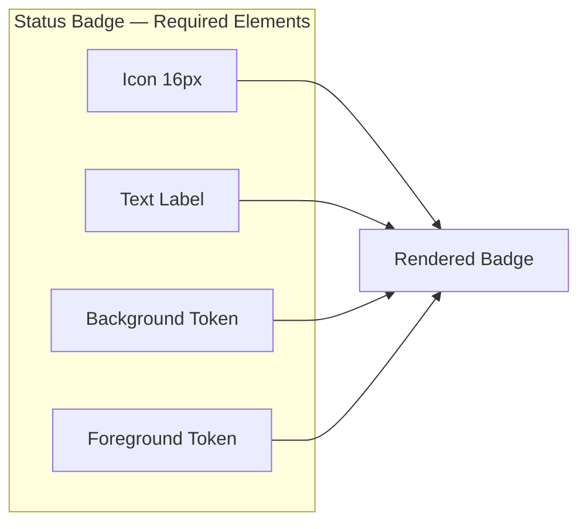
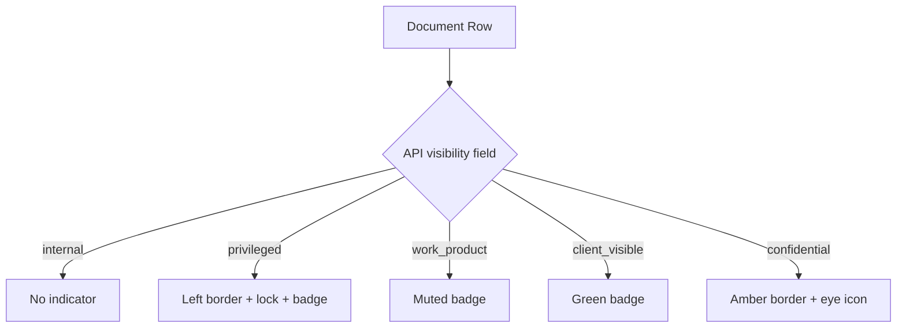
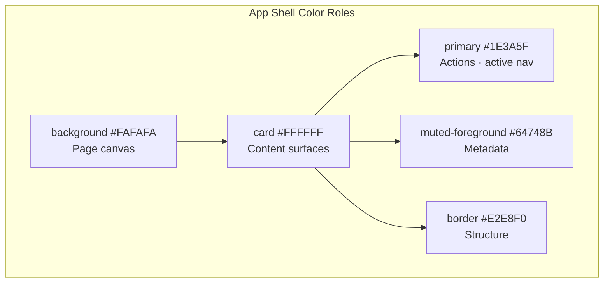
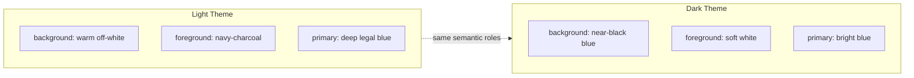

# Color System — Palettes, Semantic Colors & Matter Indicators

**LexFlow AI** — Design System Foundation  
**Version:** 1.0  
**Status:** Draft — Pre-Implementation  
**Last Updated:** 2026-07-06

---

## Purpose

Define LexFlow AI's **complete color system** — light and dark palettes, semantic color roles, workflow status colors, and matter/confidentiality indicators. Colors convey trust and hierarchy for legal professionals who spend 6–10 hours daily in the application. Every color pairing is validated for WCAG 2.1 AA contrast.

---

## Scope

| In Scope | Out of Scope |
|----------|--------------|
| Firm dashboard light palette (default) | Marketing site brand colors |
| Client portal palette overrides | Generated PDF/document colors |
| Dark theme palette (Phase 3) | Firm white-label color picker UI (Phase 2) |
| Status and workflow colors | Data visualization color scales (separate doc) |
| Matter/confidentiality indicators | Email template colors |
| High-contrast considerations (Phase 3) | |

Cross-reference: Token architecture in [design-tokens.md](./design-tokens.md), dark mode in [dark-mode.md](./dark-mode.md).

---

## Design Principles

1. **Trust through restraint** — Deep legal blue primary; no neon or consumer gradients.
2. **Semantic color roles** — Colors mean the same thing everywhere (primary = action, destructive = irreversible).
3. **Never color alone** — Status always paired with icon + text label.
4. **Warm neutrals** — Off-white backgrounds reduce eye strain vs. pure white.
5. **Subtle confidentiality** — Privilege indicators visible but not alarm-red by default.
6. **Theme parity** — Dark mode preserves semantic meaning; see [dark-mode.md](./dark-mode.md).

---

## Specifications

### Firm Dashboard — Light Theme (Default)

#### Core Surface Colors

| Token | Hex | RGB | Contrast on bg | Usage |
|-------|-----|-----|----------------|-------|
| `--background` | `#FAFAFA` | 250, 250, 250 | — | Page background |
| `--foreground` | `#1A1A2E` | 26, 26, 46 | 15.8:1 on bg | Primary text |
| `--card` | `#FFFFFF` | 255, 255, 255 | — | Cards, panels, modals |
| `--card-foreground` | `#1A1A2E` | 26, 26, 46 | 16.5:1 on card | Card text |
| `--muted` | `#F4F4F5` | 244, 244, 245 | — | Stripes, disabled bg |
| `--muted-foreground` | `#64748B` | 100, 116, 139 | 4.6:1 on bg | Timestamps, metadata |
| `--border` | `#E2E8F0` | 226, 232, 240 | 3.2:1 on bg | Borders, dividers |
| `--input` | `#E2E8F0` | 226, 232, 240 | — | Input borders |

#### Action Colors

| Token | Hex | Foreground | Contrast | Usage |
|-------|-----|------------|----------|-------|
| `--primary` | `#1E3A5F` | `#FFFFFF` | 9.2:1 | Primary buttons, active nav |
| `--primary-foreground` | `#FFFFFF` | — | — | Text on primary |
| `--primary-hover` | `#152A45` | `#FFFFFF` | 11.1:1 | Primary hover state |
| `--secondary` | `#F1F5F9` | `#334155` | — | Secondary buttons |
| `--secondary-foreground` | `#334155` | — | 8.9:1 on secondary | Secondary text |
| `--accent` | `#E8F0FE` | `#1E3A5F` | — | Hover rows, selections |
| `--accent-foreground` | `#1E3A5F` | — | 9.2:1 on accent | Text on accent |
| `--destructive` | `#B91C1C` | `#FFFFFF` | 5.9:1 | Delete, cancel workflow |
| `--destructive-foreground` | `#FFFFFF` | — | — | Text on destructive |
| `--ring` | `#1E3A5F` | — | 3.5:1 on card | Focus ring |

#### Extended Neutral Scale

| Step | Hex | Usage |
|------|-----|-------|
| neutral-0 | `#FFFFFF` | Card surfaces |
| neutral-50 | `#FAFAFA` | Page background |
| neutral-100 | `#F4F4F5` | Muted backgrounds |
| neutral-200 | `#E4E4E7` | Strong borders |
| neutral-300 | `#D4D4D8` | Disabled borders |
| neutral-400 | `#A1A1AA` | Disabled text |
| neutral-500 | `#71717A` | Placeholder |
| neutral-600 | `#52525B` | Secondary text |
| neutral-700 | `#3F3F46` | Emphasis |
| neutral-800 | `#27272A` | Strong emphasis |
| neutral-900 | `#1A1A2E` | Primary text |

#### Blue Scale (Brand / Legal)

| Step | Hex | Usage |
|------|-----|-------|
| blue-50 | `#EFF6FF` | Info backgrounds |
| blue-100 | `#DBEAFE` | Light accent |
| blue-200 | `#BFDBFE` | Selected borders |
| blue-600 | `#2563EB` | Portal primary |
| blue-700 | `#1D4ED8` | Info foreground |
| blue-800 | `#1E3A5F` | **Firm primary** |
| blue-900 | `#152A45` | Primary hover |

### Client Portal — Light Theme Overrides

| Token | Firm Value | Portal Value | Rationale |
|-------|------------|--------------|-----------|
| `--background` | `#FAFAFA` | `#FFFFFF` | Clean, approachable |
| `--primary` | `#1E3A5F` | `#2563EB` | Brighter trust signal |
| `--radius` | `8px` | `12px` | Softer corners |
| Body font size | 14px | 16px | External readability |

Cross-reference: [../../12-ui/client-portal.md](../../12-ui/client-portal.md)

### Dark Theme — Firm Dashboard (Phase 3)

| Token | Hex | Usage |
|-------|-----|-------|
| `--background` | `#0F1419` | Page background |
| `--foreground` | `#E7E9EA` | Primary text |
| `--card` | `#1A1F26` | Elevated surfaces |
| `--card-foreground` | `#E7E9EA` | Card text |
| `--muted` | `#252B33` | Stripes, disabled |
| `--muted-foreground` | `#8B949E` | Metadata |
| `--border` | `#30363D` | Borders |
| `--primary` | `#4A9EFF` | Primary actions |
| `--primary-foreground` | `#0F1419` | Text on primary |
| `--accent` | `#1C3A5E` | Hover, selection |
| `--destructive` | `#F85149` | Destructive actions |
| `--ring` | `#4A9EFF` | Focus ring |

Full dark mode guidance: [dark-mode.md](./dark-mode.md)

### Status Colors

Used for workflow execution, AI jobs, case milestones, and system health.

| Status | Token | Background | Foreground | Border | Icon | Min Contrast |
|--------|-------|------------|------------|--------|------|--------------|
| Success / Completed | `status-success` | `#ECFDF5` | `#047857` | `#A7F3D0` | CheckCircle | 4.6:1 |
| In Progress / Running | `status-info` | `#EFF6FF` | `#1D4ED8` | `#BFDBFE` | Loader2 | 5.1:1 |
| Pending / Queued | `status-warning` | `#FFFBEB` | `#B45309` | `#FDE68A` | Clock | 4.8:1 |
| Failed / Error | `status-error` | `#FEF2F2` | `#B91C1C` | `#FECACA` | AlertCircle | 5.9:1 |
| Cancelled / Skipped | `status-neutral` | `#F4F4F5` | `#71717A` | `#E4E4E7` | XCircle | 4.5:1 |
| Awaiting Approval | `status-approval` | `#F5F3FF` | `#6D28D9` | `#DDD6FE` | ShieldCheck | 5.2:1 |
| Draft | `status-draft` | `#F8FAFC` | `#475569` | `#E2E8F0` | FileEdit | 5.8:1 |

#### Dark Mode Status Adjustments

| Status | Background | Foreground |
|--------|------------|------------|
| Success | `#0D3321` | `#6EE7B7` |
| Info | `#0C2340` | `#93C5FD` |
| Warning | `#3D2E0A` | `#FCD34D` |
| Error | `#3D1515` | `#FCA5A5` |
| Neutral | `#252B33` | `#8B949E` |
| Approval | `#2E1065` | `#C4B5FD` |

### Matter & Confidentiality Indicators

Cross-reference: [../../08-security/matter-walls.md](../../08-security/matter-walls.md) — UI reflects API `visibility` field; never infers.

| Level | API Value | Visual Treatment | Badge Text | Border |
|-------|-----------|------------------|------------|--------|
| **Internal only** | `internal` | Default — no indicator | — | — |
| **Attorney-client privileged** | `privileged` | Left accent border + lock icon | `Privileged` | `4px #1E3A5F` left |
| **Work product** | `work_product` | Muted badge | `Work Product` | — |
| **Client-visible** | `client_visible` | Green-tint badge | `Shared with Client` | — |
| **Confidential — eyes only** | `confidential` | Amber left border + eye icon | `Confidential` | `4px #B45309` left |

#### Confidentiality Color Tokens

| Token | Hex | Usage |
|-------|-----|-------|
| `matter.privileged.border` | `#1E3A5F` | Privileged left border |
| `matter.privileged.background` | `#F8FAFC` | Subtle row tint |
| `matter.privileged.icon` | `#1E3A5F` | Lock icon |
| `matter.work-product.background` | `#F4F4F5` | Work product badge bg |
| `matter.work-product.foreground` | `#52525B` | Work product badge text |
| `matter.client-visible.background` | `#ECFDF5` | Client-visible badge bg |
| `matter.client-visible.foreground` | `#047857` | Client-visible badge text |
| `matter.confidential.border` | `#B45309` | Confidential left border |
| `matter.confidential.background` | `#FFFBEB` | Confidential row tint |

### AI Content Colors

| Token | Hex | Usage |
|-------|-----|-------|
| `ai.panel.background` | `#FAFBFF` | AI output panel background |
| `ai.panel.border` | `#BFDBFE` | AI panel border |
| `ai.disclaimer.background` | `#FFFBEB` | Disclaimer alert bg |
| `ai.disclaimer.foreground` | `#92400E` | Disclaimer text |
| `ai.icon` | `#6D28D9` | Sparkles icon (with tooltip) |
| `ai.approved.background` | `#ECFDF5` | Post-approval state |
| `ai.pending.background` | `#F5F3FF` | Awaiting attorney review |

### Data Visualization Palette (Dashboard Charts)

| Index | Hex | Usage |
|-------|-----|-------|
| chart-1 | `#1E3A5F` | Primary series |
| chart-2 | `#2563EB` | Secondary series |
| chart-3 | `#047857` | Success/completion |
| chart-4 | `#6D28D9` | AI-related metrics |
| chart-5 | `#B45309` | Warning/pending |
| chart-6 | `#64748B` | Neutral/baseline |

---

## Wireframes

### Status Badge Anatomy

```
┌──────────────────────────────┐
│  [✓]  Completed              │  ← Icon + text (never icon-only)
│  bg: #ECFDF5  fg: #047857    │
└──────────────────────────────┘
```



### Confidentiality Row Treatment

```
Standard row:
│ Smith_v_Jones_Motion.pdf          │  Uploaded 2h ago    │

Privileged row:
┃▌ Smith_v_Jones_Strategy.docx  🔒  │  Privileged         │  ← 4px primary left border
┃  bg tint: #F8FAFC                  │                     │

Client-visible row:
│ Client_Contract_Draft.pdf         │  [Shared with Client]│  ← green badge
```



### Color Role Map — Application Shell



### Light vs Dark Semantic Parity



---

## Best Practices

1. **Use semantic tokens** — `bg-primary` not `bg-blue-800`; `text-muted-foreground` not `text-slate-500`.
2. **Validate new pairs** — Any new background/foreground combination must meet WCAG AA before documentation merge.
3. **Status = triad** — Color + icon + text for every status indicator.
4. **Privilege from API only** — Never infer confidentiality from filename or folder path.
5. **Destructive sparingly** — Red reserved for irreversible actions; not for informational warnings.
6. **Portal warmth** — Client portal uses brighter primary; do not reuse firm destructive tones for portal CTAs.
7. **Chart accessibility** — Use pattern fills or labels in addition to color for chart segments when feasible.

---

## Accessibility Notes

- **WCAG 1.4.1 Use of Color** — Status, confidentiality, and workflow state never rely on color alone.
- **WCAG 1.4.3 Contrast** — Body text pairs ≥ 4.5:1; large text and UI components ≥ 3:1.
- **WCAG 1.4.11 Non-text Contrast** — Focus rings, input borders, and status badge borders ≥ 3:1 against adjacent colors.
- **Color blindness** — Red/green status pairs differentiated by icon shape (AlertCircle vs CheckCircle) and text label.
- **Dark mode** — Status foreground colors lightened to maintain contrast on dark backgrounds; see [dark-mode.md](./dark-mode.md).
- **High contrast (Phase 3)** — Will boost border weights and eliminate low-contrast muted text.

Full accessibility requirements: [accessibility.md](./accessibility.md) and [../../12-ui/accessibility.md](../../12-ui/accessibility.md)

---

## References

### LexFlow Documentation

| Document | Path |
|----------|------|
| Design tokens | [design-tokens.md](./design-tokens.md) |
| Dark mode | [dark-mode.md](./dark-mode.md) |
| Typography | [typography.md](./typography.md) |
| Design philosophy | [design-philosophy.md](./design-philosophy.md) |
| UI design system | [../../12-ui/design-system.md](../../12-ui/design-system.md) |
| Matter walls | [../../08-security/matter-walls.md](../../08-security/matter-walls.md) |
| User personas | [../../01-product/user-personas.md](../../01-product/user-personas.md) |
| Product vision | [../../01-product/vision.md](../../01-product/vision.md) |

### External References

- [Microsoft Fluent UI Color](https://fluent2.microsoft.design/color)
- [Stripe Design Color System](https://stripe.com/docs/stripe-jsappearance-api)
- [Atlassian Color Palette](https://atlassian.design/foundations/color)
- [WCAG 2.1 Contrast Requirements](https://www.w3.org/WAI/WCAG21/Understanding/contrast-minimum.html)
- [IBM Carbon Color](https://carbondesignsystem.com/guidelines/color/overview/)
