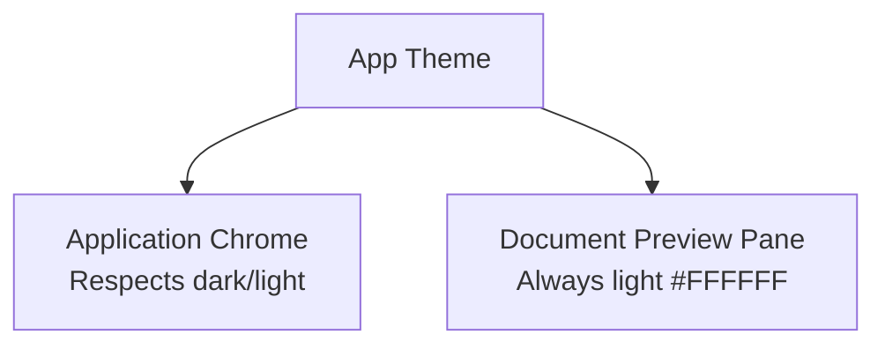
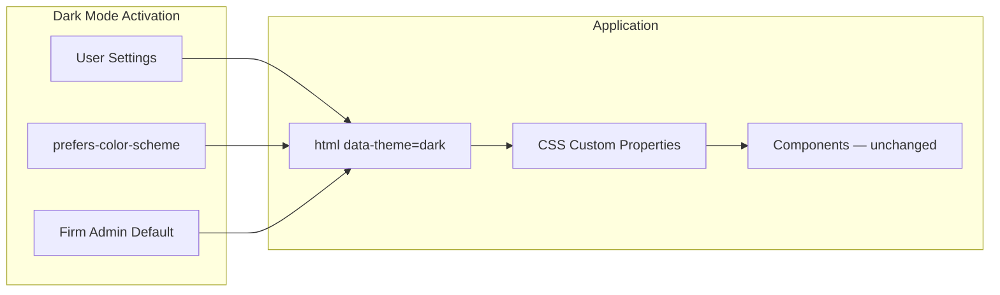

# Dark Mode — Theme Tokens, Usage & Legal Context

**LexFlow AI** — Design System Foundation  
**Version:** 1.0  
**Status:** Draft — Pre-Implementation (Phase 3 Enablement)  
**Last Updated:** 2026-07-06

---

## Purpose

Define LexFlow AI's **dark theme** — color tokens, usage guidelines, and legal-context considerations for firm dashboard dark mode. Dark mode reduces eye strain during extended evening sessions and aligns with developer-adjacent tools (GitHub, Linear) that legal operations staff may prefer, while maintaining trust, confidentiality signaling, and WCAG contrast requirements.

**Phase 3 delivery** — tokens are defined now for forward-compatible implementation; default remains light theme for firm dashboard.

---

## Scope

| In Scope | Out of Scope |
|----------|--------------|
| Dark theme token definitions | Auto-schedule (sunset) switching |
| Semantic color parity with light theme | OLED-specific optimizations |
| Status and confidentiality colors in dark | Client portal dark mode (Phase 4) |
| When to use / not use dark mode | System-wide forced dark for compliance |
| Implementation via `data-theme="dark"` | |

Cross-reference: Light palette in [color-system.md](./color-system.md), tokens in [design-tokens.md](./design-tokens.md).

---

## Design Principles

1. **Semantic parity** — Dark tokens preserve the same meaning as light (`primary` = action everywhere).
2. **Muted, not pure black** — Background `#0F1419` (blue-tinted near-black), not `#000000` — reduces halation.
3. **Elevated surfaces lighten** — Cards and modals are lighter than page background (Material elevation metaphor).
4. **Reduced eye strain** — Lower overall luminance for long sessions; warmer error/success than neon.
5. **Trust in low light** — Professional, not gaming aesthetic; no high-saturation accents.
6. **User choice** — Firm-configurable default (Phase 3); respects `prefers-color-scheme` as initial default option.

---

## Specifications

### Core Dark Tokens

| Token | Dark Value | Light Equivalent | Notes |
|-------|------------|------------------|-------|
| `--background` | `#0F1419` | `#FAFAFA` | Page canvas |
| `--foreground` | `#E7E9EA` | `#1A1A2E` | Primary text — 14.2:1 on bg |
| `--card` | `#1A1F26` | `#FFFFFF` | Elevated +1 |
| `--card-foreground` | `#E7E9EA` | `#1A1A2E` | 12.8:1 on card |
| `--popover` | `#1A1F26` | `#FFFFFF` | Dropdowns, menus |
| `--popover-foreground` | `#E7E9EA` | `#1A1A2E` | |
| `--muted` | `#252B33` | `#F4F4F5` | Stripes, disabled |
| `--muted-foreground` | `#8B949E` | `#64748B` | 5.1:1 on bg |
| `--border` | `#30363D` | `#E2E8F0` | 3.2:1 on bg |
| `--input` | `#30363D` | `#E2E8F0` | Input borders |
| `--primary` | `#4A9EFF` | `#1E3A5F` | Bright blue for dark bg |
| `--primary-foreground` | `#0F1419` | `#FFFFFF` | 8.4:1 on primary |
| `--primary-hover` | `#6BB0FF` | `#152A45` | Hover state |
| `--secondary` | `#252B33` | `#F1F5F9` | Secondary surfaces |
| `--secondary-foreground` | `#C9D1D9` | `#334155` | |
| `--accent` | `#1C3A5E` | `#E8F0FE` | Selection, hover rows |
| `--accent-foreground` | `#4A9EFF` | `#1E3A5F` | |
| `--destructive` | `#F85149` | `#B91C1C` | GitHub-inspired red |
| `--destructive-foreground` | `#FFFFFF` | `#FFFFFF` | |
| `--ring` | `#4A9EFF` | `#1E3A5F` | Focus ring |

### Elevation Scale (Dark)

Surfaces lighten as elevation increases — not shadow-dependent (shadows invisible on dark).

| Level | Background | Usage |
|-------|------------|-------|
| 0 | `#0F1419` | Page background |
| 1 | `#1A1F26` | Cards, sidebar |
| 2 | `#21262D` | Hover cards, dropdowns |
| 3 | `#30363D` | Modals, command palette |
| 4 | `#3D444D` | Toasts (floating) |

### Status Colors — Dark Mode

| Status | Background | Foreground | Border |
|--------|------------|------------|--------|
| Success | `#0D3321` | `#6EE7B7` | `#065F46` |
| Info | `#0C2340` | `#93C5FD` | `#1E40AF` |
| Warning | `#3D2E0A` | `#FCD34D` | `#92400E` |
| Error | `#3D1515` | `#FCA5A5` | `#991B1B` |
| Neutral | `#252B33` | `#8B949E` | `#30363D` |
| Approval | `#2E1065` | `#C4B5FD` | `#5B21B6` |

### Confidentiality Indicators — Dark Mode

| Level | Border / Accent | Background Tint | Badge |
|-------|-----------------|-----------------|-------|
| Privileged | `#4A9EFF` left border | `#0C2340` row tint | `#1C3A5E` bg, `#93C5FD` text |
| Work Product | — | — | `#252B33` bg, `#8B949E` text |
| Client-visible | — | — | `#0D3321` bg, `#6EE7B7` text |
| Confidential | `#FCD34D` left border | `#3D2E0A` row tint | `#3D2E0A` bg, `#FCD34D` text |

### AI Panel — Dark Mode

| Token | Value |
|-------|-------|
| `ai.panel.background` | `#0C2340` |
| `ai.panel.border` | `#1E40AF` |
| `ai.disclaimer.background` | `#3D2E0A` |
| `ai.disclaimer.foreground` | `#FCD34D` |

### Shadows (Dark Mode)

Shadows are subtle; rely on elevation background shift primarily.

| Token | Value |
|-------|-------|
| `shadow-sm` | `0 1px 2px rgb(0 0 0 / 0.4)` |
| `shadow-md` | `0 4px 8px rgb(0 0 0 / 0.5)` |
| `shadow-lg` | `0 8px 24px rgb(0 0 0 / 0.6)` |
| `shadow-xl` | `0 16px 48px rgb(0 0 0 / 0.7)` |

---

## When to Use Dark Mode

### Recommended

| Context | Rationale |
|---------|-----------|
| Extended evening work | Reduced eye strain in low ambient light |
| Operations monitoring dashboards | Familiar from GitHub/Azure dark consoles |
| User preference | Accessibility and comfort choice |
| Demo/presentation in dark rooms | Audience comfort |

### Not Recommended (Default Light)

| Context | Rationale |
|---------|-----------|
| Client portal | External users expect bright, approachable UI |
| Printed/exported views | Light theme matches paper documents |
| First-time firm onboarding | Familiarity with M365 light default |
| Color-accurate document review | Document preview pane always light (`#FFFFFF`) |
| Compliance presentations | Formal context traditionally light |

### Document Preview Exception

The **document preview pane always renders light** regardless of app theme — legal documents are authored for white paper. Only the viewer chrome respects dark mode.



---

## Legal Context Considerations

### Professional Presentation

| Concern | Dark Mode Response |
|---------|-------------------|
| Client meetings / screen share | User can switch to light before sharing |
| Courtroom-adjacent seriousness | Light remains firm default; dark is opt-in |
| Privilege visibility | Confidentiality borders use brighter accents in dark |
| AI disclaimer visibility | Amber disclaimer maintained at WCAG contrast |
| Audit log readability | Monospace IDs use `#8B949E` — verified 5.1:1 |

### Firm Policy

Phase 3 settings allow firm admin to:
- Set default theme: Light | Dark | System
- Disable dark mode entirely (compliance preference)
- Per-user override in user settings

Cross-reference: [../../01-product/capabilities.md](../../01-product/capabilities.md)

---

## Wireframes

### Light vs Dark Shell Comparison

```
LIGHT                                    DARK
┌────────────────────────────┐          ┌────────────────────────────┐
│ #FAFAFA bg  #1A1A2E text   │          │ #0F1419 bg  #E7E9EA text   │
│ ┌────────────────────────┐ │          │ ┌────────────────────────┐ │
│ │ #FFFFFF card           │ │          │ │ #1A1F26 card           │ │
│ │ Primary: #1E3A5F       │ │          │ │ Primary: #4A9EFF       │ │
│ └────────────────────────┘ │          │ └────────────────────────┘ │
└────────────────────────────┘          └────────────────────────────┘
```



### Elevation in Dark Mode

```
Page bg ─── #0F1419 ───────────────────────────────── elevation 0
  │
  ├── Sidebar ─── #1A1F26 ─────────────────────────── elevation 1
  │
  ├── Card ─── #1A1F26 ────────────────────────────── elevation 1
  │     └── Hover ─── #21262D ─────────────────────── elevation 2
  │
  └── Modal ─── #30363D ───────────────────────────── elevation 3
        └── Command Palette ─── #30363D + shadow ─── elevation 3-4
```

---

## Best Practices

1. **Define tokens now, ship Phase 3** — Components use semantic tokens; dark works without refactors.
2. **Never hardcode light colors** — `#FFFFFF` in components breaks dark mode.
3. **Preview pane stays light** — Document content is not themed.
4. **Test contrast in both themes** — CI should validate dark token pairs.
5. **Images and logos** — Provide dark-variant logo or use CSS filter sparingly.
6. **Charts** — Use dark-aware chart palette; see [color-system.md](./color-system.md).
7. **Respect firm policy** — Admin disable overrides user system preference.

---

## Accessibility Notes

- All dark mode text/background pairs meet **WCAG 2.1 AA** contrast minimums documented in token tables.
- Focus ring `#4A9EFF` achieves **3:1** against `#0F1419` and `#1A1F26`.
- Status colors use **lightened foregrounds** on darkened backgrounds — never reuse light-mode hex values.
- `prefers-color-scheme: dark` triggers system default only when firm policy allows.
- High-contrast theme (Phase 3) extends dark with stronger borders — separate token set.
- Reduced motion preferences apply equally in dark mode — see [motion-animation.md](./motion-animation.md).

Full requirements: [accessibility.md](./accessibility.md)

---

## References

### LexFlow Documentation

| Document | Path |
|----------|------|
| Color system | [color-system.md](./color-system.md) |
| Design tokens | [design-tokens.md](./design-tokens.md) |
| Design philosophy | [design-philosophy.md](./design-philosophy.md) |
| UI design system | [../../12-ui/design-system.md](../../12-ui/design-system.md) |
| Product roadmap | [../../01-product/roadmap.md](../../01-product/roadmap.md) |
| User personas | [../../01-product/user-personas.md](../../01-product/user-personas.md) |

### External References

- [Microsoft Fluent Dark Theme](https://fluent2.microsoft.design/color)
- [GitHub Primer Dark](https://primer.style/foundations/color)
- [Atlassian Dark Mode Guidelines](https://atlassian.design/foundations/color)
- [Linear Dark Theme](https://linear.app/readme)
