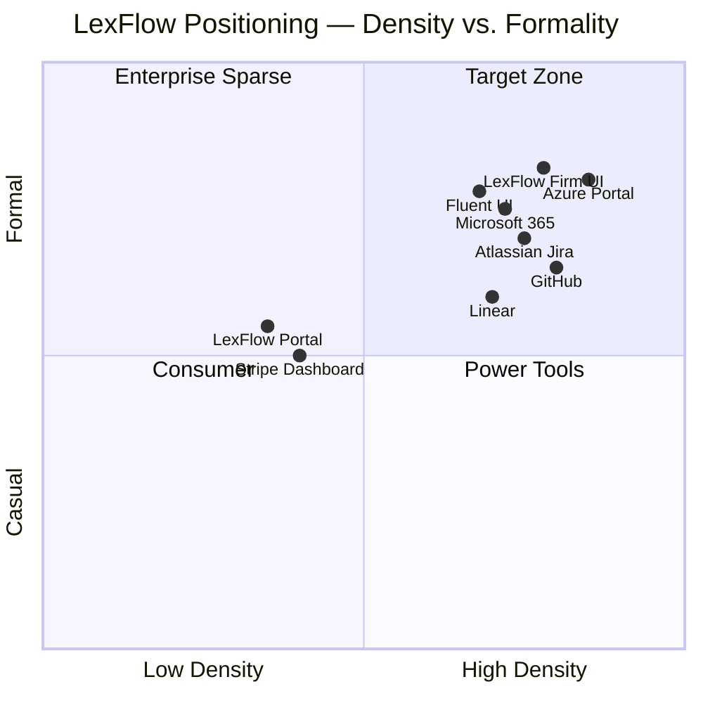
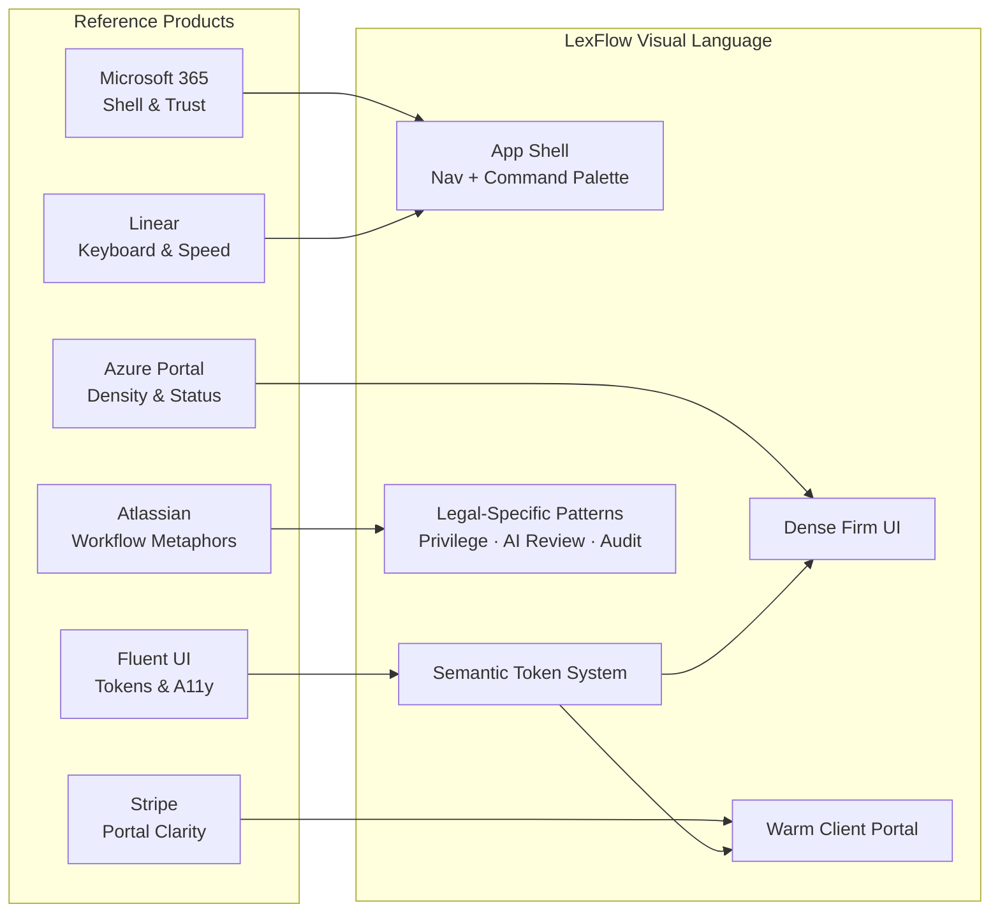
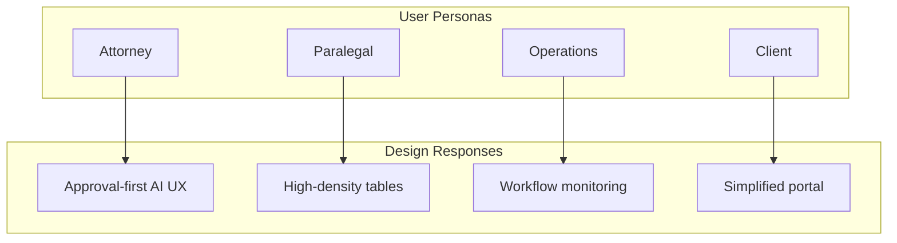
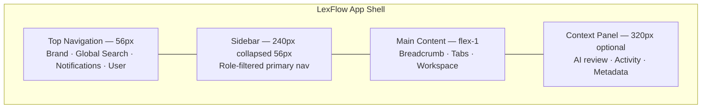
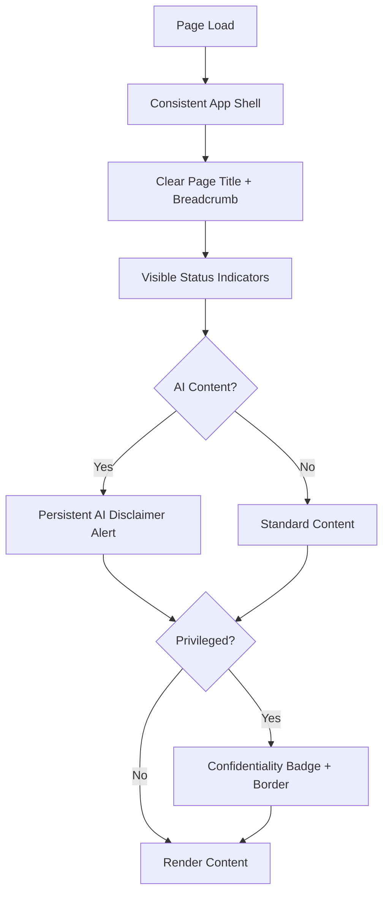
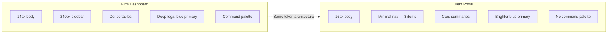

# Design Philosophy — Trust, Clarity & Density for Legal Professionals

**LexFlow AI** — Design System Foundation  
**Version:** 1.0  
**Status:** Draft — Pre-Implementation  
**Last Updated:** 2026-07-06

---

## Purpose

Establish the **strategic visual and interaction philosophy** for LexFlow AI — an enterprise legal SaaS platform. This document defines why the product looks and behaves the way it does, how it compares to reference products attorneys already use daily, and how design decisions support trust, clarity, and information density without sacrificing accessibility or ethical boundaries.

Design philosophy is the **decision filter** for every token, component, and layout choice. When two valid options exist, choose the one that best serves legal professionals in long, high-stakes work sessions.

---

## Scope

| In Scope | Out of Scope |
|----------|--------------|
| Core design values and principles | Component-level API specifications |
| Reference product comparisons (M365, Azure, Linear, etc.) | Marketing website branding |
| Persona-driven design priorities | Implementation code (Tailwind, React) |
| Trust and confidentiality UX philosophy | Figma file governance |
| Density vs. readability tradeoffs | Print/PDF stylesheet design |

Cross-reference: Implementation tokens in [design-tokens.md](./design-tokens.md), component standards in [../../12-ui/design-system.md](../../12-ui/design-system.md).

---

## Design Principles

### 1. Trust First

Legal software handles privileged information, billing data, and AI-generated content that may appear in court. The interface must feel **institutional, predictable, and auditable** — never playful, experimental, or ambiguous.

| Signal | Design Expression |
|--------|-------------------|
| Professionalism | Restrained palette; no neon gradients or consumer-app chrome |
| Predictability | Consistent shell, navigation, and action placement across all modules |
| Accountability | Destructive actions require confirmation; AI outputs carry persistent disclaimers |
| Security awareness | Confidentiality indicators are visible but not alarmist |

### 2. Clarity Over Decoration

Every pixel serves comprehension. Attorneys scan hundreds of rows daily; paralegals triage intake under time pressure. **Remove visual noise** before adding polish.

| Rule | Rationale |
|------|-----------|
| One primary action per view section | Prevents accidental irreversible operations |
| Status = color + icon + text | WCAG compliance; color-blind safety |
| Semantic naming in UI chrome | "Approve AI Summary" not "Confirm" |
| Progressive disclosure | Show detail on demand; default to scannable summaries |

### 3. Density for Power Users, Space for External Users

Firm users (attorneys, paralegals, operations) prefer **information-dense** layouts comparable to Microsoft 365 and Azure Portal. Client portal users receive **spacious, simplified** surfaces comparable to Stripe Customer Portal.

| Surface | Density Target | Reference |
|---------|------------------|-----------|
| Firm dashboard | High — 14px body, compact tables | Azure Portal, GitHub Issues |
| Case workspace | Medium-high — tabs + side panels | Atlassian Jira, Linear |
| Client portal | Low — 16px body, generous touch targets | Stripe Dashboard |
| Admin console | High — audit logs, bulk operations | Azure Resource Manager |

### 4. Familiar Enterprise Patterns

LexFlow AI integrates with Microsoft 365. Users expect **Fluent UI-adjacent** patterns: command palette, sidebar navigation, contextual panels, and status badges. Deviation requires explicit justification.

### 5. Human-in-the-Loop for AI

AI is assistive, not authoritative. Design must **slow down** approval moments and **speed up** discovery moments. Never make AI output visually indistinguishable from human-authored firm content without labeling.

### 6. Accessibility Is Non-Negotiable

WCAG 2.1 AA is the floor, not the ceiling. Legal procurement increasingly requires VPAT documentation. See [accessibility.md](./accessibility.md).

---

## Reference Product Comparison

LexFlow AI synthesizes patterns from products legal professionals already trust:



### Comparative Analysis

| Product | What LexFlow Adopts | What LexFlow Avoids |
|---------|---------------------|---------------------|
| **Microsoft 365** | App shell, ribbon-adjacent toolbars, Segoe/Inter typography, neutral grays | Full ribbon complexity; Outlook-specific metaphors |
| **Azure Portal** | Left nav + resource blade pattern, status pills, dense property panels | Azure-specific iconography; overwhelming subscription hierarchy |
| **GitHub** | Tabbed detail views, timeline activity feeds, monospace for IDs | Developer-centric dark-default; emoji reactions |
| **Linear** | Keyboard-first navigation, command palette (⌘K), clean issue rows | Startup-minimal aesthetic; low information density |
| **Fluent UI** | Design token architecture, focus rings, semantic color roles | Full Fluent component library dependency |
| **Stripe Dashboard** | Client portal clarity, card-based summaries, progressive onboarding | Payment-specific flows; consumer color vibrancy |
| **Atlassian** | Case/issue metaphor, workflow status columns, audit trails | Cluttered settings; inconsistent density across products |

### Visual Language Synthesis



---

## Persona-Driven Priorities

Cross-reference: [../../01-product/user-personas.md](../../01-product/user-personas.md)

| Persona | Primary Need | Design Response |
|---------|--------------|-----------------|
| **Attorney** | Review AI output quickly; approve with confidence | Prominent approval inbox; persistent AI disclaimer; keyboard shortcuts |
| **Paralegal** | Process high-volume intake and documents | Dense tables; bulk actions; compact mode |
| **Operations Team** | Monitor workflow health across matters | Dashboard metrics; status aggregation; filter-heavy views |
| **Compliance Officer** | Audit trail exploration | Immutable log presentation; export affordances; no destructive UI chrome |
| **Client** | Understand case status without legal jargon | Plain language; large touch targets; simplified nav |
| **Managing Partner** | Firm-wide visibility | Executive summary cards; trend indicators |



---

## Wireframes

### Application Shell Philosophy

The shell follows Microsoft 365 / Azure Portal conventions: persistent top bar, collapsible left sidebar, scrollable main content, optional right context panel.

```
┌─────────────────────────────────────────────────────────────────────────────┐
│  [Logo]  LexFlow AI          [ ⌘K Search... ]     [🔔] [?] [Avatar ▾]      │  ← Top Nav (56px)
├──────────┬──────────────────────────────────────────────────┬───────────────┤
│          │  Cases  ›  Smith v. Jones  ›  Documents           │               │
│  Cases   │  ────────────────────────────────────────────────  │  AI Review    │
│  Clients │  [Overview][Documents][Timeline][Workflows][AI]  │  Panel        │
│  Workflow│                                                   │  (320px)      │
│  Approvals│  ┌─────────────────────────────────────────────┐ │               │
│  Admin   │  │  Main Content — Case Workspace               │ │  Requires     │
│          │  │  Dense data · Scannable · Actionable         │ │  attorney     │
│  240px   │  └─────────────────────────────────────────────┘ │  review       │
│          │                                                   │               │
└──────────┴──────────────────────────────────────────────────┴───────────────┘
```



### Trust Signal Placement



### Firm UI vs. Client Portal



---

## Specifications

### Design Value Hierarchy

When principles conflict, resolve in this order:

| Priority | Principle | Example |
|----------|-----------|---------|
| 1 | Security & compliance | Matter wall 404 — no hint of existence |
| 2 | Accessibility | Contrast ratio over brand color preference |
| 3 | Clarity | Remove animation before removing label |
| 4 | Trust | Confirmation dialog before destructive legal action |
| 5 | Density | Compact mode available; never forced on portal |
| 6 | Efficiency | Keyboard shortcuts for power users |

### Emotional Design Targets

| Emotion | Target Intensity (1–5) | How Achieved |
|---------|------------------------|--------------|
| Trust | 5 | Consistent shell, audit visibility, professional palette |
| Confidence | 4 | Clear status, explicit confirmations, undo where safe |
| Calm | 4 | Restrained motion, off-white backgrounds, no alert fatigue |
| Efficiency | 4 | Density, shortcuts, command palette |
| Delight | 1 | Subtle micro-interactions only; never at expense of clarity |

---

## Best Practices

1. **Design for the 8-hour session** — Attorneys live in case management tools all day. Reduce eye strain with warm neutrals and consistent spacing.
2. **Default to familiar** — New patterns require user research justification. Prefer M365/Azure/Linear conventions.
3. **Separate firm and portal visually** — External users must never feel they entered internal tooling.
4. **Label AI everywhere** — Sparkles icon, disclaimer text, and distinct panel styling for all AI-generated content.
5. **Never use color alone** — Pair status colors with icons and text labels in every context.
6. **Respect matter walls in UX** — Generic 404 for unauthorized cases; no "access denied" enumeration hints.
7. **Document decisions** — When deviating from reference products, record rationale in ADR or design review notes.

---

## Accessibility Notes

- Philosophy-level commitment: accessibility is a **product requirement**, not a polish phase. See [accessibility.md](./accessibility.md).
- Trust and accessibility align: confirmation dialogs serve WCAG 3.3.4 (Error Prevention) for legal actions.
- Density must not compromise 4.5:1 body text contrast or 200% zoom reflow.
- Client portal targets larger base font (16px) and 44×44px touch targets minimum.
- `prefers-reduced-motion` respected globally — see [motion-animation.md](./motion-animation.md).

---

## References

### LexFlow Documentation

| Document | Path |
|----------|------|
| Design tokens | [design-tokens.md](./design-tokens.md) |
| Color system | [color-system.md](./color-system.md) |
| Typography | [typography.md](./typography.md) |
| UI implementation | [../../12-ui/design-system.md](../../12-ui/design-system.md) |
| UI index | [../../12-ui/README.md](../../12-ui/README.md) |
| Accessibility (UI) | [../../12-ui/accessibility.md](../../12-ui/accessibility.md) |
| Client portal | [../../12-ui/client-portal.md](../../12-ui/client-portal.md) |
| Product vision | [../../01-product/vision.md](../../01-product/vision.md) |
| User personas | [../../01-product/user-personas.md](../../01-product/user-personas.md) |
| Capabilities | [../../01-product/capabilities.md](../../01-product/capabilities.md) |
| Matter walls | [../../08-security/matter-walls.md](../../08-security/matter-walls.md) |

### External References

- [Microsoft Fluent UI Design Principles](https://fluent2.microsoft.design/design-principles)
- [Microsoft 365 Design Language](https://learn.microsoft.com/en-us/office/dev/add-ins/design/add-in-design)
- [Azure Portal Design Patterns](https://learn.microsoft.com/en-us/azure/azure-portal/azure-portal-dashboards)
- [Linear Design Philosophy](https://linear.app/readme)
- [Stripe Dashboard Design](https://stripe.com/docs/stripe-dashboard)
- [Atlassian Design System — Foundations](https://atlassian.design/foundations)
