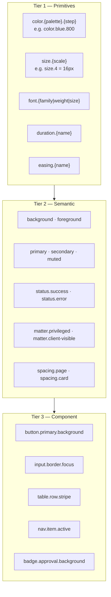
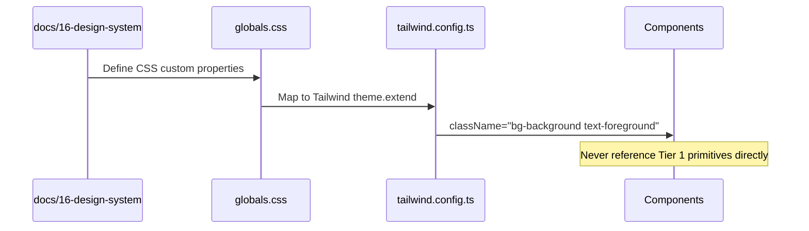
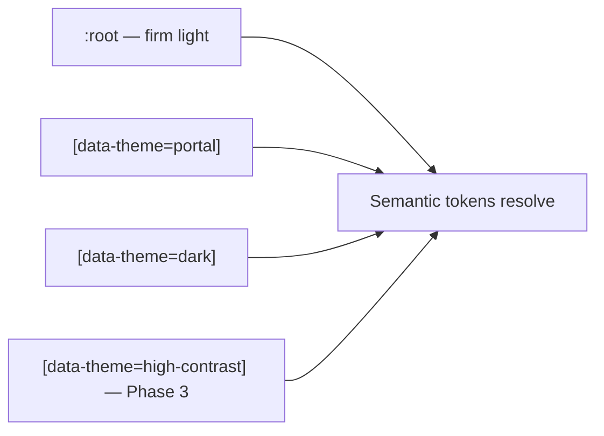
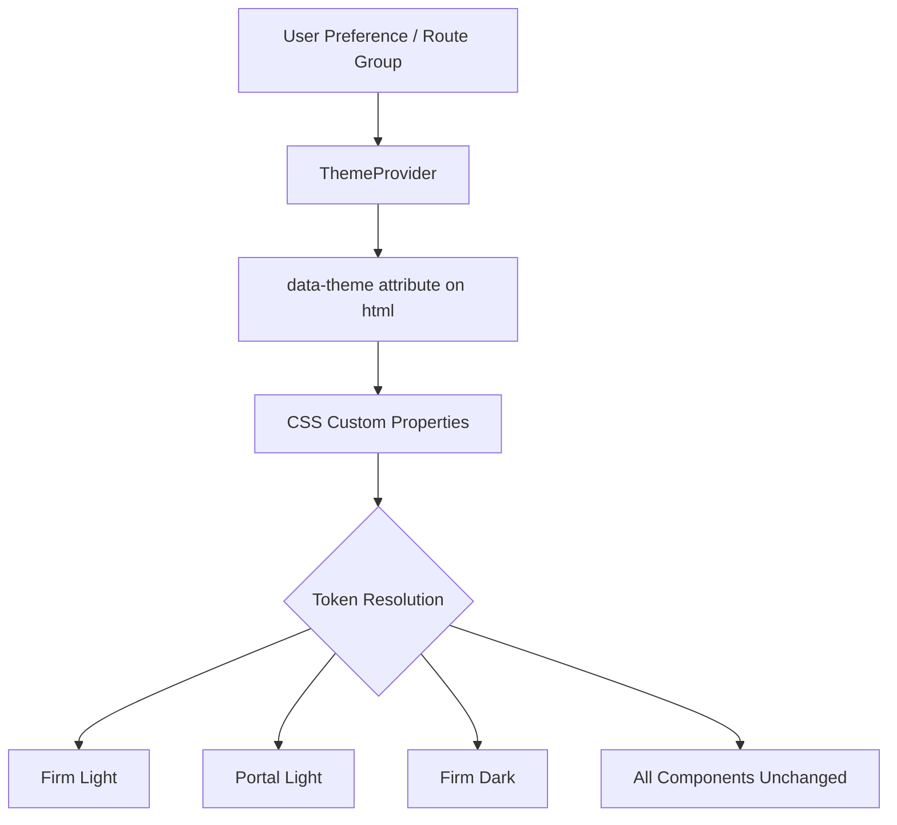

# Design Tokens — Complete Token Architecture & Semantic Naming

**LexFlow AI** — Design System Foundation  
**Version:** 1.0  
**Status:** Draft — Pre-Implementation  
**Last Updated:** 2026-07-06

---

## Purpose

Define the **complete design token architecture** for LexFlow AI — the single source of truth for color, typography, spacing, elevation, motion, and layout values. Tokens use **semantic naming** so components express intent (`bg-primary`) rather than appearance (`bg-blue-800`), enabling theme switching, firm white-labeling (Phase 2), and dark mode (Phase 3) without component refactors.

This document is the **foundation layer** consumed by [../../12-ui/design-system.md](../../12-ui/design-system.md) implementation in Tailwind CSS and CSS custom properties.

---

## Scope

| In Scope | Out of Scope |
|----------|--------------|
| Token tier architecture (primitive → semantic → component) | Tailwind config implementation code |
| Naming conventions and namespaces | Figma Variables sync pipeline (Phase 3) |
| CSS custom property definitions | Runtime token editor UI |
| Theme variants (firm, portal, dark) | Third-party chart library theming |
| Token governance and change process | Icon SVG asset definitions |

---

## Design Principles

1. **Semantic over literal** — Tokens describe role, not hex value.
2. **Three-tier hierarchy** — Primitives feed semantics feed component tokens.
3. **Theme-agnostic components** — Components reference semantic tokens only.
4. **Single source of truth** — All values originate here; implementation mirrors exactly.
5. **Forward-compatible** — Token names stable across light/dark/portal themes.
6. **Accessible by default** — Contrast-validated pairs documented per token.

---

## Token Architecture

### Three-Tier Model



### Consumption Flow



### Theme Resolution



---

## Specifications

### Naming Convention

| Pattern | Example | Usage |
|---------|---------|-------|
| `{category}.{role}` | `color.background` | Semantic color |
| `{category}.{role}.{variant}` | `color.status.success.background` | Status with bg/fg pair |
| `{component}.{part}.{state}` | `button.primary.background.hover` | Component-specific |
| `{layout}.{element}.{property}` | `layout.sidebar.width.expanded` | Layout constants |

**Rules:**
- Use kebab-case in CSS custom properties: `--color-primary`
- Use dot notation in documentation: `color.primary`
- Never include hex values in token names
- State suffixes: `.hover`, `.active`, `.focus`, `.disabled`, `.selected`

### Tier 1 — Primitive Tokens

#### Color Primitives

| Token | Light Value | Usage |
|-------|-------------|-------|
| `color.neutral.0` | `#FFFFFF` | Pure white — use sparingly |
| `color.neutral.50` | `#FAFAFA` | Warm off-white page bg |
| `color.neutral.100` | `#F4F4F5` | Muted backgrounds |
| `color.neutral.200` | `#E4E4E7` | Borders, dividers |
| `color.neutral.300` | `#D4D4D8` | Disabled borders |
| `color.neutral.400` | `#A1A1AA` | Placeholder text |
| `color.neutral.500` | `#71717A` | Secondary metadata |
| `color.neutral.600` | `#52525B` | Secondary foreground |
| `color.neutral.700` | `#3F3F46` | Emphasis text |
| `color.neutral.800` | `#27272A` | Headings |
| `color.neutral.900` | `#1A1A2E` | Primary foreground (navy-charcoal) |
| `color.blue.50` | `#EFF6FF` | Info backgrounds |
| `color.blue.100` | `#DBEAFE` | Accent wash |
| `color.blue.600` | `#2563EB` | Portal primary |
| `color.blue.800` | `#1E3A5F` | Firm primary (legal blue) |
| `color.blue.900` | `#1E3A8A` | Primary hover |
| `color.green.50` | `#ECFDF5` | Success background |
| `color.green.700` | `#047857` | Success foreground |
| `color.amber.50` | `#FFFBEB` | Warning background |
| `color.amber.700` | `#B45309` | Warning foreground |
| `color.red.50` | `#FEF2F2` | Error background |
| `color.red.700` | `#B91C1C` | Error / destructive |
| `color.violet.50` | `#F5F3FF` | Approval background |
| `color.violet.700` | `#6D28D9` | Approval foreground |

#### Size Primitives (4px base grid)

| Token | Value | px |
|-------|-------|-----|
| `size.0` | `0` | 0 |
| `size.0.5` | `0.125rem` | 2 |
| `size.1` | `0.25rem` | 4 |
| `size.2` | `0.5rem` | 8 |
| `size.3` | `0.75rem` | 12 |
| `size.4` | `1rem` | 16 |
| `size.5` | `1.25rem` | 20 |
| `size.6` | `1.5rem` | 24 |
| `size.8` | `2rem` | 32 |
| `size.10` | `2.5rem` | 40 |
| `size.12` | `3rem` | 48 |
| `size.14` | `3.5rem` | 56 |
| `size.16` | `4rem` | 64 |
| `size.20` | `5rem` | 80 |
| `size.60` | `15rem` | 240 |
| `size.80` | `20rem` | 320 |

#### Typography Primitives

| Token | Value |
|-------|-------|
| `font.family.sans` | `'Inter', 'Segoe UI', system-ui, sans-serif` |
| `font.family.serif` | `'Source Serif 4', Georgia, serif` |
| `font.family.mono` | `'JetBrains Mono', ui-monospace, monospace` |
| `font.weight.regular` | `400` |
| `font.weight.medium` | `500` |
| `font.weight.semibold` | `600` |
| `font.weight.bold` | `700` |
| `font.size.xs` | `0.75rem` / 12px |
| `font.size.sm` | `0.875rem` / 14px |
| `font.size.base` | `1rem` / 16px |
| `font.size.lg` | `1.125rem` / 18px |
| `font.size.xl` | `1.25rem` / 20px |
| `font.size.2xl` | `1.5rem` / 24px |
| `font.size.3xl` | `1.875rem` / 30px |
| `font.line-height.tight` | `1.25` |
| `font.line-height.normal` | `1.5` |
| `font.line-height.relaxed` | `1.75` |

#### Radius Primitives

| Token | Value |
|-------|-------|
| `radius.none` | `0` |
| `radius.sm` | `0.25rem` / 4px |
| `radius.md` | `0.5rem` / 8px |
| `radius.lg` | `0.75rem` / 12px |
| `radius.full` | `9999px` |

#### Elevation Primitives

| Token | CSS Value |
|-------|-----------|
| `shadow.none` | `none` |
| `shadow.sm` | `0 1px 2px 0 rgb(0 0 0 / 0.05)` |
| `shadow.md` | `0 4px 6px -1px rgb(0 0 0 / 0.1)` |
| `shadow.lg` | `0 10px 15px -3px rgb(0 0 0 / 0.1)` |
| `shadow.xl` | `0 20px 25px -5px rgb(0 0 0 / 0.1)` |

#### Motion Primitives

| Token | Value |
|-------|-------|
| `duration.instant` | `0ms` |
| `duration.fast` | `100ms` |
| `duration.normal` | `200ms` |
| `duration.slow` | `300ms` |
| `duration.slower` | `500ms` |
| `easing.default` | `cubic-bezier(0.4, 0, 0.2, 1)` |
| `easing.in` | `cubic-bezier(0.4, 0, 1, 1)` |
| `easing.out` | `cubic-bezier(0, 0, 0.2, 1)` |
| `easing.in-out` | `cubic-bezier(0.4, 0, 0.2, 1)` |

### Tier 2 — Semantic Tokens

#### Surface & Text (Firm Light Theme)

| Token | CSS Variable | Resolves To | Usage |
|-------|--------------|-------------|-------|
| `color.background` | `--background` | `neutral.50` | Page background |
| `color.foreground` | `--foreground` | `neutral.900` | Primary text |
| `color.card` | `--card` | `neutral.0` | Card surfaces |
| `color.card-foreground` | `--card-foreground` | `neutral.900` | Card text |
| `color.primary` | `--primary` | `blue.800` | Primary actions |
| `color.primary-foreground` | `--primary-foreground` | `neutral.0` | Text on primary |
| `color.secondary` | `--secondary` | `#F1F5F9` | Secondary surfaces |
| `color.secondary-foreground` | `--secondary-foreground` | `#334155` | Secondary text |
| `color.muted` | `--muted` | `neutral.100` | Disabled, stripes |
| `color.muted-foreground` | `--muted-foreground` | `#64748B` | Metadata, timestamps |
| `color.accent` | `--accent` | `#E8F0FE` | Hover, selected rows |
| `color.accent-foreground` | `--accent-foreground` | `blue.800` | Text on accent |
| `color.destructive` | `--destructive` | `red.700` | Irreversible actions |
| `color.destructive-foreground` | `--destructive-foreground` | `neutral.0` | Text on destructive |
| `color.border` | `--border` | `#E2E8F0` | Borders, dividers |
| `color.input` | `--input` | `#E2E8F0` | Input borders |
| `color.ring` | `--ring` | `blue.800` | Focus ring |

#### Status Semantic Tokens

| Token | Background | Foreground | Icon |
|-------|------------|------------|------|
| `status.success` | `#ECFDF5` | `#047857` | CheckCircle |
| `status.info` | `#EFF6FF` | `#1D4ED8` | Loader2 |
| `status.warning` | `#FFFBEB` | `#B45309` | Clock |
| `status.error` | `#FEF2F2` | `#B91C1C` | AlertCircle |
| `status.neutral` | `#F4F4F5` | `#71717A` | XCircle |
| `status.approval` | `#F5F3FF` | `#6D28D9` | ShieldCheck |

#### Matter / Confidentiality Semantic Tokens

| Token | Visual | Usage |
|-------|--------|-------|
| `matter.privileged.border` | `4px left border primary` | Attorney-client privileged |
| `matter.privileged.background` | `#F8FAFC` | Subtle privileged row tint |
| `matter.work-product.badge` | Muted badge | Work product label |
| `matter.client-visible.badge` | Green-tint badge | Shared with client |
| `matter.internal.default` | No badge | Internal-only default |

#### Layout Semantic Tokens

| Token | Value | Usage |
|-------|-------|-------|
| `layout.topnav.height` | `56px` / `size.14` | Top navigation bar |
| `layout.sidebar.width.expanded` | `240px` / `size.60` | Expanded sidebar |
| `layout.sidebar.width.collapsed` | `56px` / `size.14` | Icon-only sidebar |
| `layout.panel.width.context` | `320px` / `size.80` | Right context panel |
| `layout.content.max-width` | `1400px` | Ultra-wide cap |
| `layout.grid.columns` | `12` | Content grid |

#### Spacing Semantic Tokens

| Token | Value | Usage |
|-------|-------|-------|
| `spacing.page.x` | `size.6` (24px) / `size.8` (32px) lg | Page horizontal padding |
| `spacing.page.y` | `size.4` (16px) | Page vertical padding |
| `spacing.card` | `size.4` / `size.6` md | Card internal padding |
| `spacing.stack` | `size.4` | Form field vertical gap |
| `spacing.inline` | `size.2` | Button groups, badges |
| `spacing.table.cell.x` | `size.4` | Table cell horizontal |
| `spacing.table.cell.y` | `size.3` | Table cell vertical (comfortable) |
| `spacing.table.cell.y.compact` | `size.2` | Compact mode rows |

### Tier 3 — Component Token Examples

| Component Token | Maps To |
|-----------------|---------|
| `button.primary.background` | `color.primary` |
| `button.primary.background.hover` | `color.blue.900` |
| `button.primary.foreground` | `color.primary-foreground` |
| `button.destructive.background` | `color.destructive` |
| `input.border.default` | `color.input` |
| `input.border.focus` | `color.ring` |
| `input.background` | `color.card` |
| `table.header.background` | `color.muted` |
| `table.row.hover` | `color.accent` |
| `table.row.stripe` | `color.muted` |
| `nav.item.active.background` | `color.accent` |
| `nav.item.active.foreground` | `color.primary` |
| `nav.item.hover.background` | `color.muted` |
| `dialog.background` | `color.card` |
| `dialog.shadow` | `shadow.lg` |
| `command.shadow` | `shadow.xl` |
| `toast.success.background` | `status.success` (bg) |
| `badge.approval.background` | `status.approval` (bg) |

### Theme Variant Overrides

| Token | Firm Light | Portal | Dark (Phase 3) |
|-------|------------|--------|----------------|
| `color.background` | `#FAFAFA` | `#FFFFFF` | `#0F1419` |
| `color.primary` | `#1E3A5F` | `#2563EB` | `#4A9EFF` |
| `font.size.body` | 14px | 16px | 14px |
| `radius.default` | 8px | 12px | 8px |

See [color-system.md](./color-system.md) and [dark-mode.md](./dark-mode.md) for complete theme tables.

---

## Wireframes

### Token Layer Stack

```
┌─────────────────────────────────────────────────────────┐
│  Component: CaseStatusBadge                             │
│  uses → badge.status.background, badge.status.foreground│
├─────────────────────────────────────────────────────────┤
│  Semantic: status.success.background = #ECFDF5        │
│            status.success.foreground = #047857          │
├─────────────────────────────────────────────────────────┤
│  Primitive: color.green.50, color.green.700             │
└─────────────────────────────────────────────────────────┘
```

### Theme Switching (Conceptual)



---

## Best Practices

1. **Components use Tier 2 and Tier 3 only** — Never `color.blue.800` in domain components.
2. **Pair foreground with background** — Every surface token has a documented foreground pair validated for contrast.
3. **Add tokens, don't hardcode** — New color needs? Add semantic token here first, then implement.
4. **Version token changes** — Breaking token renames require migration note in PR.
5. **Document contrast ratios** — New semantic pairs must meet WCAG AA before merge.
6. **Keep portal overrides minimal** — Override only tokens that differ; inherit the rest.
7. **Align with Fluent naming where sensible** — `colorNeutralForeground1` maps conceptually to `color.foreground`.

---

## Accessibility Notes

- All semantic text/background pairs validated at **4.5:1** (body) or **3:1** (large text/UI components).
- Focus ring token (`color.ring`) meets **3:1** against adjacent colors.
- Status tokens always consumed with icon + text — never color-only.
- High-contrast theme (Phase 3) will amplify Tier 2 semantic deltas without new component code.
- Token documentation includes contrast ratio column in [color-system.md](./color-system.md).

---

## References

### LexFlow Documentation

| Document | Path |
|----------|------|
| Color system | [color-system.md](./color-system.md) |
| Typography | [typography.md](./typography.md) |
| Spacing | [spacing.md](./spacing.md) |
| Dark mode | [dark-mode.md](./dark-mode.md) |
| Design philosophy | [design-philosophy.md](./design-philosophy.md) |
| UI implementation | [../../12-ui/design-system.md](../../12-ui/design-system.md) |
| Product capabilities | [../../01-product/capabilities.md](../../01-product/capabilities.md) |

### External References

- [Design Tokens Community Group Format](https://design-tokens.github.io/community-group/format/)
- [Microsoft Fluent UI Design Tokens](https://fluent2.microsoft.design/design-tokens)
- [Tailwind CSS Theme Configuration](https://tailwindcss.com/docs/theme)
- [Style Dictionary](https://amzn.github.io/style-dictionary/)
