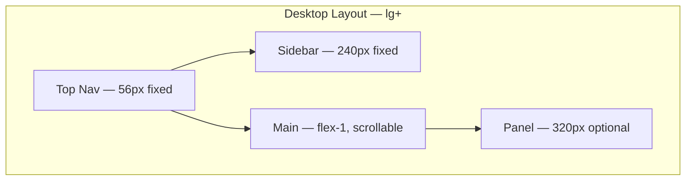
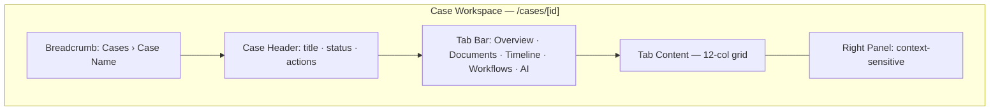
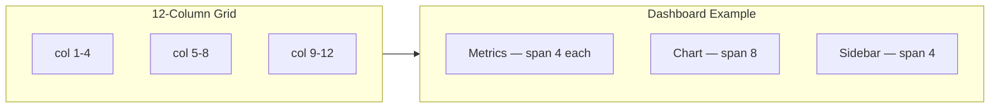
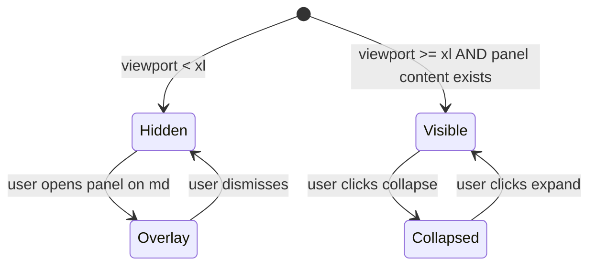

# Grid & Layout — 12-Column Grid, App Shell & Sidebar Widths

**LexFlow AI** — Design System Foundation  
**Version:** 1.0  
**Status:** Draft — Pre-Implementation  
**Last Updated:** 2026-07-06

---

## Purpose

Define LexFlow AI's **layout system** — responsive 12-column grid, application shell structure, sidebar widths, content max-widths, and panel behavior. Layout follows Microsoft 365 / Azure Portal conventions: persistent navigation, flexible content area, and optional context panels for case workspaces.

---

## Scope

| In Scope | Out of Scope |
|----------|--------------|
| 12-column responsive grid | Print layout |
| App shell dimensions (top nav, sidebar, panels) | Email template layout |
| Breakpoint definitions | Backend API pagination layout |
| Case workspace layout patterns | Marketing pages |
| Client portal simplified shell | |

Cross-reference: Spacing in [spacing.md](./spacing.md), page routes in [../../12-ui/page-architecture.md](../../12-ui/page-architecture.md).

---

## Design Principles

1. **Familiar shell** — Top nav + left sidebar matches M365/Azure mental models.
2. **Content-first** — Navigation supports content; never competes for attention.
3. **Progressive enhancement** — Single column mobile → sidebar + content → content + panel.
4. **Predictable widths** — Fixed sidebar/panel widths; fluid content area.
5. **Max-width guard** — Ultra-wide monitors cap content at 1400px for readability.
6. **Role-aware navigation** — Sidebar items filtered by RBAC; layout structure constant.

---

## Specifications

### Breakpoints

| Token | Min Width | Target Devices | Layout Mode |
|-------|-----------|----------------|-------------|
| `xs` | 0 | Small phones | Single column, hamburger nav |
| `sm` | 640px | Large phones | Single column, sheet sidebar |
| `md` | 768px | Tablets | Collapsible sidebar (overlay) |
| `lg` | 1024px | Desktop | Persistent sidebar (240px) |
| `xl` | 1280px | Wide desktop | Sidebar + content + optional panel |
| `2xl` | 1536px | Ultra-wide | Max-width 1400px centered |

### 12-Column Grid

| Property | Value |
|----------|-------|
| Columns | 12 |
| Gutter | 24px (`space-6`) at lg+; 16px (`space-4`) below |
| Margin (content area) | Per [spacing.md](./spacing.md) page padding |
| Column math | `(containerWidth - (11 × gutter)) / 12` |

#### Column Span Guidelines

| Pattern | Columns | Usage |
|---------|---------|-------|
| Full width | 12 | Tables, timelines, full-bleed content |
| Primary + sidebar | 8 + 4 | Case overview + metadata card |
| Three equal | 4 + 4 + 4 | Dashboard metric cards |
| Primary + panel | 9 + 3 (within content) | Document list + filters |
| Half split | 6 + 6 | Comparison views, settings |

#### Responsive Column Collapse

| Breakpoint | 8+4 Pattern | 4+4+4 Pattern |
|------------|-------------|---------------|
| lg+ | 8 + 4 side by side | 4 + 4 + 4 row |
| md | 12 stacked | 6 + 6, then 12 |
| sm | 12 stacked | 12 stacked |

---

### Application Shell Dimensions

| Element | Width / Height | Collapsed | Token |
|---------|----------------|-----------|-------|
| Top navigation | 100% × **56px** | — | `layout.topnav.height` |
| Sidebar (expanded) | **240px** | — | `layout.sidebar.width.expanded` |
| Sidebar (collapsed) | **56px** | Icon-only | `layout.sidebar.width.collapsed` |
| Main content | flex-1 (fluid) | — | — |
| Right context panel | **320px** | Hidden on < xl | `layout.panel.width.context` |
| Content max-width | **1400px** | Centered at 2xl | `layout.content.max-width` |

#### Shell Z-Index Stack

| Layer | Z-Index | Element |
|-------|---------|---------|
| Base | 0 | Main content |
| Sticky | 10 | Table headers, tab bars |
| Sidebar | 20 | Left navigation |
| Top nav | 30 | Top navigation bar |
| Dropdown | 40 | Menus, popovers |
| Panel | 50 | Right context panel (overlay on md) |
| Modal | 100 | Dialogs |
| Command palette | 110 | ⌘K overlay |
| Toast | 120 | Notifications |

---

### App Shell Layout

#### Desktop (lg+)

```
┌─────────────────────────────────────────────────────────────────────────────┐
│  TOP NAV — 56px — Logo · ⌘K Search · Notifications · User                  │
├──────────┬──────────────────────────────────────────────────┬───────────────┤
│ SIDEBAR  │  BREADCRUMB + PAGE HEADER                        │ CONTEXT PANEL │
│ 240px    │  ────────────────────────────────────────────────  │ 320px         │
│          │  TABS (case workspace)                             │ (optional)    │
│ Cases    │  ┌─────────────────────────────────────────────┐   │ AI Review     │
│ Clients  │  │  MAIN CONTENT — 12-col grid                 │   │ Activity Feed │
│ Workflows│  │  max-width 1400px                           │   │ Metadata      │
│ Approvals│  └─────────────────────────────────────────────┘   │               │
│ Admin    │                                                  │               │
└──────────┴──────────────────────────────────────────────────┴───────────────┘
```

#### Tablet (md)

```
┌──────────────────────────────────────────────┐
│  TOP NAV — 56px — [☰] Logo · Search · User  │
├──────────────────────────────────────────────┤
│  MAIN CONTENT — full width                   │
│  Sidebar opens as Sheet overlay on [☰]      │
└──────────────────────────────────────────────┘
```

#### Mobile (sm)

```
┌─────────────────────────┐
│  TOP NAV — [☰] · User   │
├─────────────────────────┤
│  MAIN CONTENT           │
│  Single column          │
│  Bottom nav (Phase 2)   │
└─────────────────────────┘
```



---

### Sidebar Navigation

| Property | Expanded (240px) | Collapsed (56px) |
|----------|------------------|------------------|
| Item height | 36px | 40px (icon centered) |
| Icon size | 20px | 20px |
| Label | Visible | Hidden (tooltip on hover) |
| Section header | Visible | Hidden |
| Firm logo | Full wordmark | Icon only |
| Toggle | Collapse button at bottom | Expand button |

#### Sidebar Sections (Role-Filtered)

| Section | Items | Visible To |
|---------|-------|------------|
| Work | Cases, Clients, Documents | Legal practitioners |
| Automation | Workflows, Approvals, AI Review | Per RBAC |
| Governance | Audit, Admin | Compliance, Admin |
| User | Settings, Help | All authenticated |

Cross-reference: [../../12-ui/page-architecture.md](../../12-ui/page-architecture.md)

---

### Case Workspace Layout

The case workspace is the primary high-density surface — tabbed navigation with optional right panel.



#### Tab Content Layouts

| Tab | Grid Pattern | Panel Content |
|-----|--------------|---------------|
| Overview | 8 col main + 4 col metadata | Case summary, participants |
| Documents | 12 col table | Document preview (Phase 2: split) |
| Timeline | 12 col timeline | Filter controls |
| Workflows | 12 col table + status | Execution detail |
| AI | 8 col output + 4 col review | Approval actions |
| Participants | 6 + 6 or 12 col table | Add participant form |

---

### Dashboard Grid Patterns

#### Metric Cards (Operations / Managing Partner)

```
┌────────────┬────────────┬────────────┐
│  col 4     │  col 4     │  col 4     │
│  Active    │  Pending   │  Failed    │
│  Cases     │  Approvals │  Workflows │
│  142       │  8         │  2         │
└────────────┴────────────┴────────────┘
┌──────────────────────────┬───────────┐
│  col 8                   │  col 4    │
│  Case Activity Chart     │  Tasks    │
└──────────────────────────┴───────────┘
```

#### Case List (Full Width)

```
┌──────────────────────────────────────────────────────────────┐
│  col 12 — Toolbar: Search · Filter · Create                │
├──────────────────────────────────────────────────────────────┤
│  col 12 — DataTable (full bleed within page padding)         │
├──────────────────────────────────────────────────────────────┤
│  col 12 — Pagination                                         │
└──────────────────────────────────────────────────────────────┘
```

---

### Client Portal Shell

Simplified layout — no sidebar; top nav with 3–4 items maximum.

| Element | Value |
|---------|-------|
| Top nav height | 56px |
| Nav items | Home, My Cases, Upload, Profile |
| Content max-width | 960px centered |
| Grid | 12-col, typically single column or 6+6 |
| Sidebar | None — hamburger on mobile only |

Cross-reference: [../../12-ui/client-portal.md](../../12-ui/client-portal.md)

---

### Content Max-Width Rules

| Context | Max Width | Centering |
|---------|-----------|-----------|
| Firm dashboard content | 1400px | Yes, at 2xl |
| Case workspace | 1400px | Yes, at 2xl |
| Auth pages | 400px card | Centered in viewport |
| Client portal | 960px | Always centered |
| Settings forms | 640px | Left-aligned in content area |
| Dialogs | 480px (default), 640px (wide) | Modal centered |
| Command palette | 640px | Viewport centered |

---

## Wireframes

### 12-Column Grid Anatomy

```
← page padding 32px →
│ G │ 1 │ G │ 2 │ G │ 3 │ G │ 4 │ G │ 5 │ G │ 6 │ G │ 7 │ G │ 8 │ G │ 9 │ G │ 10│ G │ 11│ G │ 12│ G │
│   │   │   │   │   │   │   │   │   │   │   │   │   │   │   │   │   │   │   │   │   │   │   │   │   │
│   │←────────── col 8 — main content ──────────→│   │←─ col 4 ─→│   │
│   G = gutter 24px
```



### Panel Toggle Behavior



---

## Best Practices

1. **Shell consistency** — Every authenticated firm page uses the same shell; no orphan layouts.
2. **One scroll container** — Main content scrolls; top nav and sidebar fixed.
3. **Panel is optional** — Content must be fully usable without right panel open.
4. **Grid gaps, not margins** — Use CSS Grid `gap: 24px` for column layouts.
5. **Table full bleed** — DataTables span 12 columns within page padding.
6. **Breadcrumb always visible** — Below top nav, above page title; never in scroll-hidden area.
7. **Portal simplicity** — Client portal never shows firm sidebar or admin navigation.

---

## Accessibility Notes

- **Landmark regions** — `<nav>` for sidebar, `<main>` for content, `<aside>` for context panel.
- **Skip link** — "Skip to main content" as first focusable element; targets `<main>`.
- **Sidebar collapse** — Toggle button has `aria-expanded`; collapsed items have tooltips/`aria-label`.
- **Panel toggle** — `aria-controls` links toggle to panel content.
- **Responsive reflow** — WCAG 1.4.10: no horizontal scroll at 320px viewport width.
- **Sticky headers** — Table header sticky does not trap focus.

See [accessibility.md](./accessibility.md), [keyboard-navigation.md](./keyboard-navigation.md)

---

## References

### LexFlow Documentation

| Document | Path |
|----------|------|
| Spacing | [spacing.md](./spacing.md) |
| Design tokens | [design-tokens.md](./design-tokens.md) |
| Design philosophy | [design-philosophy.md](./design-philosophy.md) |
| Page architecture | [../../12-ui/page-architecture.md](../../12-ui/page-architecture.md) |
| Client portal | [../../12-ui/client-portal.md](../../12-ui/client-portal.md) |
| User personas | [../../01-product/user-personas.md](../../01-product/user-personas.md) |
| Authorization RBAC | [../../04-api/authorization-rbac.md](../../04-api/authorization-rbac.md) |

### External References

- [Microsoft Fluent Layout](https://fluent2.microsoft.design/layout)
- [Azure Portal Layout Patterns](https://learn.microsoft.com/en-us/azure/azure-portal/azure-portal-dashboards)
- [Atlassian Page Layout](https://atlassian.design/components/page-layout)
- [Stripe Dashboard Layout](https://stripe.com/docs/stripe-dashboard)
