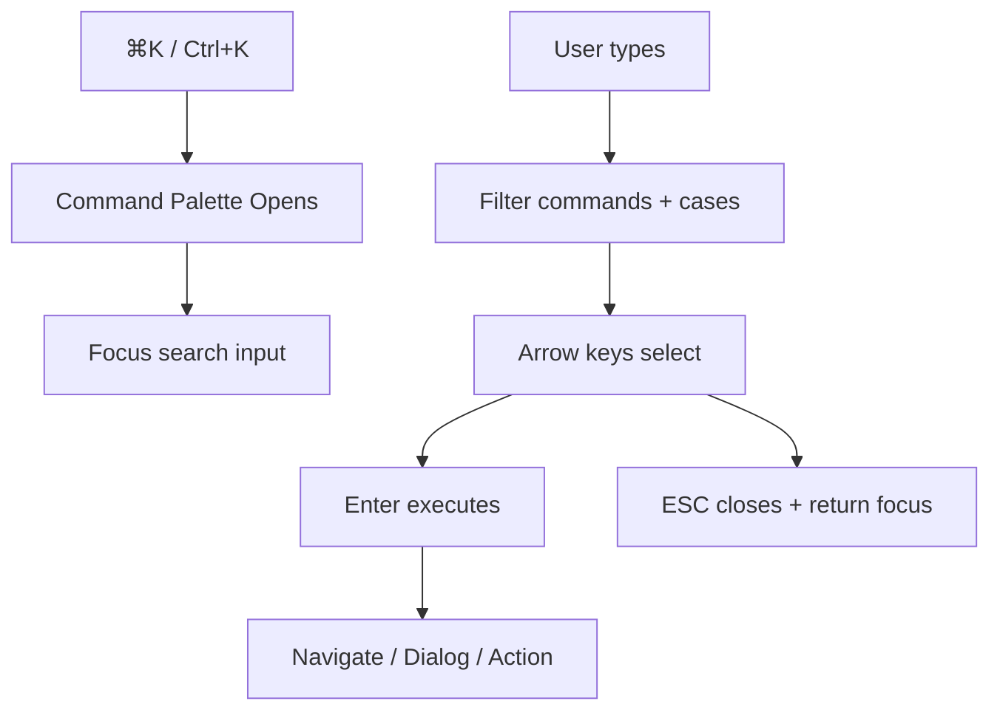
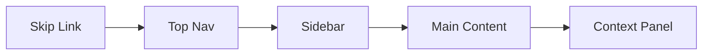
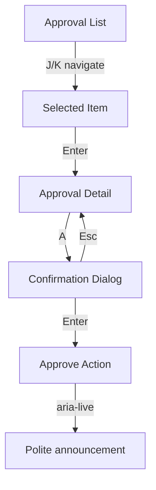

# Keyboard Navigation — Shortcuts, Focus Order & Command Palette

**LexFlow AI** — Design System Foundation  
**Version:** 1.0  
**Status:** Draft — Pre-Implementation  
**Last Updated:** 2026-07-06

---

## Purpose

Define LexFlow AI's **keyboard navigation system** — global shortcuts, focus order rules, command palette integration, and keyboard patterns for dense legal enterprise interfaces. Legal professionals frequently navigate without a mouse during document review, approval workflows, and case triage. Keyboard design follows Linear, GitHub, and Microsoft 365 conventions.

---

## Scope

| In Scope | Out of Scope |
|----------|--------------|
| Global keyboard shortcuts | Browser extension shortcuts |
| Focus order and tab sequence | Screen reader gesture patterns |
| Command palette (⌘K) integration | Mobile touch keyboard |
| Component keyboard patterns | Vim-style modal editing |
| Shortcut conflict resolution | Gamepad/accessibility switch hardware |

Cross-reference: Accessibility in [accessibility.md](./accessibility.md), layout landmarks in [grid-layout.md](./grid-layout.md).

---

## Design Principles

1. **Modifier-first shortcuts** — All global shortcuts require ⌘/Ctrl to avoid WCAG 2.1.4 conflicts.
2. **Linear-grade efficiency** — Power users navigate cases, approvals, and search without mouse.
3. **Predictable focus order** — DOM order matches visual order; no positive `tabindex`.
4. **Escape hatches** — ESC closes overlays; focus returns to trigger.
5. **Discoverability** — Command palette shows available actions; `?` opens shortcut reference.
6. **No keyboard traps** — Modals trap focus intentionally; tables and pages do not.

---

## Specifications

### Global Shortcuts

| Shortcut | Mac | Windows/Linux | Action | Context |
|----------|-----|---------------|--------|---------|
| Command palette | `⌘ K` | `Ctrl K` | Open global search / command palette | Global |
| Shortcut help | `⌘ /` or `?` | `Ctrl /` or `?` | Show keyboard shortcuts dialog | Global |
| Close overlay | `Esc` | `Esc` | Close dialog, sheet, popover, palette | When overlay open |
| Go to cases | `G then C` | `G then C` | Navigate to /cases | Global (sequence) |
| Go to approvals | `G then A` | `G then A` | Navigate to /approvals | Global |
| Go to workflows | `G then W` | `G then W` | Navigate to /workflows | Global |
| New case | `⌘ Shift N` | `Ctrl Shift N` | Open create case dialog | Cases list |
| Toggle sidebar | `[` | `[` | Collapse/expand sidebar | Global |
| Toggle panel | `]` | `]` | Show/hide right context panel | Case workspace (xl+) |

**Sequence keys:** `G then C` means press G, release, then press C within 1000ms. Displayed in help as `G → C`.

### Command Palette (⌘K)

Inspired by Linear and GitHub Command Palette.

| Feature | Behavior |
|---------|----------|
| Trigger | `⌘K` / `Ctrl+K` or click search in top nav |
| Scope | Global navigation, case search, recent items, actions |
| Filter | Type to filter; fuzzy match on case name, client, case number |
| Selection | Arrow keys navigate; Enter executes; ESC closes |
| Groups | Recent, Cases, Actions, Navigation, Settings |
| Empty | "No results" with suggestion to create case |
| Width | 640px max; centered overlay |
| Elevation | `shadow-xl` (elevation 4) |

#### Command Palette Actions

| Command | Action |
|---------|--------|
| `Go to Cases` | Navigate /cases |
| `Go to Approvals` | Navigate /approvals |
| `Create Case` | Open create case dialog |
| `Search cases: {query}` | Filter and show case results |
| `Open case: {name}` | Navigate to case workspace |
| `Toggle dark mode` | Switch theme (Phase 3) |
| `Keyboard shortcuts` | Open help dialog |



### Focus Order

#### Default Page Sequence

| Order | Element | Notes |
|-------|---------|-------|
| 1 | Skip to main content | Visually hidden until focused |
| 2 | Sidebar toggle (mobile) | md and below only |
| 3 | Top nav: Search trigger | Opens command palette on Enter |
| 4 | Top nav: Notifications | Dropdown on Enter |
| 5 | Top nav: Help | |
| 6 | Top nav: User menu | |
| 7 | Sidebar navigation items | Role-filtered |
| 8 | Main content | Breadcrumb → page actions → content |
| 9 | Context panel (if visible) | After main content |



#### Case Workspace Focus Order

| Order | Element |
|-------|---------|
| 1 | Breadcrumb links |
| 2 | Case header actions (primary first) |
| 3 | Tab list |
| 4 | Tab panel content |
| 5 | Context panel |

**Rule:** Tab key moves forward through focusable elements; Shift+Tab reverse. Never use `tabindex` > 0.

### Component Keyboard Patterns

#### DataTable

| Key | Action |
|-----|--------|
| `Tab` | Enter/exit table; move to interactive elements |
| `↑` / `↓` | Navigate rows (when row focus enabled) |
| `Enter` | Open selected row / case |
| `Space` | Toggle row selection (checkbox column) |
| `Home` / `End` | First / last row |
| Column header `Enter` | Toggle sort |
| Column header `Space` | Toggle sort (alternative) |

#### Tabs (Radix)

| Key | Action |
|-----|--------|
| `←` / `→` | Previous / next tab |
| `Home` | First tab |
| `End` | Last tab |
| `Enter` / `Space` | Activate focused tab |

#### Dropdown Menu

| Key | Action |
|-----|--------|
| `Enter` / `↓` | Open menu |
| `↑` / `↓` | Navigate items |
| `Enter` | Select item |
| `Esc` | Close menu |
| Letter key | Typeahead to matching item |

#### Dialog

| Key | Action |
|-----|--------|
| `Tab` | Cycle focusable elements (trapped) |
| `Shift+Tab` | Reverse cycle |
| `Esc` | Close dialog (unless destructive in progress) |
| `Enter` | Submit primary action (when focus not on cancel) |

#### Approval Inbox (Power User)

| Key | Action |
|-----|--------|
| `J` / `↓` | Next approval item |
| `K` / `↑` | Previous approval item |
| `Enter` | Open approval detail |
| `A` | Approve (opens confirmation dialog) |
| `R` | Reject (opens confirmation dialog) |

**Note:** `J`/`K`/`A`/`R` only active when approval list has focus — not global (WCAG 2.1.4).

#### Document List

| Key | Action |
|-----|--------|
| `↑` / `↓` | Navigate documents |
| `Enter` | Open preview |
| `Space` | Select for bulk action |
| `Delete` | Delete (opens confirmation) |

---

### Focus Management Rules

| Scenario | Behavior |
|----------|----------|
| Dialog open | Focus first focusable element; trap Tab |
| Dialog close | Return focus to trigger element |
| Command palette open | Focus search input |
| Command palette close | Return focus to search trigger |
| Route change | Focus moves to H1 (via `tabindex="-1"`) |
| Toast appear | No focus steal; `aria-live` announces |
| SSE update | No focus change; live region announces |
| Error on submit | Focus first invalid field |

```mermaid
sequenceDiagram
    participant U as User
    participant TRIGGER as Trigger Button
    participant DIALOG as Dialog
    participant APP as Page

    U->>TRIGGER: Enter — open
    TRIGGER->>DIALOG: Open; focus first field
    U->>DIALOG: Tab through fields
    U->>DIALOG: ESC — close
    DIALOG->>TRIGGER: Return focus
    U->>APP: Continue Tab navigation
```

---

### Shortcut Conflict Resolution

| Conflict | Resolution |
|----------|------------|
| Browser `Ctrl+K` (search) | Prevent default when palette open |
| Browser `Ctrl+N` (new window) | Use `Ctrl+Shift+N` for new case |
| Screen reader keys | Component-scoped only when focused |
| Input fields | Global shortcuts disabled while typing in inputs |
| Client portal | No global shortcuts except Esc — simplified UX |

---

## Wireframes

### Command Palette Layout

```
┌────────────────────────────────────────────────────────────┐
│  🔍  Search cases, actions, navigation...                  │
├────────────────────────────────────────────────────────────┤
│  RECENT                                                    │
│    ○ Smith v. Jones                                        │
│    ○ Pending approvals (3)                                 │
│  ────────────────────────────────────────────────────────  │
│  ACTIONS                                                   │
│    ○ Create case                                           │
│    ○ Go to workflows                                       │
│  ────────────────────────────────────────────────────────  │
│  ↑↓ navigate · ↵ select · esc close                        │
└────────────────────────────────────────────────────────────┘
         640px max-width · centered · shadow-xl
```

### Keyboard Shortcut Help Dialog

```
┌─────────────────────────────────────────────────────────────┐
│  Keyboard Shortcuts                                    [X]  │
├─────────────────────────────────────────────────────────────┤
│  GLOBAL                                                     │
│    ⌘ K          Command palette                             │
│    ⌘ /          Show this dialog                            │
│    G → C        Go to cases                                 │
│    [            Toggle sidebar                              │
│  ─────────────────────────────────────────────────────────  │
│  CASE WORKSPACE                                             │
│    ]            Toggle context panel                        │
│    ← →          Switch tabs                                 │
│  ─────────────────────────────────────────────────────────  │
│  APPROVALS (when list focused)                              │
│    J / K        Navigate items                              │
│    A            Approve (with confirmation)               │
└─────────────────────────────────────────────────────────────┘
```

### Focus Flow — Approval Workflow



---

## Best Practices

1. **Show shortcuts in UI** — Command palette and help dialog; tooltips on nav items (Phase 2).
2. **Never steal focus** — Toasts and SSE updates announce without moving focus.
3. **Visible focus always** — See [accessibility.md](./accessibility.md) focus ring spec.
4. **Scope single-key shortcuts** — J/K/A/R only when approval list focused.
5. **Test without mouse** — Keyboard-only walkthrough required every release.
6. **Portal simplicity** — Client portal: Tab navigation only; no command palette.
7. **Document new shortcuts** — Update this doc and help dialog in same PR.

---

## Accessibility Notes

- **WCAG 2.1.1 Keyboard** — All functionality available via keyboard.
- **WCAG 2.1.2 No Keyboard Trap** — ESC always exits overlays; no trap in page content.
- **WCAG 2.1.4 Character Key Shortcuts** — Global shortcuts require modifier; single keys scoped to focused component.
- **WCAG 2.4.3 Focus Order** — Logical sequence documented above; DOM order matches visual.
- **WCAG 2.4.7 Focus Visible** — Ring token from [design-tokens.md](./design-tokens.md).
- **Screen reader** — Command palette items have clear labels; shortcut help available via `?`.
- **Skip link** — First focusable element on every page.

---

## References

### LexFlow Documentation

| Document | Path |
|----------|------|
| Accessibility | [accessibility.md](./accessibility.md) |
| Grid layout | [grid-layout.md](./grid-layout.md) |
| Motion | [motion-animation.md](./motion-animation.md) |
| UI accessibility | [../../12-ui/accessibility.md](../../12-ui/accessibility.md) |
| Page architecture | [../../12-ui/page-architecture.md](../../12-ui/page-architecture.md) |
| User personas | [../../01-product/user-personas.md](../../01-product/user-personas.md) |
| Capabilities | [../../01-product/capabilities.md](../../01-product/capabilities.md) |

### External References

- [Linear Keyboard Shortcuts](https://linear.app/docs/keyboard-shortcuts)
- [GitHub Keyboard Shortcuts](https://docs.github.com/en/get-started/accessibility/keyboard-shortcuts)
- [Microsoft Fluent Keyboard](https://fluent2.microsoft.design/accessibility)
- [WAI-ARIA APG — Keyboard Navigation](https://www.w3.org/WAI/ARIA/apg/practices/keyboard-interface/)
- [Atlassian Design — Keyboard Interaction](https://atlassian.design/foundations/interaction)
