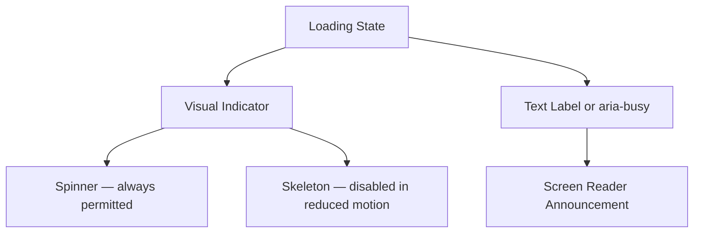
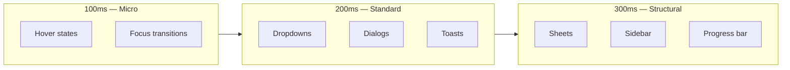

# Motion & Animation — Duration, Easing & Reduced Motion

**LexFlow AI** — Design System Foundation  
**Version:** 1.0  
**Status:** Draft — Pre-Implementation  
**Last Updated:** 2026-07-06

---

## Purpose

Define LexFlow AI's **motion and animation system** — duration tokens, easing curves, permitted animation types, and reduced-motion accessibility requirements. Legal enterprise software prioritizes stability and predictability over delight; motion communicates state change, not decoration.

Visual references: Microsoft Fluent UI (functional motion), Linear (snappy transitions), Stripe (subtle feedback).

---

## Scope

| In Scope | Out of Scope |
|----------|--------------|
| Duration and easing tokens | Lottie/After Effects assets |
| Permitted animation patterns | Video backgrounds |
| Reduced motion requirements | 3D transforms |
| Loading and status animations | Marketing page animations |
| Panel/dialog transitions | Gamification animations |

Cross-reference: Accessibility in [accessibility.md](./accessibility.md), tokens in [design-tokens.md](./design-tokens.md).

---

## Design Principles

1. **Functional, not decorative** — Motion explains state change (open, close, loading, success).
2. **Fast by default** — 200ms standard; legal users prefer snappy over cinematic.
3. **Respect reduced motion** — `prefers-reduced-motion: reduce` disables non-essential animation.
4. **No motion fatigue** — Minimal animation during 8-hour sessions.
5. **Consistent easing** — Same curve family across all transitions.
6. **Accessible alternatives** — Loading states communicate via text + `aria-busy`, not animation alone.

---

## Specifications

### Duration Tokens

| Token | Value | Usage |
|-------|-------|-------|
| `duration.instant` | `0ms` | Reduced motion fallback; state toggles |
| `duration.fast` | `100ms` | Hover color transitions, opacity fades |
| `duration.normal` | `200ms` | **Default** — dialogs, dropdowns, panels |
| `duration.slow` | `300ms` | Sheet slide-in, sidebar collapse |
| `duration.slower` | `500ms` | Page-level transitions (avoid) |
| `duration.spinner` | `1000ms` | Full rotation cycle for loading spinners |

### Easing Tokens

| Token | Value | Usage |
|-------|-------|-------|
| `easing.default` | `cubic-bezier(0.4, 0, 0.2, 1)` | General transitions (Material standard) |
| `easing.in` | `cubic-bezier(0.4, 0, 1, 1)` | Elements exiting viewport |
| `easing.out` | `cubic-bezier(0, 0, 0.2, 1)` | Elements entering viewport |
| `easing.in-out` | `cubic-bezier(0.4, 0, 0.2, 1)` | Symmetric state changes |
| `easing.linear` | `linear` | Spinner rotation only |

### Animation Catalog

#### Permitted Animations

| Animation | Duration | Easing | Reduced Motion |
|-----------|----------|--------|----------------|
| Button hover bg | 100ms | default | Instant color change |
| Focus ring appear | 0ms | — | Always instant |
| Dropdown open | 200ms | out | Instant show/hide |
| Dialog fade + scale | 200ms | out | Instant show/hide |
| Sheet slide (right) | 300ms | out | Instant show/hide |
| Sidebar collapse | 300ms | in-out | Instant width change |
| Toast enter/exit | 200ms | out / in | Instant |
| Command palette | 200ms | out | Instant |
| Skeleton pulse | 1500ms | linear | Static gray block |
| Spinner rotate | 1000ms | linear | **Keep** — essential loading |
| Progress bar fill | 300ms | out | Instant jump |
| Accordion expand | 200ms | in-out | Instant expand |
| Tab indicator slide | 200ms | out | Instant jump |
| Row hover highlight | 100ms | default | Instant |

#### Prohibited Animations

| Animation | Reason |
|-----------|--------|
| Parallax scrolling | Distracting in long sessions; vestibular trigger |
| Auto-playing carousels | WCAG 2.2.2; no user benefit |
| Bounce / spring overshoot | Unprofessional in legal context |
| Confetti / celebration | Inappropriate for enterprise legal |
| Infinite background animation | Motion fatigue |
| Shake on error | Anxiety-inducing; use color + text |
| Page flip transitions | Disorienting for dense data apps |

---

### Component Motion Specs

#### Dialog

| Phase | Animation | Duration |
|-------|-----------|----------|
| Enter | Fade in + scale from 95% | 200ms out |
| Exit | Fade out + scale to 95% | 150ms in |
| Backdrop | Fade to 50% opacity black | 200ms |

#### Sheet (Mobile Sidebar / Metadata Drawer)

| Phase | Animation | Duration |
|-------|-----------|----------|
| Enter | Slide from right edge | 300ms out |
| Exit | Slide to right edge | 250ms in |
| Backdrop | Fade | 200ms |

#### Dropdown / Popover

| Phase | Animation | Duration |
|-------|-----------|----------|
| Enter | Fade + translateY(-4px) to 0 | 200ms out |
| Exit | Fade out | 150ms in |

#### Command Palette

| Phase | Animation | Duration |
|-------|-----------|----------|
| Enter | Fade + scale from 98% | 200ms out |
| Exit | Fade out | 150ms in |

#### Sidebar Collapse

| Phase | Animation | Duration |
|-------|-----------|----------|
| Collapse | Width 240px → 56px | 300ms in-out |
| Expand | Width 56px → 240px | 300ms in-out |
| Labels | Fade out/in | 150ms (mid-transition) |

#### Toast (Sonner)

| Phase | Animation | Duration |
|-------|-----------|----------|
| Enter | Slide from bottom + fade | 200ms out |
| Exit | Slide down + fade | 150ms in |
| Swipe dismiss | Follow pointer | — |

---

### Loading States

| State | Visual | Motion | Accessible |
|-------|--------|--------|------------|
| Button loading | Spinner icon + disabled | Spinner rotate 1000ms | `aria-busy="true"` |
| Page loading | Skeleton blocks | Pulse 1500ms | `aria-busy="true"` on container |
| Table loading | Skeleton rows | Pulse 1500ms | "Loading cases" sr-only text |
| AI processing | Progress bar + status text | Bar fill 300ms | `role="progressbar"` |
| Workflow running | Status badge spinner | Loader2 rotate 1000ms | Badge text "In Progress" |
| Infinite scroll | Bottom spinner | Rotate 1000ms | `aria-live="polite"` on load |

**Rule:** Never use animation as the sole loading indicator — always pair with text or `aria-busy`.



---

### Reduced Motion

#### Media Query

```css
@media (prefers-reduced-motion: reduce) {
  *, *::before, *::after {
    animation-duration: 0.01ms !important;
    animation-iteration-count: 1 !important;
    transition-duration: 0.01ms !important;
    scroll-behavior: auto !important;
  }
}
```

#### Reduced Motion Behavior Matrix

| Animation | Full Motion | Reduced Motion |
|-----------|-------------|----------------|
| Dialog open | Fade + scale 200ms | Instant appear |
| Sheet slide | 300ms slide | Instant appear |
| Hover transitions | 100ms color | Instant |
| Skeleton pulse | 1500ms pulse | Static `muted` background |
| Spinner | 1000ms rotate | **Keep rotating** — essential |
| Progress bar | 300ms fill | Instant jump to value |
| Sidebar collapse | 300ms width | Instant |
| Toast | 200ms slide | Instant |

**Exception:** Loading spinners remain animated — they communicate system activity that has no static alternative. Pair with `aria-busy` and text label.

---

## Wireframes

### Dialog Enter Animation (Full Motion)

```
Frame 0 (0ms):          Frame 100 (200ms):
┌──────────────┐          ┌──────────────────────┐
│              │          │  Approve AI Summary  │
│   (hidden)   │    →     │  ──────────────────  │
│              │          │  Content...          │
└──────────────┘          │  [Cancel] [Approve]  │
  opacity: 0                └──────────────────────┘
  scale: 95%                  opacity: 1, scale: 100%
```

### State Change Motion Map



### Loading State Timeline

```
User action ──→ Button disabled + spinner (1000ms rotate)
              ──→ API call in flight
              ──→ Success: toast fade in (200ms) + aria-live announce
              ──→ Button re-enabled

Reduced motion:
User action ──→ Button disabled + spinner (still rotates)
              ──→ API call in flight
              ──→ Success: toast instant + aria-live announce
```

---

## Best Practices

1. **200ms default** — If unsure, use `duration.normal` with `easing.default`.
2. **Test reduced motion** — Every animated component verified in `prefers-reduced-motion` mode.
3. **No animation on errors** — Errors appear instantly with `role="alert"`.
4. **Spinner + text** — "Processing..." or `aria-busy` alongside every spinner.
5. **Avoid layout shift** — Animate opacity/transform; not width/height of content (except sidebar).
6. **SSE updates** — No entrance animation on live-updated rows — instant insert with `aria-live`.
7. **Portal restraint** — Client portal uses fewer animations than firm dashboard.

---

## Accessibility Notes

- **WCAG 2.3.1 Three Flashes** — No flashing content; spinners rotate smoothly.
- **WCAG 2.3.3 Animation from Interactions** — Reduced motion disables non-essential motion.
- **WCAG 2.2.2 Pause, Stop, Hide** — No auto-playing animations > 5s (none planned).
- **Vestibular disorders** — No parallax, zoom, or large spatial transitions.
- **Cognitive load** — Minimal motion during data entry and legal review.
- **Loading accessibility** — `aria-busy`, `role="progressbar"`, and text labels required.

Full requirements: [accessibility.md](./accessibility.md)

---

## References

### LexFlow Documentation

| Document | Path |
|----------|------|
| Design tokens | [design-tokens.md](./design-tokens.md) |
| Accessibility | [accessibility.md](./accessibility.md) |
| Dark mode | [dark-mode.md](./dark-mode.md) |
| UI design system | [../../12-ui/design-system.md](../../12-ui/design-system.md) |
| Real-time updates | [../../12-ui/real-time-updates.md](../../12-ui/real-time-updates.md) |
| User personas | [../../01-product/user-personas.md](../../01-product/user-personas.md) |

### External References

- [Microsoft Fluent Motion](https://fluent2.microsoft.design/motion)
- [Material Design Motion](https://m3.material.io/styles/motion/overview)
- [Atlassian Motion Guidelines](https://atlassian.design/foundations/motion)
- [Linear Interface Philosophy](https://linear.app/readme)
- [Stripe Design Motion](https://stripe.com/docs/stripe-js/appearance-api)
- [WCAG 2.1 — Animation from Interactions](https://www.w3.org/WAI/WCAG21/Understanding/animation-from-interactions.html)
- [prefers-reduced-motion — MDN](https://developer.mozilla.org/en-US/docs/Web/CSS/@media/prefers-reduced-motion)
