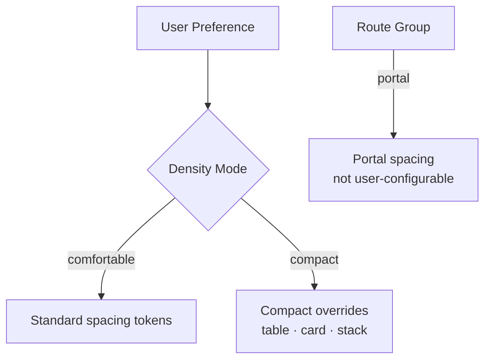
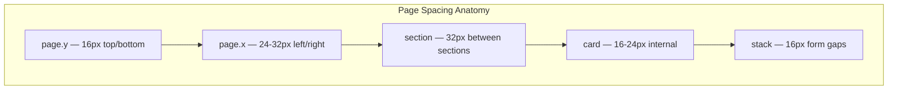

# Spacing — 4px Base Grid & Component Spacing

**LexFlow AI** — Design System Foundation  
**Version:** 1.0  
**Status:** Draft — Pre-Implementation  
**Last Updated:** 2026-07-06

---

## Purpose

Define LexFlow AI's **spacing system** — a 4px base grid, spacing scale, and component-specific spacing rules that create visual rhythm across dense legal enterprise interfaces. Consistent spacing reduces cognitive load during long work sessions and aligns with Fluent UI, Linear, and Atlassian spacing conventions.

---

## Scope

| In Scope | Out of Scope |
|----------|--------------|
| Base grid unit and spacing scale | Print layout margins |
| Page, card, and form spacing | Email template spacing |
| Table and list density modes | Icon internal SVG padding |
| Component spacing patterns | Animation keyframe offsets |
| Responsive spacing adjustments | |

Cross-reference: Grid layout in [grid-layout.md](./grid-layout.md), typography line heights in [typography.md](./typography.md).

---

## Design Principles

1. **4px base grid** — All spacing values are multiples of 4px for pixel-perfect alignment.
2. **Semantic spacing tokens** — Use intent-based names (`spacing.page.x`) over raw scale numbers in documentation.
3. **Density modes** — Comfortable (default) and compact (power users) without breaking layout.
4. **Vertical rhythm** — Stack gaps align with typography line heights where possible.
5. **Consistent component padding** — Cards, dialogs, and panels share predictable internal spacing.
6. **Responsive scaling** — Page padding increases at larger breakpoints.

---

## Specifications

### Base Grid

| Property | Value |
|----------|-------|
| Base unit | `4px` / `0.25rem` |
| Grid alignment | All margins, padding, gaps snap to 4px |
| Sub-grid | `2px` allowed for border widths and fine icon alignment only |

### Spacing Scale

| Token | Value | px | Common Usage |
|-------|-------|-----|--------------|
| `space-0` | `0` | 0 | Reset |
| `space-0.5` | `0.125rem` | 2 | Icon optical adjustment (exception) |
| `space-1` | `0.25rem` | 4 | Tight inline gaps, badge padding-y |
| `space-2` | `0.5rem` | 8 | Button groups, inline badges, compact gaps |
| `space-3` | `0.75rem` | 12 | Table cell padding-y (comfortable), input padding |
| `space-4` | `1rem` | 16 | **Default stack gap**, card padding (mobile), form fields |
| `space-5` | `1.25rem` | 20 | Medium gaps |
| `space-6` | `1.5rem` | 24 | Page padding-x (default), card padding (desktop) |
| `space-8` | `2rem` | 32 | Page padding-x (lg), section separation |
| `space-10` | `2.5rem` | 40 | Large section gaps |
| `space-12` | `3rem` | 48 | Page section breaks |
| `space-16` | `4rem` | 64 | Auth page vertical spacing |
| `space-20` | `5rem` | 80 | Empty state vertical padding |

### Semantic Spacing Tokens

| Token | Maps To | Usage |
|-------|---------|-------|
| `spacing.page.x` | `space-6` / `space-8` at lg | Main content horizontal padding |
| `spacing.page.y` | `space-4` | Main content vertical padding |
| `spacing.section` | `space-8` | Gap between major page sections |
| `spacing.card` | `space-4` / `space-6` at md | Card internal padding |
| `spacing.stack` | `space-4` | Vertical form field gap |
| `spacing.stack.tight` | `space-2` | Compact form groups |
| `spacing.inline` | `space-2` | Horizontal button/badge gap |
| `spacing.inline.loose` | `space-4` | Toolbar action separation |

---

### Page-Level Spacing

| Element | Mobile (< md) | Tablet (md) | Desktop (lg+) |
|---------|---------------|-------------|---------------|
| Page padding-x | 16px (`space-4`) | 24px (`space-6`) | 32px (`space-8`) |
| Page padding-y | 16px (`space-4`) | 16px (`space-4`) | 16px (`space-4`) |
| Section gap | 24px (`space-6`) | 32px (`space-8`) | 32px (`space-8`) |
| Breadcrumb to content | 16px (`space-4`) | 16px (`space-4`) | 16px (`space-4`) |

Tailwind pattern: `px-4 py-4 md:px-6 lg:px-8`

---

### Component Spacing

#### Buttons

| Element | Padding | Gap (icon + text) | Min Height |
|---------|---------|-------------------|------------|
| Default | `px-4 py-2` (16×8) | 8px (`space-2`) | 36px |
| Small | `px-3 py-1.5` (12×6) | 6px | 32px |
| Large | `px-6 py-2.5` (24×10) | 8px | 40px |
| Icon only | `p-2` (8) | — | 36px |
| Portal primary | `px-6 py-3` (24×12) | 8px | 44px |

#### Form Controls

| Element | Spacing |
|---------|---------|
| Label to input | 8px (`space-2`) |
| Input padding | `px-3 py-2` (12×8) |
| Field to field (vertical) | 16px (`space-4`) |
| Field group to field group | 24px (`space-6`) |
| Helper text to input | 4px (`space-1`) |
| Error message to input | 4px (`space-1`) |
| Checkbox/radio label gap | 8px (`space-2`) |

#### Cards & Panels

| Element | Comfortable | Compact |
|---------|-------------|---------|
| Card padding | 24px (`space-6`) | 16px (`space-4`) |
| Card header to body | 16px (`space-4`) | 12px (`space-3`) |
| Card gap (grid of cards) | 16px (`space-4`) | 12px (`space-3`) |
| Panel padding (right context) | 16px (`space-4`) | 16px (`space-4`) |

#### Tables (DataTable)

| Element | Comfortable | Compact |
|---------|-------------|---------|
| Cell padding-x | 16px (`space-4`) | 12px (`space-3`) |
| Cell padding-y | 12px (`space-3`) | 8px (`space-2`) |
| Header padding-y | 12px (`space-3`) | 8px (`space-2`) |
| Row action button gap | 4px (`space-1`) | 4px (`space-1`) |
| Table to pagination | 16px (`space-4`) | 12px (`space-3`) |

#### Navigation

| Element | Value |
|---------|-------|
| Top nav height | 56px (14 × 4px) |
| Sidebar item padding | `px-3 py-2` (12×8) |
| Sidebar item gap | 4px (`space-1`) between items |
| Sidebar section gap | 24px (`space-6`) between groups |
| Breadcrumb item gap | 8px (`space-2`) |
| Tab padding | `px-4 py-2` (16×8) |
| Tab gap | 0 (border-separated) |

#### Dialogs & Modals

| Element | Spacing |
|---------|---------|
| Dialog padding | 24px (`space-6`) |
| Header to body | 16px (`space-4`) |
| Body to footer | 16px (`space-4`) |
| Footer button gap | 8px (`space-2`) |
| Sheet padding | 16px (`space-4`) |

#### Lists & Timelines

| Element | Spacing |
|---------|---------|
| List item padding-y | 12px (`space-3`) |
| List item gap (avatar to content) | 12px (`space-3`) |
| Timeline entry gap | 16px (`space-4`) |
| Timeline dot to content | 12px (`space-3`) |

---

### Density Modes

Cross-reference: [../../01-product/user-personas.md](../../01-product/user-personas.md)

| Property | Comfortable | Compact | Portal |
|----------|-------------|---------|--------|
| Body font | 14px | 12px (tables) | 16px |
| Table row py | 12px | 8px | 16px |
| Card padding | 24px | 16px | 24px |
| Stack gap | 16px | 12px | 20px |
| Default mode | All firm users | Operations opt-in | Client routes (fixed) |



---

### Touch Target Minimums

| Surface | Minimum Size | Spacing Between |
|---------|--------------|-----------------|
| Firm dashboard | 36×36px (buttons) | 4px |
| Client portal | 44×44px | 8px |
| Mobile firm (Phase 2) | 44×44px | 8px |

Portal meets WCAG 2.5.5 Target Size through larger button padding.

---

## Wireframes

### 4px Grid Alignment

```
    4   8   12  16  20  24  28  32  36  40  44  48  52  56
    │   │   │   │   │   │   │   │   │   │   │   │   │   │
    ├─────────────── Card padding (24px) ────────────────┤
    │  ┌─────────────────────────────────────────────┐  │
    │  │  Label                           8px gap   │  │
    │  │  [ Input field                   ]  16px     │  │
    │  │                                     stack    │  │
    │  │  Label                                       │  │
    │  │  [ Input field                   ]           │  │
    │  └─────────────────────────────────────────────┘  │
    └───────────────────────────────────────────────────┘
```

### Page Layout Spacing

```
┌─ Top Nav ───────────────────────────────────────── 56px ─┐
├──────────┬──────────────────────────────────────────────┤
│          │ ← 32px page px →                             │
│ Sidebar  │   ┌─ Section ─────────────────────────────┐  │
│ 240px    │   │  ↕ 16px section gap                   │  │
│          │   └───────────────────────────────────────┘  │
│          │   ┌─ Card (24px padding) ─────────────────┐  │
│          │   │  Content                             │  │
│          │   └──────────────────────────────────────┘  │
│          │ ← 32px page px →                             │
└──────────┴──────────────────────────────────────────────┘
```



### Table Row Spacing Comparison

```
Comfortable (py-3 = 12px):
┌────────────────────────────────────────┐
│           12px                         │
│  Case Name    Status    Modified       │
│           12px                         │
├────────────────────────────────────────┤

Compact (py-2 = 8px):
┌────────────────────────────────────────┐
│        8px                             │
│  Case Name    Status    Modified       │
│        8px                             │
├────────────────────────────────────────┤
```

---

## Best Practices

1. **Snap to grid** — If a spacing value isn't in the scale, it's probably wrong.
2. **Prefer gap over margin** — Use Flexbox/Grid `gap` for sibling spacing; margin for external separation only.
3. **Consistent card padding** — All cards in a view use the same padding tier.
4. **Don't mix density** — Compact tables with comfortable cards in the same view creates visual discord.
5. **Portal is spacious** — Never apply compact mode to client portal routes.
6. **Section breaks** — Use `space-8` between unrelated sections; `space-4` within related groups.
7. **Document exceptions** — 2px spacing allowed only for icon optical alignment; note in component spec.

---

## Accessibility Notes

- **WCAG 1.4.8 Visual Presentation** — Spacing supports readable blocks; line length controlled separately in [grid-layout.md](./grid-layout.md).
- **Touch targets** — Portal buttons meet 44×44px through padding, not just visual size.
- **Focus ring offset** — `ring-offset-2` (8px) prevents focus ring overlap with adjacent elements.
- **Zoom reflow** — Relative spacing units (`rem`) scale with browser zoom.
- **Compact mode** — Must not reduce touch targets below 36px firm / 44px portal minimums.

See [accessibility.md](./accessibility.md)

---

## References

### LexFlow Documentation

| Document | Path |
|----------|------|
| Grid layout | [grid-layout.md](./grid-layout.md) |
| Design tokens | [design-tokens.md](./design-tokens.md) |
| Typography | [typography.md](./typography.md) |
| UI design system | [../../12-ui/design-system.md](../../12-ui/design-system.md) |
| Page architecture | [../../12-ui/page-architecture.md](../../12-ui/page-architecture.md) |
| User personas | [../../01-product/user-personas.md](../../01-product/user-personas.md) |

### External References

- [Microsoft Fluent Spacing](https://fluent2.microsoft.design/layout)
- [Atlassian Space Tokens](https://atlassian.design/foundations/spacing)
- [Linear Layout Principles](https://linear.app/readme)
- [Tailwind Spacing Scale](https://tailwindcss.com/docs/customizing-spacing)
