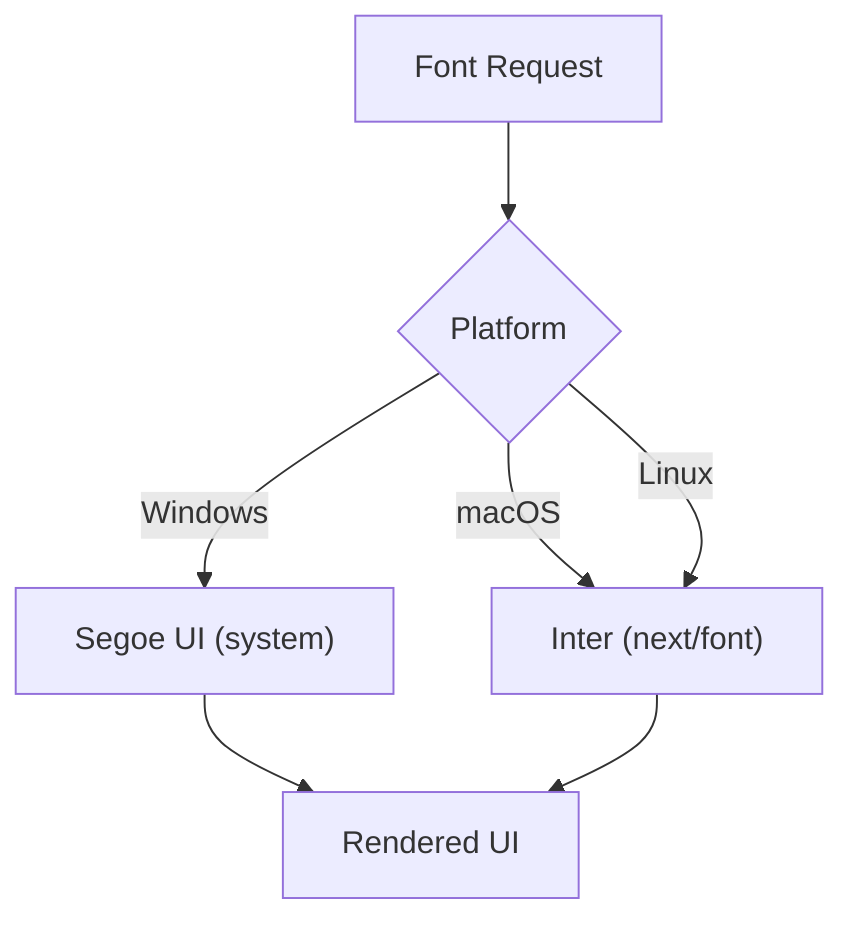
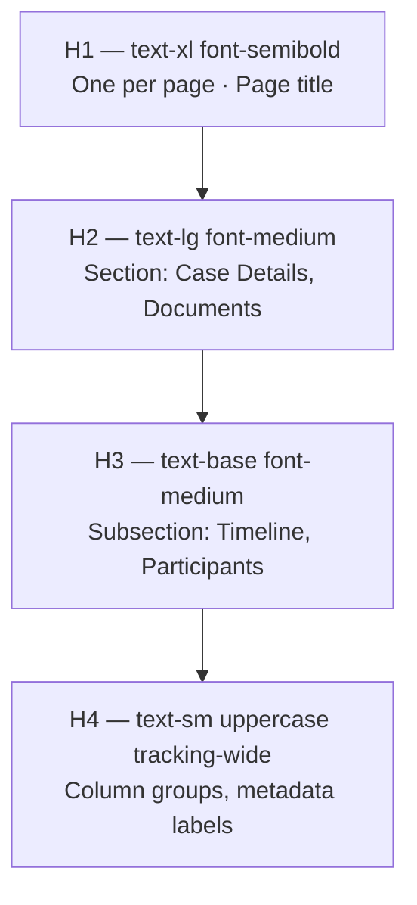
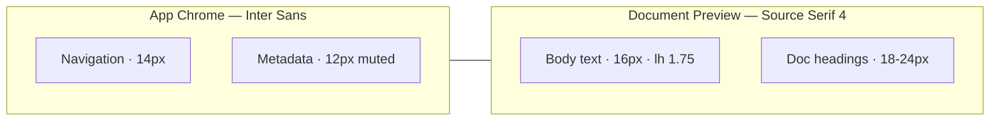

# Typography — Type Scale, Font Stack & Legal Readability

**LexFlow AI** — Design System Foundation  
**Version:** 1.0  
**Status:** Draft — Pre-Implementation  
**Last Updated:** 2026-07-06

---

## Purpose

Define LexFlow AI's **typography system** — font families, type scale, heading hierarchy, and readability standards optimized for legal professionals who read dense case data, long document previews, and AI-generated summaries for extended sessions. Typography aligns with Microsoft 365 / Fluent UI conventions (Segoe UI on Windows, Inter cross-platform) while supporting serif rendering for legal document preview panes.

---

## Scope

| In Scope | Out of Scope |
|----------|--------------|
| Font stack and loading strategy | PDF export typography |
| Type scale and line heights | Email template fonts |
| Heading hierarchy rules | Court filing document formatting |
| Firm vs. portal typography differences | Custom firm font licensing (Phase 2) |
| Monospace for IDs and codes | Marketing website hero typography |
| Legal document preview typography | |

Cross-reference: Spacing rhythm in [spacing.md](./spacing.md), tokens in [design-tokens.md](./design-tokens.md).

---

## Design Principles

1. **Readability over personality** — Inter/Segoe UI for UI chrome; no decorative display fonts.
2. **Hierarchy through weight and size** — Not color alone; headings use semibold, body uses regular.
3. **Density with legibility** — 14px firm default balances information density with WCAG compliance.
4. **Serif for documents only** — Source Serif 4 reserved for legal document preview; sans everywhere else.
5. **Consistent vertical rhythm** — Line heights align to 4px grid where possible.
6. **Accessible scaling** — Relative units; supports 200% browser zoom without clipping.

---

## Specifications

### Font Stack

| Role | Primary | Fallback Stack | Context |
|------|---------|----------------|---------|
| **UI Sans** | Inter | `'Segoe UI', system-ui, -apple-system, sans-serif` | All application chrome |
| **Document Serif** | Source Serif 4 | `Georgia, 'Times New Roman', serif` | Document preview pane only |
| **Monospace** | JetBrains Mono | `ui-monospace, 'Cascadia Code', monospace` | Case IDs, correlation IDs, API job IDs |

#### Platform Resolution



#### Inter OpenType Features

Enable for improved legibility at small sizes:

| Feature | Setting | Effect |
|---------|---------|--------|
| `cv02` | on | Open 4 |
| `cv03` | on | Open 6 |
| `cv04` | on | Open 9 |
| `cv11` | on | Single-story a |
| `tnum` | on (tables) | Tabular numbers for aligned columns |

CSS: `font-feature-settings: "cv02", "cv03", "cv04", "cv11";`

#### Font Loading

| Font | Method | Display |
|------|--------|---------|
| Inter | `next/font/google` | `swap` |
| Source Serif 4 | `next/font/google` | `swap` (preview routes only) |
| JetBrains Mono | `next/font/google` | `swap` |
| Segoe UI | System — no load | instant |

---

### Type Scale

#### Firm Dashboard (Default — 14px base)

| Token | Size | Rem | Line Height | Line px | Weight | Letter Spacing | Usage |
|-------|------|-----|-------------|---------|--------|----------------|-------|
| `text-xs` | 12px | 0.75rem | 1.33 | 16px | 400 | 0 | Timestamps, footnotes, table metadata |
| `text-sm` | 14px | 0.875rem | 1.43 | 20px | 400 | 0 | **Default body**, form inputs, table cells |
| `text-base` | 16px | 1rem | 1.5 | 24px | 400 | 0 | Emphasized body, subsection titles |
| `text-lg` | 18px | 1.125rem | 1.56 | 28px | 500 | 0 | Section headings (H2) |
| `text-xl` | 20px | 1.25rem | 1.4 | 28px | 600 | -0.01em | Page titles (H1) |
| `text-2xl` | 24px | 1.5rem | 1.33 | 32px | 600 | -0.02em | Dashboard hero metrics |
| `text-3xl` | 30px | 1.875rem | 1.2 | 36px | 700 | -0.02em | Auth pages only |

#### Client Portal (16px base)

| Token | Size | Line Height | Usage |
|-------|------|-------------|-------|
| `text-sm` | 14px | 20px | Metadata, captions |
| `text-base` | 16px | 24px | **Default body** |
| `text-lg` | 18px | 28px | Section headings |
| `text-xl` | 20px | 28px | Page titles |

#### Compact Mode Adjustments (Firm)

| Element | Comfortable | Compact |
|---------|-------------|---------|
| Table body | 14px / 20px lh | 12px / 16px lh |
| Table header | 12px uppercase | 11px uppercase |
| Metadata | 12px | 11px |
| Row padding | 12px vertical | 8px vertical |

Cross-reference: [../../01-product/user-personas.md](../../01-product/user-personas.md) — Operations Team defaults to compact.

---

### Heading Hierarchy

| Level | Token | Weight | Usage | Max Per Page |
|-------|-------|--------|-------|--------------|
| H1 | `text-xl font-semibold` | 600 | Page title | 1 |
| H2 | `text-lg font-medium` | 500 | Major sections (Documents, Timeline) | Unlimited |
| H3 | `text-base font-medium` | 500 | Subsections (Participants, Deadlines) | Unlimited |
| H4 | `text-sm font-medium uppercase tracking-wide` | 500 | Table column groups, metadata labels | Unlimited |

**Rules:**
- Never skip heading levels for visual styling — apply utility classes to lower semantic level instead.
- Page title (H1) includes case name when in case workspace: "Smith v. Jones — Documents"
- Dialog titles use H2 equivalent (`text-lg font-semibold`) regardless of page context.



---

### Font Weights

| Token | Value | Usage |
|-------|-------|-------|
| `font-normal` | 400 | Body text, descriptions, table cells |
| `font-medium` | 500 | Labels, H2/H3, nav items, button text |
| `font-semibold` | 600 | H1, metrics, emphasis within body |
| `font-bold` | 700 | Auth headings only; avoid in dashboard |

**Rule:** Do not use bold (700) in dense tables — use medium (500) for emphasis.

---

### Legal Document Preview Typography

Used exclusively in document viewer preview pane — not application chrome.

| Element | Font | Size | Line Height | Usage |
|---------|------|------|-------------|-------|
| Body | Source Serif 4 | 16px | 1.75 (28px) | Document paragraphs |
| Headings (in doc) | Source Serif 4 | 18–24px | 1.4 | Document section titles |
| Footnotes | Source Serif 4 | 12px | 1.5 | Footnote text |
| Page numbers | Inter | 12px | 1.33 | Viewer chrome only |
| Redlines / markup | JetBrains Mono | 13px | 1.5 | Tracked changes (Phase 2) |

#### Readability Targets for Legal Text

| Metric | Target | Rationale |
|--------|--------|-----------|
| Line length | 65–75 characters | Optimal reading measure for legal prose |
| Paragraph spacing | 16px (1em) | Clear paragraph boundaries |
| Minimum size | 14px (user can zoom) | Accessibility floor |
| Contrast | 4.5:1 minimum | WCAG AA on preview background `#FFFFFF` |

---

### Monospace Usage

| Context | Example | Token |
|---------|---------|-------|
| Case number | `CASE-2026-0042` | `font-mono text-sm` |
| Correlation ID | `corr_8f3a2b1c` | `font-mono text-xs` |
| API job ID | `job_ai_7d4e9f` | `font-mono text-xs` |
| Audit log entry ID | `aud_00192847` | `font-mono text-xs` |
| Code snippets (admin) | Config JSON | `font-mono text-sm` |

**Rule:** Monospace never used for prose or headings — IDs and codes only.

---

### Text Colors (Semantic)

| Token | Usage |
|-------|-------|
| `text-foreground` | Primary body text |
| `text-muted-foreground` | Timestamps, secondary metadata, placeholders |
| `text-primary` | Links, active nav items |
| `text-destructive` | Error messages, validation text |
| `text-status-success` | Success inline messages |
| `text-status-warning` | Warning inline messages |

Cross-reference: [color-system.md](./color-system.md)

---

## Wireframes

### Page Title & Section Hierarchy

```
┌─────────────────────────────────────────────────────────────┐
│  Smith v. Jones — Documents                    [H1 text-xl] │
│  ─────────────────────────────────────────────────────────  │
│  Uploaded Files                                 [H2 text-lg]│
│  ┌───────────────────────────────────────────────────────┐  │
│  │ Name              │ Status    │ Modified    [H4 labels]│  │
│  │ Motion_to_Dismiss   Completed   2h ago      [text-sm] │  │
│  │ Discovery_Request   In Progress 1d ago      [text-sm] │  │
│  └───────────────────────────────────────────────────────┘  │
│  Version History                              [H2 text-lg]│
└─────────────────────────────────────────────────────────────┘
```

### Document Preview Split View



```
┌──────────────┬──────────────────────────────────────────────┐
│  Metadata    │  MOTION TO DISMISS              [Serif H1]   │
│  (Inter)     │                                              │
│              │  Pursuant to Rule 12(b)(6)...   [Serif body]  │
│  Filename    │  The Plaintiff fails to state...             │
│  Privileged  │                                              │
│  12 pages    │  ...long legal prose with 65-75 char lines...│
│              │                                              │
└──────────────┴──────────────────────────────────────────────┘
```

### Table Typography (Dense Data)

```
┌────────────────────────────────────────────────────────────────┐
│  CASE NAME          STATUS        ATTORNEY       MODIFIED      │  ← 12px uppercase H4
│  ────────────────────────────────────────────────────────────  │
│  Smith v. Jones     [In Progress]  J. Smith      2h ago        │  ← 14px body
│  CASE-2026-0042     [Pending]      —             1d ago        │  ← mono case ID
└────────────────────────────────────────────────────────────────┘
```

---

## Best Practices

1. **One H1 per page** — Assists screen readers and SEO; matches WCAG 2.4.6.
2. **Relative units** — Use `rem` for font sizes; supports user browser font preferences.
3. **Tabular numbers in tables** — Enable `font-variant-numeric: tabular-nums` for numeric columns.
4. **Truncate with tooltip** — Long case names: `truncate` + full name in tooltip, not smaller font.
5. **No all-caps body text** — Uppercase reserved for H4 labels and table headers only.
6. **Link styling** — `text-primary underline-offset-4 hover:underline`; never rely on color alone.
7. **AI content labeling** — AI-generated text includes visible "AI-generated" label in Inter, not serif.

---

## Accessibility Notes

- **WCAG 1.4.4 Resize Text** — All text uses relative units; layout reflows at 200% zoom.
- **WCAG 1.4.12 Text Spacing** — Line height ≥ 1.5 for body; paragraph spacing adjustable.
- **Minimum sizes** — 12px floor for metadata; 14px firm body; 16px portal body.
- **Screen readers** — Heading hierarchy matches visual hierarchy; no `aria-hidden` on visible headings.
- **Dyslexia considerations** — Inter's open forms (`cv02`, `cv03`) improve character distinction; no justified text in UI chrome.
- **Document preview** — User zoom controls in viewer; preview pane respects browser zoom.

Full requirements: [accessibility.md](./accessibility.md)

---

## References

### LexFlow Documentation

| Document | Path |
|----------|------|
| Design tokens | [design-tokens.md](./design-tokens.md) |
| Color system | [color-system.md](./color-system.md) |
| Spacing | [spacing.md](./spacing.md) |
| Design philosophy | [design-philosophy.md](./design-philosophy.md) |
| UI design system | [../../12-ui/design-system.md](../../12-ui/design-system.md) |
| User personas | [../../01-product/user-personas.md](../../01-product/user-personas.md) |
| Product vision | [../../01-product/vision.md](../../01-product/vision.md) |

### External References

- [Inter Font Specimen](https://rsms.me/inter/)
- [Source Serif 4](https://fonts.google.com/specimen/Source+Serif+4)
- [Microsoft Fluent Typography](https://fluent2.microsoft.design/typography)
- [Segoe UI Type Ramp](https://learn.microsoft.com/en-us/windows/apps/design/style/typography)
- [Atlassian Typography](https://atlassian.design/foundations/typography)
- [Linear Typography](https://linear.app/readme)
