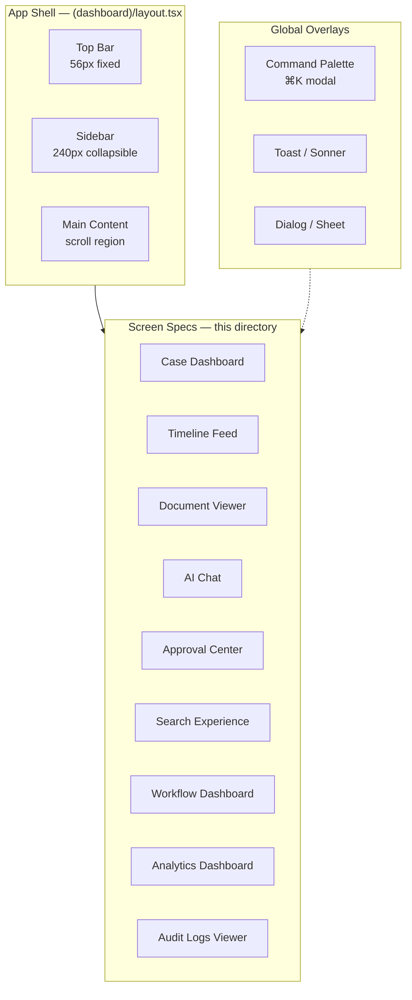
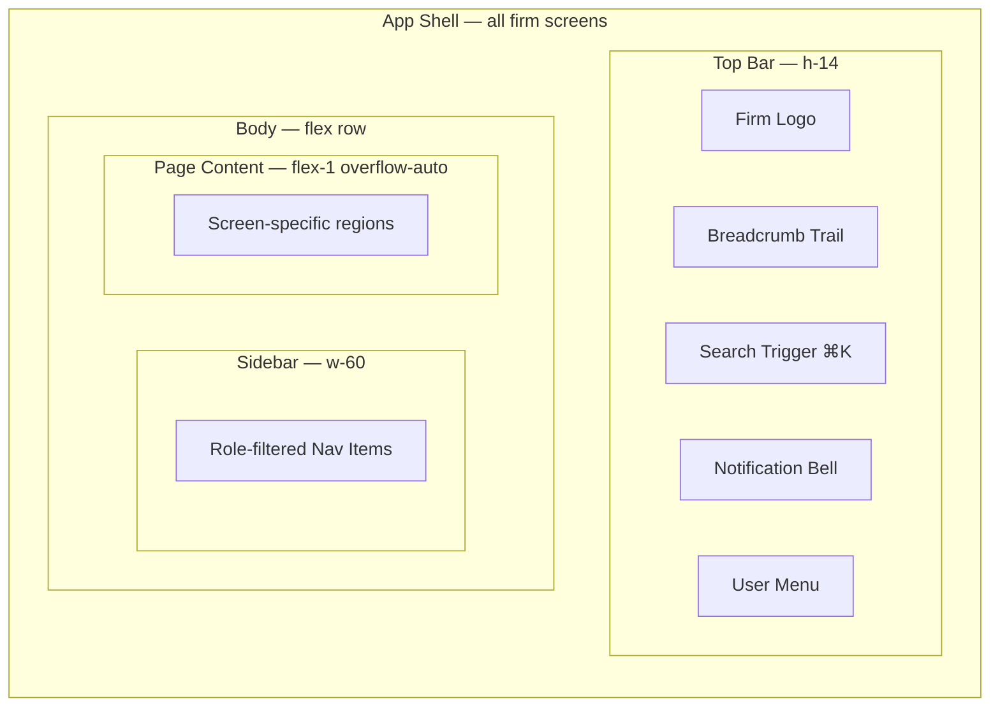

# Screen Specifications — LexFlow AI

**LexFlow AI** — Screen-Level Design Documentation  
**Version:** 1.0  
**Status:** Draft — Pre-Implementation  
**Last Updated:** 2026-07-06

---

## Purpose

This directory contains **screen-level design specifications** for the LexFlow AI firm dashboard. Each document defines layout regions, data requirements, interaction patterns, responsive behavior, and accessibility expectations for a single primary surface.

These specs are **design documentation only** — no React implementation code. Wireframes use Mermaid block diagrams showing layout regions, aligned with the visual language in [../12-ui/design-system.md](../../12-ui/design-system.md) and routing in [../12-ui/page-architecture.md](../../12-ui/page-architecture.md).

**Design reference:** Enterprise legal SaaS combining Microsoft 365 information density, Azure Portal operational clarity, and Linear-style keyboard-first navigation.

---

## Screen Index

| Screen | Route | Primary Personas | Doc |
|--------|-------|------------------|-----|
| **Case Dashboard** | `/cases/[caseId]/overview` | Attorney, Paralegal, Associate | [case-dashboard.md](./case-dashboard.md) |
| **Timeline / Activity Feed** | `/cases/[caseId]/timeline` | All assigned roles | [timeline-activity-feed.md](./timeline-activity-feed.md) |
| **Document Viewer** | `/cases/[caseId]/documents/[documentId]` | Attorney, Paralegal, Associate | [document-viewer.md](./document-viewer.md) |
| **AI Chat** | `/cases/[caseId]/ai` | Attorney, Associate, Paralegal | [ai-chat.md](./ai-chat.md) |
| **Approval Center** | `/approvals` | Attorney, Managing Partner | [approval-center.md](./approval-center.md) |
| **Search Experience** | `/documents` · Cmd+K search mode | All firm users | [search-experience.md](./search-experience.md) |
| **Command Palette** | Global overlay (`⌘K` / `Ctrl+K`) | All firm users | [command-palette.md](./command-palette.md) |
| **Workflow Dashboard** | `/workflows` | Operations Team, Paralegal | [workflow-dashboard.md](./workflow-dashboard.md) |
| **Analytics Dashboard** | `/reports` | Managing Partner, Operations | [analytics-dashboard.md](./analytics-dashboard.md) |
| **Audit Logs Viewer** | `/audit` | Compliance Officer, System Admin | [audit-logs-viewer.md](./audit-logs-viewer.md) |

---

## Architecture — Screen Layer Model

---

## Shared Conventions

All screen specs in this directory follow a common structure:

| Section | Description |
|---------|-------------|
| **Purpose** | Why the screen exists and what job it completes |
| **Users / Personas** | Primary and secondary roles with permission gates |
| **Layout Wireframe** | Mermaid block diagram of layout regions |
| **Regions / Components** | Named regions with ShadCN primitives and domain components |
| **Data Requirements** | API endpoints, query keys, real-time subscriptions |
| **States** | Empty, loading, error, and partial-data states |
| **Interactions** | User actions, navigation, keyboard shortcuts |
| **Responsive Behavior** | Desktop (≥1280px), tablet (768–1279px), mobile (<768px) |
| **Accessibility** | WCAG 2.1 AA requirements specific to the screen |
| **API References** | Links to [../../04-api/](../../04-api/) endpoint docs |

### Visual Language

| Principle | Implementation |
|-----------|----------------|
| **Trust & professionalism** | Deep legal blue primary (`#1E3A5F`); no consumer-app neon |
| **Information density** | Azure Portal–style data tables; compact row height (40px default) |
| **Keyboard-first** | Linear-style command palette; full keyboard traversal |
| **Status clarity** | Semantic status pills — never color alone (icon + text) |
| **Confidentiality** | Privileged content: left border + lock icon per design system |

### Shared App Shell Regions

Every authenticated firm screen inherits these regions from `(dashboard)/layout.tsx`:

### Matter Wall UX (All Case-Scoped Screens)

When the user lacks access to a case resource, the API returns **404**. Screens must:

- Render generic not-found messaging — never distinguish "exists" vs "blocked"
- Message: *"This case could not be found or you may not have access."*
- Cross-reference: [../../08-security/matter-walls.md](../../08-security/matter-walls.md)

---

## Persona → Screen Access Matrix

| Screen | Attorney | Associate | Paralegal | Legal Asst. | Managing Partner | Operations | Compliance | Client |
|--------|:--------:|:---------:|:---------:|:-----------:|:----------------:|:----------:|:----------:|:------:|
| Case Dashboard | ✓ | ✓ | ✓ | ✓ | ✓ (read) | ✓ (read) | ✓ (read) | — |
| Timeline Feed | ✓ | ✓ | ✓ | ✓ | ✓ (read) | ✓ (read) | ✓ (read) | — |
| Document Viewer | ✓ | ✓ | ✓ | ✓ | ✓ (read) | ✓ (read) | metadata | portal |
| AI Chat | ✓ | ✓ | ✓ | configurable | ✓ | ✓ | — | — |
| Approval Center | ✓ | — | submit only | — | ✓ | — | — | — |
| Search Experience | ✓ | ✓ | ✓ | ✓ | ✓ | ✓ | ✓ | — |
| Command Palette | ✓ | ✓ | ✓ | ✓ | ✓ | ✓ | ✓ | — |
| Workflow Dashboard | ✓ | ✓ | ✓ | limited | ✓ (read) | ✓ | — | — |
| Analytics Dashboard | ✓ (read) | — | — | — | ✓ | ✓ | ✓ (read) | — |
| Audit Logs Viewer | lead only | — | — | — | ✓ | — | ✓ | — |

Full persona definitions: [../../01-product/user-personas.md](../../01-product/user-personas.md)

---

## Related Documentation

| Document | Path |
|----------|------|
| Design system tokens & components | [../../12-ui/design-system.md](../../12-ui/design-system.md) |
| App Router routes & tab model | [../../12-ui/page-architecture.md](../../12-ui/page-architecture.md) |
| Accessibility standards | [../../12-ui/accessibility.md](../../12-ui/accessibility.md) |
| State management & query keys | [../../12-ui/state-management.md](../../12-ui/state-management.md) |
| Real-time SSE events | [../../12-ui/real-time-updates.md](../../12-ui/real-time-updates.md) |
| REST API index | [../../04-api/README.md](../../04-api/README.md) |
| RBAC permission matrix | [../../04-api/authorization-rbac.md](../../04-api/authorization-rbac.md) |
| Product roadmap (screen phasing) | [../../01-product/roadmap.md](../../01-product/roadmap.md) |

---

## Implementation Phasing

| Phase | Screens |
|-------|---------|
| **Phase 1 (MVP)** | Case Dashboard, Timeline, Document Viewer, Approval Center, Workflow Dashboard |
| **Phase 2** | Search Experience, Command Palette, AI Chat (basic) |
| **Phase 3** | Analytics Dashboard, Audit Logs Viewer (advanced export), AI Chat (SSE streaming) |
