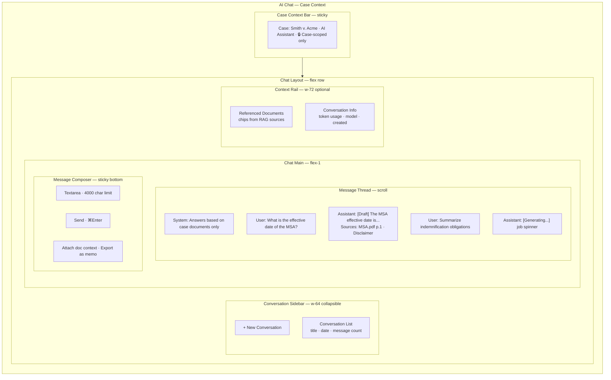
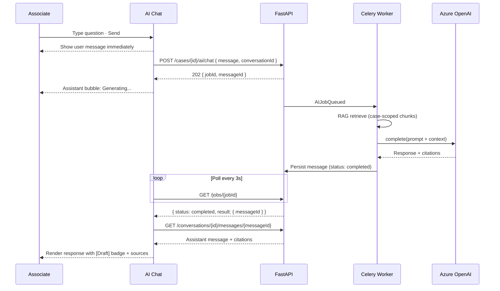
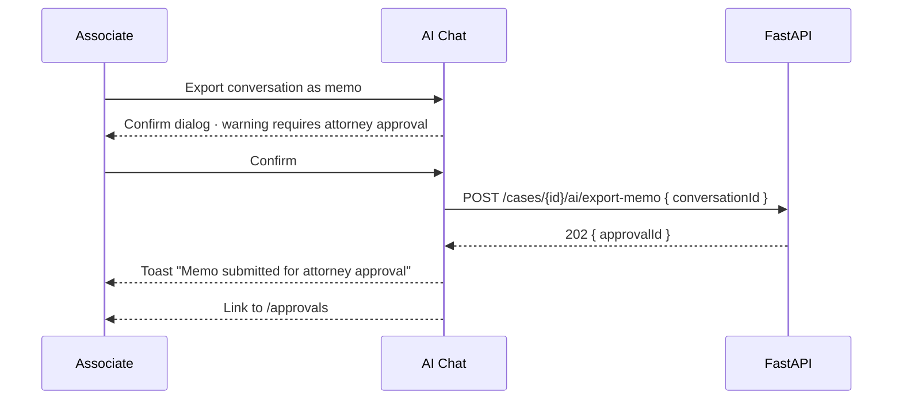

# AI Chat — Case-Scoped Assistant

**LexFlow AI** — Screen Specification  
**Version:** 1.0  
**Status:** Draft — Pre-Implementation  
**Last Updated:** 2026-07-06  
**Route:** `/cases/[caseId]/ai` (chat tab or dedicated chat view)

---

## Purpose

The AI Chat screen provides a **case-scoped conversational assistant** for legal practitioners — answering questions grounded in case documents and notes, supporting research queries, and producing draft content labeled as AI-generated. It follows the async 202 pattern (ADR-004): messages are queued, processed by Celery workers, and results appear when ready — with optional SSE streaming in Phase 2.

Unlike general-purpose chatbots, every conversation is **strictly bounded to the current case** (case-scoped RAG). Responses never cross matter walls. Draft outputs require explicit labeling and optional export-to-approval workflow.

---

## Users / Personas

| Persona | Usage | Permissions |
|---------|-------|-------------|
| **Attorney** (primary) | Case research, document Q&A, draft review | `ai:request:assigned` |
| **Associate Attorney** (primary) | Research assistance, first-pass drafts | `ai:request:assigned`; cannot approve exports |
| **Paralegal** | Document organization questions, discovery prep | `ai:request:assigned` |
| **Operations Team** | Template testing on assigned cases | `ai:request:assigned` |
| **Legal Assistant** | — | No AI by default (firm-configurable) |
| **Client** | — | No access |

---

## Layout Wireframe



---

## Regions / Components

| Region | Component | Description |
|--------|-----------|-------------|
| **Case Context Bar** | `CaseContextBanner` | Reinforces case scope; link back to case dashboard |
| **Conversation Sidebar** | `ConversationList` | Past conversations for this case |
| **New Conversation** | Button | Clears thread; new `conversationId` on first message |
| **Message Thread** | `ChatMessageList` | User and assistant messages; auto-scroll to bottom |
| **User Message** | `UserMessageBubble` | Right-aligned; avatar + timestamp |
| **Assistant Message** | `AssistantMessageBubble` | Left-aligned; draft badge; source citations |
| **Draft Label** | `DraftBadge` | Purple `status-approval` — "AI Draft — Not Legal Advice" |
| **Source Citations** | `CitationChips` | Document title + page; click opens document viewer |
| **Generating State** | `MessageGenerating` | Skeleton bubble + "Generating response..." |
| **Disclaimer** | Footer text | Required on every assistant message |
| **Composer** | `ChatComposer` | Textarea + send; disabled while job running |
| **Context Rail** | `ChatContextPanel` | RAG sources, token count, model info |
| **Export Action** | DropdownMenu | "Export as draft memo" → triggers approval workflow |

### Message States

| State | Visual |
|-------|--------|
| `queued` | User message shown; assistant bubble with queued indicator |
| `running` | Assistant bubble skeleton + progress |
| `completed` | Full response with citations |
| `failed` | Error bubble + retry button |

---

## Data Requirements

| Data | Endpoint | Notes |
|------|----------|-------|
| Send message | `POST /api/v1/cases/{caseId}/ai/chat` | 202 async; returns `jobId`, `conversationId`, `messageId` |
| Poll job | `GET /api/v1/jobs/{jobId}` | Until `completed` or `failed` |
| Conversation list | `GET /api/v1/cases/{caseId}/ai/conversations` | Phase 2 — list past threads |
| Conversation messages | `GET /api/v1/cases/{caseId}/ai/conversations/{conversationId}` | Phase 2 — message history |
| Case context | `GET /api/v1/cases/{caseId}` | Capabilities check |
| Document context | `GET /api/v1/cases/{caseId}/documents` | Optional attach-to-query |

**Cache keys:**
- `['cases', caseId, 'ai', 'conversations']`
- `['cases', caseId, 'ai', 'conversations', conversationId, 'messages']`

**Real-time (Phase 2):**
- SSE token streaming on `/api/v1/events/stream` for incremental response rendering
- Event type: `ai.chat.token` (stream) → `ai.chat.completed` (final)

### Request / Response

```json
// POST /cases/{caseId}/ai/chat
{
  "message": "What is the effective date of the MSA?",
  "conversationId": "conv1a2b3c4-d5e6-7890-abcd-ef1234567890"
}

// 202 Response
{
  "data": {
    "jobId": "j3c4d5e6-f7a8-9012-cdef-123456789012",
    "conversationId": "conv1a2b3c4-d5e6-7890-abcd-ef1234567890",
    "messageId": "msg1a2b3c4-d5e6-7890-abcd-ef1234567890",
    "status": "queued",
    "statusUrl": "/api/v1/jobs/j3c4d5e6-f7a8-9012-cdef-123456789012"
  }
}
```

### API References

- [POST /cases/{id}/ai/chat](../../04-api/endpoints-ai.md)
- [GET /jobs/{id}](../../04-api/endpoints-ai.md)
- [POST /cases/{id}/ai/research](../../04-api/endpoints-ai.md) — Research mode variant
- [RAG architecture](../../07-ai/rag-architecture.md) — Case-scoped retrieval
- [Human-in-the-loop](../../07-ai/human-in-the-loop.md) — Export approval

---

## States

### Loading

- Initial: Conversation list skeleton (5 items)
- Message history load: 3 assistant + 3 user message skeletons
- Send message: User bubble immediate; assistant skeleton below

### Empty — New Conversation

- Message area: Welcome panel explaining case scope
- Suggested prompts: "Summarize key parties", "What deadlines are upcoming?", "Find indemnification clauses"
- Composer focused and ready

### Error

| Error | UX |
|-------|-----|
| 404 case | Matter wall not-found |
| Job failed (rate limit) | Assistant bubble: error + "Retry" (if `retryable: true`) |
| Job failed (validation) | Error message with guidance |
| Message too long | Inline validation before send (>4000 chars) |
| No processed documents | Banner: "Upload and process documents to enable AI chat" |

---

## Interactions

### Primary Flow — Ask Question and Receive Answer



### Export as Draft Memo



### Keyboard Shortcuts

| Shortcut | Action |
|----------|--------|
| `⌘Enter` / `Ctrl+Enter` | Send message |
| `⌘N` | New conversation (when chat focused) |
| `↑` in empty composer | Edit last user message (Phase 2) |
| `Escape` | Blur composer |

---

## Responsive Behavior

| Breakpoint | Layout |
|------------|--------|
| **Desktop ≥1280px** | 3-pane: conversation list + chat + context rail |
| **Tablet 768–1279px** | Conversation list collapses to hamburger; context rail in sheet |
| **Mobile <768px** | Single chat pane; conversation list via top dropdown; no context rail |

Composer remains sticky bottom on all breakpoints. Message bubbles max-width 80% on mobile.

---

## Accessibility

| Requirement | Implementation |
|-------------|----------------|
| **Chat log** | `role="log" aria-live="polite" aria-relevant="additions"` |
| **Draft labeling** | Visible text badge — not icon-only; announced by screen reader |
| **Citations** | Each citation is a link with descriptive text: "Source: MSA.pdf, page 12" |
| **Disclaimer** | Present in DOM on every assistant message; not collapsed |
| **Generating state** | `aria-busy="true"` on assistant bubble; announce "Generating response" |
| **Composer** | `aria-label="Message input"`; character count announced at 3800+ chars |
| **Keyboard** | Tab order: conversation list → messages → composer; no keyboard traps |

---

## References

| Document | Path |
|----------|------|
| AI endpoints | [../../04-api/endpoints-ai.md](../../04-api/endpoints-ai.md) |
| ADR-004 async AI | [../../13-decisions/004-async-ai-processing.md](../../13-decisions/004-async-ai-processing.md) |
| RAG architecture | [../../07-ai/rag-architecture.md](../../07-ai/rag-architecture.md) |
| Safety guardrails | [../../07-ai/safety-guardrails.md](../../07-ai/safety-guardrails.md) |
| Approval center | [approval-center.md](./approval-center.md) |
| Document viewer | [document-viewer.md](./document-viewer.md) |
