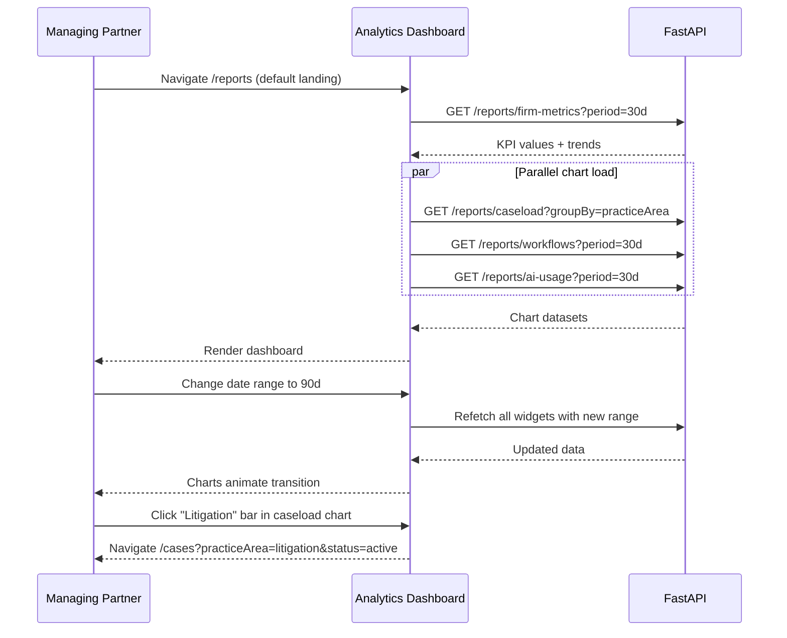

# Analytics Dashboard — Firm Metrics for Leadership

**LexFlow AI** — Screen Specification  
**Version:** 1.0  
**Status:** Draft — Pre-Implementation  
**Last Updated:** 2026-07-06  
**Route:** `/reports`  
**Phase:** 3 (per [roadmap](../../01-product/roadmap.md))

---

## Purpose

The Analytics Dashboard provides **Managing Partners and Operations leaders** with firm-wide visibility into caseload health, workflow throughput, AI adoption, document processing metrics, and compliance indicators. It mirrors the executive reporting surface of Azure Portal dashboards and Microsoft 365 usage analytics — dense, chart-driven, and designed for weekly review sessions under 30 minutes.

This screen aggregates read-only metrics across all accessible cases (respecting matter walls for non-leadership roles). It does **not** expose individual attorney performance rankings in Phase 3 (deferred to Phase 4 with HR policy review).

---

## Users / Personas

| Persona | Usage | Permissions |
|---------|-------|-------------|
| **Managing Partner** (primary) | Weekly executive review, board reporting | Firm-wide read; default landing route |
| **Operations Team** | Workflow adoption, automation ROI | Firm-wide read + workflow metrics |
| **Compliance Officer** | AI usage oversight, audit completeness indicators | Firm-wide read (subset of widgets) |
| **System Administrator** | Platform health indicators | Admin metrics panel |
| **Attorney** | — | No access in Phase 3 (redirect to `/cases`) |

---

## Layout Wireframe

```mermaid
flowchart TB
    subgraph AnalyticsPage["Analytics Dashboard — /reports"]
        direction TB
        subgraph PageHeader["Page Header"]
            PH["Firm Analytics · Last 30 days"]
            DR["Date Range Selector · Practice Area Filter · Export PDF"]
        end
        subgraph KPISection["KPI Row — 6 cards"]
            direction LR
            K1["Active Cases<br/>count + trend ▲3%"]
            K2["Cases Opened<br/>this period"]
            K3["Workflow Completion Rate<br/>% + avg duration"]
            K4["AI Requests<br/>count + approval rate"]
            K5["Documents Processed<br/>count + avg OCR time"]
            K6["Pending Approvals<br/>firm-wide count"]
        end
        subgraph ChartRow1["Chart Row 1 — 2 columns"]
            direction LR
            C1["Caseload by Practice Area<br/>horizontal bar chart"]
            C2["Case Status Distribution<br/>donut chart"]
        end
        subgraph ChartRow2["Chart Row 2 — 2 columns"]
            direction LR
            C3["Workflow Executions Over Time<br/>line chart · success vs failed"]
            C4["AI Usage by Type<br/>stacked bar · summarize · research · chat"]
        end
        subgraph ChartRow3["Chart Row 3 — full width"]
            C5["Top Workflow Templates by Volume<br/>data table with sparklines"]
        end
        subgraph ComplianceRow["Compliance Strip — Compliance Officer visible"]
            direction LR
            CP1["Audit Log Completeness · 100%"]
            CP2["Failed Access Attempts · 12"]
            CP3["AI Drafts Pending Approval · 8"]
        end
    end

    PageHeader --> KPISection --> ChartRow1 --> ChartRow2 --> ChartRow3 --> ComplianceRow
```

---

## Regions / Components

| Region | Component | Chart Library | Description |
|--------|-----------|---------------|-------------|
| **Date Range Selector** | `DateRangePicker` | — | Presets: 7d, 30d, 90d, YTD, Custom |
| **Practice Area Filter** | `MultiSelect` | — | Filter all widgets simultaneously |
| **KPI Cards** | `MetricCard` × 6 | — | Value + period comparison + trend arrow |
| **Caseload Chart** | `PracticeAreaBarChart` | Recharts | Horizontal bars by practice area |
| **Status Donut** | `CaseStatusDonut` | Recharts | intake · active · on_hold · closed |
| **Workflow Trend** | `WorkflowLineChart` | Recharts | Daily execution count; success/fail series |
| **AI Usage Chart** | `AIUsageStackedBar` | Recharts | By request type per week |
| **Template Table** | `WorkflowTemplateTable` | DataTable | Name, executions, success rate, avg duration |
| **Compliance Strip** | `ComplianceIndicators` | — | Read-only badges for governance metrics |
| **Export PDF** | Button | — | Phase 3 — snapshot current dashboard view |

### Widget Refresh Strategy

| Widget | Stale Time | Real-Time |
|--------|------------|-------------|
| KPI cards | 5 min | No |
| Charts | 15 min | No |
| Compliance strip | 1 min | Optional SSE for approval count |
| Export | On demand | — |

Dashboard data is **aggregated server-side** — the frontend never computes firm metrics from raw case lists.

---

## Data Requirements

### Primary Endpoints (Phase 3)

| Data | Endpoint | Notes |
|------|----------|-------|
| Firm metrics summary | `GET /api/v1/reports/firm-metrics` | KPI card values + trends |
| Caseload breakdown | `GET /api/v1/reports/caseload?groupBy=practiceArea` | Bar chart data |
| Case status counts | `GET /api/v1/reports/cases/status-summary` | Donut chart |
| Workflow analytics | `GET /api/v1/reports/workflows?occurredAfter=&occurredBefore=` | Line chart + template table |
| AI usage analytics | `GET /api/v1/reports/ai-usage?occurredAfter=&occurredBefore=` | Stacked bar |
| Compliance indicators | `GET /api/v1/reports/compliance-summary` | Compliance strip |

> **Note:** Report aggregation endpoints are planned for Phase 3 (roadmap M3.6). Until implemented, widgets may compose from existing list endpoints with server-side BFF aggregation — not client-side rollups.

### Interim Data Sources (Phase 1–2 fallback)

| Widget | Fallback Endpoint |
|--------|-------------------|
| Active cases | `GET /api/v1/cases?status=active` (count only — Managing Partner) |
| Workflow metrics | `GET /api/v1/workflows/executions?createdAfter=` |
| Pending approvals | `GET /api/v1/approvals?status=pending` |
| AI summaries | Firm-wide AI dashboard at `/ai` (Managing Partner, Compliance) |

**Cache keys:** `['reports', 'firm-metrics', dateRange, filters]` — 5 min stale time

### API References

- [GET /reports/firm-metrics](../../api-architecture.md) — Planned Phase 3
- [GET /cases](../../04-api/endpoints-cases.md) — Case counts
- [GET /workflows/executions](../../04-api/endpoints-workflows.md) — Execution history
- [GET /approvals](../../api-architecture.md#109-approvals) — Pending approval count
- [Success metrics KPIs](../../01-product/success-metrics.md) — Target values

---

## States

### Loading

- KPI row: 6 card skeletons with shimmer
- Charts: Chart-area skeleton matching aspect ratio (16:9)
- Table: 5-row skeleton
- Global: No full-page spinner — progressive widget load acceptable

### Empty

| Widget | Empty State |
|--------|-------------|
| Caseload chart | "No active cases in selected period" |
| Workflow trend | "No workflow executions yet — deploy templates to get started" |
| AI usage | "No AI requests in selected period" |
| Template table | "No workflow templates configured" + link to `/workflows/templates` |

### Error

| Error | UX |
|-------|-----|
| 403 | Redirect to `/cases` with toast |
| Partial widget failure | Failed widget shows inline retry; others render |
| 500 global | Error boundary with "Unable to load analytics" + retry |
| Stale data | Subtle "Data as of {timestamp}" on each widget |

---

## Interactions

### Primary Flow — Weekly Executive Review

### Drill-Down Navigation

| Widget Click | Destination |
|--------------|-------------|
| Active Cases KPI | `/cases?status=active` |
| Pending Approvals KPI | `/approvals` |
| Workflow template row | `/workflows/executions?workflowSlug={slug}` |
| AI Requests KPI | `/ai` (firm AI dashboard) |
| Failed access attempts | `/audit?outcome=denied_*` |
| Practice area bar | `/cases?practiceArea={area}` |

### Export PDF (Phase 3)

- Captures current filter state + visible widgets
- Async job → download link
- Watermark: "Confidential — {firmName} — Generated {date}"

---

## Responsive Behavior

| Breakpoint | Layout |
|------------|--------|
| **Desktop ≥1280px** | Full grid: KPI 6-across, charts 2-column, table full-width |
| **Tablet 768–1279px** | KPI 3×2; charts single column stacked |
| **Mobile <768px** | KPI 2×3; charts simplified (table view instead of chart where needed) |

Analytics is **desktop-first**. Mobile shows KPI cards only; charts hidden behind "View charts" expander.

---

## Accessibility

| Requirement | Implementation |
|-------------|----------------|
| **Charts** | Each chart has text alternative summary (`aria-describedby`); data table toggle for all charts |
| **Trend indicators** | "Increased 3%" not just green arrow — text + icon |
| **Color palette** | Chart colors meet 3:1 contrast; patterns supplement color series |
| **KPI cards** | `aria-label="Active cases: 142, up 3 percent from prior period"` |
| **Date range** | Calendar picker fully keyboard accessible |
| **Motion** | Chart animations respect `prefers-reduced-motion` — instant render |
| **Data tables** | Chart data always available as accessible table (toggle or parallel) |

---

## References

| Document | Path |
|----------|------|
| Success metrics & KPIs | [../../01-product/success-metrics.md](../../01-product/success-metrics.md) |
| Roadmap — Analytics M3.6 | [../../01-product/roadmap.md](../../01-product/roadmap.md) |
| Workflow executions API | [../../04-api/endpoints-workflows.md](../../04-api/endpoints-workflows.md) |
| AI usage metering | [../../07-ai/usage-metering.md](../../07-ai/usage-metering.md) |
| Managing Partner persona | [../../01-product/user-personas.md](../../01-product/user-personas.md) |
| Workflow dashboard | [workflow-dashboard.md](./workflow-dashboard.md) |
