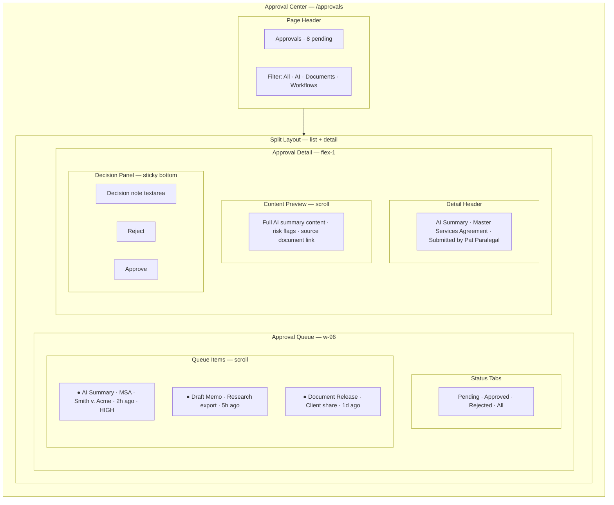
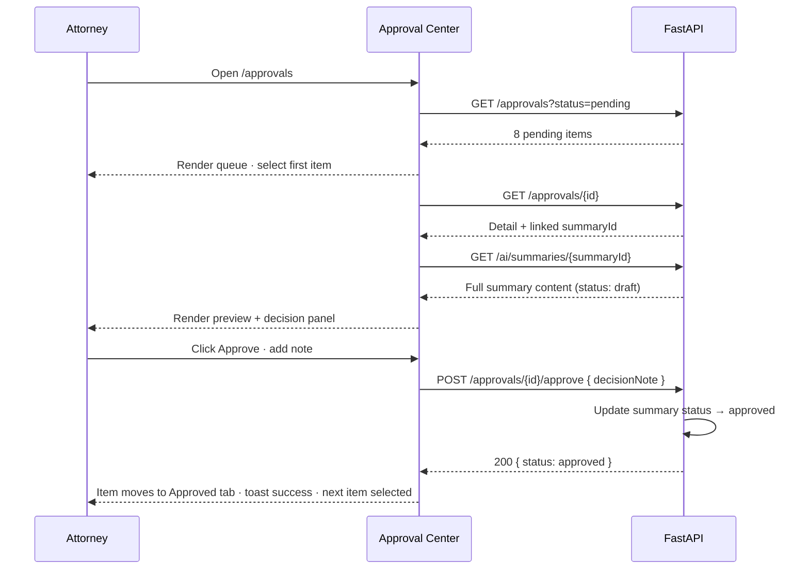
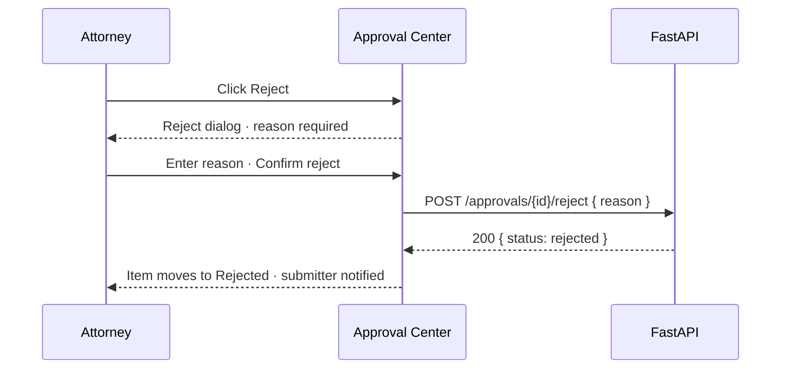

# Approval Center — Pending Approvals Queue

**LexFlow AI** — Screen Specification  
**Version:** 1.0  
**Status:** Draft — Pre-Implementation  
**Last Updated:** 2026-07-06  
**Route:** `/approvals`

---

## Purpose

The Approval Center is the **human-in-the-loop decision inbox** for attorneys and managing partners. It aggregates all pending approval requests — AI summaries, AI-generated memos, document releases, and workflow gates — into a prioritized queue with approve/reject flows, decision notes, and audit trail linkage.

Associates and paralegals **submit** items for approval but cannot decide. Attorneys **approve or reject** with mandatory rationale on rejection. This screen is critical for legal compliance: no AI output reaches team visibility without attorney approval.

---

## Users / Personas

| Persona | Usage | Permissions |
|---------|-------|-------------|
| **Attorney** (primary) | Review and decide on pending items daily | `approval:decide:assigned` |
| **Managing Partner** | Firm-wide approval oversight | `approval:decide:assigned` + firm-wide read |
| **Associate Attorney** | Submit items; view own submission status | Submit only; read own pending |
| **Paralegal** | Submit AI summaries and workflow items | Submit only |
| **Compliance Officer** | Read-only audit view of approval history | No decide permission |

---

## Layout Wireframe

---

## Regions / Components

| Region | Component | Description |
|--------|-----------|-------------|
| **Page Header** | `ApprovalPageHeader` | Pending count badge; sync with notification bell |
| **Type Filter** | `ToggleGroup` | All · AI Summary · Document · Workflow · Memo |
| **Status Tabs** | Tabs | Pending (default) · Approved · Rejected · All |
| **Queue Item** | `ApprovalQueueItem` | Type icon, title, case, submitter, age, priority |
| **Priority Indicator** | Badge | `urgent` cases highlighted; overdue submissions |
| **Detail Header** | `ApprovalDetailHeader` | Type, resource link, submitter, submitted at |
| **Content Preview** | Type-specific preview | AI summary renderer, document metadata, workflow output |
| **Source Links** | Inline links | Navigate to document viewer, case dashboard, AI chat |
| **Decision Panel** | `ApprovalDecisionPanel` | Note field + reject + approve buttons |
| **Reject Dialog** | Dialog | Mandatory rejection reason (min 10 chars) |
| **Approve Confirm** | Dialog | Optional decision note; confirm button |
| **History Tab** | Timeline | Past decisions with actor and timestamp |

### Approval Types

| Type | `approvalType` | Preview Component |
|------|----------------|-------------------|
| AI Summary | `ai.summary` | Structured summary with risk flags |
| AI Memo Export | `ai.memo_export` | Chat conversation export |
| Document Release | `document.client_share` | Document metadata + visibility change |
| Workflow Gate | `workflow.manual_gate` | Workflow step output requiring sign-off |

---

## Data Requirements

| Data | Endpoint | Notes |
|------|----------|-------|
| Pending queue | `GET /api/v1/approvals?status=pending` | Default view; filter by type |
| All approvals | `GET /api/v1/approvals` | Query: `status`, `approvalType`, `caseId`, `submittedBy` |
| Approval detail | `GET /api/v1/approvals/{id}` | Full content for preview |
| Approve | `POST /api/v1/approvals/{id}/approve` | Body: `{ decisionNote }` optional |
| Reject | `POST /api/v1/approvals/{id}/reject` | Body: `{ reason }` required |
| AI summary (linked) | `GET /api/v1/ai/summaries/{summaryId}` | When type is `ai.summary` |
| Alt: direct AI approve | `POST /api/v1/ai/summaries/{id}/approve` | Also creates approval record |

**Cache keys:**
- `['approvals', 'pending']`
- `['approvals', approvalId]`

**Real-time:**
- SSE `approval.requested` — prepend to queue; increment header badge
- SSE `approval.decided` — remove from pending list

### API References

- [GET /approvals](../../api-architecture.md#109-approvals)
- [POST /approvals/{id}/approve](../../api-architecture.md#109-approvals)
- [POST /approvals/{id}/reject](../../api-architecture.md#109-approvals)
- [POST /ai/summaries/{id}/approve](../../04-api/endpoints-ai.md)
- [POST /ai/summaries/{id}/reject](../../04-api/endpoints-ai.md)
- [Human-in-the-loop](../../07-ai/human-in-the-loop.md)
- [Audit schema — approvals table](../../05-database/audit-schema.md)

---

## States

### Loading

- Queue list: 6 item skeletons
- Detail pane: content skeleton (title + 8 lines)
- Empty detail (no selection): "Select an item to review"

### Empty

| Tab | Message |
|-----|---------|
| Pending | "No pending approvals — you're all caught up" ✓ illustration |
| Approved | "No approved items in selected period" |
| Rejected | "No rejected items" |
| Submitter (Associate) | "No items awaiting decision" + list of own submissions |

### Error

| Error | UX |
|-------|-----|
| 403 on decide | Hide approve/reject; show "Awaiting attorney review" |
| 409 already decided | Refresh item; toast "This item was already decided" |
| 404 | Remove from list; toast "Item no longer available" |
| Approve network failure | Retain form state; retry button |

---

## Interactions

### Primary Flow — Approve AI Summary

### Reject Flow

### Queue Item Selection

| Action | Behavior |
|--------|----------|
| Click queue item | Load detail in right pane; highlight selected |
| `↑/↓` keyboard | Navigate queue items |
| Enter | Open selected item detail |
| Approve/Reject | Auto-advance to next pending item |
| Click case link | Navigate case dashboard (new tab) |
| Click document link | Navigate document viewer (new tab) |

### Notification Integration

- Notification bell badge count = pending approval count
- Click notification → deep link to `/approvals/{id}`
- Real-time: new approval prepends queue with subtle highlight

---

## Responsive Behavior

| Breakpoint | Layout |
|------------|--------|
| **Desktop ≥1280px** | Split pane: queue 384px + detail flex-1 |
| **Tablet 768–1279px** | Queue full-width list; tap item opens detail sheet |
| **Mobile <768px** | Single-pane queue; detail full-screen overlay with back button |

Decision panel sticky bottom on all breakpoints. Approve/Reject buttons full-width on mobile.

---

## Accessibility

| Requirement | Implementation |
|-------------|----------------|
| **Queue list** | `role="listbox"`; selected item `aria-selected="true"` |
| **Approve/Reject** | Distinct labels; reject uses destructive styling + confirmation |
| **Preview content** | AI disclaimer always visible; heading hierarchy in summary |
| **Keyboard** | `↑/↓` navigate queue; `A` approve (with confirm); `R` reject (opens dialog) |
| **Focus management** | After decide: focus moves to next queue item |
| **Live updates** | `aria-live="polite"` announces "New approval request: {title}" |
| **Reject reason** | Required field with `aria-required="true"`; error on empty submit |

---

## References

| Document | Path |
|----------|------|
| Approvals API | [../../api-architecture.md](../../api-architecture.md) |
| AI approve/reject | [../../04-api/endpoints-ai.md](../../04-api/endpoints-ai.md) |
| Human-in-the-loop | [../../07-ai/human-in-the-loop.md](../../07-ai/human-in-the-loop.md) |
| Audit schema | [../../05-database/audit-schema.md](../../05-database/audit-schema.md) |
| Document viewer — AI sidebar | [document-viewer.md](./document-viewer.md) |
| User personas — approval chain | [../../01-product/user-personas.md](../../01-product/user-personas.md) |
