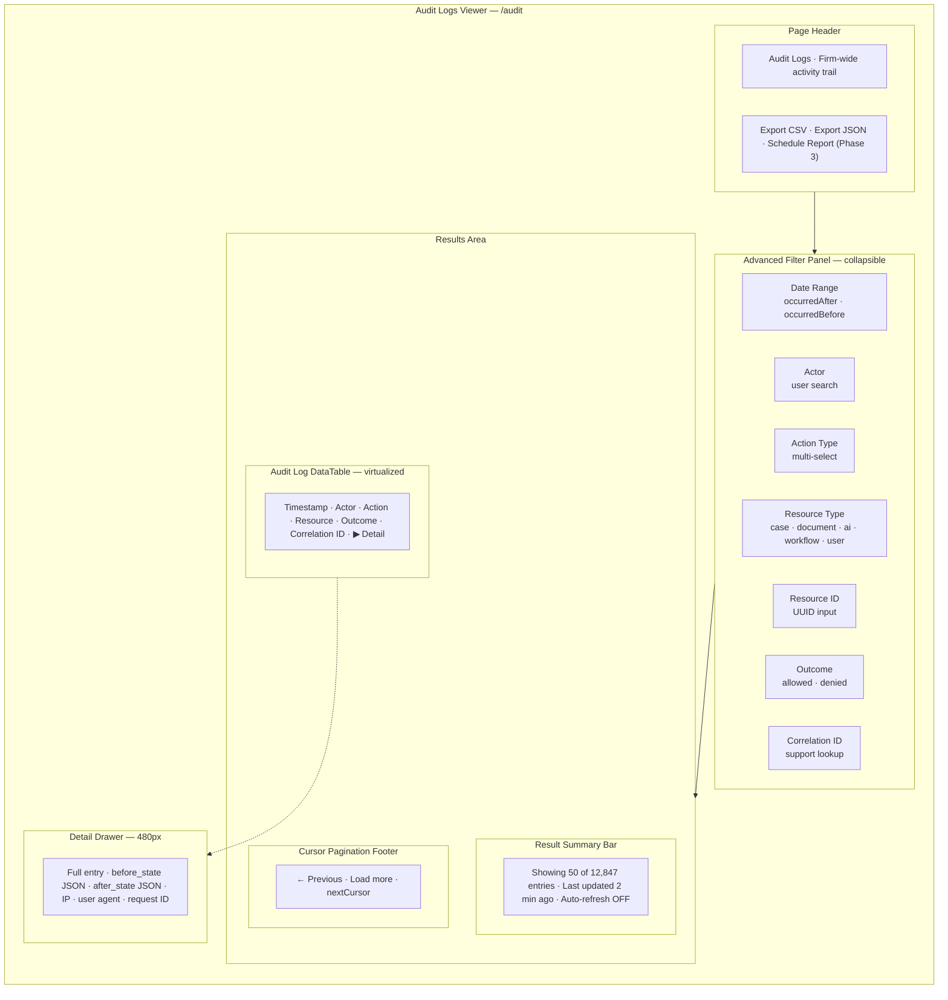
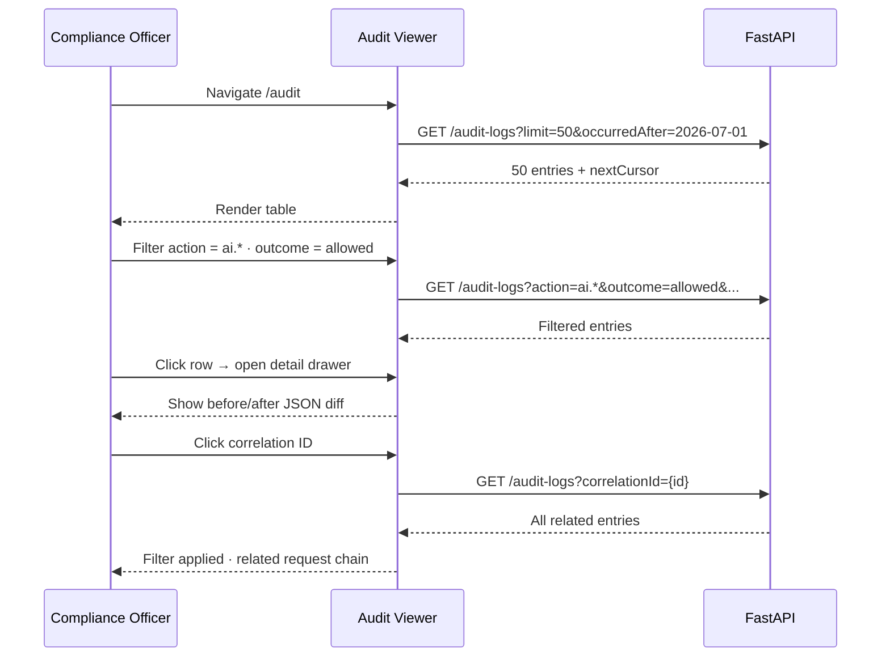
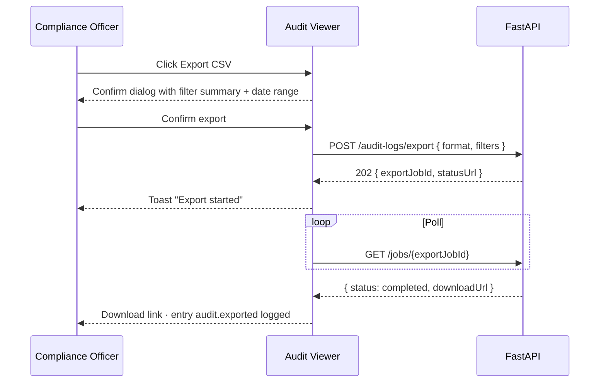

# Audit Logs Viewer — Compliance Officer Surface

**LexFlow AI** — Screen Specification  
**Version:** 1.0  
**Status:** Draft — Pre-Implementation  
**Last Updated:** 2026-07-06  
**Route:** `/audit`

---

## Purpose

The Audit Logs Viewer is the **firm-wide compliance and governance surface** for immutable activity records. Compliance Officers, System Administrators, and Managing Partners use it to investigate access patterns, verify AI usage, demonstrate regulatory readiness, and export audit trails for external review.

Unlike the case Timeline (practitioner-oriented activity feed), this viewer exposes **raw audit log entries** with before/after state diffs, actor attribution, correlation IDs, and export capabilities — modeled after Azure Monitor activity logs and enterprise SIEM query interfaces.

---

## Users / Personas

| Persona | Usage | Permissions |
|---------|-------|-------------|
| **Compliance Officer** (primary) | Daily audit review, export for regulators, AI usage reports | `audit:read:firm` — read-only |
| **System Administrator** | Troubleshoot access issues, verify audit completeness | `audit:read:firm` |
| **Managing Partner** | Periodic compliance posture review | `audit:read:firm` |
| **Attorney (lead)** | Case-scoped audit via case route | `GET /cases/{id}/audit-logs` only |

**Invariant:** Compliance Officer has **read-only** access — no mutations from this screen. All exports are audit-logged themselves.

---

## Layout Wireframe



---

## Regions / Components

| Region | Component | Description |
|--------|-----------|-------------|
| **Page Header** | `AuditPageHeader` | Title, export actions, last refresh timestamp |
| **Filter Panel** | `AuditFilterPanel` | Advanced multi-criteria filters; saved filter presets (Phase 2) |
| **Summary Bar** | `AuditResultSummary` | Result count, filter summary chips, clear all |
| **Audit Table** | `AuditLogDataTable` | Virtualized rows; sort by `occurredAt` desc only |
| **Outcome Badge** | `OutcomeBadge` | `allowed` (green), `denied_rbac` (amber), `denied_matter_wall` (red) |
| **Detail Drawer** | `AuditEntryDetail` | Expandable JSON diff viewer; copy correlation ID |
| **Export Dialog** | `AuditExportDialog` | Format selection, date range confirmation, async export job |
| **Saved Filters** | `SavedFilterDropdown` | Phase 2 — "AI usage last 30 days", "Failed access attempts" |

### Action Type Categories

| Category | Example Actions |
|----------|-----------------|
| **Authentication** | `auth.login`, `auth.logout`, `auth.token_refresh`, `auth.login_failed` |
| **Case** | `case.created`, `case.updated`, `case.participant_added` |
| **Document** | `document.uploaded`, `document.downloaded`, `document.deleted` |
| **AI** | `ai.summary_requested`, `ai.summary_approved`, `ai.chat_message` |
| **Workflow** | `workflow.triggered`, `workflow.completed`, `workflow.cancelled` |
| **Authorization** | `authz.denied`, `authz.matter_wall_denied` |
| **Admin** | `admin.user_created`, `admin.role_assigned`, `admin.config_changed` |
| **Export** | `audit.exported` | Self-referential — exports log themselves |

---

## Data Requirements

| Data | Endpoint | Parameters |
|------|----------|------------|
| Firm audit logs | `GET /api/v1/audit-logs` | Cursor pagination — see below |
| Case-scoped (alt route) | `GET /api/v1/cases/{caseId}/audit-logs` | Lead attorney or `audit:read:firm` |
| Export job | `POST /api/v1/audit-logs/export` | Phase 2 — async CSV/JSON generation |
| User lookup (actor filter) | `GET /api/v1/admin/users?search=` | System Admin / Compliance |

### Query Parameters — Firm-Wide Audit

| Parameter | Type | Description |
|-----------|------|-------------|
| `cursor` | string | Cursor token for pagination |
| `limit` | int | Default 50, max 100 |
| `occurredAfter` | ISO 8601 | Start of date range |
| `occurredBefore` | ISO 8601 | End of date range |
| `actorId` | uuid | Filter by user |
| `action` | string | Exact or prefix match (`ai.*`) |
| `resourceType` | string | `case`, `document`, `ai`, `workflow`, `user` |
| `resourceId` | uuid | Specific resource |
| `outcome` | string | `allowed`, `denied_rbac`, `denied_matter_wall` |
| `correlationId` | uuid | Support ticket lookup |

**Cache key:** `['audit-logs', filters]` — **no cache** beyond in-memory session; always fetch fresh for compliance.

### Response Shape

```json
{
  "data": [
    {
      "id": "a1b2c3d4-e5f6-7890-abcd-ef1234567890",
      "occurredAt": "2026-07-06T08:00:00Z",
      "actorId": "b2c3d4e5-f6a7-8901-bcde-f12345678901",
      "actorName": "Jane Attorney",
      "actorEmail": "jane@firm.com",
      "action": "document.downloaded",
      "resourceType": "document",
      "resourceId": "d1e2f3a4-b5c6-7890-def1-234567890abc",
      "resourceLabel": "Master Services Agreement",
      "outcome": "allowed",
      "correlationId": "550e8400-e29b-41d4-a716-446655440000",
      "ipAddress": "203.0.113.42",
      "userAgent": "Mozilla/5.0...",
      "beforeState": null,
      "afterState": { "downloadUrlIssued": true }
    }
  ],
  "meta": {
    "pagination": {
      "limit": 50,
      "nextCursor": "eyJpZCI6ImEyYjNjNGQ1...",
      "hasMore": true
    }
  }
}
```

### API References

- [GET /audit-logs](../../04-api/rest-standards.md) — Cursor pagination pattern
- [GET /cases/{id}/audit-logs](../../04-api/endpoints-cases.md) — Case-scoped trail
- [Authorization — audit:read:firm](../../04-api/authorization-rbac.md)
- [Audit schema](../../05-database/audit-schema.md) — Data model

---

## States

### Loading

- Initial: Filter panel visible (empty defaults); table shows 10-row skeleton
- Filter apply: Table overlay shimmer; preserve scroll position on refine
- Load more: Bottom spinner; disable pagination buttons during fetch

### Empty

| Condition | Message |
|-----------|---------|
| No logs in date range | "No audit entries found for the selected period" |
| Filters too restrictive | "No entries match your filters" + "Clear filters" |
| New firm / pre-go-live | "Audit logging begins when the platform goes live" |

### Error

| Error | UX |
|-------|-----|
| 403 | Redirect to role-appropriate home; toast "Audit access required" |
| 500 | Full-page error with correlation ID for support |
| Export failure | Toast with job ID; link to retry |
| Invalid cursor | Reset to first page; toast "Results refreshed" |

---

## Interactions

### Primary Flow — Compliance Investigation



### Export Flow (Phase 2)



### Filter Presets (Phase 2)

| Preset | Filters Applied |
|--------|-----------------|
| Failed access attempts | `outcome=denied_*` · last 7 days |
| AI activity | `action=ai.*` · last 30 days |
| Document downloads | `action=document.downloaded` · custom range |
| Admin changes | `action=admin.*` · last 90 days |

---

## Responsive Behavior

| Breakpoint | Changes |
|------------|---------|
| **Desktop ≥1280px** | Filter panel expanded by default; table all columns; detail drawer right |
| **Tablet 768–1279px** | Filter panel collapsed — "Filters" button opens sheet; hide IP/User Agent columns |
| **Mobile <768px** | Not primary target for compliance work; card list replaces table; export via email link |

Compliance workflows assume desktop. Mobile view is read-only fallback.

---

## Accessibility

| Requirement | Implementation |
|-------------|----------------|
| **Table** | Proper `<table>` with `<th scope="col">`; sortable column announced |
| **JSON diff** | Syntax-highlighted code block with horizontal scroll; `aria-label="State diff"` |
| **Filters** | Fieldset/legend grouping; apply button announces result count |
| **Outcome badges** | Text label always visible — not color-only |
| **Keyboard** | `↑/↓` row navigation; Enter opens drawer; `Escape` closes |
| **Export dialog** | Focus trap; confirm button describes export scope |
| **High contrast** | JSON diff readable in Windows High Contrast Mode |

---

## References

| Document | Path |
|----------|------|
| Audit schema | [../../05-database/audit-schema.md](../../05-database/audit-schema.md) |
| REST pagination (cursor) | [../../04-api/rest-standards.md](../../04-api/rest-standards.md) |
| Authorization RBAC | [../../04-api/authorization-rbac.md](../../04-api/authorization-rbac.md) |
| Compliance mapping | [../../08-security/compliance-mapping.md](../../08-security/compliance-mapping.md) |
| Timeline (practitioner view) | [timeline-activity-feed.md](./timeline-activity-feed.md) |
