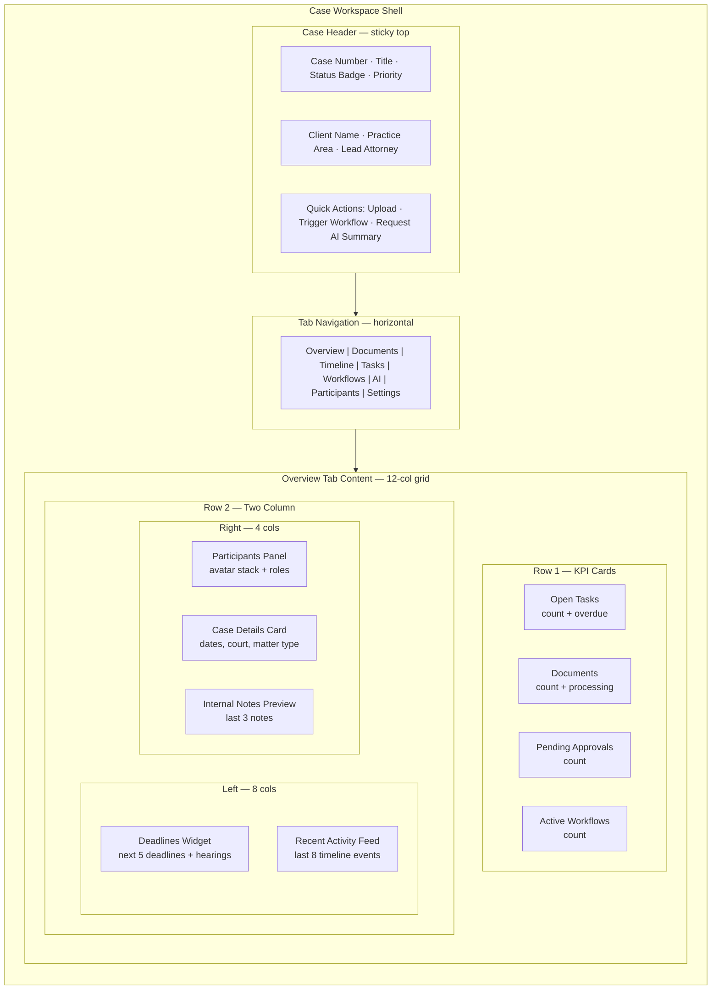
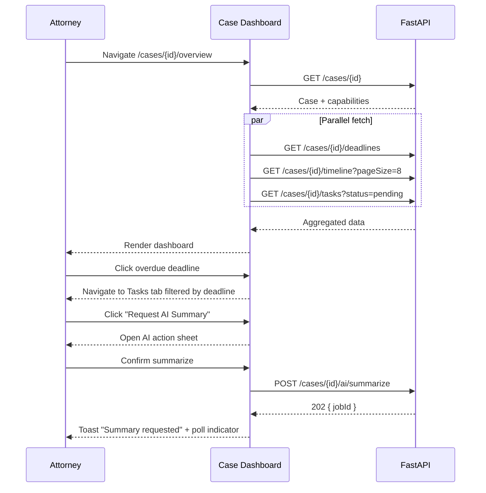

# Case Dashboard — Central Case Hub

**LexFlow AI** — Screen Specification  
**Version:** 1.0  
**Status:** Draft — Pre-Implementation  
**Last Updated:** 2026-07-06  
**Route:** `/cases/[caseId]/overview` (default tab in case workspace)

---

## Purpose

The Case Dashboard is the **central hub for a single legal matter**. It aggregates case metadata, key metrics, upcoming deadlines, recent activity, participant roster, and quick actions into one at-a-glance surface — similar to an Azure Portal resource overview blade or a Microsoft 365 team site home page.

Attorneys and paralegals land here after selecting a case from the case list. The dashboard answers: *What is the status of this matter? What needs attention today? Who is on the team?*

---

## Users / Personas

| Persona | Usage | Permissions |
|---------|-------|-------------|
| **Attorney** (primary) | Daily case review, approve items, trigger workflows | Full read/write on assigned matters |
| **Paralegal** (primary) | Task coordination, deadline tracking, document uploads | Read/write; cannot approve AI |
| **Associate Attorney** | Work execution, AI requests, task completion | Read/write; submit approvals only |
| **Legal Assistant** | Intake support, document handling, scheduling | Read/write; limited workflow templates |
| **Managing Partner** | Firm-wide caseload oversight | Read firm-wide; write on assigned only |
| **Compliance Officer** | Audit context review | Read-only firm-wide |

**Access gate:** User must be a case participant or hold firm-wide read permission. Unauthorized access returns 404 per matter wall policy.

---

## Layout Wireframe

---

## Regions / Components

| Region | Component | ShadCN / Domain | Notes |
|--------|-----------|-----------------|-------|
| **Case Header** | `CaseHeader` | Badge, Button, DropdownMenu | Sticky below top bar; shows `status-*` pill |
| **Tab Navigation** | `CaseTabNav` | Tabs | Tabs filtered by API capabilities from case detail |
| **KPI Cards** | `CaseMetricCard` × 4 | Card, Skeleton | Click navigates to relevant tab |
| **Deadlines Widget** | `DeadlinesWidget` | Card, DataTable compact | Color-coded by urgency (`upcoming`, `due_soon`, `overdue`) |
| **Recent Activity** | `ActivityFeedCompact` | ScrollArea, TimelineItem | Subset of full timeline; "View all" link |
| **Participants Panel** | `ParticipantsPanel` | Avatar, Badge | Lead attorney highlighted; "+ Add" for lead role |
| **Case Details** | `CaseDetailsCard` | Card, DescriptionList | Opened/closed dates, court, docket number |
| **Notes Preview** | `NotesPreview` | Card, truncated text | Internal-only; never shown to Client portal |
| **Quick Actions** | `CaseQuickActions` | Button group, DropdownMenu | Role-gated action buttons |

### Tab Visibility (API-Driven)

Capabilities returned by `GET /api/v1/cases/{caseId}` determine visible tabs — not computed from role alone:

| Tab | Capability Flag |
|-----|-----------------|
| Overview | Always (if case accessible) |
| Documents | `canReadDocuments` |
| Timeline | `canReadTimeline` |
| Tasks | `canReadTasks` |
| Workflows | `canTriggerWorkflow` or `canViewExecutions` |
| AI | `canRequestAI` or `canApproveAI` |
| Participants | `canReadParticipants` |
| Settings | `canManageCase` (lead only) |

---

## Data Requirements

| Data | Source | Cache Key | Refresh |
|------|--------|-----------|---------|
| Case detail + capabilities | `GET /api/v1/cases/{caseId}` | `['cases', caseId]` | On mount; SSE `case.updated` |
| Task counts | `GET /api/v1/cases/{caseId}/tasks?status=pending` | `['cases', caseId, 'tasks']` | 30s stale |
| Document counts | `GET /api/v1/cases/{caseId}/documents` | `['cases', caseId, 'documents']` | 60s stale |
| Deadlines | `GET /api/v1/cases/{caseId}/deadlines` | `['cases', caseId, 'deadlines']` | 60s stale |
| Hearings | `GET /api/v1/cases/{caseId}/hearings` | `['cases', caseId, 'hearings']` | 60s stale |
| Timeline (recent) | `GET /api/v1/cases/{caseId}/timeline?pageSize=8` | `['cases', caseId, 'timeline']` | SSE `case.updated` |
| Participants | `GET /api/v1/cases/{caseId}/participants` | `['cases', caseId, 'participants']` | On mutation |
| Notes preview | `GET /api/v1/cases/{caseId}/notes?pageSize=3` | `['cases', caseId, 'notes']` | 60s stale |
| Pending approvals | `GET /api/v1/approvals?caseId={caseId}&status=pending` | `['approvals', 'pending', caseId]` | SSE |

### API References

- [GET /cases/{id}](../../04-api/endpoints-cases.md) — Case detail and capabilities
- [GET /cases/{id}/tasks](../../04-api/endpoints-cases.md) — Task list
- [GET /cases/{id}/deadlines](../../04-api/endpoints-cases.md) — Deadlines
- [GET /cases/{id}/hearings](../../04-api/endpoints-cases.md) — Hearings
- [GET /cases/{id}/timeline](../../04-api/endpoints-cases.md) — Activity events
- [GET /cases/{id}/participants](../../04-api/endpoints-cases.md) — Matter team
- [GET /cases/{id}/notes](../../04-api/endpoints-cases.md) — Internal notes
- [GET /approvals](../../api-architecture.md#109-approvals) — Pending approval count

---

## States

### Loading

- Case header: title skeleton (240px) + status badge skeleton
- KPI cards: four card skeletons with shimmer
- Deadlines widget: 5-row table skeleton
- Activity feed: 8 timeline item skeletons
- Participants: avatar circle skeletons

### Empty (New / Intake Case)

| Region | Empty State |
|--------|-------------|
| KPI Cards | All show `0` — not hidden |
| Deadlines | Illustration + "No deadlines scheduled" + CTA "Add Deadline" |
| Activity | "No activity yet — upload a document or create a task to get started" |
| Notes | "No internal notes" + CTA "Add Note" |
| Participants | Shows lead attorney only; CTA "Add Team Member" |

### Error

| Error | UX |
|-------|-----|
| 404 | Render `not-found.tsx` — matter wall message |
| 403 on action | Toast: "You don't have permission for this action" |
| 500 | Error boundary with retry; preserve tab navigation |
| Partial load failure | Failed widget shows inline error with retry; other widgets render |

### Closed / Archived Case

- Status badge: `Closed` or `Archived` (muted neutral)
- Quick actions disabled except Download and View Audit (lead/compliance)
- Banner: "This case is read-only. Contact lead attorney to reopen."

---

## Interactions

### Primary Flow — Daily Case Review

### Keyboard Shortcuts (Case Context)

| Shortcut | Action |
|----------|--------|
| `G then O` | Go to Overview (vim-style nav) |
| `G then D` | Go to Documents tab |
| `G then T` | Go to Timeline tab |
| `U` | Open upload dialog (when focused on case) |
| `⌘K` | Open command palette scoped to case |

### Click Actions

| Element | Action |
|---------|--------|
| KPI card | Navigate to filtered tab |
| Deadline row | Open deadline detail sheet; option to create task |
| Activity item | Navigate to referenced resource (document, task, workflow) |
| Participant avatar | Open participant detail popover |
| "+ Add Team Member" | Open add participant dialog (lead only) |
| Status badge | Open status change dialog (lead only, active cases) |

---

## Responsive Behavior

| Breakpoint | Layout Changes |
|------------|----------------|
| **Desktop ≥1280px** | Full 12-col grid; sidebar + content; KPI row 4-across |
| **Tablet 768–1279px** | KPI row 2×2; deadlines full-width above activity; participants below |
| **Mobile <768px** | Single column stack; tab nav becomes horizontal scroll; KPI cards 2×2; quick actions collapse to overflow menu |

Case header remains sticky on all breakpoints. Tab labels shorten on tablet (`Docs` vs `Documents`).

---

## Accessibility

| Requirement | Implementation |
|-------------|----------------|
| **Landmarks** | `<main>` for overview content; `<nav aria-label="Case tabs">` for tab bar |
| **Heading hierarchy** | Case title = `<h1>`; widget titles = `<h2>` |
| **KPI cards** | `aria-label="Open tasks: 3, 1 overdue"` — not color-only urgency |
| **Deadlines table** | Sortable columns; row announces deadline date and status |
| **Activity feed** | `<time datetime="...">` for all timestamps; list semantics |
| **Tab navigation** | Arrow keys between tabs; `role="tablist"` pattern |
| **Focus order** | Header actions → tabs → KPI cards → widgets left-to-right, top-to-bottom |
| **Live regions** | SSE updates announce via `aria-live="polite"` for new activity items |

Cross-reference: [../../12-ui/accessibility.md](../../12-ui/accessibility.md)

---

## References

| Document | Path |
|----------|------|
| Case endpoints | [../../04-api/endpoints-cases.md](../../04-api/endpoints-cases.md) |
| Page architecture — case tabs | [../../12-ui/page-architecture.md](../../12-ui/page-architecture.md) |
| User personas | [../../01-product/user-personas.md](../../01-product/user-personas.md) |
| Matter walls | [../../08-security/matter-walls.md](../../08-security/matter-walls.md) |
| Real-time updates | [../../12-ui/real-time-updates.md](../../12-ui/real-time-updates.md) |
| Timeline screen spec | [timeline-activity-feed.md](./timeline-activity-feed.md) |
