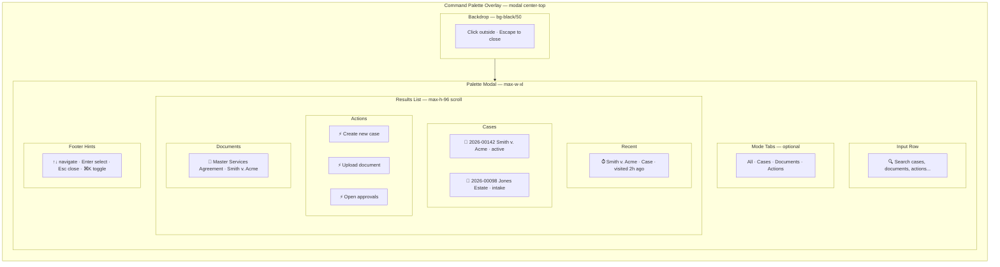
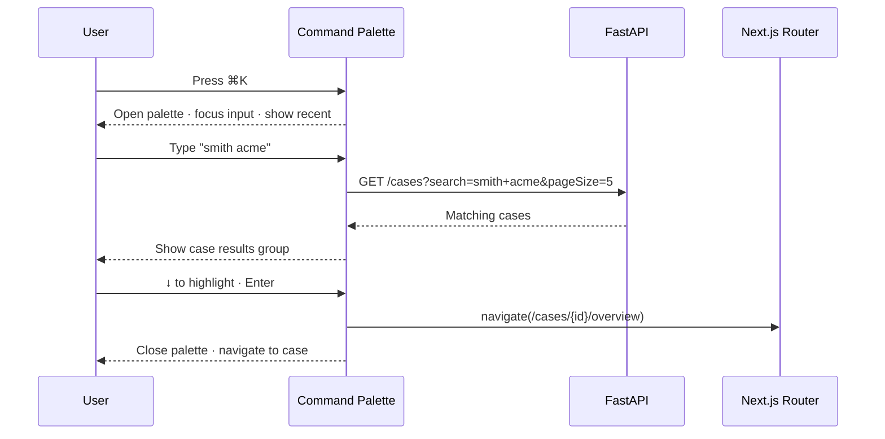
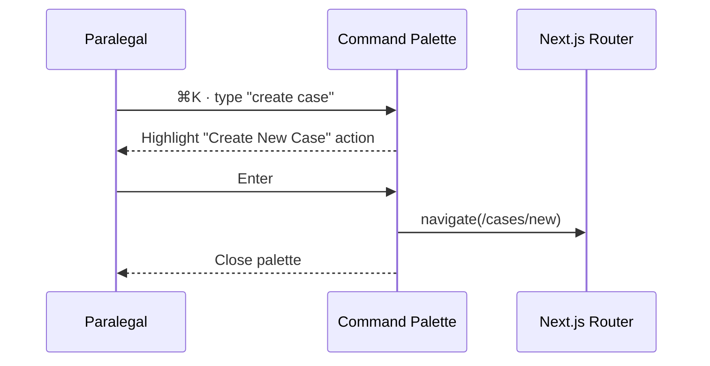

# Command Palette — Global ⌘K Navigation

**LexFlow AI** — Screen Specification  
**Version:** 1.0  
**Status:** Draft — Pre-Implementation  
**Last Updated:** 2026-07-06  
**Route:** Global overlay (not a route) — triggered via `⌘K` / `Ctrl+K`

---

## Purpose

The Command Palette is a **keyboard-first global action and navigation layer** inspired by Linear, VS Code, and Azure Portal's search bar. It provides instant access to cases, documents, actions, settings, and recent items without leaving the current screen — essential for attorneys who navigate dozens of matters daily.

The palette is a **modal overlay** rendered above all screens from `(dashboard)/layout.tsx`. It composes existing search and navigation APIs rather than introducing a separate backend endpoint.

---

## Users / Personas

| Persona | Usage |
|---------|-------|
| **All firm users** | Navigation, quick search, trigger actions |
| **Attorney** | Jump to case, approve item, request AI summary |
| **Paralegal** | Upload document, trigger workflow, create task |
| **Operations Team** | Navigate to workflow templates, executions |
| **Managing Partner** | Jump to reports, audit logs |

**Excluded:** Client portal users (separate simplified portal without command palette in Phase 1).

---

## Layout Wireframe

---

## Regions / Components

| Region | Component | ShadCN Base | Description |
|--------|-----------|-------------|-------------|
| **Backdrop** | Overlay | Dialog overlay | Click-outside closes; traps focus |
| **Palette Modal** | `CommandPalette` | Command (cmdk) | Centered top-third of viewport |
| **Search Input** | CommandInput | Input | Autofocus on open; clear button |
| **Mode Tabs** | CommandTabs | Tabs | Filter result types (optional) |
| **Result Groups** | CommandGroup | — | Labeled sections: Recent, Cases, Documents, Actions |
| **Result Item** | CommandItem | — | Icon + primary label + secondary metadata |
| **Empty State** | CommandEmpty | — | "No results found" |
| **Footer Hints** | Text muted | — | Keyboard shortcut legend |
| **Loading** | CommandLoading | Skeleton | Shown during async search |

### Built-In Action Registry

| Action ID | Label | Shortcut | Route / Handler |
|-----------|-------|----------|-----------------|
| `nav.cases` | Go to Cases | `G C` | `/cases` |
| `nav.approvals` | Open Approvals | `G A` | `/approvals` |
| `nav.workflows` | Workflow Dashboard | `G W` | `/workflows` |
| `nav.reports` | Analytics Dashboard | `G R` | `/reports` (role-gated) |
| `nav.audit` | Audit Logs | — | `/audit` (role-gated) |
| `action.case.create` | Create New Case | — | `/cases/new` |
| `action.document.upload` | Upload Document | — | Open upload dialog (case context) |
| `action.ai.summarize` | Request AI Summary | — | AI action sheet (case context) |
| `action.workflow.trigger` | Trigger Workflow | — | Trigger dialog |
| `user.settings` | Settings | — | `/settings` |
| `user.profile` | Profile | — | `/settings/profile` |
| `user.logout` | Sign Out | — | Logout handler |

Actions filtered by JWT permissions — hidden actions are not rendered.

---

## Data Requirements

The command palette **does not have a dedicated API**. It composes:

| Result Type | Source | Trigger |
|-------------|--------|---------|
| Recent items | Local storage + server `GET /api/v1/users/me/recent` | Phase 2 — on palette open |
| Cases | `GET /api/v1/cases?search={q}&pageSize=5` | Query ≥2 chars, debounced 200ms |
| Documents | `GET /api/v1/documents/search?q={q}&limit=5` | Query ≥2 chars |
| Actions | Static registry filtered by permissions | Always shown in "Actions" group |
| Navigation routes | Static route map | Filtered by role |
| Current case actions | Case context from URL | When on `/cases/[caseId]/*` |

**State management:** `useCommandStore` (Zustand) — `isOpen`, `query`, `mode`

Cross-reference: [../../12-ui/state-management.md](../../12-ui/state-management.md)

### API References

- [GET /cases?search=](../../04-api/endpoints-cases.md)
- [GET /documents/search](../../04-api/endpoints-documents.md)
- [Authorization RBAC](../../04-api/authorization-rbac.md) — Action visibility
- [Page architecture](../../12-ui/page-architecture.md) — Route map

---

## States

### Closed (Default)

- Palette not in DOM (or hidden with `aria-hidden`)
- `⌘K` / `Ctrl+K` toggles open
- Top bar search icon also opens palette

### Open — Empty Query

- Show: Recent items (last 5) + pinned actions + navigation shortcuts
- No API calls until query entered
- First item focused

### Open — Searching

- Debounce 200ms after keystroke
- Parallel fetch: cases + documents
- Loading spinner in input row
- Previous results remain visible until new results arrive (stale-while-revalidate)

### Open — No Results

- "No results for '{query}'"
- Suggestions: "Try a different term" + link to full search page

### Error

- Inline error in palette: "Search unavailable" + retry
- Actions group still functional (static registry)

---

## Interactions

### Primary Flow — Jump to Case

### Action Flow — Create Case

### Keyboard Navigation

| Key | Action |
|-----|--------|
| `⌘K` / `Ctrl+K` | Toggle palette open/close |
| `Escape` | Close palette |
| `↑` / `↓` | Navigate results |
| `Enter` | Select highlighted result |
| `Tab` | Cycle mode tabs (All · Cases · Documents · Actions) |
| `Backspace` on empty input | Close palette |

### Context-Aware Actions

When URL matches `/cases/[caseId]/*`:

| Additional Action | Behavior |
|-------------------|----------|
| Upload document | Open upload dialog with caseId pre-filled |
| Request AI summary | Open AI sheet scoped to case |
| Trigger workflow | Open trigger dialog with caseId |
| View timeline | Navigate to case timeline tab |

---

## Responsive Behavior

| Breakpoint | Behavior |
|------------|----------|
| **Desktop ≥1280px** | Modal centered, max-width 576px, top 20vh |
| **Tablet 768–1279px** | Modal width 90vw; same keyboard behavior |
| **Mobile <768px** | Full-width sheet from top; input large touch target |

On mobile, footer hints hidden; swipe down closes palette.

---

## Accessibility

| Requirement | Implementation |
|-------------|----------------|
| **Modal pattern** | `role="dialog" aria-modal="true" aria-label="Command palette"` |
| **Focus trap** | Focus cycles within palette while open; restore focus on close |
| **Input** | Autofocus on open; `aria-expanded="true"` on trigger button |
| **Results** | `role="listbox"`; items `role="option"`; `aria-selected` on highlight |
| **Groups** | `role="group" aria-label="Cases"` per section |
| **Character shortcuts** | All shortcuts require modifier key (⌘/Ctrl) — no bare letter traps |
| **Screen reader** | Result count announced: "5 results found" via `aria-live="polite"` |
| **Reduced motion** | No animation on open/close when `prefers-reduced-motion` |

Cross-reference: [../../12-ui/accessibility.md](../../12-ui/accessibility.md) — §2.1.4 Character Key Shortcuts

---

## Visual Design

| Token | Value |
|-------|-------|
| Modal shadow | `shadow-xl` (elevation 4) |
| Backdrop | `bg-black/50` |
| Modal background | `--card` (#FFFFFF) |
| Selected item | `--accent` background |
| Input height | 48px (lg) |
| Max results height | 384px scroll |
| Border radius | `--radius` lg (8px) |

Position: top-center (Linear-style), not vertical center — keeps context visible below.

---

## References

| Document | Path |
|----------|------|
| State management — commandStore | [../../12-ui/state-management.md](../../12-ui/state-management.md) |
| Page architecture — Phase 2 palette | [../../12-ui/page-architecture.md](../../12-ui/page-architecture.md) |
| Accessibility — ⌘K | [../../12-ui/accessibility.md](../../12-ui/accessibility.md) |
| Design system — shadow-xl | [../../12-ui/design-system.md](../../12-ui/design-system.md) |
| Search experience (full page) | [search-experience.md](./search-experience.md) |
| Case endpoints | [../../04-api/endpoints-cases.md](../../04-api/endpoints-cases.md) |
