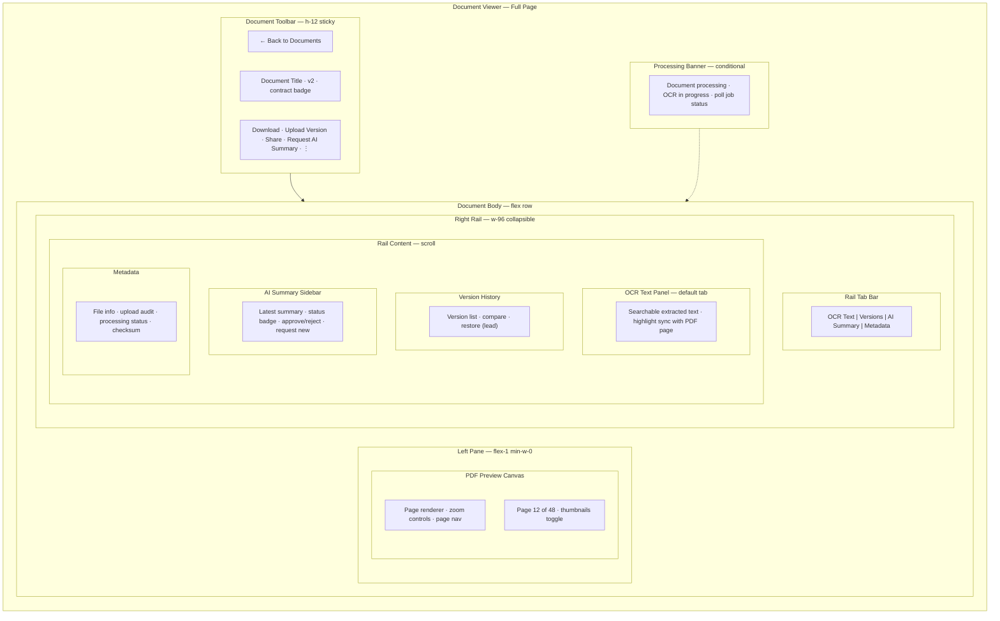
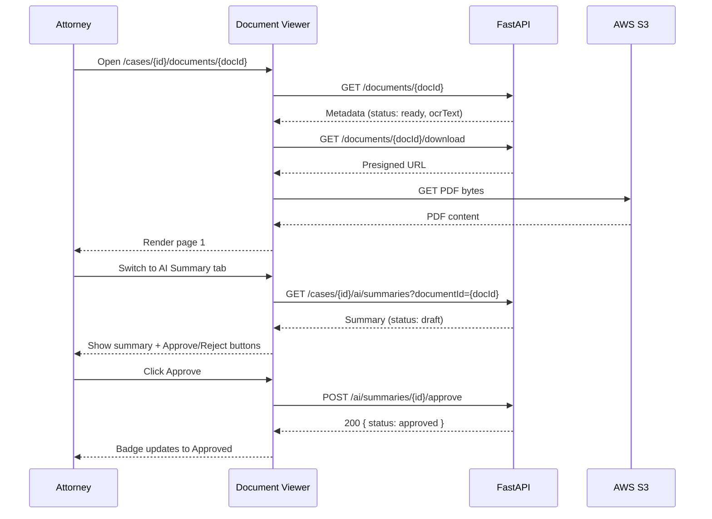

# Document Viewer — PDF Preview & AI Context

**LexFlow AI** — Screen Specification  
**Version:** 1.0  
**Status:** Draft — Pre-Implementation  
**Last Updated:** 2026-07-06  
**Route:** `/cases/[caseId]/documents/[documentId]`

---

## Purpose

The Document Viewer is the **primary surface for reviewing case documents** — rendering PDF previews, displaying OCR-extracted text, browsing version history, and surfacing AI-generated summaries in a contextual sidebar. It combines the document reading experience of Microsoft 365 SharePoint with Azure Portal's split-pane resource detail layout.

Attorneys and paralegals spend significant time here during discovery review, contract analysis, and deposition prep. The viewer must support long reading sessions without fatigue.

---

## Users / Personas

| Persona | Usage | Permissions |
|---------|-------|-------------|
| **Attorney** (primary) | Review documents, approve AI summaries, annotate | Full document access on assigned matters |
| **Paralegal** (primary) | Upload versions, verify OCR quality, organize | Read/write documents |
| **Associate Attorney** | Research within documents, request summaries | Read/write; cannot approve AI |
| **Legal Assistant** | Upload and verify processing status | Read/write |
| **Compliance Officer** | Metadata and audit review | Read metadata firm-wide; content per policy |
| **Client** (portal) | View firm-shared documents only | Portal subset — no OCR panel, no AI sidebar |

---

## Layout Wireframe



---

## Regions / Components

| Region | Component | Description |
|--------|-----------|-------------|
| **Document Toolbar** | `DocumentToolbar` | Navigation, title, version badge, confidentiality indicator |
| **PDF Preview** | `PdfViewer` | Client-side PDF.js render; zoom 50–200%; fit-width default |
| **Page Navigation** | `PageControls` | Current page input, prev/next, thumbnail drawer |
| **OCR Text Panel** | `OcrTextPanel` | Scroll-synced text; in-panel search with highlight |
| **Version History** | `VersionHistoryList` | Version cards with author, date, size; compare action |
| **AI Summary Sidebar** | `AISummarySidebar` | Summary content, draft/approved badge, action buttons |
| **Metadata Panel** | `DocumentMetadata` | Read-only fields from document API |
| **Processing Banner** | `ProcessingStatusBanner` | Shown when status ≠ `ready` |
| **Confidentiality Badge** | `ConfidentialityBadge` | Privileged / work product / client-shared indicators |

### Rail Tab Default by Document State

| Document Status | Default Rail Tab |
|-----------------|------------------|
| `pending_upload` | Metadata (upload instructions) |
| `uploaded` / `processing` | Metadata + processing progress |
| `ready` | OCR Text |
| `failed` | Metadata + retry action |

---

## Data Requirements

| Data | Endpoint | Notes |
|------|----------|-------|
| Document metadata | `GET /api/v1/documents/{documentId}` | Includes versions array, ocrStatus |
| Download URL | `GET /api/v1/documents/{documentId}/download` | Presigned S3 GET; 15 min TTL |
| OCR text | `GET /api/v1/documents/{documentId}` → `ocrText` field | Available when `ocrStatus: completed` |
| AI summaries | `GET /api/v1/cases/{caseId}/ai/summaries?documentId={documentId}` | Filter by document |
| Summary detail | `GET /api/v1/ai/summaries/{summaryId}` | Full structured content |
| Processing job | `GET /api/v1/jobs/{jobId}` | Poll when status is `processing` |
| Case context | `GET /api/v1/cases/{caseId}` | Matter wall + capabilities |

**Cache keys:**
- `['documents', documentId]`
- `['documents', documentId, 'download']` — short TTL (10 min)
- `['cases', caseId, 'ai', 'summaries', documentId]`

**Real-time:** SSE `document.processed` event transitions banner → ready state.

### API References

- [GET /documents/{id}](../../04-api/endpoints-documents.md) — Metadata and OCR text
- [GET /documents/{id}/download](../../04-api/endpoints-documents.md) — Presigned download
- [POST /documents/{id}/versions](../../04-api/endpoints-documents.md) — New version upload
- [GET /cases/{id}/ai/summaries](../../04-api/endpoints-ai.md) — Document summaries
- [POST /cases/{id}/ai/summarize](../../04-api/endpoints-ai.md) — Request new summary
- [POST /ai/summaries/{id}/approve](../../04-api/endpoints-ai.md) — Approve summary
- [GET /jobs/{id}](../../04-api/endpoints-ai.md) — Processing job poll

---

## States

### Loading

- Toolbar: title skeleton + action button skeletons
- PDF pane: centered spinner with "Loading document..."
- Rail: tab bar visible; content area skeleton (12 lines)

### Processing (`uploaded` / `processing`)

```mermaid
flowchart LR
    A[Upload confirmed] --> B[Banner: Processing]
    B --> C[Poll GET /jobs/{id}]
    C --> D{Status?}
    D -->|running| C
    D -->|completed| E[Reload document · show PDF]
    D -->|failed| F[Error banner + retry]
```

- PDF pane: placeholder illustration "Document processing"
- OCR tab: disabled with tooltip "Available after processing completes"
- Progress: indeterminate bar + elapsed time

### Empty — No AI Summary

- AI Summary tab: "No summary yet" + CTA "Request AI Summary"
- Disabled if document not `ready`

### Error

| Error | UX |
|-------|-----|
| 404 document | Not-found page (matter wall) |
| Download URL expired | Silent refetch download URL |
| PDF render failure | "Unable to preview this file type" + download fallback |
| OCR unavailable | Tab shows "OCR text not available for this document" |
| Processing failed | Banner with error detail + "Retry processing" (re-queue) |

### Version Compare (Phase 2)

- Side-by-side PDF panes when comparing v1 vs v2
- Changed pages highlighted in thumbnail strip

---

## Interactions

### Primary Flow — Document Review with AI Summary



### OCR Text Sync

| Action | Behavior |
|--------|----------|
| Scroll PDF to page N | OCR panel scrolls to corresponding text block |
| Click OCR text block | PDF navigates to source page |
| Search in OCR panel | Highlights matches; lists page numbers |
| Copy text | Copy button per section; audit logged |

### Toolbar Actions

| Action | Permission | Result |
|--------|------------|--------|
| Download | `document:download:assigned` | Trigger presigned download |
| Upload Version | `document:write:assigned` | Open version upload dialog (3-step presigned flow) |
| Request AI Summary | `ai:request:assigned` | POST summarize → 202; switch to AI tab |
| Approve Summary | `ai:approve:assigned` | POST approve |
| Share with Client | `document:write:assigned` + lead | Toggle client visibility flag |

---

## Responsive Behavior

| Breakpoint | Layout |
|------------|--------|
| **Desktop ≥1280px** | Split pane: PDF left (60%), rail right (360px); rail collapsible to icon strip |
| **Tablet 768–1279px** | PDF full-width; rail becomes bottom sheet (swipe up) with tab bar |
| **Mobile <768px** | PDF full-screen; rail tabs become full-screen overlay; toolbar actions in overflow menu |

PDF zoom defaults to fit-width on tablet/mobile. Pinch-to-zoom enabled on touch devices.

---

## Accessibility

| Requirement | Implementation |
|-------------|----------------|
| **PDF accessibility** | OCR text panel is primary accessible content path; PDF canvas `aria-label="PDF preview, page N of M"` |
| **Rail tabs** | Standard `role="tablist"` pattern; panel `aria-labelledby` |
| **Search in OCR** | `aria-describedby` for result count; announce "N matches found" |
| **Zoom controls** | Buttons with `aria-label="Zoom in"` / `"Zoom out"`; announce current zoom % |
| **Keyboard** | `←/→` page navigation; `⌘F` focus OCR search; `Tab` cycles toolbar → PDF → rail |
| **AI disclaimer** | Summary panel includes visible disclaimer text; not icon-only |
| **Motion** | Respect `prefers-reduced-motion` for page transition animations |

---

## References

| Document | Path |
|----------|------|
| Document endpoints | [../../04-api/endpoints-documents.md](../../04-api/endpoints-documents.md) |
| AI endpoints | [../../04-api/endpoints-ai.md](../../04-api/endpoints-ai.md) |
| Document aggregate | [../../02-domain/document-aggregate.md](../../02-domain/document-aggregate.md) |
| Human-in-the-loop | [../../07-ai/human-in-the-loop.md](../../07-ai/human-in-the-loop.md) |
| Design system — confidentiality | [../../12-ui/design-system.md](../../12-ui/design-system.md) |
