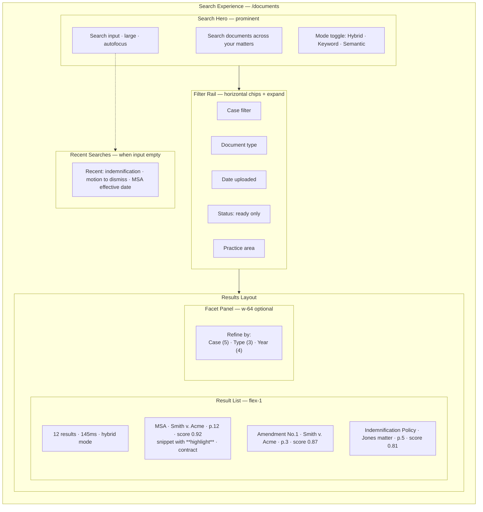
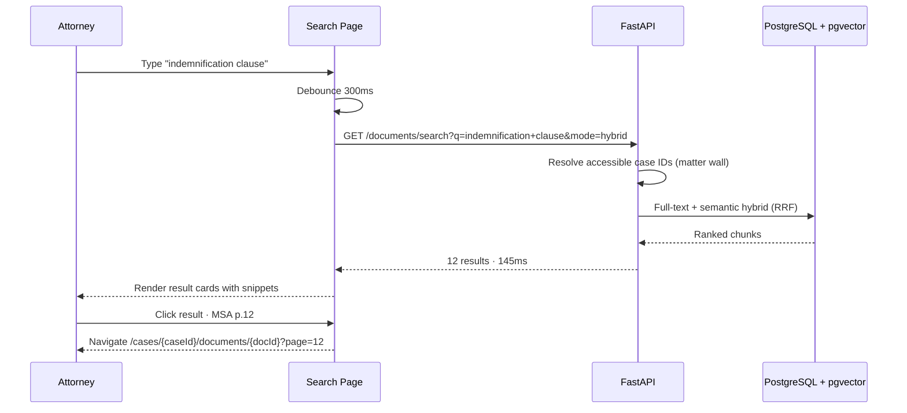

# Search Experience — Hybrid Document & Case Search

**LexFlow AI** — Screen Specification  
**Version:** 1.0  
**Status:** Draft — Pre-Implementation  
**Last Updated:** 2026-07-06  
**Route:** `/documents` (firm-wide search) · case-scoped via case documents tab

---

## Purpose

The Search Experience is LexFlow's **hybrid retrieval surface** — combining PostgreSQL full-text search with pgvector semantic similarity to help practitioners find documents, clauses, and case references across their accessible matters. It draws from enterprise search patterns in Microsoft 365 and Azure Cognitive Search, with matter wall filtering enforced server-side on every query.

Users never search firm-wide content they cannot access. Results always include contextual snippets, relevance scores, and direct navigation to the document viewer at the matching page.

---

## Users / Personas

| Persona | Usage | Scope |
|---------|-------|-------|
| **Attorney** | Cross-case clause research on assigned + firm-wide read matters | Matter wall filtered |
| **Paralegal** | Discovery document location, duplicate detection | Assigned cases |
| **Associate Attorney** | Research within assigned matters | Assigned cases |
| **Operations Team** | Firm-wide document analytics prep | Firm-wide read |
| **Compliance Officer** | Metadata search for audit investigations | Firm-wide (metadata emphasis) |
| **Managing Partner** | Firm-wide search on read-accessible matters | Firm-wide read |

---

## Layout Wireframe



---

## Regions / Components

| Region | Component | Description |
|--------|-----------|-------------|
| **Search Input** | `SearchInput` large variant | Debounced 300ms; min 2 chars to search |
| **Mode Toggle** | `SegmentedControl` | hybrid · keyword · semantic |
| **Filter Chips** | `FilterChipBar` | Active filters with remove × button |
| **Case Filter** | Combobox | Search assigned/accessible cases |
| **Result Summary** | Text | Count + duration + mode indicator |
| **Result Card** | `SearchResultCard` | Title, case, page, snippet, score, type badge |
| **Snippet Highlight** | `<mark>` | Bold matched terms from full-text; semantic matches unbold |
| **Facet Panel** | `SearchFacets` | Aggregated counts per dimension (Phase 2) |
| **Recent Searches** | `RecentSearchList` | Local storage + server history (Phase 2) |
| **Empty Suggestions** | Prompt chips | Popular searches for practice area |
| **Sort Control** | Dropdown | Relevance (default) · Date · Case |

### Search Mode Behavior

| Mode | `mode` param | Best For |
|------|--------------|----------|
| **Hybrid** | `hybrid` | Default; RRF merge of keyword + semantic |
| **Keyword** | `keyword` | Exact phrases, case numbers, names |
| **Semantic** | `semantic` | Conceptual queries ("limitation of liability caps") |

---

## Data Requirements

| Data | Endpoint | Parameters |
|------|----------|------------|
| Document search | `GET /api/v1/documents/search` | `q`, `caseId`, `documentType`, `mode`, `limit` |
| Case list (filter) | `GET /api/v1/cases?search=` | Case combobox autocomplete |
| Document detail | `GET /api/v1/documents/{id}` | After result click |
| Case-scoped list | `GET /api/v1/cases/{caseId}/documents?search=` | Within case documents tab |

**Cache key:** `['documents', 'search', query, filters, mode]` — 60s stale time

**No cache** when query changes. Matter wall filtering is **always server-side** — never client-filtered.

### Response Shape

```json
{
  "data": [
    {
      "documentId": "d1e2f3a4-b5c6-7890-def1-234567890abc",
      "caseId": "c1d2e3f4-a5b6-7890-cdef-123456789012",
      "caseTitle": "Smith v. Acme Corp",
      "documentTitle": "Master Services Agreement",
      "documentType": "contract",
      "snippet": "...party shall provide **indemnification** for all claims...",
      "pageNumber": 12,
      "score": 0.92,
      "matchType": "hybrid"
    }
  ],
  "meta": {
    "searchMeta": {
      "query": "indemnification clause",
      "mode": "hybrid",
      "totalResults": 12,
      "searchDurationMs": 145
    }
  }
}
```

### API References

- [GET /documents/search](../../04-api/endpoints-documents.md)
- [GET /cases/{id}/documents](../../04-api/endpoints-documents.md)
- [RAG architecture](../../07-ai/rag-architecture.md) — Same embedding index
- [Matter walls](../../08-security/matter-walls.md) — Server-side filter
- [Indexing strategy](../../05-database/indexing-strategy.md)

---

## States

### Loading

- Search in progress: Result area skeleton (5 cards); input shows spinner icon
- Filter change: Overlay shimmer on results; preserve query
- Debounce pending: Subtle "Searching..." after 300ms delay

### Empty

| Condition | Message |
|-----------|---------|
| No query yet | Recent searches + suggested prompts |
| Query too short (<2 chars) | "Type at least 2 characters to search" |
| Zero results | "No documents match '{query}'" + suggestions: try keyword mode, broaden filters |
| No accessible documents | "No searchable documents in your accessible cases" |

### Error

| Error | UX |
|-------|-----|
| 429 rate limit | "Search rate limit reached. Retry in {n} seconds." |
| 500 | Inline error with retry; preserve query and filters |
| Timeout (>5s) | "Search is taking longer than expected" + retry |

---

## Interactions

### Primary Flow — Hybrid Search



### Filter Interactions

| Filter | Behavior |
|--------|----------|
| Case | Scopes search to single case; clears on "All cases" |
| Document type | Multi-select OR logic |
| Date uploaded | Range picker presets |
| Status | Default `ready` only; toggle includes processing |
| Practice area | Filters via case metadata join |
| Clear all | Resets filters; preserves query and mode |

### Result Click

- Navigate to document viewer with `?page={pageNumber}` query param
- PDF viewer opens to specified page
- OCR panel scrolls to matching text block
- Search query passed for in-document highlight (Phase 2)

### Case Documents Tab Variant

When accessed from `/cases/[caseId]/documents`:
- Search input scoped to case (no case filter shown)
- Same hybrid search via `GET /documents/search?caseId={id}&q=...`
- Integrated with document list table below

---

## Responsive Behavior

| Breakpoint | Layout |
|------------|--------|
| **Desktop ≥1280px** | Hero search + horizontal filters + results + facet panel |
| **Tablet 768–1279px** | Facet panel collapses to filter sheet; results full-width |
| **Mobile <768px** | Compact search bar in top nav; filters in bottom sheet; result cards stack |

Search hero collapses to top bar search on mobile when scrolling.

---

## Accessibility

| Requirement | Implementation |
|-------------|----------------|
| **Search input** | `role="searchbox" aria-label="Search documents"`; results count via `aria-live` |
| **Mode toggle** | `role="radiogroup"` with labeled options |
| **Result list** | `<ul role="list">`; each result `<li>` with heading link |
| **Snippets** | `<mark>` for highlights; screen reader reads matched context |
| **Score** | `aria-label="Relevance score 92 percent"` — supplementary, not sole indicator |
| **Keyboard** | `/` focuses search; `↑/↓` navigate results; Enter opens document |
| **Empty state** | Suggested prompts are keyboard-focusable buttons |

---

## References

| Document | Path |
|----------|------|
| Document search API | [../../04-api/endpoints-documents.md](../../04-api/endpoints-documents.md) |
| Command palette (quick search) | [command-palette.md](./command-palette.md) |
| Document viewer | [document-viewer.md](./document-viewer.md) |
| RAG architecture | [../../07-ai/rag-architecture.md](../../07-ai/rag-architecture.md) |
| Documents schema | [../../05-database/documents-schema.md](../../05-database/documents-schema.md) |
