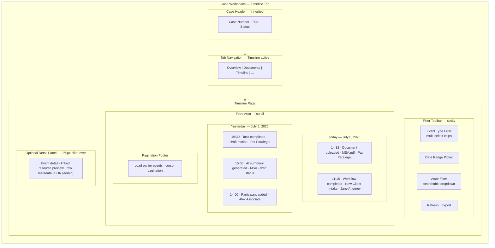
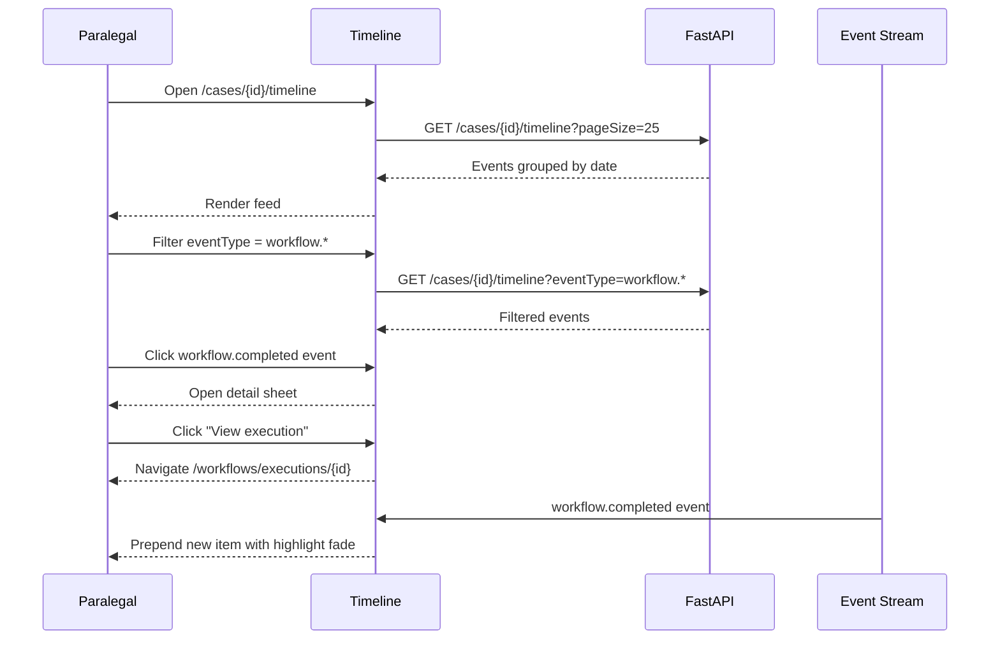

# Timeline / Activity Feed — Case Chronological Events

**LexFlow AI** — Screen Specification  
**Version:** 1.0  
**Status:** Draft — Pre-Implementation  
**Last Updated:** 2026-07-06  
**Route:** `/cases/[caseId]/timeline`

---

## Purpose

The Timeline screen presents a **chronological, filterable feed of all significant events** on a case — document uploads, task completions, workflow executions, AI summary generations, participant changes, status transitions, and internal notes. It serves as the case's **audit-friendly activity log** for day-to-day work (distinct from the compliance-grade Audit Logs Viewer).

Think of it as the activity stream on a Linear issue or the history blade on an Azure Portal resource — optimized for practitioners who need context on *what happened and when*.

---

## Users / Personas

| Persona | Usage | Notes |
|---------|-------|-------|
| **Attorney** | Review case history before hearings; verify workflow completion | Full event visibility on assigned matters |
| **Paralegal** | Track document processing, workflow status, task handoffs | Primary daily user |
| **Associate Attorney** | Understand recent changes before drafting | Cannot see compliance-only audit detail fields |
| **Legal Assistant** | Confirm upload and intake events processed | Limited to assigned matters |
| **Managing Partner** | Spot-check matter activity (firm-wide read) | Read-only |
| **Compliance Officer** | Cross-reference with firm audit logs | Read-only; link to Audit Logs Viewer for immutable trail |

**Excluded:** Client portal users never see internal timeline events (notes, AI drafts, internal workflows).

---

## Layout Wireframe



---

## Regions / Components

| Region | Component | Description |
|--------|-----------|-------------|
| **Filter Toolbar** | `TimelineFilters` | Multi-select event types, date range, actor filter |
| **Date Group Header** | `TimelineDayGroup` | Sticky date separator ("Today", "Yesterday", full date) |
| **Event Item** | `TimelineEventItem` | Icon + title + actor + timestamp + reference link |
| **Event Type Icon** | Status icon map | Document=FileText, Task=CheckSquare, Workflow=GitBranch, AI=Sparkles |
| **Reference Link** | Inline link | Navigates to document viewer, task, workflow execution, AI summary |
| **Load More** | Button + cursor | Cursor-based infinite scroll or explicit "Load earlier" |
| **Detail Panel** | Sheet (right) | Expanded event metadata on click |
| **Export Button** | DropdownMenu | Export visible timeline as CSV (Phase 2) |
| **Empty State** | Illustration + CTA | Prompt first action |

### Event Type Catalog

| `eventType` | Icon | Color Token | Display Title Pattern |
|-------------|------|-------------|----------------------|
| `document.uploaded` | FileText | status-info | "{title} uploaded" |
| `document.processed` | FileCheck | status-success | "{title} processed and searchable" |
| `task.created` | PlusSquare | status-neutral | "Task created: {title}" |
| `task.completed` | CheckCircle | status-success | "Task completed: {title}" |
| `workflow.started` | Play | status-info | "Workflow started: {name}" |
| `workflow.completed` | GitBranch | status-success | "Workflow completed: {name}" |
| `workflow.failed` | AlertCircle | status-error | "Workflow failed: {name}" |
| `ai.summary.generated` | Sparkles | status-approval | "AI summary generated: {doc}" |
| `ai.summary.approved` | ShieldCheck | status-success | "AI summary approved" |
| `participant.added` | UserPlus | status-neutral | "{name} added as {role}" |
| `case.status_changed` | RefreshCw | status-warning | "Status changed to {status}" |
| `note.created` | MessageSquare | status-neutral | "Internal note added" |
| `deadline.created` | Calendar | status-warning | "Deadline set: {title}" |

---

## Data Requirements

| Data | Endpoint | Parameters |
|------|----------|------------|
| Timeline events | `GET /api/v1/cases/{caseId}/timeline` | `page`, `pageSize`, `eventType`, `occurredAfter`, `occurredBefore`, `actorId` |
| Case context | `GET /api/v1/cases/{caseId}` | Capabilities check |
| Participants (actor filter) | `GET /api/v1/cases/{caseId}/participants` | Populate actor dropdown |

**Cache key:** `['cases', caseId, 'timeline', filters]`

**Real-time:** Subscribe to SSE events on `/api/v1/events/stream`:
- `case.updated` — prepend new timeline events
- `workflow.completed`, `summary.generated` — prepend with animation

### Response Shape (per event)

```json
{
  "id": "ev1a2b3c4-d5e6-7890-abcd-ef1234567890",
  "eventType": "document.uploaded",
  "title": "Contract uploaded",
  "description": "Master Services Agreement uploaded for processing",
  "occurredAt": "2026-07-05T14:00:00Z",
  "actorId": "d3e4f5a6-b7c8-9012-cdef-123456789012",
  "actorName": "Pat Paralegal",
  "referenceType": "document",
  "referenceId": "doc-uuid",
  "metadata": { "fileName": "msa-acme-2026.pdf" }
}
```

### API References

- [GET /cases/{id}/timeline](../../04-api/endpoints-cases.md) — Primary feed
- [GET /events/stream](../../api-architecture.md#12-websocket--sse) — Real-time updates

---

## States

### Loading

- Initial: 10 skeleton timeline items grouped under 2 date headers
- Filter change: Overlay shimmer on feed area; preserve filter state
- Load more: Inline spinner at bottom; disable "Load earlier" button

### Empty

| Condition | Message | CTA |
|-----------|---------|-----|
| New case, no events | "No activity on this case yet" | "Upload Document" · "Create Task" |
| Filters exclude all | "No events match your filters" | "Clear filters" button |
| Closed case, no recent | "No recent activity" | Show full history via "Load earlier" |

### Error

| Error | UX |
|-------|-----|
| 404 | Case not-found page (matter wall) |
| 500 on initial load | Full-page error with retry |
| 500 on load more | Toast + retain loaded events; retry load more |
| SSE disconnect | Banner: "Live updates paused" with reconnect indicator |

---

## Interactions

### Primary Flow — Review Recent Activity



### Filter Interactions

| Control | Behavior |
|---------|----------|
| Event type chips | Toggle multi-select; OR logic within types |
| Date range | Presets: Today, Last 7 days, Last 30 days, Custom |
| Actor filter | Searchable combobox of case participants |
| Clear all | Resets to default (all types, no date limit) |
| Refresh | Manual refetch; icon spins during load |

### Event Item Click

| `referenceType` | Navigation Target |
|-----------------|-------------------|
| `document` | `/cases/{caseId}/documents/{referenceId}` |
| `task` | `/cases/{caseId}/tasks?highlight={referenceId}` |
| `workflow_execution` | `/workflows/executions/{referenceId}` |
| `ai_summary` | `/cases/{caseId}/ai/{referenceId}` |
| `participant` | `/cases/{caseId}/participants` |
| null | Open detail sheet only |

---

## Responsive Behavior

| Breakpoint | Changes |
|------------|---------|
| **Desktop ≥1280px** | Full filter toolbar inline; optional detail panel slides from right |
| **Tablet 768–1279px** | Filters collapse to filter sheet (button opens); detail panel full-width sheet |
| **Mobile <768px** | Filters in bottom sheet; event items full-width; date headers sticky; no side panel — navigate directly |

Feed uses virtual scrolling when >100 events loaded (Phase 2 performance optimization).

---

## Accessibility

| Requirement | Implementation |
|-------------|----------------|
| **Feed semantics** | `<ol>` ordered list per day group; each event = `<li>` |
| **Timestamps** | `<time datetime="ISO8601">` with human-readable format |
| **Event type** | Icon has `aria-hidden="true"`; type conveyed in text title |
| **Filters** | `aria-label` on multi-select; filter count announced on change |
| **Live updates** | New events: `aria-live="polite"` region announces "New activity: {title}" |
| **Keyboard** | Arrow keys navigate events; Enter opens detail; Escape closes panel |
| **Color** | Status never conveyed by color alone — icon + text label |

---

## References

| Document | Path |
|----------|------|
| Timeline endpoint | [../../04-api/endpoints-cases.md](../../04-api/endpoints-cases.md) |
| Case dashboard (compact feed) | [case-dashboard.md](./case-dashboard.md) |
| Audit logs viewer (compliance) | [audit-logs-viewer.md](./audit-logs-viewer.md) |
| Real-time updates | [../../12-ui/real-time-updates.md](../../12-ui/real-time-updates.md) |
| Domain events | [../../02-domain/domain-events.md](../../02-domain/domain-events.md) |
