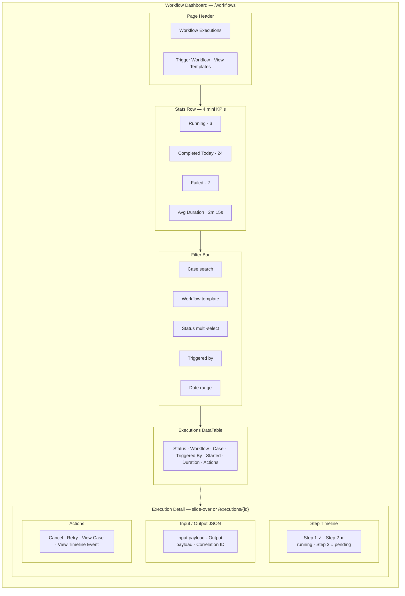
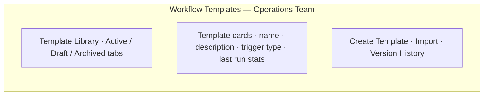
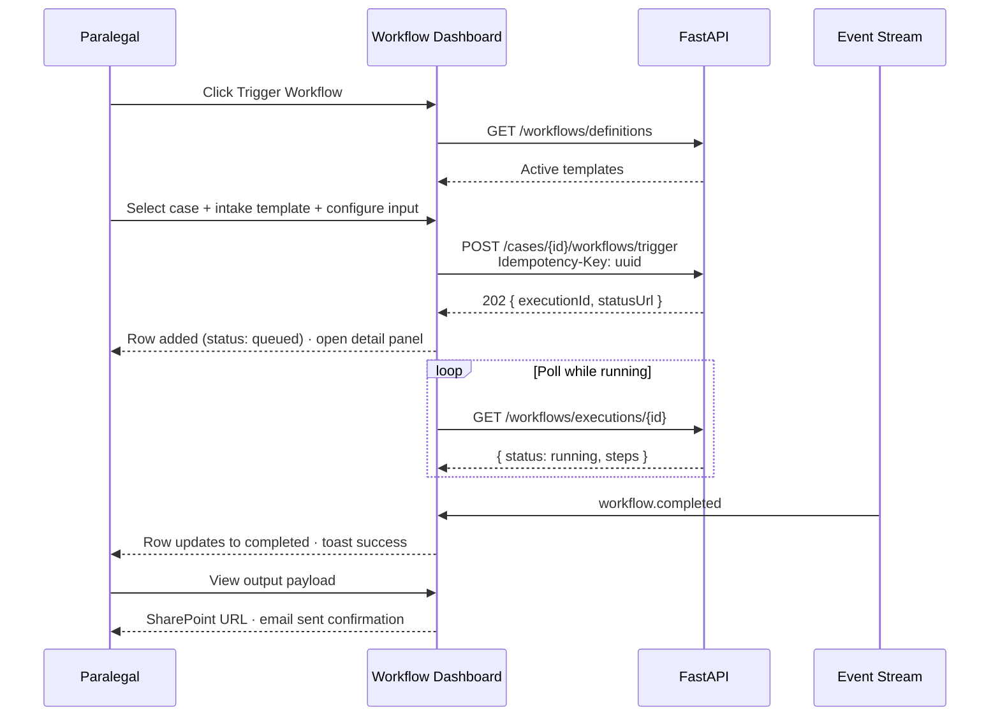

# Workflow Dashboard — Operations Monitoring

**LexFlow AI** — Screen Specification  
**Version:** 1.0  
**Status:** Draft — Pre-Implementation  
**Last Updated:** 2026-07-06  
**Route:** `/workflows` (executions) · `/workflows/templates` (Operations Team)

---

## Purpose

The Workflow Dashboard is the **operations command center** for monitoring workflow executions across the firm. Operations Team members, paralegals, and attorneys use it to trigger manual workflows, track running executions, diagnose failures, and review step-level progress — similar to Azure Logic Apps run history or n8n's execution list, but with case context and matter wall enforcement.

Business logic lives in FastAPI; n8n is a private orchestration pipe. This screen reflects **execution state persisted by the API**, not raw n8n internals.

---

## Users / Personas

| Persona | Usage | Permissions |
|---------|-------|-------------|
| **Operations Team** (primary) | Firm-wide execution monitoring, template management | `workflow:manage:firm` + `workflow:trigger:assigned` |
| **Paralegal** | Trigger case workflows, monitor own executions | `workflow:trigger:assigned` |
| **Attorney** | Trigger workflows on assigned cases | `workflow:trigger:assigned` |
| **Legal Assistant** | Limited template trigger on assigned cases | Restricted template subset |
| **Managing Partner** | Read-only throughput overview | View executions firm-wide |

---

## Layout Wireframe

### Templates Sub-Route (`/workflows/templates`)

---

## Regions / Components

| Region | Component | Description |
|--------|-----------|-------------|
| **Stats Row** | `WorkflowStatsBar` | Computed from current filter set |
| **Filter Bar** | `ExecutionFilters` | Case, workflow, status, actor, date |
| **Executions Table** | `ExecutionDataTable` | Sortable; status pill per row |
| **Status Pill** | `ExecutionStatusBadge` | queued · running · completed · failed · cancelled |
| **Trigger Dialog** | `TriggerWorkflowDialog` | Select template + case + JSON schema form |
| **Detail Panel** | `ExecutionDetailPanel` | Step timeline, payloads, actions |
| **Step Timeline** | `WorkflowStepTimeline` | Vertical step list with status icons |
| **Cancel Button** | Button destructive | POST cancel; confirm dialog |
| **Live Indicator** | Pulse dot | Running executions poll every 5s or SSE |

### Execution Status Visual Language

| Status | Token | Animation |
|--------|-------|-----------|
| `queued` | status-warning | None |
| `running` | status-info | Loader2 spin on icon |
| `completed` | status-success | None |
| `failed` | status-error | None |
| `cancelled` | status-neutral | None |

---

## Data Requirements

| Data | Endpoint | Parameters |
|------|----------|------------|
| Execution list | `GET /api/v1/workflows/executions` | `caseId`, `workflowSlug`, `status`, `triggeredBy`, `createdAfter`, `page`, `pageSize` |
| Execution detail | `GET /api/v1/workflows/executions/{executionId}` | Includes `steps[]`, input/output payloads |
| Workflow definitions | `GET /api/v1/workflows/definitions` | For trigger dialog + filter dropdown |
| Trigger workflow | `POST /api/v1/cases/{caseId}/workflows/trigger` | 202 async; requires `Idempotency-Key` |
| Cancel execution | `POST /api/v1/workflows/executions/{executionId}/cancel` | Running executions only |
| Case lookup | `GET /api/v1/cases?search=` | Case filter autocomplete |

**Cache keys:**
- `['workflows', 'executions', filters]`
- `['workflows', 'executions', executionId]`

**Real-time:**
- SSE `workflow.completed`, `workflow.failed` — update row status
- Running executions: poll `GET /executions/{id}` every 5s until terminal state

### API References

- [GET /workflows/executions](../../04-api/endpoints-workflows.md)
- [GET /workflows/executions/{id}](../../04-api/endpoints-workflows.md)
- [POST /cases/{id}/workflows/trigger](../../04-api/endpoints-workflows.md)
- [POST /workflows/executions/{id}/cancel](../../04-api/endpoints-workflows.md)
- [GET /workflows/definitions](../../04-api/endpoints-workflows.md)

---

## States

### Loading

- Stats row: 4 skeleton pills
- Table: 10-row skeleton with status pill placeholders
- Detail panel: step timeline skeleton (5 steps)

### Empty

| Condition | Message | CTA |
|-----------|---------|-----|
| No executions ever | "No workflows have run yet" | "Trigger your first workflow" |
| Filters exclude all | "No executions match your filters" | "Clear filters" |
| Case has no executions | "No workflows on this case" | "Trigger Workflow" (from case context) |

### Error

| Error | UX |
|-------|-----|
| Trigger validation 422 | Inline form errors from JSON schema |
| Trigger 404 | Toast "Workflow or case not found" |
| Cancel on completed | Toast "Execution already completed" |
| Step detail unavailable | Show execution-level status only |

### Running Execution Detail

- Step timeline auto-refreshes every 5s
- Currently running step highlighted with pulse
- Elapsed timer in header
- Cancel button enabled until terminal state

---

## Interactions

### Primary Flow — Trigger and Monitor Workflow

### Trigger Workflow Dialog

| Step | UI |
|------|-----|
| 1. Select case | Searchable case combobox (assigned cases) |
| 2. Select workflow | Filtered by `isActive=true`; description shown |
| 3. Configure input | Dynamic form from `configSchema` (JSON Schema) |
| 4. Confirm | Summary + estimated duration |
| 5. Submit | POST trigger → close dialog → navigate to execution detail |

### Row Actions

| Action | Condition | Result |
|--------|-----------|--------|
| View detail | Always | Open slide-over or navigate to `/workflows/executions/{id}` |
| Cancel | `status=running` or `queued` | Confirm → POST cancel |
| Retry | `status=failed` | Re-trigger with same input (new idempotency key) |
| View case | Always | Navigate `/cases/{caseId}/overview` |
| View in timeline | `status=completed` | Navigate case timeline filtered to event |

---

## Responsive Behavior

| Breakpoint | Changes |
|------------|---------|
| **Desktop ≥1280px** | Full table all columns; detail slide-over 480px |
| **Tablet 768–1279px** | Hide duration column; detail full-width sheet |
| **Mobile <768px** | Card list instead of table; tap opens full-screen detail |

Stats row wraps 2×2 on tablet, stacks on mobile.

---

## Accessibility

| Requirement | Implementation |
|-------------|----------------|
| **Status** | Text label on every status pill — not color-only |
| **Step timeline** | `<ol>` ordered list; `aria-current="step"` on active step |
| **Running poll** | `aria-live="polite"` announces status transitions |
| **Trigger form** | JSON schema form fields have associated labels and error text |
| **Cancel confirm** | Focus trap in dialog; destructive action clearly labeled |
| **Table** | Sortable headers with `aria-sort`; row action menu keyboard accessible |

---

## References

| Document | Path |
|----------|------|
| Workflow endpoints | [../../04-api/endpoints-workflows.md](../../04-api/endpoints-workflows.md) |
| n8n integration | [../../06-workflows/n8n-integration.md](../../06-workflows/n8n-integration.md) |
| Workflow catalog | [../../06-workflows/workflow-catalog.md](../../06-workflows/workflow-catalog.md) |
| Operations persona | [../../01-product/user-personas.md](../../01-product/user-personas.md) |
| Analytics dashboard | [analytics-dashboard.md](./analytics-dashboard.md) |
