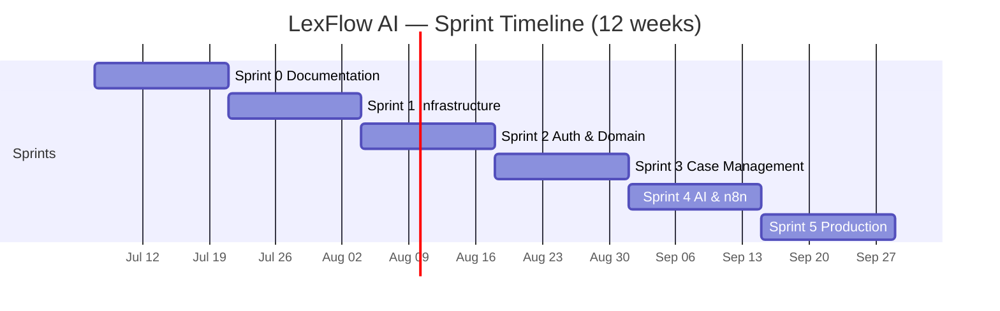
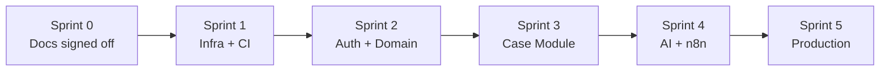

# LexFlow AI — Sprint Planning

**Version:** 1.0  
**Status:** Ready for Jira Import  
**Last Updated:** 2026-07-06  
**Sprint Duration:** 2 weeks (10 working days)

---

## Purpose

This folder contains **detailed sprint plans** for LexFlow AI MVP delivery (Sprints 0–5). Each sprint document includes goals, epics, user stories, acceptance criteria, story points, dependencies, and demo criteria. CSV files in [`jira-import/`](./jira-import/) can be imported into Jira Cloud or adapted for Azure DevOps / Linear.

---

## Sprint Overview

| Sprint | Theme | Story Points (Target) | Primary Outcome |
|--------|-------|----------------------|-----------------|
| [Sprint 0](./sprint-00-documentation.md) | Documentation review & sign-off | 34 | Docs validated; backlog refined; team aligned |
| [Sprint 1](./sprint-01-infrastructure.md) | Monorepo, Docker, CI/CD, tooling | 55 | `make dev` works; CI green; empty apps deploy to staging |
| [Sprint 2](./sprint-02-auth-domain.md) | Auth, RBAC, core domain models | 62 | Login works; matter walls enforced; migrations baseline |
| [Sprint 3](./sprint-03-case-management.md) | Case Management module | 68 | Full case CRUD UI + API; timeline; participants |
| [Sprint 4](./sprint-04-ai-n8n.md) | AI services + n8n orchestration | 72 | Async AI summary; document pipeline; first workflow |
| [Sprint 5](./sprint-05-production.md) | Hardening, observability, AWS | 58 | Staging load test; observability; production deploy |

**Total estimated:** ~349 story points (~12 weeks at velocity 29–35 SP/sprint for a team of 6–8)

---

## Team Assumptions

| Role | Count | Sprint Focus |
|------|-------|--------------|
| Tech Lead / Architect | 1 | All sprints — ADRs, reviews, unblocking |
| Backend Engineer | 2 | Sprints 1–5 |
| Frontend Engineer | 2 | Sprints 1–5 |
| DevOps / SRE | 1 | Sprints 1, 5 (support 2–4) |
| QA / SDET | 1 | Sprints 2–5 |
| Product Owner | 1 | All sprints — backlog, acceptance |
| **Optional** AI/ML Engineer | 0.5 FTE | Sprint 4 primary |

Adjust velocity if team size differs. Story points use **Fibonacci (1, 2, 3, 5, 8, 13)**.

---

## Jira Import Guide

### Files

| File | Contents |
|------|----------|
| [`jira-import/epics.csv`](./jira-import/epics.csv) | 6 epics (one per sprint theme) + cross-cutting |
| [`jira-import/stories.csv`](./jira-import/stories.csv) | All user stories with acceptance criteria |
| [`jira-import/tasks.csv`](./jira-import/tasks.csv) | Technical tasks (sub-task candidates) |
| [`jira-import/labels-and-components.csv`](./jira-import/labels-and-components.csv) | Reference for Jira project setup |

### Jira Cloud Import Steps

1. **Create project** — Scrum template, key: `LEX` (or `LFA`)
2. **Configure components:** `backend`, `frontend`, `infra`, `n8n`, `ai`, `docs`, `qa`
3. **Configure labels:** `sprint-0` … `sprint-5`, `matter-wall`, `security`, `blocker`
4. **Import epics first:** Jira → Project Settings → External Import → CSV → `epics.csv`
5. **Import stories:** Map columns: Summary, Issue Type, Description, Epic Link, Story Points, Priority, Labels, Components
6. **Create sprints:** Backlog → Create Sprint → drag stories by `sprint-N` label
7. **Map custom fields:** If `Story Points` field name differs, remap on import

### CSV Column Mapping (Jira Cloud)

| CSV Column | Jira Field |
|------------|------------|
| `Summary` | Summary |
| `Issue Type` | Issue Type |
| `Description` | Description |
| `Epic Name` | Epic Link (after epics exist) |
| `Story Points` | Story point estimate |
| `Priority` | Priority |
| `Labels` | Labels (comma-separated) |
| `Components` | Component/s |
| `Acceptance Criteria` | Append to Description or Custom Field |
| `Sprint` | Assign manually post-import |

### Azure DevOps / Linear

- **Azure DevOps:** Import `stories.csv` as Work Items; map Epic Name → Parent
- **Linear:** Use `stories.csv` Summary + Description; create Cycles for sprints

---

## Epic Index

| Epic Key | Epic Name | Sprint |
|----------|-----------|--------|
| LEX-E0 | Documentation & Alignment | Sprint 0 |
| LEX-E1 | Platform Infrastructure | Sprint 1 |
| LEX-E2 | Identity, Auth & Domain Foundation | Sprint 2 |
| LEX-E3 | Case Management Module | Sprint 3 |
| LEX-E4 | AI Services & Workflow Orchestration | Sprint 4 |
| LEX-E5 | Production Readiness & AWS Deployment | Sprint 5 |

---

## Cross-Sprint Dependencies

| Dependency | Blocker For |
|------------|-------------|
| Docker Compose local stack | All development sprints |
| CI pipeline | Merge gates Sprint 2+ |
| Auth + RBAC | All case-scoped features |
| Matter walls | Case module, AI, documents |
| Case aggregate | Documents, AI, workflows |
| RabbitMQ + Celery | AI async, n8n triggers |
| n8n private deploy | Workflow stories Sprint 4 |

---

## Definition of Ready (Sprint Start)

From [`.ai/handbook/definition-of-ready.md`](../.ai/handbook/definition-of-ready.md):

- [ ] Story has clear acceptance criteria
- [ ] Dependencies identified and unblocked
- [ ] Design spec linked (if UI) — `docs/16-design-system/`
- [ ] API contract linked (if backend) — `docs/04-api/`
- [ ] Story pointed by team
- [ ] No open architecture questions (or ADR drafted)

---

## Definition of Done (All Sprints)

From [`.ai/handbook/definition-of-done.md`](../.ai/handbook/definition-of-done.md):

- [ ] Acceptance criteria met
- [ ] CI passes (lint, test, build)
- [ ] Code review approved
- [ ] Matter wall tests pass (if auth/case touched)
- [ ] Audit logging (if mutating API)
- [ ] Documentation updated if behavior changed

---

## Sprint Documents

| Sprint | Document |
|--------|----------|
| Sprint 0 | [sprint-00-documentation.md](./sprint-00-documentation.md) |
| Sprint 1 | [sprint-01-infrastructure.md](./sprint-01-infrastructure.md) |
| Sprint 2 | [sprint-02-auth-domain.md](./sprint-02-auth-domain.md) |
| Sprint 3 | [sprint-03-case-management.md](./sprint-03-case-management.md) |
| Sprint 4 | [sprint-04-ai-n8n.md](./sprint-04-ai-n8n.md) |
| Sprint 5 | [sprint-05-production.md](./sprint-05-production.md) |

---

## References

| Document | Path |
|----------|------|
| Product roadmap | [../01-product/roadmap.md](../01-product/roadmap.md) |
| Capabilities | [../01-product/capabilities.md](../01-product/capabilities.md) |
| DoR / DoD | [../.ai/handbook/](../.ai/handbook/README.md) |
| Architecture | [../03-architecture/README.md](../03-architecture/README.md) |
| Design system | [../16-design-system/README.md](../16-design-system/README.md) |
