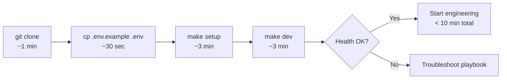

# Sprint 0 — Engineering Setup

**Epic:** LEX-E0 — Engineering Setup  
**Duration:** 1 week (recommended) · max 2 weeks  
**Target Velocity:** 34 story points  
**Sprint Goal:** Every engineer can **clone the repository and start developing in under 10 minutes** — engineering scaffold only, **no business code**.

---

## North Star

```bash
git clone git@github.com:abhishekthatguy/luxflow-ai.git && cd luxflow-ai
cp .env.example .env
make setup && make dev
# → API :8000/health 200 · Web :3000 loads · under 10 minutes on a standard laptop
```

| In Sprint 0 | Out of Sprint 0 (later sprints) |
|-------------|----------------------------------|
| Monorepo folders, Makefile, Docker Compose (core) | Auth, JWT, RBAC, matter walls |
| Empty FastAPI shell — `GET /health` only | Domain models, aggregates, business rules |
| Empty Next.js shell — status page only | Case/client/document APIs or UI |
| `.env.example`, setup scripts, README quickstart | Alembic business schema migrations |
| Minimal CI (lint + typecheck on empty apps) | Full platform stack (n8n, Celery, MinIO, Grafana) |
| Pre-commit hooks | RFC-002 implementation |

**Documentation** (146+ docs, `.ai/`, design system) is **already complete** — Sprint 0 does not re-review docs unless a setup gap is found.

---

## 10-Minute Quickstart Flow



**Option B (active):** Sprint 0 **planning and docs** are complete. **LEX-001–010 implementation runs as Sprint 1 Phase 1** (Week 1), then LEX-104+ as Phase 2 (Week 2).

Timed verification: [10-minute quickstart](../14-playbooks/10-minute-quickstart.md) — required before Phase 2 platform work.

---

## Sprint Ceremonies (lightweight)

| Ceremony | When | Duration | Output |
|----------|------|----------|--------|
| Sprint Planning | Day 1 AM | 1h | Sprint 0 backlog committed |
| Pair setup session | Day 1 PM | 1h | Every engineer completes quickstart once |
| Mid-sprint check | Day 3 | 30m | `make setup && make dev` works for all |
| Sprint Review | Last day AM | 30m | Live 10-minute demo from clean clone |
| Retro | Last day PM | 30m | Setup friction logged |

No stakeholder doc-review sessions — docs were delivered pre-Sprint 0.

---

## Stories

### Story LEX-001 — Monorepo scaffold (5 SP)

**As a** developer  
**I want** the repository folder structure created per architecture docs  
**So that** every layer has a defined home before code lands

**Acceptance Criteria:**
- [ ] Structure matches [`docs/folder-structure.md`](../folder-structure.md) — top-level dirs only (no business modules populated)
- [ ] `apps/web`, `apps/api`, `services/` (empty `.gitkeep` or README per context), `workers/`, `packages/`, `infra/`, `n8n/`, `scripts/`, `tests/` exist
- [ ] Root `Makefile` with targets: `setup`, `dev`, `down`, `logs`, `ps`, `lint`, `test`
- [ ] Root `.env.example` — all vars documented, no secret values
- [ ] `.gitignore` covers `.env`, `node_modules`, `__pycache__`, `.venv`, Docker volumes

**Labels:** `sprint-0`, `infra`  
**Component:** `infra`

---

### Story LEX-002 — FastAPI application shell (5 SP)

**As a** backend developer  
**I want** a minimal FastAPI app with health check only  
**So that** I can extend the API in Sprint 1+ without rework

**Acceptance Criteria:**
- [ ] `apps/api` with `main.py`, `config.py` (pydantic-settings)
- [ ] **Only route:** `GET /health` → `{ "status": "ok", "service": "api" }`
- [ ] **No** auth middleware, **no** domain routes, **no** database models
- [ ] CORS configured for local web origin
- [ ] Correlation ID middleware stub (reads/generates `X-Correlation-ID`, attaches to request state)
- [ ] Structured JSON logging stub (single line per request)
- [ ] `pyproject.toml`: FastAPI, uvicorn, pydantic-settings, ruff, mypy
- [ ] Dockerfile multi-stage (dev + prod stages)
- [ ] `GET /health` responds in Docker Compose

**Labels:** `sprint-0`, `backend`  
**Component:** `backend`

---

### Story LEX-003 — Next.js application shell (5 SP)

**As a** frontend developer  
**I want** a minimal Next.js App Router app  
**So that** I can add UI in later sprints without rework

**Acceptance Criteria:**
- [ ] Next.js 14+ App Router — single page at `/` showing "LexFlow AI — dev environment"
- [ ] Displays API health status (fetch `NEXT_PUBLIC_API_URL/health`) — proves web → api connectivity
- [ ] Tailwind + ShadCN initialized; design tokens imported from docs (no feature screens)
- [ ] **No** auth pages with logic, **no** dashboard routes, **no** business components
- [ ] `Dockerfile` for production build
- [ ] ESLint + Prettier + tsc configured

**Labels:** `sprint-0`, `frontend`  
**Component:** `frontend`

---

### Story LEX-004 — Docker Compose core stack (8 SP)

**As a** developer  
**I want** `make dev` to start api, web, postgres, and redis  
**So that** local development works without installing databases locally

**Acceptance Criteria:**
- [ ] `docker-compose.yml` services: `api`, `web`, `postgres` (16 + pgvector), `redis`
- [ ] Healthchecks defined for all four services
- [ ] `make dev` — detached up; `make down` — tear down; `make ps` — status
- [ ] `make logs api` / `make logs web` work
- [ ] Postgres reachable from api container; Redis reachable (connection test in `/health` optional: `"redis": "ok"`)
- [ ] **Not in Sprint 0:** rabbitmq, n8n, minio, worker, otel, grafana (Sprint 1)
- [ ] Documented in [`10-minute-quickstart.md`](../14-playbooks/10-minute-quickstart.md)

**Labels:** `sprint-0`, `infra`  
**Component:** `infra`

---

### Story LEX-005 — Setup script & 10-minute quickstart doc (5 SP)

**As a** new engineer  
**I want** a single documented path from clone to running stack  
**So that** I am productive in under 10 minutes

**Acceptance Criteria:**
- [ ] `scripts/setup.sh` (or `make setup`) installs hooks, validates Docker, copies `.env` if missing
- [ ] [`docs/14-playbooks/10-minute-quickstart.md`](../14-playbooks/10-minute-quickstart.md) — step-by-step with expected timings
- [ ] Root `README.md` — **Quick Start (10 min)** section at top with exact commands
- [ ] Troubleshooting section: Docker not running, port conflicts, ARM Mac notes
- [ ] `scripts/verify/quickstart.sh` — exits 0 when api + web healthy (used in CI smoke)

**Labels:** `sprint-0`, `docs`, `infra`  
**Component:** `infra`

---

### Story LEX-006 — Shared packages scaffold (3 SP)

**As a** developer  
**I want** `packages/shared` and `packages/ui` initialized  
**So that** cross-app types and components have a home

**Acceptance Criteria:**
- [ ] `packages/shared` — TypeScript config, exports `ApiHealthResponse` type matching `/health`
- [ ] `packages/ui` — ShadCN re-export stub (Button only)
- [ ] npm/pnpm workspaces configured at root
- [ ] Web app imports one symbol from each package (proves linking)

**Labels:** `sprint-0`, `frontend`  
**Component:** `frontend`

---

### Story LEX-007 — Pre-commit & editor config (2 SP)

**As a** developer  
**I want** consistent formatting enforced locally  
**So that** CI surprises are minimized

**Acceptance Criteria:**
- [ ] `.pre-commit-config.yaml`: ruff (api), eslint + prettier (web), trailing whitespace, gitleaks
- [ ] `.editorconfig` at root
- [ ] `make setup` installs pre-commit hooks
- [ ] Hooks complete in < 15 seconds on empty project

**Labels:** `sprint-0`, `infra`  
**Component:** `infra`

---

### Story LEX-008 — Minimal GitHub Actions CI (5 SP)

**As a** team  
**I want** CI on every PR  
**So that** broken scaffold cannot merge

**Acceptance Criteria:**
- [ ] Workflow: checkout → lint api → lint web → `scripts/verify/quickstart.sh` (Compose smoke in CI)
- [ ] Branch protection on `main`: require CI pass
- [ ] CI completes < 8 minutes
- [ ] **No** business logic tests — scaffold smoke only
- [ ] Badge in README

**Labels:** `sprint-0`, `infra`, `ci`  
**Component:** `infra`

---

### Story LEX-009 — GitHub & access provisioning (3 SP)

**As a** DevOps engineer  
**I want** repo access and branch rules configured  
**So that** the team can push Sprint 0 work safely

**Acceptance Criteria:**
- [ ] GitHub repo `abhishekthatguy/luxflow-ai` — team write access
- [ ] Branch protection: `main` requires PR + CI
- [ ] Issue templates and PR template linked (already in repo)
- [ ] No secrets in repo — gitleaks clean
- [ ] `.env.example` documents all vars; `.env` gitignored

**Labels:** `sprint-0`, `infra`  
**Component:** `infra`

---

### Story LEX-010 — 10-minute verification & sign-off (3 SP)

**As a** tech lead  
**I want** timed verification on a clean machine  
**So that** we prove the 10-minute goal is real

**Acceptance Criteria:**
- [ ] 3 engineers run quickstart independently — all under 10 minutes (document timings)
- [ ] Results recorded in `docs/17-sprint-planning/sprint-0-deliverables/quickstart-timings.md`
- [ ] Friction items filed as Sprint 1 chores if not fixed in Sprint 0
- [ ] Tech lead sign-off: **Sprint 0 complete**

**Labels:** `sprint-0`, `infra`  
**Component:** `infra`

---

## Sprint 0 Exit Criteria

| # | Criterion | Verify |
|---|-----------|--------|
| 1 | Clone → `make setup` → `make dev` in **< 10 min** (cached Docker images OK) | [10-minute-quickstart.md](../14-playbooks/10-minute-quickstart.md) |
| 2 | `GET http://localhost:8000/health` → 200 | curl |
| 3 | `GET http://localhost:3000` → 200, shows API health | browser |
| 4 | **Zero business code** — no auth, domain, migrations with tables, n8n workflows | code review |
| 5 | CI green on `main` | GitHub Actions |
| 6 | All engineers completed quickstart once | standup attestation |

```bash
make verify-quickstart   # exits 0 — api + web healthy
```

---

## What Moves to Sprint 1

Sprint 1 adds the **full platform stack** and [Platform Readiness Gate](../14-playbooks/platform-readiness-gate.md):

- RabbitMQ, Celery worker, n8n (internal), MinIO, OTel Collector, Grafana
- Alembic schema baseline (empty schemas only)
- Staging ECS deploy
- `make verify-platform` (all 10 checks)

Sprint 0 is intentionally **thin** — optimize for speed to first commit, not full infra parity.

---

## Demo (Sprint Review)

Live demo — **no slides**:

1. Fresh terminal → clone (timer visible)
2. `cp .env.example .env && make setup && make dev`
3. Open `:3000` — status page green
4. `curl :8000/health` — 200
5. Show repo tree — empty `services/`, no domain code
6. Total elapsed time **< 10 minutes**

---

## Risks

| Risk | Mitigation |
|------|------------|
| First `docker pull` exceeds 10 min | Document "first run" vs "repeat run"; pre-pull images in setup script |
| ARM Mac build failures | Multi-arch Dockerfiles; test on M-series in LEX-010 |
| Engineers skip Docker | `make setup` fails fast with clear message |
| Scope creep into auth/domain | Story AC explicitly forbid business routes |

---

## References

- [10-Minute Quickstart](../14-playbooks/10-minute-quickstart.md)
- [Folder Structure](../folder-structure.md)
- [Local Dev Setup](../14-playbooks/local-dev-setup.md) — full stack (Sprint 1+)
- [Platform Readiness Gate](../14-playbooks/platform-readiness-gate.md) — Sprint 1 exit
- [Sprint 1 — Platform Infrastructure](./sprint-01-infrastructure.md)
