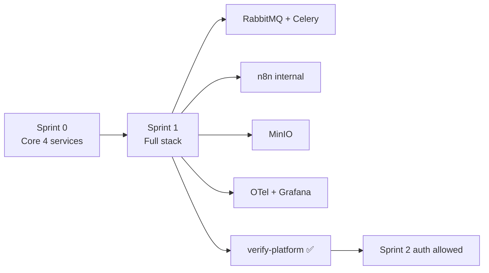

# Sprint 1 — Full Platform Stack

**Epic:** LEX-E1 — Platform Infrastructure  
**Duration:** 2 weeks  
**Target Velocity:** 42 story points  
**Sprint Goal:** Extend the Sprint 0 core stack to the **full platform** and pass the [Platform Readiness Gate](../14-playbooks/platform-readiness-gate.md) — still **no business code**.

**Depends on:** [Sprint 0 exit criteria](./sprint-00-documentation.md) — 10-minute quickstart passing

> Sprint 0 delivers clone → `make dev` in < 10 min (api, web, postgres, redis).  
> Sprint 1 adds RabbitMQ, Celery, n8n, MinIO, observability, Alembic baseline, staging deploy, and `make verify-platform`.

---

## Sprint Goal Diagram



---

## Stories

### Story LEX-104 — Docker Compose full stack (8 SP)

**As a** developer  
**I want** the remaining platform services in Compose  
**So that** async, storage, and orchestration paths are available locally

**Acceptance Criteria:**
- [ ] Add to existing Compose: `rabbitmq`, `worker`, `n8n` (internal only), `minio`, `otel-collector`, `grafana`
- [ ] `make dev-full` or extended `make dev` starts all services
- [ ] RabbitMQ management UI on `:15672` (dev only)
- [ ] n8n **not** on public port
- [ ] Documented in [`local-dev-setup.md`](../14-playbooks/local-dev-setup.md)

**Labels:** `sprint-1`, `infra`  
**Component:** `infra`

---

### Story LEX-105 — Alembic migration baseline (3 SP)

**As a** backend developer  
**I want** Alembic configured with empty schema baseline  
**So that** Sprint 2 identity migrations apply cleanly

**Acceptance Criteria:**
- [ ] Alembic in `apps/api/alembic/`
- [ ] Baseline creates empty schemas: `identity`, `cases`, `documents`, `workflows`, `ai`, `audit`, `shared`
- [ ] **No business tables** in Sprint 1
- [ ] `make migrate` / `make migrate-down`

**Labels:** `sprint-1`, `backend`, `database`  
**Component:** `backend`

---

### Story LEX-106 — Celery worker shell (5 SP)

**Acceptance Criteria:**
- [ ] `workers/celery/app.py` with Celery factory + RabbitMQ broker
- [ ] `ping` task returns `pong`
- [ ] Worker in Compose; correlation ID in logs

**Labels:** `sprint-1`, `backend`  
**Component:** `backend`

---

### Story LEX-107 — CI pipeline expansion (5 SP)

**As a** team  
**I want** full CI including integration smoke and container scan  
**So that** platform regressions cannot merge

**Acceptance Criteria:**
- [ ] Extend Sprint 0 CI: integration smoke, Docker image build, Trivy (block CRITICAL)
- [ ] `make verify-platform` in CI (or subset on PR, full on main)
- [ ] CI < 12 minutes

**Labels:** `sprint-1`, `infra`, `ci`  
**Component:** `infra`

---

### Story LEX-111 — Observability local stack (Grafana + OTel) (5 SP)

**Acceptance Criteria:**
- [ ] OTel Collector OTLP `:4317`; Grafana + Tempo on `:3001`
- [ ] API + worker export spans
- [ ] `make verify-traces` passes

**Labels:** `sprint-1`, `infra`, `observability`  
**Component:** `infra`

---

### Story LEX-112 — Platform integration smoke tests (8 SP)

**Acceptance Criteria:**
- [ ] `make verify-platform` — all 10 checks from [platform-readiness-gate.md](../14-playbooks/platform-readiness-gate.md)
- [ ] Scripts in `scripts/verify/`; tests in `tests/integration/`
- [ ] **No business logic** in tests — infrastructure proof only

**Labels:** `sprint-1`, `infra`, `backend`  
**Component:** `infra`

---

### Story LEX-110 — Staging ECS deploy (empty apps) (7 SP)

**Acceptance Criteria:**
- [ ] Terraform stubs; ECR for web + api
- [ ] ECS Fargate on merge to `main`; ALB `/health` 200

**Labels:** `sprint-1`, `infra`, `aws`  
**Component:** `infra`

---

### Story LEX-113 — App shell hardening (3 SP)

**As a** developer  
**I want** Sprint 0 shells extended with platform middleware stubs  
**So that** Sprint 2 plugs in auth without restructuring

**Acceptance Criteria:**
- [ ] API: OpenAPI at `/api/v1/docs` (dev); SQLAlchemy + Alembic deps added; internal webhook route stub (returns 501)
- [ ] Web: `(auth)` and `(dashboard)` route groups — **empty layouts only**, no auth logic
- [ ] Still **no business routes or domain code**

**Labels:** `sprint-1`, `backend`, `frontend`  
**Component:** `backend`

---

## Moved to Sprint 0 (do not re-implement)

| Old ID | Story | Now |
|--------|-------|-----|
| LEX-101 | Monorepo scaffold | LEX-001 |
| LEX-102 | FastAPI shell | LEX-002 |
| LEX-103 | Next.js shell | LEX-003 |
| LEX-104 (core) | Compose core four | LEX-004 |
| LEX-108 | Pre-commit | LEX-007 |
| LEX-109 | Packages | LEX-006 |

---

## Sprint 1 Exit Criteria

### Platform Readiness Gate (required before Sprint 2)

All 10 checks in [`platform-readiness-gate.md`](../14-playbooks/platform-readiness-gate.md) — see Sprint 1 doc for table.

```bash
make verify-platform   # must exit 0
```

### Additional

- [ ] Full stack `make dev` works on top of Sprint 0 quickstart
- [ ] Staging ECS `/health` 200
- [ ] Still **zero business code**

---

## Demo

1. Sprint 0 quickstart recap (< 10 min)
2. `make dev-full` — show all containers
3. `make verify-platform` live
4. Grafana trace for sample request
5. Staging URLs

---

## References

- [Sprint 0 — Engineering Setup](./sprint-00-documentation.md)
- [10-Minute Quickstart](../14-playbooks/10-minute-quickstart.md)
- [Platform Readiness Gate](../14-playbooks/platform-readiness-gate.md)
