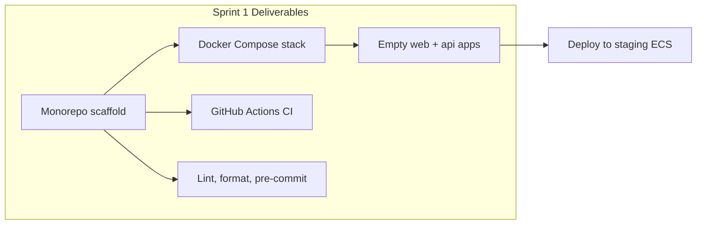

# Sprint 1 — Platform Infrastructure

**Epic:** LEX-E1 — Platform Infrastructure  
**Duration:** 2 weeks  
**Target Velocity:** 55 story points  
**Sprint Goal:** Deliver a working monorepo with Docker Compose local stack, CI/CD pipeline, empty deployable apps, and developer tooling so the team can run `make dev` and merge with confidence.

**Depends on:** Sprint 0 exit criteria met

---

## Sprint Goal Diagram

---

## Stories

### Story LEX-101 — Monorepo scaffold (8 SP)

**As a** developer  
**I want** the monorepo folder structure scaffolded per architecture docs  
**So that** all code has a consistent home

**Acceptance Criteria:**
- [ ] Folder structure matches [`docs/folder-structure.md`](../folder-structure.md) / [`.ai/rules/folder-structure.md`](../../.ai/rules/folder-structure.md)
- [ ] `apps/web`, `apps/api`, `services/`, `workers/`, `packages/`, `infra/`, `n8n/` created
- [ ] Root `Makefile` with `setup`, `dev`, `test`, `lint` targets
- [ ] `.env.example` with all required vars documented (no values)
- [ ] Root `README.md` updated with dev quickstart

**Labels:** `sprint-1`, `infra`  
**Component:** `infra`

---

### Story LEX-102 — FastAPI application shell (5 SP)

**As a** backend developer  
**I want** an empty FastAPI app with middleware stubs  
**So that** Sprint 2 can add auth and routes

**Acceptance Criteria:**
- [ ] `apps/api` with `main.py`, config (pydantic-settings), health endpoint `GET /health`
- [ ] Middleware placeholders: correlation ID, CORS, request logging
- [ ] OpenAPI at `/api/v1/docs` (dev only)
- [ ] Dockerfile multi-stage build
- [ ] `pyproject.toml` with FastAPI, SQLAlchemy, Alembic, Pydantic v2

**Labels:** `sprint-1`, `backend`  
**Component:** `backend`

---

### Story LEX-103 — Next.js application shell (5 SP)

**As a** frontend developer  
**I want** an empty Next.js App Router app with design tokens  
**So that** Sprint 2 can add auth UI

**Acceptance Criteria:**
- [ ] Next.js 14+ App Router with `(auth)` and `(dashboard)` route groups
- [ ] Tailwind + ShadCN initialized; design tokens from [`docs/16-design-system/foundation/`](../16-design-system/foundation/design-tokens.md)
- [ ] App shell layout (header, sidebar placeholder) per design system
- [ ] Dockerfile for production build
- [ ] Health/status page at `/`

**Labels:** `sprint-1`, `frontend`  
**Component:** `frontend`

---

### Story LEX-104 — Docker Compose local stack (8 SP)

**As a** developer  
**I want** `docker compose up` to start the full local stack  
**So that** I can develop without manual service installation

**Acceptance Criteria:**
- [ ] Services: web, api, postgres (pgvector), redis, rabbitmq, n8n (internal network), worker, minio
- [ ] PostgreSQL 16 with pgvector extension enabled
- [ ] RabbitMQ management UI on `:15672` (dev only)
- [ ] n8n not exposed on public port (internal Docker network only)
- [ ] `make dev` starts stack; `make down` tears down
- [ ] Documented in [`docs/14-playbooks/local-dev-setup.md`](../14-playbooks/local-dev-setup.md)

**Labels:** `sprint-1`, `infra`  
**Component:** `infra`

---

### Story LEX-105 — Alembic migration baseline (3 SP)

**As a** backend developer  
**I want** Alembic configured with empty baseline migration  
**So that** Sprint 2 schema migrations apply cleanly

**Acceptance Criteria:**
- [ ] Alembic initialized in `apps/api/alembic/`
- [ ] Baseline migration creates schemas: `identity`, `cases`, `documents`, `workflows`, `ai`, `audit`, `shared`
- [ ] `make migrate` runs upgrades; `make migrate-down` runs downgrade
- [ ] Migration runs in Docker Compose on api startup (optional flag)

**Labels:** `sprint-1`, `backend`, `database`  
**Component:** `backend`

---

### Story LEX-106 — Celery worker shell (5 SP)

**As a** backend developer  
**I want** Celery app configured with RabbitMQ broker  
**So that** Sprint 4 async tasks have a worker ready

**Acceptance Criteria:**
- [ ] `workers/celery/app.py` with Celery factory
- [ ] RabbitMQ connection from env vars
- [ ] Health check task `ping` returns pong
- [ ] Worker container in Docker Compose
- [ ] Structured logging with correlation ID propagation stub

**Labels:** `sprint-1`, `backend`  
**Component:** `backend`

---

### Story LEX-107 — GitHub Actions CI pipeline (8 SP)

**As a** team  
**I want** CI on every PR to `main`  
**So that** broken code cannot merge

**Acceptance Criteria:**
- [ ] Workflow: lint → typecheck → unit test → build Docker images
- [ ] Python: ruff, mypy; TypeScript: eslint, tsc
- [ ] Branch protection requires CI pass + 1 approval
- [ ] Trivy container scan (block CRITICAL)
- [ ] CI completes < 10 minutes for empty apps

**Labels:** `sprint-1`, `infra`, `ci`  
**Component:** `infra`

---

### Story LEX-108 — Pre-commit hooks & code quality tooling (3 SP)

**As a** developer  
**I want** pre-commit hooks for lint and format  
**So that** CI failures are caught locally

**Acceptance Criteria:**
- [ ] pre-commit config: ruff, mypy (api), eslint + prettier (web)
- [ ] Commit message lint (conventional commits optional warning)
- [ ] Documented in [`.ai/rules/git-workflow.md`](../../.ai/rules/git-workflow.md)

**Labels:** `sprint-1`, `infra`  
**Component:** `infra`

---

### Story LEX-109 — Shared packages scaffold (3 SP)

**As a** frontend developer  
**I want** `packages/shared` and `packages/ui` initialized  
**So that** types and components can be shared

**Acceptance Criteria:**
- [ ] `packages/shared` with TypeScript config
- [ ] `packages/ui` placeholder with ShadCN export pattern
- [ ] Workspace linking in root package.json (pnpm or npm workspaces)

**Labels:** `sprint-1`, `frontend`  
**Component:** `frontend`

---

### Story LEX-110 — Staging ECS deploy (empty apps) (7 SP)

**As a** DevOps engineer  
**I want** web + api deployed to staging ECS  
**So that** we validate AWS pipeline before feature work

**Acceptance Criteria:**
- [ ] Terraform modules stubbed for dev/staging ([`docs/09-deployment/`](../09-deployment/README.md))
- [ ] ECR repositories for web and api
- [ ] ECS Fargate services deploy on merge to `main`
- [ ] ALB health checks pass for `/health`
- [ ] Staging URL documented (internal/VPN if required)

**Labels:** `sprint-1`, `infra`, `aws`  
**Component:** `infra`

---

## Sprint 1 Exit Criteria

- [ ] `make dev` brings up full stack locally
- [ ] `GET /health` returns 200 on api (local + staging)
- [ ] Next.js app loads in browser (local + staging)
- [ ] CI green on `main`
- [ ] No secrets in repository
- [ ] Team can clone, setup, and run in < 30 minutes

---

## Demo

1. Live `make dev` from clean clone
2. Show staging URLs loading empty apps
3. Show CI pipeline on sample PR
4. Walk through monorepo structure

---

## References

- [Deployment Architecture](../09-deployment/README.md)
- [Docker Containers](../09-deployment/docker-containers.md)
- [CI/CD Pipeline](../09-deployment/cicd-pipeline.md)
- [Local Dev Playbook](../14-playbooks/local-dev-setup.md)
