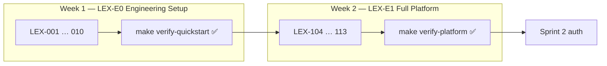

# Sprint 1 — Engineering Setup + Full Platform

**Epics:** LEX-E0 (Phase 1) + LEX-E1 (Phase 2)  
**Duration:** 2 weeks  
**Target Velocity:** ~76 story points (34 + 42)  
**Sprint Goal:** **Phase 1** — clone → `make dev` in < 10 min (no business code). **Phase 2** — full platform stack + [Platform Readiness Gate](../14-playbooks/platform-readiness-gate.md).

**Option B:** Sprint 0 planning/docs are committed; **LEX-001–010 ship in Sprint 1 Week 1** before RabbitMQ/n8n/MinIO work.

---

## Phase Overview

| Phase | Stories | Exit |
|-------|---------|------|
| **1** | LEX-001 – LEX-010 | [10-minute quickstart](../14-playbooks/10-minute-quickstart.md) passes |
| **2** | LEX-104 – LEX-113 | [Platform readiness gate](../14-playbooks/platform-readiness-gate.md) passes |

---

## Phase 1 — Engineering Setup (LEX-001 – LEX-010)

> Spec: [Sprint 0 stories](./sprint-00-documentation.md#stories) — implemented in Sprint 1 Week 1.

| Story | Title | SP |
|-------|-------|-----|
| LEX-001 | Monorepo scaffold | 5 |
| LEX-002 | FastAPI shell — `/health` only | 5 |
| LEX-003 | Next.js status page | 5 |
| LEX-004 | Docker Compose core (api, web, postgres, redis) | 8 |
| LEX-005 | Setup script + 10-minute quickstart | 5 |
| LEX-006 | packages/shared + packages/ui | 3 |
| LEX-007 | Pre-commit + editorconfig | 2 |
| LEX-008 | Minimal CI | 5 |
| LEX-009 | GitHub access + branch protection | 3 |
| LEX-010 | Timed verification sign-off | 3 |

**Phase 1 gate:** `make verify-quickstart` exits 0 — **required before starting Phase 2 stories**.

---

## Phase 2 — Full Platform Stack (LEX-104+)

### Story LEX-104 — Docker Compose full stack (8 SP)

**Acceptance Criteria:**
- [ ] Add to existing Compose: `rabbitmq`, `worker`, `n8n` (internal only), `minio`, `otel-collector`, `grafana`
- [ ] `make dev-full` or extended `make dev` starts all services
- [ ] RabbitMQ management UI on `:15672` (dev only)
- [ ] n8n **not** on public port
- [ ] Documented in [`local-dev-setup.md`](../14-playbooks/local-dev-setup.md)

**Labels:** `sprint-1`, `infra`  
**Component:** `infra`

---

### Story LEX-105 — Alembic migration baseline (3 SP)

**Acceptance Criteria:**
- [ ] Alembic in `apps/api/alembic/`
- [ ] Baseline creates empty schemas: `identity`, `cases`, `documents`, `workflows`, `ai`, `audit`, `shared`
- [ ] **No business tables** in Sprint 1
- [ ] `make migrate` / `make migrate-down`

**Labels:** `sprint-1`, `backend`, `database`  
**Component:** `backend`

---

### Story LEX-106 — Celery worker shell (5 SP)

**Acceptance Criteria:**
- [ ] `workers/celery/app.py` with Celery factory + RabbitMQ broker
- [ ] `ping` task returns `pong`
- [ ] Worker in Compose; correlation ID in logs

**Labels:** `sprint-1`, `backend`  
**Component:** `backend`

---

### Story LEX-107 — CI pipeline expansion (5 SP)

**Acceptance Criteria:**
- [ ] Extend Phase 1 CI: integration smoke, Docker image build, Trivy (block CRITICAL)
- [ ] `make verify-platform` in CI (or subset on PR, full on main)
- [ ] CI < 12 minutes

**Labels:** `sprint-1`, `infra`, `ci`  
**Component:** `infra`

---

### Story LEX-111 — Observability local stack (5 SP)

**Acceptance Criteria:**
- [ ] OTel Collector OTLP `:4317`; Grafana + Tempo on `:3001`
- [ ] API + worker export spans
- [ ] `make verify-traces` passes

**Labels:** `sprint-1`, `infra`, `observability`  
**Component:** `infra`

---

### Story LEX-112 — Platform integration smoke tests (8 SP)

**Acceptance Criteria:**
- [ ] `make verify-platform` — all 10 checks from [platform-readiness-gate.md](../14-playbooks/platform-readiness-gate.md)
- [ ] Scripts in `scripts/verify/`; tests in `tests/integration/`
- [ ] **No business logic** in tests

**Labels:** `sprint-1`, `infra`, `backend`  
**Component:** `infra`

---

### Story LEX-110 — Staging ECS deploy (empty apps) (7 SP)

**Acceptance Criteria:**
- [ ] Terraform stubs; ECR for web + api
- [ ] ECS Fargate on merge to `main`; ALB `/health` 200

**Labels:** `sprint-1`, `infra`, `aws`  
**Component:** `infra`

---

### Story LEX-113 — App shell hardening (3 SP)

**Acceptance Criteria:**
- [ ] API: OpenAPI at `/api/v1/docs` (dev); internal webhook stub returns 501
- [ ] Web: empty `(auth)` and `(dashboard)` route groups — no auth logic
- [ ] Still **no business routes**

**Labels:** `sprint-1`, `backend`, `frontend`  
**Component:** `backend`

---

## Sprint 1 Exit Criteria

### After Phase 1

- [ ] `make verify-quickstart` exits 0
- [ ] 3 engineer timings recorded in [quickstart-timings.md](./sprint-0-deliverables/quickstart-timings.md)

### After Phase 2 (Sprint 1 complete)

- [ ] `make verify-platform` exits 0 — all 10 [platform readiness](../14-playbooks/platform-readiness-gate.md) checks
- [ ] Staging ECS `/health` 200
- [ ] Still **zero business code**

---

## Demo

1. **Week 1:** Live 10-minute quickstart from clean clone
2. **Week 2:** `make verify-platform` + Grafana trace + staging URLs

---

## References

- [Sprint 0 spec (Phase 1 stories)](./sprint-00-documentation.md)
- [10-Minute Quickstart](../14-playbooks/10-minute-quickstart.md)
- [Platform Readiness Gate](../14-playbooks/platform-readiness-gate.md)
