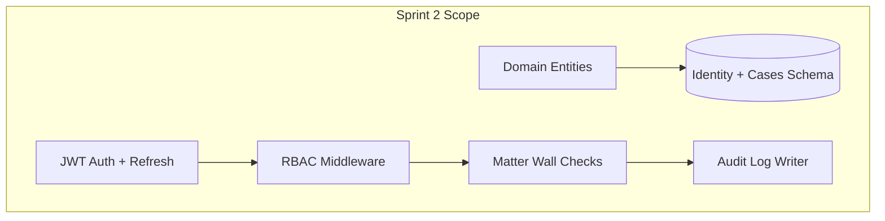

# Sprint 2 — Authentication, RBAC & Core Domain Models

**Epic:** LEX-E2 — Identity, Auth & Domain Foundation  
**Duration:** 2 weeks  
**Target Velocity:** 62 story points  
**Sprint Goal:** Users can log in with JWT, RBAC and matter walls are enforced, core domain entities exist in PostgreSQL, and seed data supports development.

**Depends on:** Sprint 1 — **Platform Readiness Gate passed** ([`platform-readiness-gate.md`](../14-playbooks/platform-readiness-gate.md)) + RFC-002 Accepted

> **Hard gate:** Do not implement JWT, RBAC, matter walls, identity schema, or domain entities until all 10 platform readiness checks pass and RFC-002 is Accepted.

---

## Architecture Focus

---

## Stories

### Story LEX-201 — Identity schema migration (5 SP)

**Acceptance Criteria:**
- [ ] Migration: `firms`, `users`, `roles`, `permissions`, `user_roles`, `role_permissions`, `refresh_tokens`
- [ ] Seed script: system roles (10 personas), default permissions
- [ ] Seed admin user for dev/staging only
- [ ] Matches [`docs/05-database/identity-schema.md`](../05-database/identity-schema.md)

**Labels:** `sprint-2`, `backend`, `database`  
**Component:** `backend`

---

### Story LEX-202 — JWT authentication API (8 SP)

**As a** user  
**I want** to log in with email/password and receive JWT tokens  
**So that** I can access the platform securely

**Acceptance Criteria:**
- [ ] `POST /api/v1/auth/login` — returns access token + sets refresh cookie
- [ ] `POST /api/v1/auth/refresh` — rotates refresh token
- [ ] `POST /api/v1/auth/logout` — revokes refresh token
- [ ] RS256 signing; keys from env/Secrets Manager stub
- [ ] Brute force lockout after 5 failures
- [ ] Integration tests for happy path + invalid credentials
- [ ] Matches [`docs/04-api/authentication.md`](../04-api/authentication.md), ADR-005

**Labels:** `sprint-2`, `backend`, `security`  
**Component:** `backend`

---

### Story LEX-203 — RBAC authorization middleware (8 SP)

**As a** platform  
**I want** RBAC enforced on every authenticated endpoint  
**So that** users only perform permitted actions

**Acceptance Criteria:**
- [ ] Permission resolution from DB/Redis cache (5 min TTL)
- [ ] `@require_permission("case:read:assigned")` decorator pattern
- [ ] Permission matrix matches [`docs/04-api/authorization-rbac.md`](../04-api/authorization-rbac.md)
- [ ] Parameterized integration tests for role matrix (Attorney, Paralegal, Client, etc.)
- [ ] 403 for missing permission (non-case resources)

**Labels:** `sprint-2`, `backend`, `security`  
**Component:** `backend`

---

### Story LEX-204 — Matter wall enforcement (8 SP)

**As a** firm  
**I want** case data hidden from non-participants  
**So that** ethical walls are maintained

**Acceptance Criteria:**
- [ ] Case-scoped endpoints return **404** for unauthorized users (ADR-007)
- [ ] `case_participants` table and repository
- [ ] Integration test matrix: participant, non-participant, ManagingPartner, Compliance Officer
- [ ] Audit log entry on denied access (`denied_matter_wall`)
- [ ] Matches [`docs/08-security/matter-walls.md`](../08-security/matter-walls.md)

**Labels:** `sprint-2`, `backend`, `security`, `matter-wall`  
**Component:** `backend`

---

### Story LEX-205 — Case & Client domain entities (5 SP)

**Acceptance Criteria:**
- [ ] Domain entities: `Case`, `Client`, `CaseParticipant` in `services/case_management/domain/`
- [ ] Value objects: `CaseNumber`, `Email`, `CaseStatus` enum
- [ ] Case status state machine enforced in domain
- [ ] Unit tests for invariants ([`docs/02-domain/case-aggregate.md`](../02-domain/case-aggregate.md))
- [ ] No framework imports in domain layer

**Labels:** `sprint-2`, `backend`  
**Component:** `backend`

---

### Story LEX-206 — Cases & Clients schema migration (5 SP)

**Acceptance Criteria:**
- [ ] Migration: `clients`, `cases`, `case_participants`, `case_timeline_events` stub
- [ ] Indexes per [`docs/05-database/cases-schema.md`](../05-database/cases-schema.md)
- [ ] `firm_id`, `version`, soft delete columns on all tables

**Labels:** `sprint-2`, `backend`, `database`  
**Component:** `backend`

---

### Story LEX-207 — Audit log infrastructure (5 SP)

**Acceptance Criteria:**
- [ ] `audit.audit_logs` table (append-only)
- [ ] Audit middleware/writer service
- [ ] Application DB role: INSERT only on audit_logs
- [ ] Logs: actor, action, resource, correlationId, IP
- [ ] Integration test: mutating API call produces audit entry

**Labels:** `sprint-2`, `backend`, `security`  
**Component:** `backend`

---

### Story LEX-208 — Transactional outbox setup (5 SP)

**Acceptance Criteria:**
- [ ] `shared.outbox_events` table
- [ ] Outbox publisher Celery beat task (poll + publish stub)
- [ ] Domain command template writes outbox event in same transaction
- [ ] ADR-006 compliance documented in code comments
- [ ] Integration test: event persisted on case create (Sprint 3 prep)

**Labels:** `sprint-2`, `backend`  
**Component:** `backend`

---

### Story LEX-209 — Login & auth UI (5 SP)

**Acceptance Criteria:**
- [ ] Login page at `/login` per design system
- [ ] Token storage: access in memory, refresh httpOnly cookie via BFF if needed
- [ ] Redirect to dashboard on success; error states for invalid credentials / locked account
- [ ] Logout clears session
- [ ] Matches [`docs/16-design-system/foundation/`](../16-design-system/foundation/design-philosophy.md)

**Labels:** `sprint-2`, `frontend`  
**Component:** `frontend`

---

### Story LEX-210 — Admin user management UI (stub) (3 SP)

**Acceptance Criteria:**
- [ ] `/admin/users` list page (SystemAdmin only)
- [ ] Create user form (email, name, role assignment)
- [ ] Wired to admin API stubs or Sprint 2 backend
- [ ] RBAC hides menu for non-admins

**Labels:** `sprint-2`, `frontend`  
**Component:** `frontend`

---

### Story LEX-211 — Auth & matter wall integration tests (5 SP)

**Acceptance Criteria:**
- [ ] Testcontainers: postgres, redis, rabbitmq
- [ ] Full auth flow integration test
- [ ] Matter wall matrix tests (non-negotiable CI gate)
- [ ] Documented in [`docs/10-testing/integration-testing.md`](../10-testing/integration-testing.md)

**Labels:** `sprint-2`, `qa`, `matter-wall`  
**Component:** `qa`

---

## Sprint 2 Exit Criteria

- [ ] Login/logout works end-to-end (UI + API)
- [ ] RBAC blocks unauthorized actions with correct status codes
- [ ] Matter wall 404 tests pass in CI
- [ ] Domain entities + migrations applied locally and staging
- [ ] Audit log written on login and permission denial
- [ ] Security review of auth PR completed

---

## Demo

1. Login as Attorney → see dashboard shell
2. Login as user without case access → 404 on case URL
3. Show audit log entries in DB
4. Show CI matter wall test suite green

---

## References

- [Authentication API](../04-api/authentication.md)
- [Authorization RBAC](../04-api/authorization-rbac.md)
- [ADR-005 JWT](../../docs/13-decisions/005-jwt-authentication.md)
- [ADR-007 Matter Walls 404](../../docs/13-decisions/007-matter-walls-404-deny.md)
