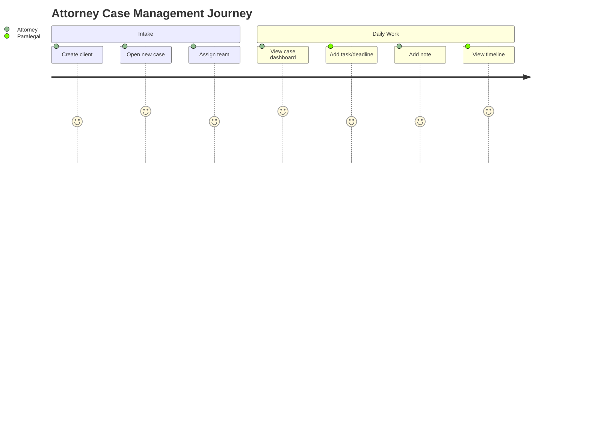

# Sprint 3 — Case Management Module

**Epic:** LEX-E3 — Case Management Module  
**Duration:** 2 weeks  
**Target Velocity:** 68 story points  
**Sprint Goal:** Deliver full Case Management — case and client CRUD, participants (matter walls), tasks, deadlines, notes, timeline — with firm dashboard UI matching design system specs.

**Depends on:** Sprint 2 — Auth, RBAC, matter walls, domain entities, cases schema

---

## User Journey (This Sprint)

---

## Stories

### Story LEX-301 — Client management API (5 SP)

**Acceptance Criteria:**
- [ ] `GET/POST/PATCH /api/v1/clients` per [`docs/04-api/endpoints-cases.md`](../04-api/endpoints-cases.md)
- [ ] `GET /api/v1/clients/{id}/cases`
- [ ] Firm-scoped queries; soft delete
- [ ] Audit log on create/update
- [ ] Integration tests + validation errors (RFC 7807)

**Labels:** `sprint-3`, `backend`  
**Component:** `backend`

---

### Story LEX-302 — Case CRUD API (8 SP)

**Acceptance Criteria:**
- [ ] `GET/POST/PATCH /api/v1/cases` with filters (status, practiceArea, leadAttorney)
- [ ] `GET/PATCH /api/v1/cases/{id}` with optimistic concurrency (ETag/version)
- [ ] Case creation emits `CaseCreated` outbox event
- [ ] Matter wall on all case endpoints
- [ ] Pagination: offset-based default

**Labels:** `sprint-3`, `backend`, `matter-wall`  
**Component:** `backend`

---

### Story LEX-303 — Case participants API (5 SP)

**Acceptance Criteria:**
- [ ] `GET/POST/DELETE /api/v1/cases/{id}/participants`
- [ ] Roles: lead, associate, paralegal, observer
- [ ] Only lead or admin can add/remove participants
- [ ] `CaseParticipantAdded` event + notification stub
- [ ] Matter wall tests for participant changes

**Labels:** `sprint-3`, `backend`, `matter-wall`  
**Component:** `backend`

---

### Story LEX-304 — Tasks API (5 SP)

**Acceptance Criteria:**
- [ ] `GET/POST/PATCH /api/v1/cases/{id}/tasks`
- [ ] Status: pending, in_progress, completed, cancelled
- [ ] Filter by assignee, status, due date
- [ ] `TaskCreated` / `TaskCompleted` events

**Labels:** `sprint-3`, `backend`  
**Component:** `backend`

---

### Story LEX-305 — Deadlines & hearings API (5 SP)

**Acceptance Criteria:**
- [ ] `GET/POST/PATCH /api/v1/cases/{id}/deadlines`
- [ ] `GET/POST /api/v1/cases/{id}/hearings`
- [ ] Deadline types: filing, discovery, statute_of_limitations, internal
- [ ] Index-friendly queries for calendar views (Sprint 4 reminders prep)

**Labels:** `sprint-3`, `backend`  
**Component:** `backend`

---

### Story LEX-306 — Notes API (3 SP)

**Acceptance Criteria:**
- [ ] `GET/POST /api/v1/cases/{id}/notes`
- [ ] Visibility: team, attorneys_only, private
- [ ] Author-only edit within 24h (configurable)

**Labels:** `sprint-3`, `backend`  
**Component:** `backend`

---

### Story LEX-307 — Case timeline API (5 SP)

**Acceptance Criteria:**
- [ ] `GET /api/v1/cases/{id}/timeline` — paginated, newest first
- [ ] Timeline events written on: case created, participant added, task completed, note added
- [ ] Denormalized `case_timeline_events` table populated by event handlers

**Labels:** `sprint-3`, `backend`  
**Component:** `backend`

---

### Story LEX-308 — Case list & create UI (8 SP)

**Acceptance Criteria:**
- [ ] `/cases` — data table with sort, filter, pagination per [`docs/16-design-system/components/data-tables.md`](../16-design-system/components/data-tables.md)
- [ ] Create case wizard (client select/create, practice area, lead attorney)
- [ ] Empty state when no cases
- [ ] Matter-scoped list (user sees only authorized cases)

**Labels:** `sprint-3`, `frontend`  
**Component:** `frontend`

---

### Story LEX-309 — Case dashboard UI (8 SP)

**Acceptance Criteria:**
- [ ] `/cases/[id]/overview` per [`docs/16-design-system/screens/case-dashboard.md`](../16-design-system/screens/case-dashboard.md)
- [ ] KPI cards: open tasks, documents count (0 until Sprint 4), pending approvals, workflows
- [ ] Deadlines widget, recent activity, participants panel
- [ ] Tab navigation: Overview, Documents (stub), Timeline, Tasks, Participants

**Labels:** `sprint-3`, `frontend`  
**Component:** `frontend`

---

### Story LEX-310 — Case timeline UI (5 SP)

**Acceptance Criteria:**
- [ ] `/cases/[id]/timeline` per [`docs/16-design-system/screens/timeline-activity-feed.md`](../16-design-system/screens/timeline-activity-feed.md)
- [ ] Filter by event type
- [ ] Infinite scroll or cursor pagination

**Labels:** `sprint-3`, `frontend`  
**Component:** `frontend`

---

### Story LEX-311 — Tasks & deadlines UI (5 SP)

**Acceptance Criteria:**
- [ ] Tasks list with assignee, due date, status pills
- [ ] Create/edit task modal
- [ ] Deadlines list with urgency colors per design system
- [ ] Add deadline form

**Labels:** `sprint-3`, `frontend`  
**Component:** `frontend`

---

### Story LEX-312 — Client management UI (3 SP)

**Acceptance Criteria:**
- [ ] `/clients` list and detail pages
- [ ] Link to client's cases
- [ ] Create client form

**Labels:** `sprint-3`, `frontend`  
**Component:** `frontend`

---

### Story LEX-313 — Case management E2E tests (3 SP)

**Acceptance Criteria:**
- [ ] Playwright: create case → add participant → add task → view timeline
- [ ] Playwright: non-participant gets 404 on case URL
- [ ] Runs in CI against staging

**Labels:** `sprint-3`, `qa`, `matter-wall`  
**Component:** `qa`

---

### Story LEX-314 — Case domain event handlers (3 SP)

**Acceptance Criteria:**
- [ ] Handlers for CaseCreated, TaskCompleted, CaseParticipantAdded
- [ ] Idempotent consumer pattern
- [ ] Timeline entries created asynchronously

**Labels:** `sprint-3`, `backend`  
**Component:** `backend`

---

## Sprint 3 Exit Criteria

- [ ] Attorney can create case, assign team, add tasks/deadlines end-to-end
- [ ] Case dashboard matches design spec (visual review)
- [ ] Matter wall E2E test passes
- [ ] 100% case mutating APIs write audit logs
- [ ] Timeline reflects case activity within 5 seconds (async)
- [ ] Phase 1 roadmap M1.2 (Case & Client Core) complete

---

## Demo

1. Paralegal creates client + case
2. Attorney adds associate to matter wall
3. Add task and deadline; show on dashboard
4. Show timeline updating
5. Attempt access as non-participant → 404 UX

---

## References

- [Case Dashboard Screen](../16-design-system/screens/case-dashboard.md)
- [Case Aggregate](../02-domain/case-aggregate.md)
- [Endpoints Cases](../04-api/endpoints-cases.md)
