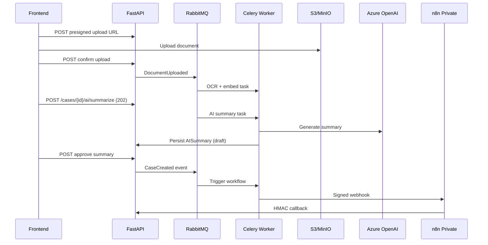

# Sprint 4 — AI Services & n8n Orchestration

**Epic:** LEX-E4 — AI Services & Workflow Orchestration  
**Duration:** 2 weeks  
**Target Velocity:** 72 story points  
**Sprint Goal:** Document upload pipeline with OCR, async AI document summary with attorney approval, private n8n deployment with first workflow, and workflow execution tracking.

**Depends on:** Sprint 3 — Case module, outbox, Celery worker, matter walls

---

## Architecture (Sprint Scope)

---

## Stories

### Story LEX-401 — Documents schema & S3 integration (5 SP)

**Acceptance Criteria:**
- [ ] Migration: `documents`, `document_versions` per [`docs/05-database/documents-schema.md`](../05-database/documents-schema.md)
- [ ] S3/MinIO adapter with presigned URL generation
- [ ] Checksum SHA256 validation on confirm

**Labels:** `sprint-4`, `backend`, `database`  
**Component:** `backend`

---

### Story LEX-402 — Document upload API (8 SP)

**Acceptance Criteria:**
- [ ] 3-step upload: initiate → presigned URL → confirm per [`docs/04-api/endpoints-documents.md`](../04-api/endpoints-documents.md)
- [ ] `GET /api/v1/cases/{id}/documents`, download presigned URL
- [ ] Matter wall enforced; virus scan stub (ClamAV hook Sprint 5)
- [ ] `DocumentUploaded` outbox event

**Labels:** `sprint-4`, `backend`, `matter-wall`  
**Component:** `backend`

---

### Story LEX-403 — OCR processing pipeline (8 SP)

**Acceptance Criteria:**
- [ ] Celery task: extract text from PDF/image (Tesseract or cloud OCR stub)
- [ ] Update `documents.ocr_text`, `ocr_status`
- [ ] Emit `DocumentProcessed` event
- [ ] Retry + DLQ on failure
- [ ] p95 processing < 10 min for 50-page PDF (staging target)

**Labels:** `sprint-4`, `backend`, `ai`  
**Component:** `backend`

---

### Story LEX-404 — AI schema & prompt registry v1 (5 SP)

**Acceptance Criteria:**
- [ ] Migration: `ai_summaries`, `prompt_templates`, `prompt_history` per [`docs/05-database/ai-schema.md`](../05-database/ai-schema.md)
- [ ] Seed `document-summary-v1` template
- [ ] Prompt registry service in `services/ai_knowledge/`

**Labels:** `sprint-4`, `backend`, `ai`, `database`  
**Component:** `backend`

---

### Story LEX-405 — Async AI summary API (8 SP)

**Acceptance Criteria:**
- [ ] `POST /api/v1/cases/{id}/ai/summarize` → 202 + jobId per ADR-004
- [ ] `GET /api/v1/jobs/{id}` status polling
- [ ] Celery task calls LLM provider (Azure OpenAI stub/dev key)
- [ ] Summary status: generating → draft → pending_approval
- [ ] PII redaction pipeline before LLM call
- [ ] `prompt_history` row written (redacted)

**Labels:** `sprint-4`, `backend`, `ai`  
**Component:** `backend`

---

### Story LEX-406 — AI summary approval API (5 SP)

**Acceptance Criteria:**
- [ ] `POST /api/v1/ai/summaries/{id}/approve` and `/reject`
- [ ] Attorney role required for approve
- [ ] `ApprovalRequested` / `SummaryApproved` events
- [ ] Audit log on approval decision

**Labels:** `sprint-4`, `backend`, `ai`  
**Component:** `backend`

---

### Story LEX-407 — n8n private deployment (5 SP)

**Acceptance Criteria:**
- [ ] n8n on ECS internal ALB (staging) OR Docker internal network (dev)
- [ ] No public DNS; security group restricts to worker/API only
- [ ] Credentials from Secrets Manager
- [ ] Matches [`docs/06-workflows/n8n-integration.md`](../06-workflows/n8n-integration.md), ADR-002

**Labels:** `sprint-4`, `infra`, `n8n`  
**Component:** `infra`

---

### Story LEX-408 — Workflow execution schema & bridge (5 SP)

**Acceptance Criteria:**
- [ ] Migration: `workflow_definitions`, `workflow_executions`, `workflow_steps`
- [ ] n8n bridge client: signed webhook invoke + callback handler
- [ ] `POST /internal/webhooks/n8n/{slug}` HMAC verification
- [ ] Public: `POST /api/v1/cases/{id}/workflows/trigger` → 202

**Labels:** `sprint-4`, `backend`, `n8n`  
**Component:** `backend`

---

### Story LEX-409 — First n8n workflow: document-upload-notify-v1 (5 SP)

**Acceptance Criteria:**
- [ ] Workflow JSON in `n8n/workflows/documents/document-upload-notify-v1.json`
- [ ] Triggered on `DocumentUploaded` → notify case team (email stub or log)
- [ ] Callback updates workflow execution status
- [ ] Promotion to staging via CI
- [ ] No business logic in n8n — routing only

**Labels:** `sprint-4`, `n8n`  
**Component:** `n8n`

---

### Story LEX-410 — Document upload & list UI (8 SP)

**Acceptance Criteria:**
- [ ] `/cases/[id]/documents` — upload drop zone, progress, list
- [ ] Document type selector, confidentiality badge
- [ ] Processing status indicator (uploading → processing → ready)
- [ ] Per [`docs/16-design-system/screens/document-viewer.md`](../16-design-system/screens/document-viewer.md) list portions

**Labels:** `sprint-4`, `frontend`  
**Component:** `frontend`

---

### Story LEX-411 — AI summary & approval UI (8 SP)

**Acceptance Criteria:**
- [ ] Request summary button on document/case
- [ ] Poll job status; show draft with AI disclaimer label
- [ ] Approve/reject dialog per [`docs/16-design-system/screens/approval-center.md`](../16-design-system/screens/approval-center.md)
- [ ] Approved summary visible to team; draft visible only to requester + attorneys

**Labels:** `sprint-4`, `frontend`, `ai`  
**Component:** `frontend`

---

### Story LEX-412 — Workflow status UI (5 SP)

**Acceptance Criteria:**
- [ ] `/cases/[id]/workflows` tab — execution list, status pills
- [ ] Manual trigger dropdown (available workflows)
- [ ] Execution detail with step timeline
- [ ] Per [`docs/16-design-system/screens/workflow-dashboard.md`](../16-design-system/screens/workflow-dashboard.md) (case-scoped subset)

**Labels:** `sprint-4`, `frontend`, `n8n`  
**Component:** `frontend`

---

### Story LEX-413 — LLM usage metering stub (2 SP)

**Acceptance Criteria:**
- [ ] Token counts stored in `prompt_history`
- [ ] Basic `llm_usage` aggregation job (daily)
- [ ] No budget hard-stop yet (Sprint 5)

**Labels:** `sprint-4`, `backend`, `ai`  
**Component:** `backend`

---

### Story LEX-414 — Sprint 4 integration & AI tests (3 SP)

**Acceptance Criteria:**
- [ ] Integration: upload → OCR → summarize → approve flow
- [ ] Integration: workflow trigger → n8n mock callback
- [ ] Matter wall on document and AI endpoints
- [ ] AI async 202 pattern tested

**Labels:** `sprint-4`, `qa`, `matter-wall`  
**Component:** `qa`

---

## Sprint 4 Exit Criteria

- [ ] Document upload → OCR → searchable text demonstrated
- [ ] AI summary async path end-to-end with attorney approval
- [ ] n8n not publicly accessible (network verification)
- [ ] First workflow executes on document upload
- [ ] No business logic in n8n workflow JSON (code review checklist)
- [ ] Phase 1 milestones M1.3, M1.4 partial complete

---

## Demo

1. Upload PDF to case → OCR completes
2. Request AI summary → poll → attorney approves
3. Show workflow execution triggered by upload
4. Show n8n internal-only URL / network isolation
5. Show prompt history audit row

---

## References

- [AI Architecture](../07-ai/README.md)
- [Workflow Orchestration](../06-workflows/README.md)
- [ADR-002 n8n Only](../13-decisions/002-n8n-orchestration-only.md)
- [ADR-004 Async AI](../13-decisions/004-async-ai-processing.md)
