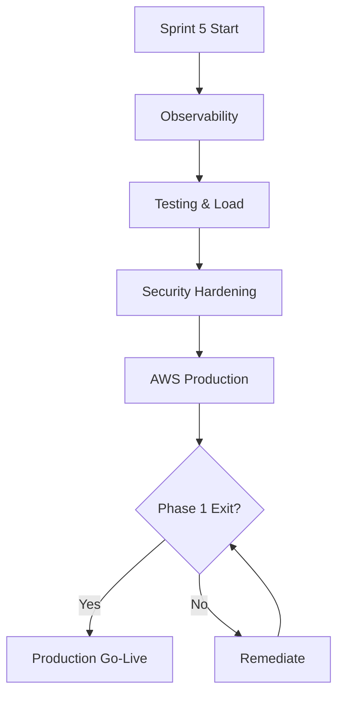

# Sprint 5 — Production Hardening, Observability & AWS Deployment

**Epic:** LEX-E5 — Production Readiness & AWS Deployment  
**Duration:** 2 weeks  
**Target Velocity:** 58 story points  
**Sprint Goal:** Production-grade observability, comprehensive test coverage, security hardening, load test baseline, and AWS production deployment with Phase 1 exit criteria met.

**Depends on:** Sprint 4 — Full MVP feature set in staging

---

## Production Readiness Checklist

---

## Stories

### Story LEX-501 — Structured logging & correlation IDs (5 SP)

**Acceptance Criteria:**
- [ ] JSON logs with correlationId, userId, firmId, caseId per [`docs/11-observability/structured-logging.md`](../11-observability/structured-logging.md)
- [ ] PII redaction in log processor
- [ ] Correlation ID propagated: API → queue → worker → n8n callback
- [ ] CloudWatch log group configured (staging + prod)

**Labels:** `sprint-5`, `infra`, `observability`  
**Component:** `infra`

---

### Story LEX-502 — OpenTelemetry tracing (5 SP)

**Acceptance Criteria:**
- [ ] OTel SDK in api and worker
- [ ] ADOT sidecar or X-Ray export
- [ ] Trace visible for: API request, Celery task, LLM call
- [ ] Per [`docs/11-observability/distributed-tracing.md`](../11-observability/distributed-tracing.md)

**Labels:** `sprint-5`, `infra`, `observability`  
**Component:** `infra`

---

### Story LEX-503 — Metrics & alerting (5 SP)

**Acceptance Criteria:**
- [ ] CloudWatch metrics: request rate, error rate, latency, queue depth
- [ ] Alarms: API 5xx > 5%, DLQ depth > 0, RDS CPU > 80%
- [ ] P1/P2 routing documented per [`docs/11-observability/metrics-alerting.md`](../11-observability/metrics-alerting.md)
- [ ] Operational dashboard stub

**Labels:** `sprint-5`, `infra`, `observability`  
**Component:** `infra`

---

### Story LEX-504 — AWS production infrastructure (8 SP)

**Acceptance Criteria:**
- [ ] Terraform: production environment per [`docs/09-deployment/aws-topology.md`](../09-deployment/aws-topology.md)
- [ ] RDS Multi-AZ, ElastiCache, Amazon MQ, S3, ECS services (web, api, worker, n8n)
- [ ] CloudFront + WAF + ALB
- [ ] Secrets Manager populated (manual ceremony)
- [ ] Zero-downtime deploy configured

**Labels:** `sprint-5`, `infra`, `aws`  
**Component:** `infra`

---

### Story LEX-505 — CI/CD production promotion gate (5 SP)

**Acceptance Criteria:**
- [ ] Manual approval gate for production deploy
- [ ] Pre-deploy: Alembic migration task, smoke tests
- [ ] Post-deploy: 15-min monitoring window per [`docs/14-playbooks/deploy-production.md`](../14-playbooks/deploy-production.md)
- [ ] Rollback procedure documented and tested in staging

**Labels:** `sprint-5`, `infra`, `ci`  
**Component:** `infra`

---

### Story LEX-506 — Security hardening (8 SP)

**Acceptance Criteria:**
- [ ] WAF rules on CloudFront
- [ ] Rate limiting on auth endpoints
- [ ] Trivy + Dependabot — zero CRITICAL open
- [ ] OWASP ZAP scan on staging — no high findings
- [ ] Matter wall penetration test — zero cross-matter access
- [ ] n8n public exposure scan — must fail (expected)

**Labels:** `sprint-5`, `security`  
**Component:** `backend`

---

### Story LEX-507 — Load test baseline (5 SP)

**Acceptance Criteria:**
- [ ] k6 scripts: 100 concurrent users, case list/read
- [ ] k6: 50 simultaneous document uploads
- [ ] Thresholds: p95 API < 500ms, error rate < 1%
- [ ] Report published per [`docs/10-testing/load-testing.md`](../10-testing/load-testing.md)

**Labels:** `sprint-5`, `qa`  
**Component:** `qa`

---

### Story LEX-508 — E2E test suite MVP (5 SP)

**Acceptance Criteria:**
- [ ] Playwright suite: login, create case, upload doc, AI summary, approve, workflow
- [ ] Runs nightly against staging
- [ ] < 15 min total runtime
- [ ] Per [`docs/10-testing/e2e-testing.md`](../10-testing/e2e-testing.md)

**Labels:** `sprint-5`, `qa`  
**Component:** `qa`

---

### Story LEX-509 — Command palette & global search (5 SP)

**Acceptance Criteria:**
- [ ] `⌘K` command palette per [`docs/16-design-system/screens/command-palette.md`](../16-design-system/screens/command-palette.md)
- [ ] Case search, quick navigation, recent cases
- [ ] Full hybrid search deferred — basic keyword search on cases/clients

**Labels:** `sprint-5`, `frontend`  
**Component:** `frontend`

---

### Story LEX-510 — Notifications (in-app + email stub) (5 SP)

**Acceptance Criteria:**
- [ ] In-app notification bell + SSE per [`docs/12-ui/real-time-updates.md`](../12-ui/real-time-updates.md)
- [ ] Email via SES for: task assigned, approval requested, deadline approaching
- [ ] `notifications` table populated by event handlers

**Labels:** `sprint-5`, `backend`, `frontend`  
**Component:** `backend`

---

### Story LEX-511 — Audit log viewer UI (3 SP)

**Acceptance Criteria:**
- [ ] `/audit` for Compliance Officer per [`docs/16-design-system/screens/audit-logs-viewer.md`](../16-design-system/screens/audit-logs-viewer.md)
- [ ] Filters: date, actor, action, case
- [ ] Cursor pagination
- [ ] Export CSV (async job stub)

**Labels:** `sprint-5`, `frontend`  
**Component:** `frontend`

---

### Story LEX-512 — Backup & DR verification (3 SP)

**Acceptance Criteria:**
- [ ] RDS automated backups enabled (35-day retention)
- [ ] PITR restore tested to staging clone
- [ ] S3 versioning enabled on document bucket
- [ ] Runbook updated per [`docs/09-deployment/disaster-recovery.md`](../09-deployment/disaster-recovery.md)

**Labels:** `sprint-5`, `infra`, `aws`  
**Component:** `infra`

---

### Story LEX-513 — Production go-live & hypercare plan (3 SP)

**Acceptance Criteria:**
- [ ] Go-live checklist completed
- [ ] 50 pilot users identified and provisioned
- [ ] Hypercare schedule: 2 weeks elevated support
- [ ] Rollback plan signed by Tech Lead + PO
- [ ] Phase 1 exit criteria validated ([`docs/01-product/roadmap.md`](../01-product/roadmap.md))

**Labels:** `sprint-5`, `planning`  
**Component:** `docs`

---

## Phase 1 Exit Criteria (Sprint 5 Gate)

From product roadmap — all must pass:

- [ ] 50 internal users onboarded with RBAC verified
- [ ] Matter wall penetration test passed
- [ ] Document upload-to-OCR < 10 min (p95)
- [ ] AI summary async path demonstrated in production
- [ ] 100% mutating API calls produce audit logs
- [ ] Platform availability ≥ 99.5% in staging (30-day) or production pilot window
- [ ] Security review — no critical findings open

---

## Demo (Go-Live Review)

1. Production URL walkthrough with Managing Partner persona
2. Observability dashboard — traces, logs, metrics
3. Load test results summary
4. Security test summary
5. Hypercare plan presentation

---

## References

- [Observability](../11-observability/README.md)
- [Disaster Recovery](../09-deployment/disaster-recovery.md)
- [Deploy Production Playbook](../14-playbooks/deploy-production.md)
- [Phase 1 Roadmap](../01-product/roadmap.md)
