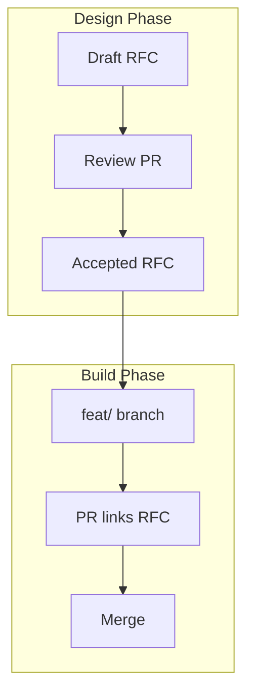

# RFC-000: RFC Process — Design Before Code

**Status:** Accepted  
**Author:** abhishek  
**Created:** 2026-07-06  
**Last Updated:** 2026-07-06  
**Reviewers:** Architecture  
**Sprint / Epic:** Sprint 0 — Documentation  
**Related ADRs:** All existing ADRs inform RFC constraints  
**Jira Epic:** N/A

---

## Summary

LexFlow AI adopts a **Request for Comments (RFC)** process: every major feature is designed, reviewed, and accepted in writing **before implementation begins**. This meta-RFC establishes that culture as a first-class engineering practice.

---

## Problem Statement

Legal technology systems fail expensively when teams:

- Start coding from underspecified tickets
- Discover matter-wall or compliance gaps mid-sprint
- Lack a durable record of *why* a feature behaves a certain way
- Conflate feature design with irreversible architecture decisions

Pre-implementation documentation exists (`docs/01–17`), but without an **RFC gate**, sprint work can drift from agreed design.

---

## Goals

- [ ] Every major feature has an Accepted RFC before Sprint N engineering starts
- [ ] Clear separation between **RFC** (what to build) and **ADR** (architectural binding choices)
- [ ] PRs reference RFC numbers; deviations are documented
- [ ] Onboarding engineers can read RFCs to understand feature intent

## Non-Goals

- RFCs for one-line bug fixes or dependency bumps
- Replacing ADRs — architecture decisions remain in `docs/13-decisions/`
- Live workshop-only design with no written artifact

---

## Proposed Solution

### Process

See full process: [README.md](./README.md)

### Governance

| Role | Responsibility |
|------|----------------|
| **Author** | Draft RFC, respond to comments, update index |
| **Tech lead** | Accept RFC; ensure ADR fork resolved |
| **Product owner** | Validate goals, non-goals, success metrics |
| **Security reviewer** | Required for auth, matter walls, PII, client portal |

### Sprint Gate

From Sprint 1 onward, epics in [17-sprint-planning](../17-sprint-planning/README.md) require **Accepted** RFCs before stories enter *In Progress*.

---

## Alternatives Considered

| Option | Pros | Cons | Decision |
|--------|------|------|----------|
| Tickets only | Fast start | Rework, tacit knowledge | **Rejected** |
| ADRs only | Good for architecture | Wrong granularity for features | **Rejected** |
| RFC + ADR | Right tool per concern | Two processes | **Accepted** |
| Design docs in Notion | Familiar | Not versioned with code | **Rejected** |

---

## Success Metrics

| Metric | Target |
|--------|--------|
| Major features with Accepted RFC before code | 100% |
| PRs referencing RFC for covered features | 100% |
| RFC → implementation rework rate | < 15% story point churn |

---

## Implementation Plan

| Phase | Deliverable | Status |
|-------|-------------|--------|
| 1 | `docs/18-rfc/` process + template | Done |
| 2 | `.ai/handbook/rfc-process.md` + task prompt | Done |
| 3 | Update DoR, lifecycle, sprint planning | Done |
| 4 | Draft RFC-001 … RFC-005 before Sprint 1 | Planned |
| 5 | CI RFC reference lint (optional) | Future |

---

## Open Questions

| # | Question | Resolution |
|---|----------|------------|
| 1 | Mandatory security reviewer for all RFCs? | Only security-sensitive (see README) |
| 2 | Who owns RFC index updates? | RFC author on acceptance |

---

## References

- [README.md](./README.md) — full RFC process
- [_template.md](./_template.md) — RFC template
- [13-decisions/README.md](../13-decisions/README.md) — ADR process
- [development-standards.md](../development-standards.md)
