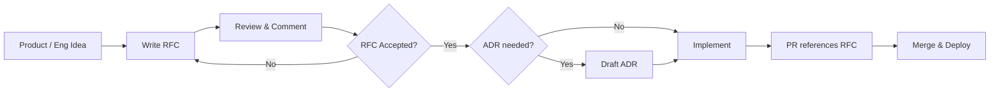
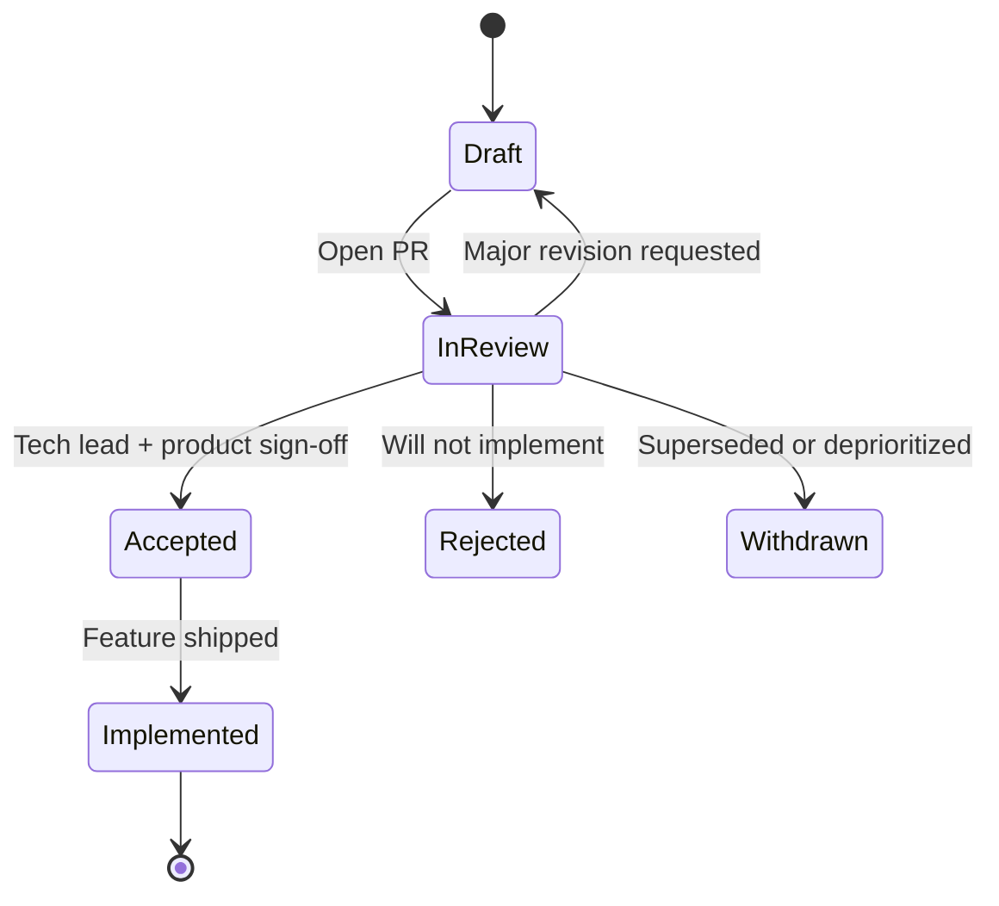

# Request for Comments (RFC)

**LexFlow AI** — Feature Design Before Implementation  
**Version:** 1.0  
**Status:** Accepted  
**Last Updated:** 2026-07-06

---

## Purpose

LexFlow AI treats **every major feature as an RFC before a single line of production code is written**. RFCs force explicit design, cross-functional review, and a durable record of *why* a feature exists and *how* it should behave — not just what was shipped.

This is a **differentiator**: most projects jump from ticket to PR. We jump from problem → RFC → accepted design → implementation.

---

## RFC vs ADR

| | **RFC** (`docs/18-rfc/`) | **ADR** (`docs/13-decisions/`) |
|---|--------------------------|--------------------------------|
| **Question** | *What are we building and how should it behave?* | *Which architectural option do we bind to?* |
| **Scope** | Features, modules, API surfaces, UX flows, integrations | Cross-cutting, hard-to-reverse architecture |
| **Timing** | **Before** implementation | During RFC review or when a binding choice emerges |
| **Audience** | Product, engineering, design, security, legal ops | Architects, tech leads, senior engineers |
| **Lifecycle** | Draft → Review → Accepted → Implemented | Proposed → Accepted → Superseded |
| **Immutability** | Accepted RFCs are amended via superseding RFC | Accepted ADRs are superseded by new ADR |



**Rule:** If an RFC reveals a binding architectural fork, write an ADR *before* or *with* RFC acceptance — never defer ADRs to the implementation PR.

---

## When an RFC Is Required

Write an RFC when **any** of the following apply:

| Trigger | Examples |
|---------|----------|
| **New capability** | Case intake hub, document semantic search, AI case summary |
| **New API resource group** | `/cases`, `/documents`, `/ai/summaries` — not a single field tweak |
| **New bounded-context module** | First implementation of Workflow, Client Portal, Billing adapter |
| **Schema spanning contexts** | Tables/events consumed by more than one module |
| **AI / LLM feature** | RAG, prompt templates, HITL approval flows |
| **n8n workflow family** | New external integration pattern (Graph, email, courts) |
| **Security-sensitive UX** | Matter wall behavior, client portal access, export controls |
| **Cross-surface feature** | API + UI + worker + n8n in one cohesive deliverable |

### RFC Not Required

| Exemption | Examples |
|-----------|----------|
| Bug fix restoring specified behavior | Regression in existing endpoint |
| Typo, copy, styling within design system | Button label, spacing token |
| Dependency upgrade (no behavior change) | FastAPI patch version |
| Internal refactor (no contract change) | Extract service class |
| Documentation-only | Playbook update |

**When unsure:** write the RFC. Over-communication beats rework.

---

## RFC Process



### Steps

| Step | Actor | Action |
|------|-------|--------|
| **1. Draft** | Feature owner (eng or PM) | Copy [`_template.md`](./_template.md) → `RFC-NNN-short-title.md` |
| **2. Socialize** | Author | Share in refinement; link personas, ADRs, design system screens |
| **3. Review PR** | Tech lead, product, security (if applicable) | Comment on API, matter walls, AI async path, rollout |
| **4. Accept** | Tech lead + product owner | Merge to `main`; update RFC index below |
| **5. Implement** | Engineering | Branch `feat/` — PR must link `RFC-NNN` |
| **6. Close loop** | Author | Mark RFC **Implemented** when epic complete; note deviations in RFC |

### Review SLA

| RFC size | Minimum comment period | Required approvers |
|----------|------------------------|-------------------|
| Standard | 2 business days | Tech lead + product owner |
| Security-sensitive | 3 business days | + security reviewer |
| AI feature | 3 business days | + AI/ML engineer or tech lead |

### Acceptance Criteria for an RFC

An RFC may be **Accepted** only when:

- [ ] Problem statement and success metrics are clear
- [ ] Non-goals explicitly listed (aligned with [non-goals](../01-product/non-goals.md))
- [ ] API contract sketched (or N/A with justification)
- [ ] Matter wall / RBAC impact documented
- [ ] Async AI path confirmed if LLM involved (ADR-004)
- [ ] n8n role defined — orchestration only (ADR-002)
- [ ] Rollout and rollback plan present
- [ ] Open questions resolved or tracked as implementation tickets
- [ ] ADR drafted if architectural binding decision required

---

## File Naming & Numbering

```
docs/18-rfc/
├── README.md              # This file — process and index
├── _template.md           # Copy to create new RFCs
├── 000-rfc-process.md     # Meta-RFC — this process (Accepted)
├── RFC-001-case-management.md
├── RFC-002-authentication-rbac.md
└── ...
```

| Convention | Rule |
|------------|------|
| **Number** | Zero-padded 3 digits: `RFC-001`, `RFC-002` |
| **Filename** | `RFC-NNN-kebab-case-title.md` |
| **Branch (draft)** | `rfc/NNN-short-title` |
| **Branch (implement)** | `feat/short-title` — references RFC in PR |

---

## RFC Index

| RFC | Title | Status | Sprint / Epic | Owner |
|-----|-------|--------|---------------|-------|
| [000](./000-rfc-process.md) | RFC Process — Design Before Code | **Accepted** | — | Architecture |
| [001](./RFC-001-case-management.md) | Case Management Module | **Planned** | Sprint 3 | Backend |
| [002](./RFC-002-authentication-rbac.md) | Authentication & RBAC | **Planned** | Sprint 2 | Backend |
| [003](./RFC-003-async-ai-summaries.md) | Async AI Case Summaries | **Planned** | Sprint 4 | AI / Backend |
| [004](./RFC-004-document-pipeline.md) | Document Upload & OCR Pipeline | **Planned** | Sprint 4 | Backend |
| [005](./RFC-005-n8n-orchestration-bootstrap.md) | n8n Orchestration Bootstrap | **Planned** | Sprint 4 | Integration |

> **Planned** = backlog slot reserved; full RFC draft required before sprint start.  
> **Draft** / **In Review** / **Accepted** / **Implemented** / **Rejected** / **Withdrawn** per lifecycle above.

---

## Integration with Sprint Planning

From [Sprint 1](../17-sprint-planning/sprint-01-infrastructure.md) onward:

1. **Sprint planning gate** — no epic enters a sprint without an **Accepted** RFC (or explicit exemption documented in sprint notes).
2. **Story breakdown** — RFC § Implementation Plan becomes Jira stories/tasks.
3. **Demo criteria** — RFC § Success Metrics become sprint demo checklist.
4. **Retrospective** — deviations from accepted RFC are recorded in the RFC file under **Implementation Notes**.

Sprint 0 established documentation; **Sprint 1+ is RFC-driven delivery**.

**Sprint 2 dual gate:** [Platform Readiness](../14-playbooks/platform-readiness-gate.md) (10 checks) **and** Accepted RFC.

---

## PR Requirements

Every implementation PR for an RFC-covered feature must include:

```markdown
## RFC
Implements [RFC-NNN: Title](../docs/18-rfc/RFC-NNN-short-title.md)

### RFC Compliance
- [ ] Behavior matches accepted RFC
- [ ] Deviations documented in RFC (if any)
- [ ] Open questions from RFC closed or ticketed
```

CI (Phase 2): optional lint check that `feat/*` PRs touching `services/` reference an RFC number in the PR body.

---

## Best Practices

1. **Write for a new engineer** — RFC should stand alone without a walkthrough meeting.
2. **Include diagrams** — sequence, state, ER, or C4 snippets for non-trivial flows.
3. **Link design system** — reference `docs/16-design-system/screens/` for UI RFCs.
4. **Prefer small RFCs** — split epics > 3 sprints into RFC-NNN-a, RFC-NNN-b.
5. **Reject early** — a **Rejected** RFC is valuable; it saves implementation waste.
6. **Amend via supersession** — do not silently edit Accepted RFCs; add **Amendments** section or new RFC.

---

## Tradeoffs

| Approach | Benefit | Cost |
|----------|---------|------|
| RFC-before-code | Fewer rewrites; shared mental model; audit trail for legal tech | Upfront time; discipline required |
| RFC + ADR split | Features vs architecture concerns separated | Two doc types to learn |
| Git-based review | Async comments; versioned history | Not a live workshop substitute |

---

## References

| Document | Relationship |
|----------|--------------|
| [../13-decisions/README.md](../13-decisions/README.md) | ADR process — binding architecture |
| [../development-standards.md](../development-standards.md) | PR and branching standards |
| [../17-sprint-planning/README.md](../17-sprint-planning/README.md) | Sprint backlog — RFC gate |
| [../../.ai/handbook/rfc-process.md](../../.ai/handbook/rfc-process.md) | AI assistant RFC workflow |
| [../../.ai/handbook/definition-of-ready.md](../../.ai/handbook/definition-of-ready.md) | DoR — RFC link required |
| [../01-product/capabilities.md](../01-product/capabilities.md) | Capability → RFC mapping |
