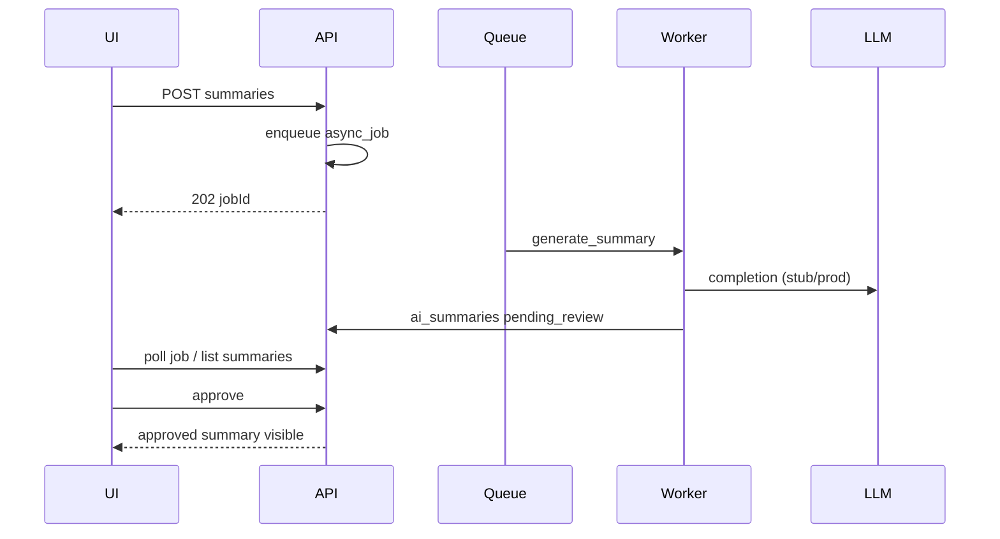

# RFC-003: Async AI Case Summaries

**Status:** Accepted  
**Author:** Engineering  
**Created:** 2026-07-06  
**Last Updated:** 2026-07-06  
**Reviewers:** Tech Lead, Product Owner  
**Sprint / Epic:** Sprint 4 — AI & n8n (LEX-E4)  
**Related ADRs:** [ADR-004](../13-decisions/004-async-ai-processing.md), [ADR-008](../13-decisions/008-azure-openai-primary.md)

---

## Summary

Attorney-triggered case summary generation returns **202 Accepted** with a job ID. A Celery worker loads case context and documents, calls the LLM provider (Azure OpenAI in production; stub locally), persists a draft summary, and gates team visibility behind **human-in-the-loop (HITL) approval**.

---

## Goals

- [x] `POST /cases/{id}/ai/summaries` → 202 + `async_jobs` row
- [x] Worker pipeline: gather context → LLM → persist `ai_summaries` (status `pending_review`)
- [x] HITL: `POST /ai/summaries/{id}/approve` before non-author visibility
- [x] Prompt template versioning in `ai.prompt_templates`
- [x] Token metering fields on summary rows (stub counts locally)
- [ ] Production Azure OpenAI + PII redaction preprocessor (Sprint 5+)

## Non-Goals

- Real-time streaming tokens to UI
- Cross-firm RAG / pgvector embeddings (deferred)

---

## API Contract

| Method | Path | Auth | Response |
|--------|------|------|----------|
| POST | `/api/v1/cases/{caseId}/ai/summaries` | Bearer | 202 `{ jobId }` |
| GET | `/api/v1/cases/{caseId}/ai/summaries` | Bearer | 200 list |
| GET | `/api/v1/ai/summaries/{id}` | Bearer | 200 detail |
| POST | `/api/v1/ai/summaries/{id}/approve` | Bearer (lead/admin) | 200 |

Matter walls: unauthorized case → **404** (ADR-007).

---

## Async Sequence

---

## Security

- Case-scoped document text only; no cross-matter retrieval
- PII redaction in log processor (Sprint 5 LEX-501)
- Approved summaries written to audit log

---

## Implementation Notes

- Local: `lexflow_api.services.llm_stub.LlmStubProvider`
- Celery task: `lexflow_api.tasks.ai_tasks.generate_case_summary`
- Seed template: `scripts/seed_sprint4.py`

---

## References

- [endpoints-ai.md](../04-api/endpoints-ai.md)
- [human-in-the-loop.md](../07-ai/human-in-the-loop.md)
- [sprint-04-ai-n8n.md](../17-sprint-planning/sprint-04-ai-n8n.md)
