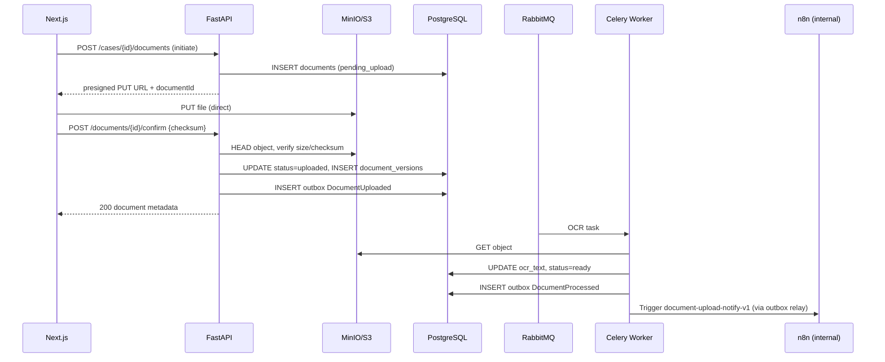

# RFC-004: Document Upload & OCR Pipeline

**Status:** Accepted  
**Author:** Engineering  
**Created:** 2026-07-06  
**Last Updated:** 2026-07-06  
**Reviewers:** Tech Lead, Product Owner, Security Champion  
**Sprint / Epic:** Sprint 4 — AI Services & n8n Orchestration (LEX-E4)  
**Related ADRs:** [ADR-002](../13-decisions/002-n8n-orchestration-only.md), [ADR-004](../13-decisions/004-async-ai-processing.md), [ADR-007](../13-decisions/007-matter-walls-404-deny.md)  
**Jira Epic:** LEX-E4

---

## Summary

Case-scoped document upload to S3/MinIO via presigned URLs, metadata persistence in PostgreSQL, async OCR extraction via Celery, and `DocumentUploaded` outbox events that trigger n8n notification workflows. Binary content never passes through FastAPI; matter walls return **404** for unauthorized access (ADR-007).

---

## Problem Statement

| Persona | Pain | Current Workaround |
|---------|------|-------------------|
| Associate Attorney | Cannot attach pleadings/evidence to a case in LexFlow | Email files to paralegal; store in SharePoint |
| Paralegal | No processing status or searchable text after upload | Manual OCR in external tools |
| Firm (compliance) | No audit trail linking documents to cases | Ad-hoc folder permissions |

Without this RFC, Sprint 4 AI summaries and n8n workflows have no document source material.

---

## Goals

- [ ] 3-step presigned upload flow (initiate → S3 PUT → confirm) with SHA-256 integrity check
- [ ] Case-scoped document list and presigned download
- [ ] Async OCR pipeline updating `ocr_text` and `ocr_status`
- [ ] `DocumentUploaded` / `DocumentProcessed` outbox events
- [ ] Matter wall enforcement on all document endpoints (404 deny)

## Non-Goals

- pgvector embeddings and semantic search (Sprint 4 stretch / Sprint 5 — table deferred)
- ClamAV virus scanning (stub hook only; Sprint 5)
- SharePoint sync, e-filing integrations
- Direct binary streaming through FastAPI

---

## Proposed Solution

### Overview



### User Stories

| ID | As a… | I want… | So that… |
|----|-------|---------|----------|
| US-1 | Paralegal | Upload a PDF to a case with progress feedback | Evidence is linked to the matter |
| US-2 | Associate | Download a document via secure link | I can review without S3 credentials |
| US-3 | Outsider attorney | GET a walled case document | I receive 404 with no metadata leak |
| US-4 | System | OCR extracted text after upload | AI summary and search can use content |

---

## API Contract (Sketch)

> Full spec: [`docs/04-api/endpoints-documents.md`](../04-api/endpoints-documents.md)

| Method | Path | Auth | Description |
|--------|------|------|-------------|
| `POST` | `/api/v1/cases/{caseId}/documents` | JWT + participant | Initiate upload → presigned PUT URL |
| `POST` | `/api/v1/documents/{documentId}/confirm` | JWT + participant | Confirm upload + checksum |
| `GET` | `/api/v1/cases/{caseId}/documents` | JWT + matter wall | List documents |
| `GET` | `/api/v1/documents/{documentId}` | JWT + matter wall | Document metadata |
| `GET` | `/api/v1/documents/{documentId}/download` | JWT + matter wall | Presigned GET URL (short TTL) |

**Initiate request:**

```json
{
  "title": "Motion to Dismiss",
  "documentType": "pleading",
  "filename": "motion.pdf",
  "mimeType": "application/pdf",
  "fileSizeBytes": 1048576,
  "checksumSha256": "e3b0c44298fc1c149afbf4c8996fb92427ae41e4649b934ca495991b7852b855"
}
```

**Initiate response (201):**

```json
{
  "data": {
    "id": "d1a2b3c4-d5e6-7890-abcd-ef1234567890",
    "status": "pending_upload",
    "uploadUrl": "https://minio:9000/lexflow/...",
    "uploadExpiresAt": "2026-07-06T09:15:00Z",
    "s3Key": "{firmId}/{caseId}/{documentId}/v1/motion.pdf"
  },
  "meta": { "requestId": "..." }
}
```

**Confirm request:**

```json
{
  "checksumSha256": "e3b0c44298fc1c149afbf4c8996fb92427ae41e4649b934ca495991b7852b855"
}
```

**Errors:** RFC 7807 — `validation_error`, `not_found` (matter wall), `conflict` (checksum mismatch), `upload_expired`.

---

## Data Model (Sketch)

> Full schema: [`docs/05-database/documents-schema.md`](../05-database/documents-schema.md)  
> Migration: `apps/api/alembic/versions/003_documents_ai_workflows.py`

| Entity / Table | Key Fields | Events Published |
|----------------|------------|------------------|
| `documents.documents` | case_id, status, s3_key, ocr_text, checksum | `DocumentUploaded`, `DocumentProcessed` |
| `documents.document_versions` | document_id, version_number, s3_key, checksum | — |
| `shared.async_jobs` | type=`document.process`, status, resource_id | — (poll via `/jobs/{id}`) |

**S3 key pattern:**

```
{firm_id}/{case_id}/{document_id}/v{version}/{filename}
```

**Status lifecycle:** `pending_upload` → `uploaded` → `processing` → `ready` | `failed`

**OCR lifecycle:** `pending` → `processing` → `completed` | `failed` | `skipped`

---

## UI / UX

| Screen | Design System Reference | Notes |
|--------|------------------------|-------|
| Case documents | [document-viewer.md](../16-design-system/screens/document-viewer.md) | Drop zone, progress, status pills |
| Case nav tab | [case-dashboard.md](../16-design-system/screens/case-dashboard.md) | `/cases/[id]/documents` |

---

## Security & Matter Walls

| Question | Answer |
|----------|--------|
| Case-scoped? | Yes — all documents require `case_id` |
| RBAC roles affected | Associate, Paralegal (upload); Partner (download) |
| Unauthorized GET behavior | **404** — no document title or count leak (ADR-007) |
| Audit events | `document.uploaded`, `document.downloaded` |
| PII fields | OCR text may contain PII — case-scoped access only |

**Matter wall matrix:**

| Role | Participant | GET document | POST upload |
|------|-------------|--------------|-------------|
| Associate | Yes | 200 | 201 |
| Associate | No | 404 | 404 |
| Outsider | No | 404 | 404 |

**Presigned URL security:**

- PUT URLs: 15-minute TTL, single object key, content-type restricted
- GET URLs: 5-minute TTL, logged in audit trail
- No public bucket ACLs

---

## AI Implications

| Question | Answer |
|----------|--------|
| LLM involved? | No (OCR only in this RFC) |
| Async only? | OCR via Celery (not 202 to client — poll document status) |
| Feeds RFC-003? | Yes — `ocr_text` is RAG input for document summaries |

---

## n8n / Orchestration

| Question | Answer |
|----------|--------|
| n8n workflow needed? | Yes — `document-upload-notify-v1` (RFC-005) |
| Business logic location | FastAPI only — n8n sends notification/routing |
| Trigger | Outbox relay → worker → signed n8n webhook on `DocumentUploaded` |
| Callback | n8n → `POST /internal/webhooks/n8n/document-upload-notify` (HMAC) |

---

## Rollout & Migration

| Phase | Action | Rollback |
|-------|--------|----------|
| 1 | Run migration `003_documents_ai_workflows` | `alembic downgrade -1` |
| 2 | Deploy API + worker with OCR task | Disable Celery queue consumer |
| 3 | Enable document UI tab | Hide nav link via feature flag |

**Environment order:** local (MinIO) → staging (S3) → production

---

## Alternatives Considered

| Option | Pros | Cons | Why rejected |
|--------|------|------|--------------|
| Direct upload through API | Simpler client | Memory/timeout limits, no scale | **Rejected** |
| Presigned S3 upload | Scalable, industry standard | 3-step client flow | **Selected** |
| Sync OCR in confirm handler | Immediate text | Blocks request, timeout risk | **Rejected** (ADR-004 spirit) |
| Store binaries in PostgreSQL | Single system | Cost, size limits | **Rejected** |

---

## Success Metrics

| Metric | Target | Measurement |
|--------|--------|-------------|
| Upload success rate | > 99% (staging) | Confirm / initiate ratio |
| OCR p95 latency | < 10 min (50-page PDF) | Worker metrics |
| Matter wall leaks | 0 | Integration tests LEX-414 |
| Checksum mismatches | Logged + rejected | API audit |

---

## Implementation Plan

| Phase | Deliverable | Stories | Owner |
|-------|-------------|---------|-------|
| 1 | Schema + S3 adapter | LEX-401 | Backend |
| 2 | Upload API + outbox | LEX-402 | Backend |
| 3 | OCR Celery task | LEX-403 | Backend |
| 4 | Documents UI | LEX-410 | Frontend |
| 5 | Tests + verify script | LEX-414 | QA |

**Estimated story points:** 21 (401+402+403+410 portion)  
**Dependencies:** Sprint 3 case module, MinIO in Docker, existing S3 adapter stub

---

## Open Questions

| # | Question | Owner | Resolution |
|---|----------|-------|------------|
| 1 | Tesseract in worker image vs cloud OCR stub for dev? | Backend | **Open** — start with Tesseract in Docker |
| 2 | Max file size per upload? | Product | **Open** — propose 100 MB Phase 1 |
| 3 | Embeddings in Sprint 4 or defer? | Tech Lead | **Deferred** — OCR only for Sprint 4 exit criteria |

---

## Implementation Notes

| Date | Note |
|------|------|
| 2026-07-06 | RFC drafted; migration `003` adds documents + supporting Sprint 4 tables |

---

## References

- [sprint-04-ai-n8n.md](../17-sprint-planning/sprint-04-ai-n8n.md)
- [document-aggregate.md](../02-domain/document-aggregate.md)
- [endpoints-documents.md](../04-api/endpoints-documents.md)
- [documents-schema.md](../05-database/documents-schema.md)
- [RFC-003](./RFC-003-async-ai-summaries.md)
- [RFC-005](./RFC-005-n8n-orchestration-bootstrap.md)
