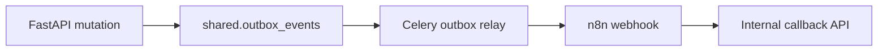

# RFC-005: n8n Orchestration Bootstrap

**Status:** Accepted  
**Author:** Engineering  
**Created:** 2026-07-06  
**Last Updated:** 2026-07-06  
**Reviewers:** Tech Lead, Integration Lead  
**Sprint / Epic:** Sprint 4 — AI & n8n (LEX-E4)  
**Related ADRs:** [ADR-002](../13-decisions/002-n8n-orchestration-only.md), [ADR-006](../13-decisions/006-transactional-outbox.md)

---

## Summary

n8n runs on a **private network** and orchestrates notifications, reminders, and external integrations. FastAPI owns business rules, persistence, and the transactional outbox. n8n **never** connects to PostgreSQL directly (ADR-002).

---

## Goals

- [x] Outbox relay publishes domain events to n8n webhooks
- [x] HMAC-signed internal callback route `/api/internal/n8n/callback`
- [x] First workflow: `document-upload-notify-v1.json`
- [x] Repo layout: `n8n/workflows/{domain}/`
- [x] Import script: `scripts/n8n/import-workflows.py`
- [ ] Staging/prod promotion pipeline with manual gate (Sprint 5 LEX-505)

## Non-Goals

- n8n as system of record
- Public n8n UI exposure (must fail security scan)

---

## Event → Webhook Flow



Payload includes `correlationId`, `firmId`, `caseId`, aggregate metadata.

---

## Security

| Control | Implementation |
|---------|----------------|
| Network | Docker internal / VPC private subnet |
| Webhook auth | Shared secret header `X-N8n-Webhook-Secret` |
| Callback auth | HMAC `X-N8n-Signature` on `/api/internal/n8n/callback` |
| DB access | **Denied** — HTTP to FastAPI only |

---

## Workflow Catalog (Phase 1)

| Workflow | Trigger | Purpose |
|----------|---------|---------|
| `document-upload-notify-v1` | `DocumentUploaded` | Notify assignee / Teams stub |
| `smoke-callback-v1` | Manual | Platform integration test |

---

## Local Development

```bash
# After stack is up and N8N_API_KEY is set in .env
python3 scripts/n8n/import-workflows.py --activate
```

---

## References

- [n8n-integration.md](../06-workflows/n8n-integration.md)
- [webhook-contracts.md](../06-workflows/webhook-contracts.md)
- [RFC-004](./RFC-004-document-pipeline.md)
