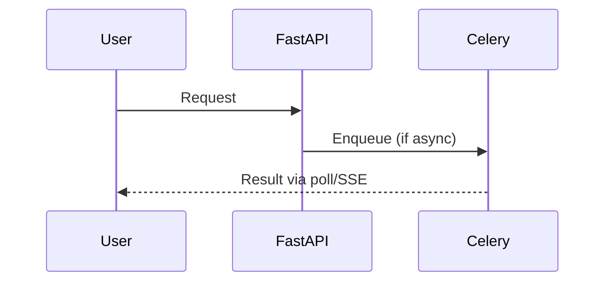
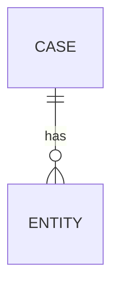

# RFC-NNN: {Feature Title}

**Status:** Draft | In Review | Accepted | Implemented | Rejected | Withdrawn  
**Author:** {name}  
**Created:** YYYY-MM-DD  
**Last Updated:** YYYY-MM-DD  
**Reviewers:** {tech lead}, {product owner}, {security — if applicable}  
**Sprint / Epic:** Sprint N — {Epic name}  
**Related ADRs:** [ADR-XXX](../13-decisions/XXX-slug.md) (if any)  
**Jira Epic:** LEX-XXX (when created)

---

## Summary

One paragraph: what we are building, for whom, and why now.

---

## Problem Statement

What pain exists today? Who feels it? What happens if we do nothing?

| Persona | Pain | Current Workaround |
|---------|------|-------------------|
| {e.g., Associate Attorney} | {pain} | {workaround} |

---

## Goals

- [ ] Goal 1 — measurable outcome
- [ ] Goal 2

## Non-Goals

Explicitly out of scope for this RFC (link [non-goals](../01-product/non-goals.md) where relevant):

- Not building X
- Not supporting Y in Phase 1

---

## Proposed Solution

### Overview

High-level description of the feature. Include a diagram for non-trivial flows.



### User Stories

| ID | As a… | I want… | So that… |
|----|-------|---------|----------|
| US-1 | {persona} | {action} | {outcome} |

---

## API Contract (Sketch)

> Full spec lands in `docs/04-api/` after RFC acceptance.

| Method | Path | Auth | Description |
|--------|------|------|-------------|
| `GET` | `/api/v1/...` | JWT + matter wall | ... |

**Request example:**

```json
{}
```

**Response example:**

```json
{
  "data": {},
  "meta": { "request_id": "..." }
}
```

**Errors:** RFC 7807 types — reference [error-handling](../04-api/error-handling.md).

---

## Data Model (Sketch)

> Full schema lands in `docs/05-database/` after acceptance.

| Entity / Table | Key Fields | Events Published |
|----------------|------------|------------------|
| | | |



---

## UI / UX

| Screen | Design System Reference | Notes |
|--------|------------------------|-------|
| {Case dashboard} | [case-dashboard.md](../16-design-system/screens/case-dashboard.md) | |

Wireframes, Figma links, or ASCII layout as needed.

---

## Security & Matter Walls

| Question | Answer |
|----------|--------|
| Case-scoped? | Yes / No |
| RBAC roles affected | |
| Unauthorized GET behavior | 404 (ADR-007) |
| Audit events | |
| PII fields | |

**Matter wall matrix (required if case-scoped):**

| Role | Participant | Expected |
|------|-------------|----------|
| Associate | Yes | 200 |
| Associate | No | 404 |

---

## AI Implications

> Skip section if N/A.

| Question | Answer |
|----------|--------|
| LLM involved? | Yes / No |
| Async only (ADR-004)? | 202 + Celery |
| HITL required? | |
| PII redaction | |
| Provider | Azure OpenAI (ADR-008) |

---

## n8n / Orchestration

> Skip section if N/A.

| Question | Answer |
|----------|--------|
| n8n workflow needed? | Yes / No |
| Business logic location | FastAPI only (ADR-002) |
| Trigger | FastAPI → n8n webhook |
| Callback | n8n → FastAPI HMAC webhook |

---

## Rollout & Migration

| Phase | Action | Rollback |
|-------|--------|----------|
| 1 | Feature flag `...` | Disable flag |
| 2 | Enable for pilot group | |

**Environment order:** local → dev → staging → production

---

## Alternatives Considered

| Option | Pros | Cons | Why rejected |
|--------|------|------|--------------|
| A | | | |
| B | | | **Selected** |

---

## Success Metrics

| Metric | Target | Measurement |
|--------|--------|-------------|
| | | |

---

## Implementation Plan

| Phase | Deliverable | Stories / Tasks | Owner |
|-------|-------------|-----------------|-------|
| 1 | API + domain | LEX-XXX | |
| 2 | UI | LEX-XXX | |
| 3 | Tests + docs | | |

**Estimated story points:** {N}  
**Dependencies:** {RFC-XXX, infra ticket, etc.}

---

## Open Questions

| # | Question | Owner | Resolution |
|---|----------|-------|------------|
| 1 | | | Open / Resolved |

---

## Implementation Notes

> Filled in when feature ships. Document deviations from accepted design.

| Date | Note |
|------|------|
| | |

---

## References

- [capabilities.md](../01-product/capabilities.md)
- [bounded-contexts.md](../02-domain/bounded-contexts.md)
- {other docs}
