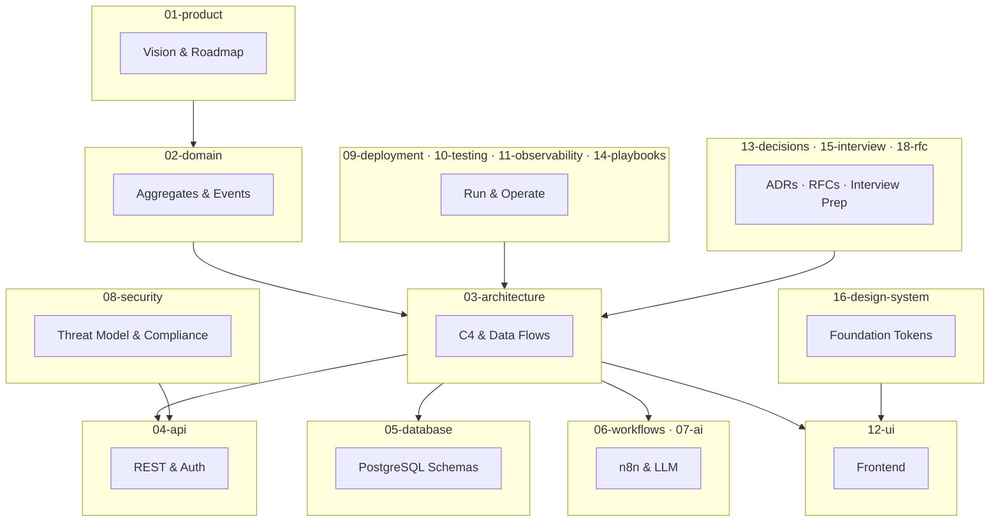

# LexFlow AI — Enterprise Documentation

**Version:** 1.0 · **Status:** Draft — Pre-Implementation · **Last Updated:** 2026-07-06

LexFlow AI is an enterprise AI automation platform for law firms. This documentation suite is designed so a new engineer can understand the entire system without speaking to anyone.

**AI assistants:** Start at [`.ai/README.md`](../.ai/README.md) or [`AGENTS.md`](../AGENTS.md) — compressed context for Cursor, Claude Code, and GitHub Copilot.

---

## Documentation Structure

---

## Quick Start by Role

| Role | Reading Path |
|------|--------------|
| **New Engineer** | [14-playbooks/onboarding.md](./14-playbooks/onboarding.md) → [01-product/vision.md](./01-product/vision.md) → [03-architecture/system-context.md](./03-architecture/system-context.md) |
| **Backend Engineer** | [02-domain/](./02-domain/README.md) → [04-api/](./04-api/README.md) → [05-database/](./05-database/README.md) → [03-architecture/event-driven-design.md](./03-architecture/event-driven-design.md) |
| **Frontend Engineer** | [16-design-system/](./16-design-system/README.md) → [12-ui/](./12-ui/README.md) → [04-api/rest-standards.md](./04-api/rest-standards.md) → [08-security/matter-walls.md](./08-security/matter-walls.md) |
| **Designer / UX** | [16-design-system/foundation/](./16-design-system/foundation/README.md) → [01-product/user-personas.md](./01-product/user-personas.md) → [12-ui/](./12-ui/README.md) |
| **DevOps / SRE** | [09-deployment/](./09-deployment/README.md) → [11-observability/](./11-observability/README.md) → [14-playbooks/deploy-production.md](./14-playbooks/deploy-production.md) |
| **Security Reviewer** | [08-security/threat-model.md](./08-security/threat-model.md) → [08-security/compliance-mapping.md](./08-security/compliance-mapping.md) → [04-api/authorization-rbac.md](./04-api/authorization-rbac.md) |
| **AI / ML Engineer** | [07-ai/](./07-ai/README.md) → [02-domain/ai-aggregate.md](./02-domain/ai-aggregate.md) → [13-decisions/008-azure-openai-primary.md](./13-decisions/008-azure-openai-primary.md) |
| **Product / Legal Ops** | [01-product/](./01-product/README.md) → [02-domain/ubiquitous-language.md](./02-domain/ubiquitous-language.md) |
| **Tech Lead / Architect** | [18-rfc/README.md](./18-rfc/README.md) → [13-decisions/](./13-decisions/README.md) → [03-architecture/](./03-architecture/README.md) |
| **Interview Prep** | [15-interview/system-design-overview.md](./15-interview/system-design-overview.md) |

---

## Folder Index

### [01-product/](./01-product/README.md) — Product Definition

| Document | Description |
|----------|-------------|
| [vision.md](./01-product/vision.md) | Product vision, problem statement, value proposition |
| [user-personas.md](./01-product/user-personas.md) | All 10 user personas with goals and permissions |
| [capabilities.md](./01-product/capabilities.md) | 13 platform capabilities in detail |
| [roadmap.md](./01-product/roadmap.md) | Phase 1–4 delivery plan with milestones |
| [success-metrics.md](./01-product/success-metrics.md) | KPIs, SLAs, measurement framework |
| [non-goals.md](./01-product/non-goals.md) | Explicit non-goals and anti-patterns |

### [02-domain/](./02-domain/README.md) — Domain Model (DDD)

| Document | Description |
|----------|-------------|
| [bounded-contexts.md](./02-domain/bounded-contexts.md) | 8 bounded contexts and context map |
| [case-aggregate.md](./02-domain/case-aggregate.md) | Central Case aggregate, invariants, state machine |
| [client-aggregate.md](./02-domain/client-aggregate.md) | Client aggregate and contacts |
| [document-aggregate.md](./02-domain/document-aggregate.md) | Document versioning and OCR lifecycle |
| [workflow-aggregate.md](./02-domain/workflow-aggregate.md) | Workflow definitions and executions |
| [ai-aggregate.md](./02-domain/ai-aggregate.md) | AI summaries and prompt templates |
| [domain-events.md](./02-domain/domain-events.md) | Full event catalog with JSON payloads |
| [ubiquitous-language.md](./02-domain/ubiquitous-language.md) | Glossary and anti-patterns |

### [03-architecture/](./03-architecture/README.md) — System Architecture (C4)

| Document | Description |
|----------|-------------|
| [system-context.md](./03-architecture/system-context.md) | C4 Level 1 — users, externals, trust boundaries |
| [container-architecture.md](./03-architecture/container-architecture.md) | C4 Level 2 — ECS, data stores, network |
| [component-architecture.md](./03-architecture/component-architecture.md) | C4 Level 3 — FastAPI bounded contexts |
| [data-flow.md](./03-architecture/data-flow.md) | Sync and async request paths |
| [event-driven-design.md](./03-architecture/event-driven-design.md) | Outbox pattern, RabbitMQ topology |
| [integration-patterns.md](./03-architecture/integration-patterns.md) | Adapter pattern, Microsoft 365 |
| [cross-cutting-concerns.md](./03-architecture/cross-cutting-concerns.md) | Idempotency, caching, tracing, audit |
| [nfr-requirements.md](./03-architecture/nfr-requirements.md) | Scale, HA, DR, performance targets |

### [04-api/](./04-api/README.md) — REST API

| Document | Description |
|----------|-------------|
| [rest-standards.md](./04-api/rest-standards.md) | REST conventions, response envelope |
| [authentication.md](./04-api/authentication.md) | JWT, refresh tokens, login flows |
| [authorization-rbac.md](./04-api/authorization-rbac.md) | RBAC matrix, matter walls |
| [endpoints-cases.md](./04-api/endpoints-cases.md) | Case API with JSON examples |
| [endpoints-documents.md](./04-api/endpoints-documents.md) | Document upload, search |
| [endpoints-ai.md](./04-api/endpoints-ai.md) | Async AI endpoints (202 pattern) |
| [endpoints-workflows.md](./04-api/endpoints-workflows.md) | Workflow trigger and status |
| [error-handling.md](./04-api/error-handling.md) | RFC 7807 error catalog |
| [versioning.md](./04-api/versioning.md) | API versioning strategy |
| [webhooks-internal.md](./04-api/webhooks-internal.md) | n8n HMAC callback contracts |

### [05-database/](./05-database/README.md) — PostgreSQL Data Layer

| Document | Description |
|----------|-------------|
| [schema-overview.md](./05-database/schema-overview.md) | 7-schema overview and conventions |
| [identity-schema.md](./05-database/identity-schema.md) | Users, roles, permissions |
| [cases-schema.md](./05-database/cases-schema.md) | Cases, tasks, deadlines, timeline |
| [documents-schema.md](./05-database/documents-schema.md) | Documents, versions, pgvector |
| [workflows-schema.md](./05-database/workflows-schema.md) | Workflow definitions and executions |
| [ai-schema.md](./05-database/ai-schema.md) | AI summaries, prompts, usage |
| [audit-schema.md](./05-database/audit-schema.md) | Audit logs, outbox, notifications |
| [indexing-strategy.md](./05-database/indexing-strategy.md) | Indexes, HNSW, full-text search |
| [migrations.md](./05-database/migrations.md) | Alembic conventions |
| [retention-backup.md](./05-database/retention-backup.md) | Retention policies and backup |

### [06-workflows/](./06-workflows/README.md) — n8n Orchestration

| Document | Description |
|----------|-------------|
| [orchestration-model.md](./06-workflows/orchestration-model.md) | FastAPI vs n8n responsibilities |
| [n8n-integration.md](./06-workflows/n8n-integration.md) | Private n8n deployment and security |
| [workflow-catalog.md](./06-workflows/workflow-catalog.md) | Initial workflow catalog |
| [webhook-contracts.md](./06-workflows/webhook-contracts.md) | FastAPI ↔ n8n payloads |
| [retry-dlq.md](./06-workflows/retry-dlq.md) | Retry policies and dead letter queues |
| [promotion-pipeline.md](./06-workflows/promotion-pipeline.md) | Dev → staging → production |

### [07-ai/](./07-ai/README.md) — AI & LLM Integration

| Document | Description |
|----------|-------------|
| [llm-providers.md](./07-ai/llm-providers.md) | Provider adapter pattern |
| [prompt-management.md](./07-ai/prompt-management.md) | Versioned prompt registry |
| [rag-architecture.md](./07-ai/rag-architecture.md) | Chunking, embeddings, hybrid search |
| [safety-guardrails.md](./07-ai/safety-guardrails.md) | PII redaction, injection defense |
| [human-in-the-loop.md](./07-ai/human-in-the-loop.md) | Attorney approval workflow |
| [usage-metering.md](./07-ai/usage-metering.md) | Token tracking and cost controls |

### [08-security/](./08-security/README.md) — Security & Compliance

| Document | Description |
|----------|-------------|
| [threat-model.md](./08-security/threat-model.md) | STRIDE threat analysis |
| [network-security.md](./08-security/network-security.md) | VPC, security groups, WAF |
| [encryption.md](./08-security/encryption.md) | At rest, in transit, application PII |
| [secrets-management.md](./08-security/secrets-management.md) | AWS Secrets Manager |
| [matter-walls.md](./08-security/matter-walls.md) | Case-level ABAC, ethical walls |
| [compliance-mapping.md](./08-security/compliance-mapping.md) | ABA, GDPR, CCPA, SOC 2 |
| [incident-response.md](./08-security/incident-response.md) | Breach response lifecycle |

### [09-deployment/](./09-deployment/README.md) — Infrastructure & CI/CD

| Document | Description |
|----------|-------------|
| [aws-topology.md](./09-deployment/aws-topology.md) | AWS VPC, ECS, RDS, S3, ALB |
| [terraform.md](./09-deployment/terraform.md) | Terraform modules and state |
| [cicd-pipeline.md](./09-deployment/cicd-pipeline.md) | GitHub Actions pipeline |
| [docker-containers.md](./09-deployment/docker-containers.md) | Container builds, local compose |
| [environment-strategy.md](./09-deployment/environment-strategy.md) | Local, dev, staging, production |
| [zero-downtime-deploy.md](./09-deployment/zero-downtime-deploy.md) | Rolling updates, migrations |
| [disaster-recovery.md](./09-deployment/disaster-recovery.md) | HA, RPO/RTO, failover |

### [10-testing/](./10-testing/README.md) — Quality Assurance

| Document | Description |
|----------|-------------|
| [unit-testing.md](./10-testing/unit-testing.md) | pytest and Vitest standards |
| [integration-testing.md](./10-testing/integration-testing.md) | Testcontainers, matter wall tests |
| [e2e-testing.md](./10-testing/e2e-testing.md) | Playwright critical journeys |
| [load-testing.md](./10-testing/load-testing.md) | k6 scenarios and thresholds |
| [security-testing.md](./10-testing/security-testing.md) | RBAC, injection, scanning |
| [test-data.md](./10-testing/test-data.md) | Factories, seed data, anonymization |

### [11-observability/](./11-observability/README.md) — Logging, Tracing, Alerting

| Document | Description |
|----------|-------------|
| [structured-logging.md](./11-observability/structured-logging.md) | JSON logs, PII redaction |
| [distributed-tracing.md](./11-observability/distributed-tracing.md) | OpenTelemetry, X-Ray |
| [metrics-alerting.md](./11-observability/metrics-alerting.md) | CloudWatch, P1–P4 alerts |
| [dashboards.md](./11-observability/dashboards.md) | Operational, business, security |
| [runbooks.md](./11-observability/runbooks.md) | Alert response procedures |

### [12-ui/](./12-ui/README.md) — Frontend Architecture

| Document | Description |
|----------|-------------|
| [design-system.md](./12-ui/design-system.md) | Tailwind, ShadCN, legal enterprise UI |
| [page-architecture.md](./12-ui/page-architecture.md) | Next.js App Router structure |
| [state-management.md](./12-ui/state-management.md) | Zustand vs React Query |
| [real-time-updates.md](./12-ui/real-time-updates.md) | SSE for notifications and status |
| [accessibility.md](./12-ui/accessibility.md) | WCAG 2.1 AA compliance |
| [client-portal.md](./12-ui/client-portal.md) | Client-facing portal UI |

### [16-design-system/](./16-design-system/README.md) — Complete Design System (36 documents)

**Foundation:** [foundation/](./16-design-system/foundation/README.md) — philosophy, tokens, color, typography, spacing, grid, dark mode, a11y, keyboard, motion

**Architecture:** [architecture/](./16-design-system/architecture/README.md) — IA, navigation, screen hierarchy, user journeys, responsive, UX guidelines

**Components:** [components/](./16-design-system/components/README.md) — library, interactions, data tables, forms, dialogs, notifications

**Screens:** [screens/](./16-design-system/screens/README.md) — case dashboard, timeline, document viewer, AI chat, approvals, search, ⌘K, workflows, analytics, audit logs

| Key Document | Description |
|--------------|-------------|
| [design-philosophy.md](./16-design-system/foundation/design-philosophy.md) | M365 · Azure · Linear · Fluent · Stripe design philosophy |
| [information-architecture.md](./16-design-system/architecture/information-architecture.md) | Case-centric IA, matter wall UX |
| [user-journeys.md](./16-design-system/architecture/user-journeys.md) | 10 journeys with Mermaid diagrams |
| [component-library.md](./16-design-system/components/component-library.md) | Full component hierarchy |
| [case-dashboard.md](./16-design-system/screens/case-dashboard.md) | Central case hub wireframe |
| [command-palette.md](./16-design-system/screens/command-palette.md) | Linear-style ⌘K overlay |

### [13-decisions/](./13-decisions/README.md) — Architecture Decision Records

| ADR | Decision |
|-----|----------|
| [001](./13-decisions/001-modular-monolith.md) | Start with modular monolith |
| [002](./13-decisions/002-n8n-orchestration-only.md) | n8n orchestration only — no business logic |
| [003](./13-decisions/003-postgresql-single-database.md) | Single PostgreSQL, schema separation |
| [004](./13-decisions/004-async-ai-processing.md) | All AI via async worker path |
| [005](./13-decisions/005-jwt-authentication.md) | JWT + refresh token auth |
| [006](./13-decisions/006-transactional-outbox.md) | Transactional outbox for events |
| [007](./13-decisions/007-matter-walls-404-deny.md) | 404 not 403 for unauthorized case access |
| [008](./13-decisions/008-azure-openai-primary.md) | Azure OpenAI as production default |

### [14-playbooks/](./14-playbooks/README.md) — Operational Runbooks

| Playbook | Description |
|----------|-------------|
| [local-dev-setup.md](./14-playbooks/local-dev-setup.md) | Local development environment |
| [10-minute-quickstart.md](./14-playbooks/10-minute-quickstart.md) | Sprint 0 — clone to dev in under 10 minutes |
| [platform-readiness-gate.md](./14-playbooks/platform-readiness-gate.md) | Before auth — 10 infra checks (Sprint 1 exit) |
| [onboarding.md](./14-playbooks/onboarding.md) | New engineer first week |
| [incident-triage.md](./14-playbooks/incident-triage.md) | P1–P4 incident response |
| [deploy-production.md](./14-playbooks/deploy-production.md) | Production deployment |
| [platform-readiness-gate.md](./14-playbooks/platform-readiness-gate.md) | **Before auth/business logic** — 10 infra checks |
| [rotate-secrets.md](./14-playbooks/rotate-secrets.md) | Secret rotation ceremony |
| [add-workflow.md](./14-playbooks/add-workflow.md) | Add new n8n workflow |
| [add-llm-provider.md](./14-playbooks/add-llm-provider.md) | Add new LLM provider |

### [15-interview/](./15-interview/README.md) — Interview Preparation

| Document | Description |
|----------|-------------|
| [system-design-overview.md](./15-interview/system-design-overview.md) | 15-minute architecture pitch |
| [architecture-deep-dive.md](./15-interview/architecture-deep-dive.md) | 45-minute staff-level deep dive |
| [tradeoffs-discussion.md](./15-interview/tradeoffs-discussion.md) | Architectural tradeoff defense |
| [scaling-questions.md](./15-interview/scaling-questions.md) | Scale to 1K users, 50K workflows |
| [security-questions.md](./15-interview/security-questions.md) | Legal tech security Q&A |

### [17-sprint-planning/](./17-sprint-planning/README.md) — Sprint Planning & Jira Import

| Document | Description |
|----------|-------------|
| [Sprint 0](./17-sprint-planning/sprint-00-documentation.md) | **Engineering setup** — clone to dev in < 10 min |
| [Sprint 1](./17-sprint-planning/sprint-01-infrastructure.md) | Full platform stack + readiness gate |
| [Sprint 2](./17-sprint-planning/sprint-02-auth-domain.md) | Auth, RBAC, domain models |
| [Sprint 3](./17-sprint-planning/sprint-03-case-management.md) | Case Management module |
| [Sprint 4](./17-sprint-planning/sprint-04-ai-n8n.md) | AI services & n8n |
| [Sprint 5](./17-sprint-planning/sprint-05-production.md) | Production hardening & AWS |
| [jira-import/](./17-sprint-planning/jira-import/README.md) | CSV files for Jira import (69 stories) |

### [18-rfc/](./18-rfc/README.md) — Request for Comments (Design Before Code)

**Every major feature is an Accepted RFC before implementation.** Differentiates LexFlow from ticket-to-PR delivery.

| Document | Description |
|----------|-------------|
| [README.md](./18-rfc/README.md) | RFC process, RFC vs ADR, sprint gate, index |
| [_template.md](./18-rfc/_template.md) | Copy to create new RFCs |
| [000-rfc-process.md](./18-rfc/000-rfc-process.md) | Meta-RFC — design-before-code culture (Accepted) |
| [RFC-001](./18-rfc/RFC-001-case-management.md) | Case Management — Planned (Sprint 3) |
| [RFC-002](./18-rfc/RFC-002-authentication-rbac.md) | Auth & RBAC — Planned (Sprint 2) |
| [RFC-003](./18-rfc/RFC-003-async-ai-summaries.md) | Async AI summaries — Planned (Sprint 4) |
| [RFC-004](./18-rfc/RFC-004-document-pipeline.md) | Document pipeline — Planned (Sprint 4) |
| [RFC-005](./18-rfc/RFC-005-n8n-orchestration-bootstrap.md) | n8n bootstrap — Planned (Sprint 4) |

---

## Document Standards

Every document in this repository follows enterprise conventions:

| Section | Purpose |
|---------|---------|
| **Purpose** | Why this document exists |
| **Scope** | What is and is not covered |
| **Responsibilities** | Who owns what |
| **Architecture** | Technical design with Mermaid diagrams |
| **Flow Diagrams** | Sequence, state, ER, C4, deployment diagrams |
| **Best Practices** | Recommended patterns |
| **Tradeoffs** | Pros/cons of chosen approach |
| **Future Improvements** | Planned evolution |
| **References** | Links to related documents |

---

## Platform Invariants

These principles are enforced across all documentation:

1. **Case-centric domain** — Cases are the central aggregate; matter walls enforce access
2. **Business logic in FastAPI** — Never in n8n or the frontend
3. **n8n is private** — Orchestration only; not publicly accessible
4. **Async AI** — All LLM calls via queue/worker; human-in-the-loop for legal outputs
5. **Immutable audit** — Append-only audit logs for all significant actions
6. **Event-driven** — Transactional outbox → RabbitMQ → Celery workers
7. **RFC before code** — Major features require an Accepted RFC in `docs/18-rfc/` before implementation (see [RFC-000](./18-rfc/000-rfc-process.md))

---

## Legacy Documentation

Flat markdown files at the `docs/` root (e.g., `high-level-architecture.md`, `domain-model.md`) are **superseded** by the numbered folder structure. See [MIGRATION.md](./MIGRATION.md) for the mapping.

---

## Glossary

| Term | Definition |
|------|------------|
| **Case / Matter** | Central domain aggregate — a legal matter handled by the firm |
| **Matter Wall** | Access control restricting case visibility to assigned participants |
| **Bounded Context** | DDD module with its own ubiquitous language and data ownership |
| **Outbox Pattern** | Transactional event publishing ensuring at-least-once delivery |
| **BFF** | Backend-for-Frontend — thin Next.js API routes, not business logic |
| **HITL** | Human-in-the-Loop — attorney approval required for AI legal outputs |
| **RFC** | Request for Comments — feature design document required before major implementation |
