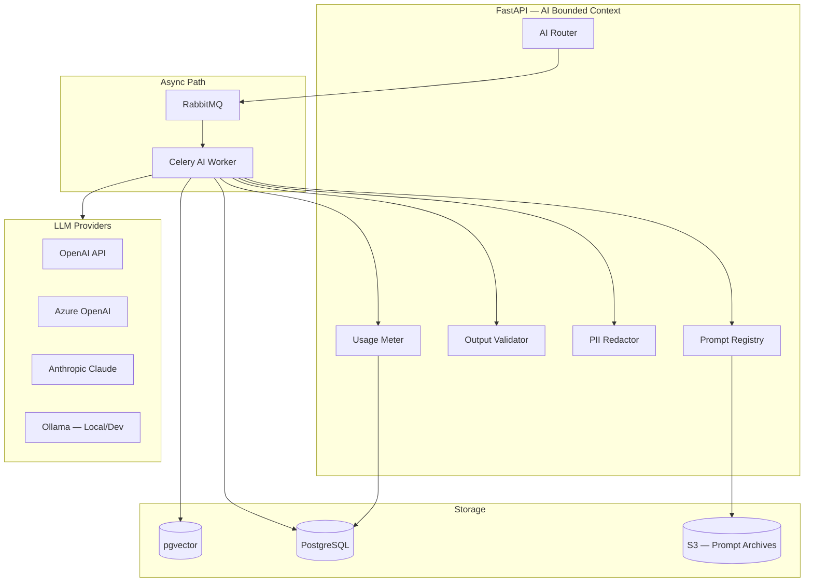
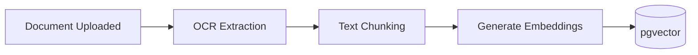
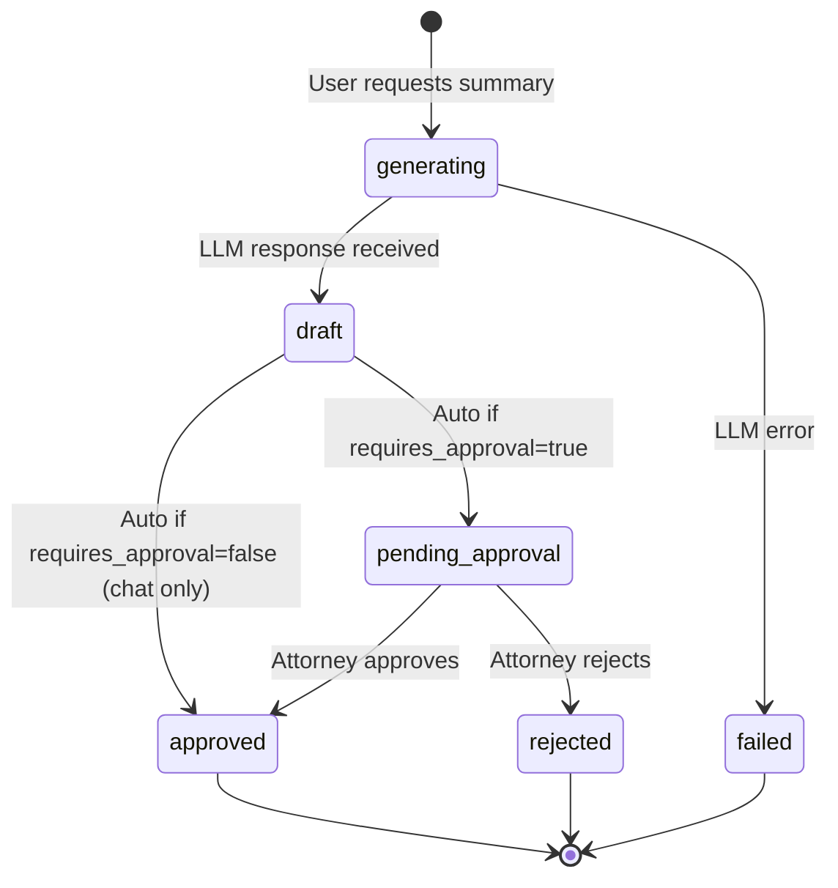

# AI Architecture

**LexFlow AI** — LLM Integration, RAG & Safety  
**Version:** 1.0  
**Status:** Draft — Pre-Implementation  
**Last Updated:** 2026-07-06

---

## 1. Overview

LexFlow AI integrates large language models to assist legal professionals with summarization, research, contract review, and case-scoped chat. AI is a **productivity multiplier** — all outputs require human review before use in legal work product.

**Core principles:**
1. All AI calls are **asynchronous** (never block the request path)
2. All AI interactions are **audited** (prompt + response logged)
3. All client-facing AI outputs require **attorney approval**
4. AI access is **case-scoped** (matter wall enforced before retrieval)
5. Provider-agnostic abstraction (OpenAI, Azure OpenAI, Claude, Ollama)

---

## 2. Architecture



---

## 3. Provider Abstraction

```python
# Conceptual interface — services/ai_knowledge/domain/providers.py
class LLMProvider(Protocol):
    async def complete(
        self,
        prompt: str,
        model: str,
        config: ModelConfig,
    ) -> LLMResponse: ...

    async def embed(
        self,
        texts: list[str],
        model: str,
    ) -> list[list[float]]: ...

class LLMResponse:
    content: str
    input_tokens: int
    output_tokens: int
    model: str
    provider: str
    latency_ms: int
    finish_reason: str
```

### 3.1 Provider Configuration

| Provider | Use Case | Model | Deployment |
|----------|----------|-------|------------|
| Azure OpenAI | Production (primary) | GPT-4o, text-embedding-3-small | Firm's Azure tenant (data residency) |
| OpenAI | Fallback / dev | GPT-4o, text-embedding-3-small | OpenAI API |
| Anthropic Claude | Contract review (long context) | Claude 3.5 Sonnet | Anthropic API |
| Ollama | Local development only | Llama 3, Mistral | Developer machine / local Docker |

**Production default:** Azure OpenAI (firm data stays in firm's Azure subscription).

Provider selection is configured per prompt template in `ai.prompt_templates.model_config`.

---

## 4. AI Capabilities

### 4.1 Document Summary

| Field | Value |
|-------|-------|
| Trigger | User request or auto on `DocumentProcessed` |
| Input | Document OCR text + case context |
| Output | Structured summary (key facts, parties, dates, obligations) |
| Approval | Required — attorney must approve before visible to team |
| Prompt template | `document-summary-v1` |

### 4.2 Case Overview Summary

| Field | Value |
|-------|-------|
| Trigger | User request |
| Input | Case metadata + all document summaries + timeline + notes |
| Output | Executive case summary |
| Approval | Required |
| Prompt template | `case-overview-v1` |

### 4.3 Legal Research

| Field | Value |
|-------|-------|
| Trigger | User query |
| Input | Research question + case context + relevant document chunks (RAG) |
| Output | Research memo draft with source citations |
| Approval | Required — marked as "draft for attorney review" |
| Prompt template | `legal-research-v1` |
| Disclaimer | Always appended: "This is AI-generated research requiring attorney verification." |

### 4.4 Contract Review

| Field | Value |
|-------|-------|
| Trigger | User uploads contract document |
| Input | Contract OCR text + firm playbook rules (JSON config) |
| Output | Clause analysis, risk flags, missing provisions, non-standard terms |
| Approval | Required |
| Prompt template | `contract-review-v1` |
| Model | Claude 3.5 Sonnet (128K context for long contracts) |

### 4.5 Case-Scoped AI Assistant (Chat)

| Field | Value |
|-------|-------|
| Trigger | User message in case chat panel |
| Input | Conversation history + case context + RAG retrieval |
| Output | Conversational response |
| Approval | Not required for internal chat; responses never auto-shared externally |
| Prompt template | `case-assistant-v1` |
| Scope | Strictly limited to current case documents and notes |

---

## 5. Prompt Management

### 5.1 Prompt Registry

Prompts are versioned templates stored in `ai.prompt_templates`:

```
ai.prompt_templates
├── document-summary-v1    (version 1, active)
├── document-summary-v2    (version 2, draft — A/B testing)
├── case-overview-v1
├── legal-research-v1
├── contract-review-v1
└── case-assistant-v1
```

### 5.2 Template Structure

```jinja2
{# document-summary-v1 #}
You are a legal document analysis assistant for a US law firm.

Analyze the following document and provide a structured summary.

Document Type: {{ document_type }}
Case: {{ case_title }} ({{ case_number }})

Document Text:
---
{{ document_text | truncate(50000) }}
---

Provide your summary in the following JSON structure:
{
  "title": "...",
  "documentType": "...",
  "keyParties": [...],
  "keyDates": [...],
  "keyProvisions": [...],
  "summary": "...",
  "riskFlags": [...]
}

IMPORTANT: This is a draft summary for attorney review. Do not present as final legal analysis.
```

### 5.3 Prompt Versioning Rules

- New versions created for any prompt text change
- Old versions retained for audit reproducibility
- Active version configurable per firm
- Prompt changes require Compliance Officer review for client-facing templates

---

## 6. RAG (Retrieval-Augmented Generation)

### 6.1 Embedding Pipeline



| Step | Detail |
|------|--------|
| Chunking | 512-token chunks, 64-token overlap |
| Embedding model | text-embedding-3-small (1536 dimensions) |
| Storage | `documents.document_embeddings` with HNSW index |
| Trigger | Async on `DocumentProcessed` event |

### 6.2 Retrieval

```python
# Pseudocode — case-scoped RAG retrieval
async def retrieve_context(case_id, query, user, top_k=10):
    # 1. Enforce matter wall
    authorize(user, "case:read:assigned", case_id)

    # 2. Generate query embedding
    query_embedding = await provider.embed([query])

    # 3. Vector search scoped to case documents
    chunks = await db.vector_search(
        embedding=query_embedding,
        filter={"case_id": case_id},
        limit=top_k,
        min_similarity=0.7
    )

    return chunks
```

**Critical:** Vector search ALWAYS filters by `case_id`. Cross-case retrieval is impossible by design.

### 6.3 Hybrid Search

For the knowledge search UI, combine:
- **Full-text search:** PostgreSQL `tsvector` on document titles and OCR text
- **Semantic search:** pgvector cosine similarity
- **Reciprocal Rank Fusion (RRF)** to merge results

---

## 7. Safety & Guardrails

### 7.1 Input Safety

| Check | Implementation |
|-------|----------------|
| PII detection | Scan input for SSN, credit card, etc. — redact before sending to LLM |
| Prompt injection | System prompt instructs model to ignore override attempts; input sanitization |
| Length limits | Max 50K tokens input per request |
| Rate limits | 20 AI requests/minute per user |
| Case scope | All retrieval filtered by case_id |

### 7.2 Output Safety

| Check | Implementation |
|-------|----------------|
| JSON schema validation | Structured outputs validated against expected schema |
| Hallucination disclaimer | All outputs include "AI-generated draft" label |
| Harmful content filter | Provider-level content filtering + post-processing check |
| Citation verification | Research outputs must reference source document IDs |
| No auto-action | AI never triggers workflows, sends emails, or files documents |

### 7.3 Human-in-the-Loop



Configurable per prompt template via `requires_approval` flag.

---

## 8. Usage Metering & Cost Control

Every LLM call records:

| Field | Purpose |
|-------|---------|
| `input_tokens` / `output_tokens` | Cost calculation |
| `provider` / `model` | Provider tracking |
| `user_id` / `case_id` / `firm_id` | Attribution |
| `latency_ms` | Performance monitoring |
| `estimated_cost_usd` | Budget tracking |

### 8.1 Cost Controls

| Control | Default |
|---------|---------|
| Firm monthly budget | Configurable (e.g., $5,000/month) |
| Alert at 80% budget | Email to Managing Partner + IT Admin |
| Hard stop at 100% budget | AI requests return 503 with message |
| Per-user daily limit | 100 requests/day |
| Per-case token limit | 500K tokens/case/month |

---

## 9. Data Handling for AI

| Data | Sent to LLM? | Stored? | Retention |
|------|-------------|---------|-----------|
| Document OCR text | Yes (within case scope) | Yes — prompt_history | 3 years |
| Case metadata | Yes (title, number, practice area) | Yes | 3 years |
| Client PII | Redacted before sending | Redacted copy stored | 3 years |
| LLM response | N/A (received) | Yes — ai_summaries + prompt_history | Case lifetime + 3 years |
| Embeddings | N/A (generated locally) | Yes — pgvector | Case lifetime |
| Conversation history | Yes (chat context window) | Yes — prompt_history | 3 years |

**Azure OpenAI:** When using firm's Azure deployment, data is NOT used for model training (Azure OpenAI enterprise policy).

---

## 10. Related Documents

- [domain-model.md](./domain-model.md)
- [database-architecture.md](./database-architecture.md) — ai schema
- [security-architecture.md](./security-architecture.md)
- [compliance-data-governance.md](./compliance-data-governance.md)
- [event-driven-architecture.md](./event-driven-architecture.md)
- [adr/004-async-ai-processing.md](./adr/004-async-ai-processing.md)
