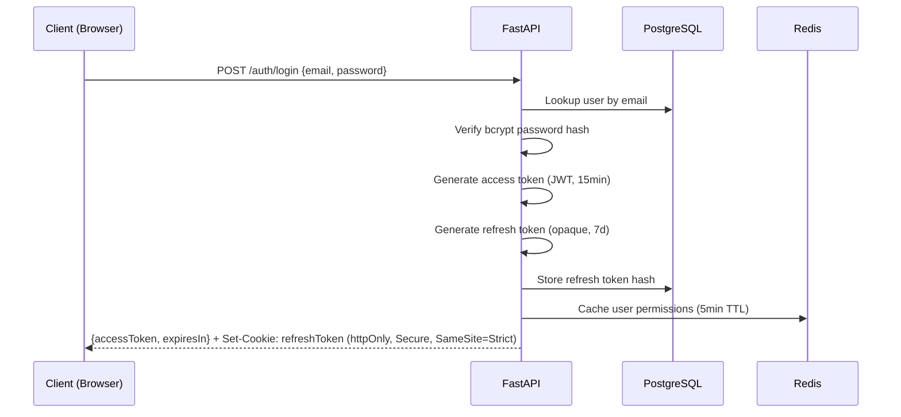
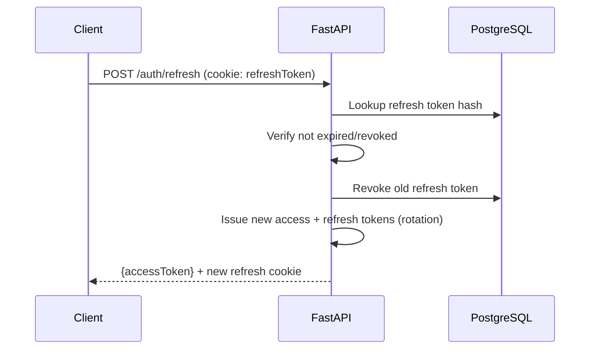
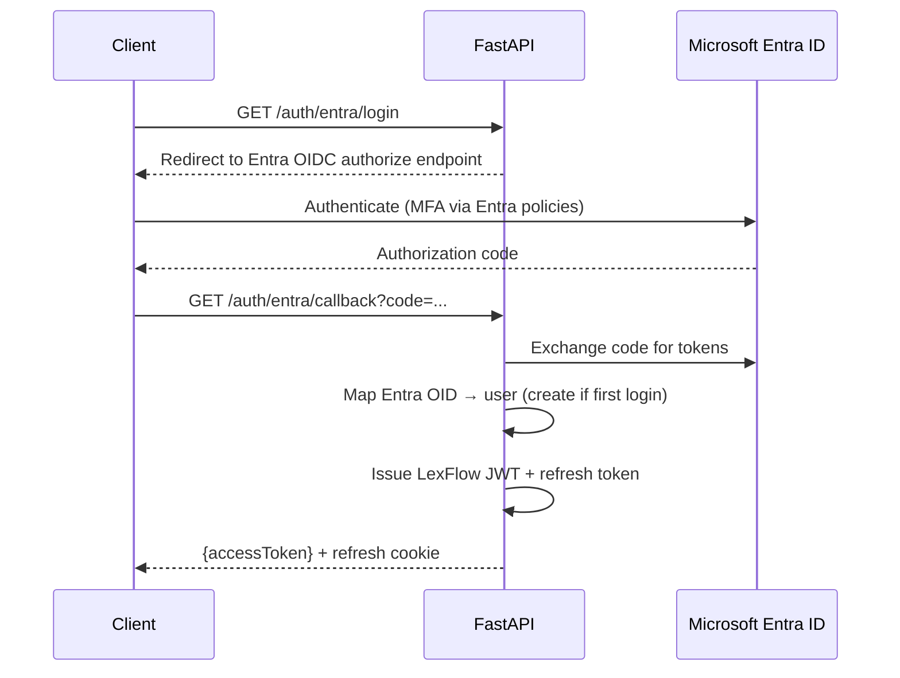

# Authentication & Authorization

**LexFlow AI** — Identity, Access Control & Matter Walls  
**Version:** 1.0  
**Status:** Draft — Pre-Implementation  
**Last Updated:** 2026-07-06

---

## 1. Overview

LexFlow AI implements defense-in-depth access control:

1. **Authentication** — Verify identity (JWT + refresh tokens; future Entra ID)
2. **Authorization (RBAC)** — Role-based permissions on resource types
3. **Authorization (ABAC)** — Matter walls restrict case-level access
4. **Audit** — Every access decision is logged

Authorization is enforced **exclusively on the FastAPI backend**. The frontend reflects permissions for UX but never enforces security.

---

## 2. Authentication Flow

### 2.1 Login (Email + Password)



### 2.2 Token Refresh



### 2.3 Access Token Structure (JWT)

```json
{
  "sub": "user-uuid",
  "firmId": "firm-uuid",
  "email": "attorney@firm.com",
  "roles": ["Attorney"],
  "iat": 1717660800,
  "exp": 1717661700,
  "jti": "token-uuid"
}
```

- **Algorithm:** RS256 (asymmetric — public key verification)
- **Signing key:** Stored in AWS Secrets Manager; rotated quarterly
- **Claims:** Minimal — permissions resolved server-side, not embedded in token

---

## 3. Role-Based Access Control (RBAC)

### 3.1 System Roles

| Role | Description |
|------|-------------|
| `SystemAdministrator` | Full firm configuration, user management |
| `ManagingPartner` | Firm-wide dashboards, policy approval, all case read |
| `Attorney` | Full case operations on assigned matters |
| `AssociateAttorney` | Case operations on assigned matters (no admin) |
| `Paralegal` | Task/document operations on assigned matters |
| `LegalAssistant` | Intake, document upload, task execution on assigned matters |
| `OperationsTeam` | Workflow management, bulk operations, reporting |
| `ITAdministrator` | Infrastructure monitoring, integration config |
| `ComplianceOfficer` | Read-only audit access across firm |
| `Client` | Portal access to own cases (limited visibility) |

### 3.2 Permission Matrix

Permissions follow `{resource}:{action}:{scope}` format.

| Permission | SystemAdmin | ManagingPartner | Attorney | Associate | Paralegal | LegalAsst | Ops | ITAdmin | Compliance | Client |
|------------|:-----------:|:---------------:|:--------:|:---------:|:---------:|:---------:|:---:|:-------:|:----------:|:------:|
| `case:read:assigned` | ✓ | ✓ | ✓ | ✓ | ✓ | ✓ | ✓ | | ✓ | ✓ |
| `case:read:firm` | ✓ | ✓ | | | | | ✓ | | ✓ | |
| `case:write:assigned` | ✓ | ✓ | ✓ | ✓ | ✓ | ✓ | | | | |
| `case:create` | ✓ | ✓ | ✓ | ✓ | ✓ | ✓ | ✓ | | | |
| `case:delete` | ✓ | ✓ | | | | | | | | |
| `document:read:assigned` | ✓ | ✓ | ✓ | ✓ | ✓ | ✓ | ✓ | | ✓ | ✓ |
| `document:write:assigned` | ✓ | ✓ | ✓ | ✓ | ✓ | ✓ | | | | ✓ |
| `document:download:assigned` | ✓ | ✓ | ✓ | ✓ | ✓ | ✓ | | | ✓ | ✓ |
| `ai:request:assigned` | ✓ | ✓ | ✓ | ✓ | ✓ | | | | | |
| `ai:approve:assigned` | ✓ | ✓ | ✓ | | | | | | | |
| `workflow:trigger:assigned` | ✓ | ✓ | ✓ | ✓ | ✓ | ✓ | ✓ | | | |
| `workflow:manage:firm` | ✓ | ✓ | | | | | ✓ | | | |
| `approval:decide:assigned` | ✓ | ✓ | ✓ | | | | | | | |
| `audit:read:firm` | ✓ | ✓ | | | | | | | ✓ | |
| `admin:users:firm` | ✓ | | | | | | | ✓ | | |
| `admin:config:firm` | ✓ | | | | | | | ✓ | | |

### 3.3 Permission Resolution

```python
# Pseudocode — authorization check flow
def authorize(user, permission, resource=None):
    # 1. Check RBAC — does user's role grant this permission?
    if not user.has_permission(permission):
        raise Forbidden()

    # 2. Check ABAC (matter wall) — for case-scoped resources
    if resource and resource.type == "case":
        scope = permission.scope  # assigned, firm, own
        if scope == "assigned":
            if not user.is_participant(resource.case_id):
                if not user.has_permission(f"{resource.type}:read:firm"):
                    raise Forbidden()  # Return 404 to prevent enumeration

    # 3. Log access
    audit_log.record(user, permission, resource)
    return True
```

---

## 4. Matter Walls (Case-Level Access Control)

Matter walls enforce **ethical walls** and **conflict boundaries** — critical for law firm operations.

### 4.1 Rules

1. A user can only access a case if they are a **participant** on that case.
2. `ManagingPartner` and `ComplianceOfficer` roles bypass matter walls for read access.
3. `SystemAdministrator` bypasses matter walls for admin operations only — not document content.
4. Unauthorized access attempts return **404 Not Found** (not 403) to prevent case ID enumeration.
5. Adding/removing participants requires `case:write:assigned` on the case + audit log entry.

### 4.2 Participant Roles

| Role | Capabilities |
|------|-------------|
| `lead` | Full case management, add/remove participants |
| `associate` | Read/write case data, cannot manage participants |
| `paralegal` | Tasks, documents, notes — no AI approval |
| `observer` | Read-only access (e.g., supervising partner) |

---

## 5. Microsoft Entra ID Integration (Future — Phase 3)



### 5.1 Entra ID Configuration

| Setting | Value |
|---------|-------|
| Protocol | OpenID Connect |
| App registration | Single-tenant (firm's Entra tenant) |
| Redirect URI | `https://api.lexflow.{domain}/api/v1/auth/entra/callback` |
| Scopes | `openid`, `profile`, `email` |
| Group mapping | Entra security groups → LexFlow roles |
| MFA | Enforced by Entra conditional access policies |
| Provisioning | JIT (just-in-time) on first login; admin can pre-provision |

### 5.2 Migration Path

1. Phase 1–2: Email/password auth only
2. Phase 3: Entra ID added as alternative login method
3. Phase 3+: Firm admin can enforce Entra-only (disable password login)

---

## 6. Client Portal Authentication

Clients authenticate via a separate portal flow:

- Invitation email with secure link (time-limited token)
- Client creates password or uses magic link
- Client role scoped to their own cases only
- Limited visibility: status updates, document upload, messages — no internal notes or AI summaries

---

## 7. Service-to-Service Authentication

### 7.1 n8n → FastAPI Callbacks

```http
POST /internal/webhooks/n8n/{workflowSlug}
X-N8N-Signature: sha256=HMAC(payload, shared_secret)
X-Correlation-Id: {uuid}
Content-Type: application/json
```

- HMAC-SHA256 signature verified against shared secret in Secrets Manager
- Request must originate from n8n security group
- Payload validated against expected schema for workflow slug

### 7.2 Celery Workers

- Workers authenticate to PostgreSQL and RabbitMQ via IAM/credentials from Secrets Manager
- No inter-service JWT — network-level trust within VPC

---

## 8. Session Management

| Control | Implementation |
|---------|----------------|
| Concurrent sessions | Allowed (multiple devices) |
| Session revocation | Revoke all refresh tokens for user (admin action or password change) |
| Idle timeout | Frontend prompts re-auth after 30 minutes of inactivity |
| Absolute timeout | Refresh token expires after 7 days regardless of activity |
| Brute force protection | 5 failed login attempts → account locked for 15 minutes |
| Password policy | Min 12 chars, complexity requirements, bcrypt cost factor 12 |

---

## 9. Multi-Factor Authentication

| Phase | Method |
|-------|--------|
| Phase 1–2 | Optional TOTP (Google Authenticator / Authy) |
| Phase 3 | Entra ID conditional access enforces MFA |
| Future | FIDO2/WebAuthn hardware keys |

---

## 10. Related Documents

- [security-architecture.md](./security-architecture.md)
- [api-architecture.md](./api-architecture.md)
- [compliance-data-governance.md](./compliance-data-governance.md)
- [database-architecture.md](./database-architecture.md) — identity schema
