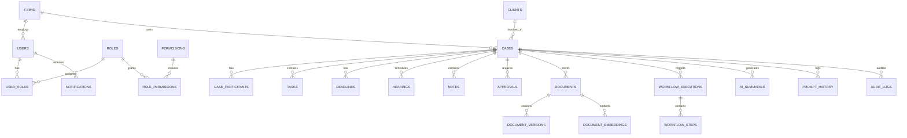

# Database Architecture

**LexFlow AI** — Data Layer Design  
**Version:** 1.0  
**Status:** Draft — Pre-Implementation  
**Last Updated:** 2026-07-06

---

## 1. Purpose

This document defines the PostgreSQL schema design, indexing strategy, data retention policies, and pgvector usage for LexFlow AI. PostgreSQL is the **single system of record** for all domain data, audit logs, and workflow execution state.

---

## 2. Design Principles

| Principle | Implementation |
|-----------|----------------|
| Single database, schema separation | Schemas per bounded context: `identity`, `cases`, `documents`, `workflows`, `ai`, `audit` |
| UUID primary keys | `gen_random_uuid()` — no sequential IDs exposed in APIs |
| Soft delete | `deleted_at TIMESTAMPTZ` on user-facing entities; hard delete only for GDPR erasure jobs |
| Optimistic concurrency | `version INTEGER NOT NULL DEFAULT 1` on mutable aggregates |
| Timestamps | `created_at`, `updated_at` (UTC) on all tables |
| Tenant isolation | `firm_id UUID NOT NULL` on all tenant-scoped tables (future multi-firm) |
| Audit immutability | `audit.audit_logs` — append-only, no UPDATE/DELETE for application roles |
| Event sourcing (partial) | Domain events in `shared.outbox_events` + `audit.domain_events` for critical aggregates |

---

## 3. Schema Overview



---

## 4. Schema: `identity`

### 4.1 `firms`

| Column | Type | Notes |
|--------|------|-------|
| id | UUID PK | |
| name | VARCHAR(255) | Law firm name |
| slug | VARCHAR(100) UNIQUE | URL-safe identifier |
| settings | JSONB | Firm-wide config |
| created_at | TIMESTAMPTZ | |
| updated_at | TIMESTAMPTZ | |

### 4.2 `users`

| Column | Type | Notes |
|--------|------|-------|
| id | UUID PK | |
| firm_id | UUID FK → firms | |
| email | VARCHAR(320) UNIQUE | |
| password_hash | VARCHAR(255) | Nullable when SSO-only |
| first_name | VARCHAR(100) | |
| last_name | VARCHAR(100) | |
| title | VARCHAR(100) | Attorney, Paralegal, etc. |
| bar_number | VARCHAR(50) | Nullable |
| entra_object_id | VARCHAR(255) | Future Microsoft Entra ID link |
| status | ENUM | `active`, `inactive`, `locked` |
| last_login_at | TIMESTAMPTZ | |
| mfa_enabled | BOOLEAN | |
| created_at | TIMESTAMPTZ | |
| updated_at | TIMESTAMPTZ | |
| deleted_at | TIMESTAMPTZ | Soft delete |

**Indexes:** `(firm_id, email)`, `(firm_id, status)`, `(entra_object_id)` WHERE NOT NULL

### 4.3 `roles`

| Column | Type | Notes |
|--------|------|-------|
| id | UUID PK | |
| firm_id | UUID FK | NULL = system role |
| name | VARCHAR(100) | `ManagingPartner`, `Attorney`, etc. |
| description | TEXT | |
| is_system | BOOLEAN | Cannot be deleted |

**Seed roles:** `SystemAdministrator`, `ManagingPartner`, `Attorney`, `AssociateAttorney`, `Paralegal`, `LegalAssistant`, `OperationsTeam`, `ITAdministrator`, `ComplianceOfficer`, `Client`

### 4.4 `permissions`

| Column | Type | Notes |
|--------|------|-------|
| id | UUID PK | |
| resource | VARCHAR(100) | `case`, `document`, `workflow` |
| action | VARCHAR(50) | `read`, `write`, `delete`, `approve` |
| scope | VARCHAR(50) | `own`, `team`, `firm`, `assigned` |

### 4.5 `user_roles` / `role_permissions`

Standard junction tables with composite unique constraints.

### 4.6 `refresh_tokens`

| Column | Type | Notes |
|--------|------|-------|
| id | UUID PK | |
| user_id | UUID FK | |
| token_hash | VARCHAR(255) | Hashed refresh token |
| expires_at | TIMESTAMPTZ | |
| revoked_at | TIMESTAMPTZ | |
| device_info | JSONB | User agent, IP |
| created_at | TIMESTAMPTZ | |

**Index:** `(user_id, expires_at)` — cleanup job removes expired tokens

---

## 5. Schema: `cases`

### 5.1 `clients`

| Column | Type | Notes |
|--------|------|-------|
| id | UUID PK | |
| firm_id | UUID FK | |
| type | ENUM | `individual`, `organization` |
| name | VARCHAR(255) | |
| email | VARCHAR(320) | |
| phone | VARCHAR(50) | |
| address | JSONB | Structured address |
| tax_id_encrypted | BYTEA | Encrypted at application layer |
| portal_user_id | UUID FK → users | Client portal access |
| metadata | JSONB | Custom fields |
| version | INTEGER | Optimistic concurrency |
| created_at | TIMESTAMPTZ | |
| updated_at | TIMESTAMPTZ | |
| deleted_at | TIMESTAMPTZ | |

### 5.2 `cases`

Central aggregate root.

| Column | Type | Notes |
|--------|------|-------|
| id | UUID PK | |
| firm_id | UUID FK | |
| client_id | UUID FK → clients | |
| case_number | VARCHAR(50) | Firm-internal matter number |
| title | VARCHAR(500) | |
| practice_area | VARCHAR(100) | Litigation, Corporate, IP, etc. |
| status | ENUM | `intake`, `active`, `on_hold`, `closed`, `archived` |
| priority | ENUM | `low`, `normal`, `high`, `urgent` |
| lead_attorney_id | UUID FK → users | |
| description | TEXT | |
| opened_at | TIMESTAMPTZ | |
| closed_at | TIMESTAMPTZ | |
| billing_code | VARCHAR(50) | |
| metadata | JSONB | |
| version | INTEGER | |
| created_at | TIMESTAMPTZ | |
| updated_at | TIMESTAMPTZ | |
| deleted_at | TIMESTAMPTZ | |

**Indexes:**
- `(firm_id, case_number)` UNIQUE
- `(firm_id, status, priority)` — dashboard queries
- `(lead_attorney_id, status)` — attorney caseload
- `(client_id)` — client matter list
- GIN on `metadata` for custom field search

### 5.3 `case_participants`

Matter walls — controls who can access a case.

| Column | Type | Notes |
|--------|------|-------|
| id | UUID PK | |
| case_id | UUID FK | |
| user_id | UUID FK | |
| role | ENUM | `lead`, `associate`, `paralegal`, `observer` |
| added_at | TIMESTAMPTZ | |
| added_by | UUID FK → users | |

**Unique:** `(case_id, user_id)`

### 5.4 `tasks`

| Column | Type | Notes |
|--------|------|-------|
| id | UUID PK | |
| case_id | UUID FK | |
| title | VARCHAR(500) | |
| description | TEXT | |
| status | ENUM | `pending`, `in_progress`, `completed`, `cancelled` |
| priority | ENUM | |
| assigned_to | UUID FK → users | |
| due_at | TIMESTAMPTZ | |
| completed_at | TIMESTAMPTZ | |
| created_by | UUID FK | |
| version | INTEGER | |
| created_at | TIMESTAMPTZ | |
| updated_at | TIMESTAMPTZ | |

**Index:** `(case_id, status, due_at)`, `(assigned_to, status, due_at)`

### 5.5 `deadlines`

| Column | Type | Notes |
|--------|------|-------|
| id | UUID PK | |
| case_id | UUID FK | |
| title | VARCHAR(500) | |
| deadline_at | TIMESTAMPTZ | |
| type | ENUM | `filing`, `discovery`, `statute_of_limitations`, `internal`, `other` |
| status | ENUM | `upcoming`, `met`, `missed`, `extended` |
| reminder_sent | BOOLEAN | |
| created_at | TIMESTAMPTZ | |

**Index:** `(firm_id via case join, deadline_at, status)` — calendar views

### 5.6 `hearings`

| Column | Type | Notes |
|--------|------|-------|
| id | UUID PK | |
| case_id | UUID FK | |
| title | VARCHAR(500) | |
| hearing_at | TIMESTAMPTZ | |
| location | VARCHAR(500) | |
| court | VARCHAR(255) | |
| judge | VARCHAR(255) | |
| notes | TEXT | |
| created_at | TIMESTAMPTZ | |

### 5.7 `notes`

| Column | Type | Notes |
|--------|------|-------|
| id | UUID PK | |
| case_id | UUID FK | |
| author_id | UUID FK → users | |
| content | TEXT | |
| is_pinned | BOOLEAN | |
| visibility | ENUM | `team`, `attorneys_only`, `private` |
| created_at | TIMESTAMPTZ | |
| updated_at | TIMESTAMPTZ | |

### 5.8 `case_timeline_events`

Denormalized timeline for fast UI rendering.

| Column | Type | Notes |
|--------|------|-------|
| id | UUID PK | |
| case_id | UUID FK | |
| event_type | VARCHAR(100) | `document_uploaded`, `task_completed`, etc. |
| title | VARCHAR(500) | |
| description | TEXT | |
| actor_id | UUID FK → users | |
| reference_type | VARCHAR(50) | Polymorphic: `document`, `task`, etc. |
| reference_id | UUID | |
| occurred_at | TIMESTAMPTZ | |
| metadata | JSONB | |

**Index:** `(case_id, occurred_at DESC)` — primary timeline query

---

## 6. Schema: `documents`

### 6.1 `documents`

| Column | Type | Notes |
|--------|------|-------|
| id | UUID PK | |
| case_id | UUID FK | |
| firm_id | UUID FK | Denormalized for partition queries |
| title | VARCHAR(500) | |
| document_type | ENUM | `pleading`, `contract`, `evidence`, `correspondence`, `invoice`, `other` |
| status | ENUM | `uploading`, `processing`, `ready`, `failed`, `archived` |
| current_version_id | UUID FK → document_versions | |
| s3_key | VARCHAR(1000) | Current version S3 path |
| mime_type | VARCHAR(100) | |
| file_size_bytes | BIGINT | |
| checksum_sha256 | VARCHAR(64) | Integrity verification |
| ocr_status | ENUM | `pending`, `completed`, `failed`, `skipped` |
| ocr_text | TEXT | Extracted text (encrypted column optional) |
| metadata | JSONB | Tags, custom fields |
| uploaded_by | UUID FK → users | |
| version | INTEGER | |
| created_at | TIMESTAMPTZ | |
| updated_at | TIMESTAMPTZ | |
| deleted_at | TIMESTAMPTZ | |

**Indexes:**
- `(case_id, document_type, status)`
- `(firm_id, created_at DESC)` — firm-wide document search
- GIN full-text on `title` + `ocr_text` via `tsvector` generated column

### 6.2 `document_versions`

| Column | Type | Notes |
|--------|------|-------|
| id | UUID PK | |
| document_id | UUID FK | |
| version_number | INTEGER | |
| s3_key | VARCHAR(1000) | |
| file_size_bytes | BIGINT | |
| checksum_sha256 | VARCHAR(64) | |
| change_summary | TEXT | |
| created_by | UUID FK | |
| created_at | TIMESTAMPTZ | |

**Unique:** `(document_id, version_number)`

### 6.3 `document_embeddings`

| Column | Type | Notes |
|--------|------|-------|
| id | UUID PK | |
| document_id | UUID FK | |
| chunk_index | INTEGER | |
| chunk_text | TEXT | Source chunk |
| embedding | vector(1536) | OpenAI ada-002 / text-embedding-3-small |
| model | VARCHAR(100) | Embedding model used |
| created_at | TIMESTAMPTZ | |

**Index:** HNSW or IVFFlat on `embedding` using `vector_cosine_ops`

```sql
CREATE INDEX idx_document_embeddings_vector
ON documents.document_embeddings
USING hnsw (embedding vector_cosine_ops)
WITH (m = 16, ef_construction = 64);
```

---

## 7. Schema: `workflows`

### 7.1 `workflow_definitions`

| Column | Type | Notes |
|--------|------|-------|
| id | UUID PK | |
| firm_id | UUID FK | NULL = system template |
| name | VARCHAR(255) | |
| slug | VARCHAR(100) | |
| description | TEXT | |
| n8n_workflow_id | VARCHAR(100) | Reference to n8n workflow |
| trigger_type | ENUM | `manual`, `event`, `schedule` |
| is_active | BOOLEAN | |
| config_schema | JSONB | User-configurable parameters |
| version | INTEGER | |
| created_at | TIMESTAMPTZ | |

### 7.2 `workflow_executions`

| Column | Type | Notes |
|--------|------|-------|
| id | UUID PK | |
| workflow_definition_id | UUID FK | |
| case_id | UUID FK | Nullable for firm-wide workflows |
| triggered_by | UUID FK → users | |
| status | ENUM | `queued`, `running`, `completed`, `failed`, `cancelled` |
| input_payload | JSONB | Sanitized input |
| output_payload | JSONB | Result from n8n callback |
| correlation_id | UUID | Distributed tracing |
| idempotency_key | VARCHAR(255) | Dedup |
| started_at | TIMESTAMPTZ | |
| completed_at | TIMESTAMPTZ | |
| error_message | TEXT | |
| retry_count | INTEGER | |
| created_at | TIMESTAMPTZ | |

**Indexes:**
- `(case_id, created_at DESC)`
- `(status, created_at)` — worker polling
- `(idempotency_key)` UNIQUE WHERE NOT NULL
- `(correlation_id)`

### 7.3 `workflow_steps`

| Column | Type | Notes |
|--------|------|-------|
| id | UUID PK | |
| execution_id | UUID FK | |
| step_name | VARCHAR(255) | |
| status | ENUM | |
| started_at | TIMESTAMPTZ | |
| completed_at | TIMESTAMPTZ | |
| metadata | JSONB | |

---

## 8. Schema: `ai`

### 8.1 `ai_summaries`

| Column | Type | Notes |
|--------|------|-------|
| id | UUID PK | |
| case_id | UUID FK | |
| document_id | UUID FK | Nullable — case-level summary |
| summary_type | ENUM | `case_overview`, `document_summary`, `deposition_summary`, `contract_review` |
| content | TEXT | Generated summary |
| model | VARCHAR(100) | |
| prompt_version | VARCHAR(50) | |
| status | ENUM | `generating`, `draft`, `approved`, `rejected` |
| approved_by | UUID FK → users | Human-in-the-loop |
| token_count | INTEGER | |
| created_at | TIMESTAMPTZ | |

### 8.2 `prompt_history`

| Column | Type | Notes |
|--------|------|-------|
| id | UUID PK | |
| case_id | UUID FK | |
| user_id | UUID FK | |
| prompt_template_id | UUID FK | |
| rendered_prompt | TEXT | Full prompt sent (PII-redacted copy) |
| response | TEXT | LLM response |
| model | VARCHAR(100) | |
| provider | ENUM | `openai`, `azure_openai`, `anthropic`, `ollama` |
| input_tokens | INTEGER | |
| output_tokens | INTEGER | |
| latency_ms | INTEGER | |
| status | ENUM | `success`, `error`, `filtered` |
| correlation_id | UUID | |
| created_at | TIMESTAMPTZ | |

**Partition:** Range partition by `created_at` (monthly) — high volume table

### 8.3 `prompt_templates`

| Column | Type | Notes |
|--------|------|-------|
| id | UUID PK | |
| name | VARCHAR(255) | |
| slug | VARCHAR(100) UNIQUE | |
| version | INTEGER | |
| template | TEXT | Jinja2 template |
| model_config | JSONB | Temperature, max_tokens, etc. |
| requires_approval | BOOLEAN | Human review before surfacing |
| is_active | BOOLEAN | |
| created_at | TIMESTAMPTZ | |

### 8.4 `llm_usage`

Monthly aggregation for cost tracking and compliance reporting.

| Column | Type | Notes |
|--------|------|-------|
| id | UUID PK | |
| firm_id | UUID FK | |
| user_id | UUID FK | |
| case_id | UUID FK | |
| provider | VARCHAR(50) | |
| model | VARCHAR(100) | |
| input_tokens | BIGINT | |
| output_tokens | BIGINT | |
| estimated_cost_usd | DECIMAL(10,6) | |
| period_start | DATE | |
| created_at | TIMESTAMPTZ | |

---

## 9. Schema: `audit`

### 9.1 `audit_logs`

Append-only. Application DB role has INSERT only — no UPDATE/DELETE.

| Column | Type | Notes |
|--------|------|-------|
| id | UUID PK | |
| firm_id | UUID FK | |
| actor_id | UUID FK → users | NULL for system actions |
| actor_type | ENUM | `user`, `system`, `worker`, `n8n` |
| action | VARCHAR(100) | `case.created`, `document.viewed`, etc. |
| resource_type | VARCHAR(100) | |
| resource_id | UUID | |
| case_id | UUID FK | Denormalized for case audit trail |
| ip_address | INET | |
| user_agent | TEXT | |
| before_state | JSONB | Nullable |
| after_state | JSONB | Nullable |
| metadata | JSONB | correlation_id, request_id |
| occurred_at | TIMESTAMPTZ | |

**Indexes:**
- `(case_id, occurred_at DESC)` — case audit trail
- `(firm_id, occurred_at DESC)` — firm-wide audit
- `(actor_id, occurred_at DESC)`
- `(resource_type, resource_id, occurred_at DESC)`

**Partition:** Range partition by `occurred_at` (monthly). Retain 7 years per legal compliance default.

### 9.2 `approvals`

| Column | Type | Notes |
|--------|------|-------|
| id | UUID PK | |
| case_id | UUID FK | |
| approval_type | ENUM | `ai_summary`, `document_send`, `workflow`, `invoice`, `other` |
| reference_type | VARCHAR(50) | |
| reference_id | UUID | |
| requested_by | UUID FK → users | |
| approver_id | UUID FK → users | |
| status | ENUM | `pending`, `approved`, `rejected`, `expired` |
| decision_note | TEXT | |
| decided_at | TIMESTAMPTZ | |
| expires_at | TIMESTAMPTZ | |
| created_at | TIMESTAMPTZ | |

---

## 10. Schema: `shared`

### 10.1 `outbox_events`

Transactional outbox pattern.

| Column | Type | Notes |
|--------|------|-------|
| id | UUID PK | |
| aggregate_type | VARCHAR(100) | |
| aggregate_id | UUID | |
| event_type | VARCHAR(100) | |
| payload | JSONB | |
| status | ENUM | `pending`, `published`, `failed` |
| created_at | TIMESTAMPTZ | |
| published_at | TIMESTAMPTZ | |

**Index:** `(status, created_at)` WHERE status = 'pending'

### 10.2 `notifications`

| Column | Type | Notes |
|--------|------|-------|
| id | UUID PK | |
| user_id | UUID FK | |
| case_id | UUID FK | Nullable |
| channel | ENUM | `in_app`, `email`, `teams` |
| title | VARCHAR(500) | |
| body | TEXT | |
| status | ENUM | `pending`, `sent`, `read`, `failed` |
| read_at | TIMESTAMPTZ | |
| metadata | JSONB | |
| created_at | TIMESTAMPTZ | |

**Index:** `(user_id, status, created_at DESC)`

### 10.3 `idempotency_keys`

| Column | Type | Notes |
|--------|------|-------|
| key | VARCHAR(255) PK | |
| response_status | INTEGER | Cached HTTP status |
| response_body | JSONB | Cached response |
| created_at | TIMESTAMPTZ | |
| expires_at | TIMESTAMPTZ | TTL 24 hours |

---

## 11. Indexing & Performance Strategy

| Pattern | Strategy |
|---------|----------|
| Case dashboard | Composite indexes on `(firm_id, status)`, partial indexes on active cases |
| Document search | PostgreSQL full-text (`tsvector`) + pgvector hybrid search |
| Audit queries | Partition pruning by date range |
| Timeline | `(case_id, occurred_at DESC)` covering index |
| Permission checks | Redis cache of user permission set; TTL 5 minutes |
| Connection pooling | PgBouncer in transaction mode — max 100 connections per API task |

**Read replicas:** RDS read replica for reporting queries and search — never for writes.

---

## 12. Data Retention

| Data Type | Retention | Mechanism |
|-----------|-----------|-----------|
| Active case data | Indefinite while case active | — |
| Closed cases | 7+ years (configurable per firm) | Archive to S3 Glacier after period |
| Audit logs | 7 years minimum | Partition drop after retention |
| Prompt history | 3 years | Partition drop |
| LLM usage | 5 years | Aggregate then drop detail |
| Notifications | 90 days | Scheduled cleanup job |
| Idempotency keys | 24 hours | TTL index |
| Refresh tokens | Until expiry + 7 days | Cleanup job |
| Document versions | All versions retained | S3 lifecycle for old versions → IA |

See [compliance-data-governance.md](./compliance-data-governance.md) for GDPR/CCPA erasure procedures.

---

## 13. Migration Strategy

- **Tool:** Alembic (Python)
- **Location:** `apps/api/alembic/versions/`
- **Naming:** `{timestamp}_{description}.py`
- **Rules:**
  - All migrations are reversible (downgrade defined)
  - No destructive migrations in production without dual-write period
  - Large table changes use concurrent index creation (`CREATE INDEX CONCURRENTLY`)
  - Schema changes require review from two engineers

---

## 14. Backup & Recovery

| Backup | Frequency | Retention |
|--------|-----------|-----------|
| RDS automated snapshots | Daily | 35 days |
| RDS transaction logs | Continuous | Point-in-time recovery to 5 minutes |
| S3 cross-region replication | Real-time | Indefinite (versioned) |
| Manual pre-deploy snapshot | Before each production deploy | 7 days |

See [disaster-recovery.md](./disaster-recovery.md).

---

## 15. Related Documents

- [domain-model.md](./domain-model.md)
- [high-level-architecture.md](./high-level-architecture.md)
- [compliance-data-governance.md](./compliance-data-governance.md)
- [ai-architecture.md](./ai-architecture.md)
