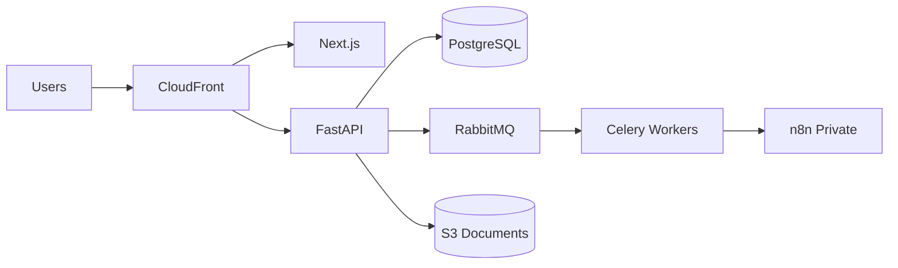
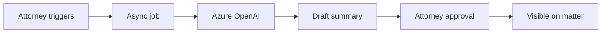

# LexFlow AI — Executive Presentation (15 Slides)

**Audience:** CTO · VP Engineering · Legal Operations · AI Director  
**Duration:** 20 minutes + Q&A  
**Format:** Slide outline with speaker notes

---

## Slide 1 — Title

**LexFlow AI**  
Enterprise Legal Automation Platform

*Speaker notes:*  
Open with the one-liner: "We eliminate repetitive legal work without replacing attorney judgment." Introduce yourself and the firm's deployment profile (500–2,000 attorneys). Set expectation: live demo available separately.

---

## Slide 2 — The Problem

**Large law firms lose 30–40% of associate time to non-billable manual work**

| Pain | Impact |
|------|--------|
| Manual intake | Delayed matters, data errors |
| Document chaos | Version confusion, missed deadlines |
| Email-driven workflows | No audit trail |
| AI tools without guardrails | Ethical and malpractice risk |

*Speaker notes:* Use insurance coverage dispute example — policy PDFs in email, summary in Word, approvals in Slack. Compliance officer cannot reconstruct access.

---

## Slide 3 — The Solution

**LexFlow AI — unified platform for matters, documents, AI, and workflows**

- Case hub with ethical walls
- Presigned document pipeline + OCR
- Human-in-the-loop AI summaries
- Event-driven automation (n8n)
- Immutable audit trail

*Speaker notes:* Emphasize **non-goals**: not auto-filing, not auto-sending to clients, not replacing attorneys.

---

## Slide 4 — Architecture (C4 Container)

*Speaker notes:* Stateless API scales horizontally. Workers handle OCR and AI async. n8n has **no database access** — orchestration only.

---

## Slide 5 — Technology Stack

| Layer | Choice | Why |
|-------|--------|-----|
| Frontend | Next.js 14 | SSR, SEO, TypeScript |
| API | FastAPI | Async, OpenAPI, Python AI ecosystem |
| Queue | RabbitMQ + Celery | Mature async pipeline |
| DB | PostgreSQL + pgvector | ACID, semantic search path |
| Storage | S3 / MinIO | Presigned uploads at scale |
| Orchestration | n8n (private) | Ops-configurable workflows |
| Observability | OTel + Grafana | Distributed traces |

*Speaker notes:* Monorepo with shared types. Python for domain + workers; TypeScript for UX.

---

## Slide 6 — Security

**Defense in depth for confidential legal data**

- JWT + Entra ID · RBAC · Matter walls (404 deny)
- Encryption in transit and at rest
- Rate limiting · PII log redaction
- Virus scan on upload · Presigned S3
- Append-only audit (7-year retention)
- n8n not public-facing

*Speaker notes:* Matter wall pen test requirement. SOC 2 alignment in progress. HIPAA = BAA + dedicated tenant if needed.

---

## Slide 7 — AI Strategy

**Augment, never auto-publish**

*Speaker notes:* Case-scoped context only. Token metering per firm. Prompt injection mitigations. Local dev uses stub LLM.

---

## Slide 8 — Workflow Automation

**FastAPI decides · n8n orchestrates**

- Transactional outbox → reliable events
- Document uploaded → notify team, Teams, email
- Approval chains with full audit
- Visual workflow editing for ops teams

*Speaker notes:* ADR-002 boundary prevents n8n from becoming shadow IT database. Promotion pipeline: dev → staging → prod with manual gate.

---

## Slide 9 — Observability

**Every request traceable end-to-end**

- `correlationId` from browser → API → worker → n8n callback
- JSON structured logs with PII redaction
- OpenTelemetry → Grafana Tempo / CloudWatch
- Alerts: 5xx rate, DLQ depth, RDS CPU

*Speaker notes:* Demo Grafana trace during technical deep dive. Compliance officer can correlate audit log entry to trace ID.

---

## Slide 10 — Scaling

| Scale | Approach |
|-------|----------|
| 100 users | 2 API + 2 worker tasks |
| 1,000 users | 10 API, autoscale workers on queue depth |
| 50k workflows/mo | Dedicated n8n pool, outbox batching |

**Targets:** 99.9% uptime · p95 API < 500ms

*Speaker notes:* PostgreSQL is first bottleneck — read replicas and audit partitioning. S3 unlimited for documents.

---

## Slide 11 — Roadmap

| Phase | Deliverables |
|-------|--------------|
| **Phase 1 (now)** | Auth, cases, documents, AI HITL, audit, n8n bootstrap |
| **Phase 2** | M365, pgvector RAG, email/Teams, intake automation |
| **Phase 3** | Contract review, billing integration, multi-region DR |
| **Phase 4** | Client portal, advanced analytics |

*Speaker notes:* Phase 1 exit criteria = production deploy + go-live checklist complete.

---

## Slide 12 — Business Value

| Metric | Year 1 Target |
|--------|---------------|
| Intake time reduction | 60% |
| Document search | < 2s p95 |
| Workflow adoption | 80% of eligible matters |
| AI approval rate | > 90% with minor edits |
| Platform availability | 99.9% |

*Speaker notes:* Frame as billable hour recovery — 200 associates × 2 hr/week saved = significant ROI.

---

## Slide 13 — ROI Model (Example)

**Mid-size firm — 500 attorneys**

| Assumption | Value |
|------------|-------|
| Associates saving 2 hr/week | 400 FTE equivalents |
| Blended rate | $350/hr |
| Weekly recovery | $280,000 |
| Platform cost | $500k/year |
| **Payback** | < 2 months |

*Speaker notes:* Conservative assumptions. Add risk reduction value — malpractice, compliance fines.

---

## Slide 14 — Future Vision

- **Institutional knowledge** captured in searchable, approved AI summaries
- **Client portal** with firm-controlled visibility
- **Predictive deadlines** from docket analysis
- **Multi-firm SaaS** with tenant isolation and data residency options
- **Responsible AI** certifications and firm-specific model policies

*Speaker notes:* Position LexFlow as platform, not point solution. Integration ecosystem (Clio, iManage) on roadmap.

---

## Slide 15 — Call to Action

**Next Steps**

1. Technical deep dive + live demo (20 min)
2. Security questionnaire review
3. Pilot firm selection (1 practice group)
4. 90-day Phase 1 deployment plan

**Contact:** support@lexflow.ai

*Speaker notes:* Ask for decision criteria — security review date, pilot practice area (litigation vs corporate), M365 integration priority.

---

## Appendix — Demo Handoff

Point audience to [DEMO_SCRIPT.md](./DEMO_SCRIPT.md) for live walkthrough.

---

## Related Docs

- [Product Overview](../product-overview.md)
- [Demo Script](./DEMO_SCRIPT.md)
- [Architecture Walkthrough](../interview/ARCHITECTURE_WALKTHROUGH.md)
