# Deployment Architecture

**LexFlow AI** — AWS Infrastructure & CI/CD  
**Version:** 1.0  
**Status:** Draft — Pre-Implementation  
**Last Updated:** 2026-07-06

---

## 1. Overview

LexFlow AI deploys to AWS using ECS Fargate for container orchestration, Terraform for infrastructure-as-code, and GitHub Actions for CI/CD. The architecture supports zero-downtime deployments, horizontal scaling, and environment isolation.

---

## 2. Environment Strategy

| Environment | Purpose | URL Pattern | Data |
|-------------|---------|-------------|------|
| **Local** | Developer machines | `localhost:3000/8000` | Docker Compose, seed data |
| **Dev** | Integration testing | `dev.lexflow.internal` | Synthetic data |
| **Staging** | Pre-production validation | `staging.lexflow.{domain}` | Anonymized production copy |
| **Production** | Live firm deployment | `app.lexflow.{domain}` | Real firm data |

Each environment has isolated VPC, RDS, Redis, RabbitMQ, and S3 buckets.

---

## 3. AWS Infrastructure

### 3.1 Regional Layout

| Region | Role |
|--------|------|
| us-east-1 | Primary — all production workloads |
| us-west-2 | DR standby — RDS cross-region replica, S3 replication |

### 3.2 VPC Design

```
VPC: 10.0.0.0/16
├── Public Subnets (10.0.1.0/24, 10.0.2.0/24)     — ALB, NAT Gateway
├── Private Subnets (10.0.10.0/24, 10.0.11.0/24)   — ECS tasks
└── Data Subnets (10.0.20.0/24, 10.0.21.0/24)      — RDS, Redis, MQ (no internet)
```

Multi-AZ deployment across 2 availability zones minimum.

### 3.3 ECS Fargate Services

| Service | Image | Min Tasks | Max Tasks | Scale Trigger |
|---------|-------|-----------|-----------|---------------|
| `web` | Next.js | 2 | 10 | CPU > 70% or requests > 1000/min |
| `api` | FastAPI | 2 | 20 | CPU > 70% or requests > 2000/min |
| `worker` | Celery | 2 | 30 | Queue depth > 100 |
| `n8n` | n8n | 1 | 2 | CPU > 80% |
| `outbox-publisher` | Celery Beat | 1 | 1 | — |

### 3.4 Container Specifications

| Service | CPU | Memory | Port |
|---------|-----|--------|------|
| web | 512 (0.5 vCPU) | 1024 MB | 3000 |
| api | 1024 (1 vCPU) | 2048 MB | 8000 |
| worker | 1024 (1 vCPU) | 2048 MB | — |
| n8n | 512 (0.5 vCPU) | 1024 MB | 5678 |

---

## 4. Terraform Structure

```
infra/terraform/
├── modules/
│   ├── vpc/                  # VPC, subnets, NAT, IGW
│   ├── ecs/                  # Cluster, services, task definitions
│   ├── rds/                  # PostgreSQL Multi-AZ
│   ├── elasticache/          # Redis cluster
│   ├── amazon_mq/            # RabbitMQ broker
│   ├── s3/                   # Document buckets
│   ├── alb/                  # Application Load Balancer
│   ├── cloudfront/           # CDN + WAF
│   ├── secrets/              # Secrets Manager resources
│   ├── monitoring/           # CloudWatch alarms, dashboards
│   └── ecr/                  # Container registries
├── environments/
│   ├── dev/
│   │   ├── main.tf
│   │   ├── variables.tf
│   │   └── terraform.tfvars
│   ├── staging/
│   └── production/
└── README.md
```

### 4.1 State Management

| Environment | Backend |
|-------------|---------|
| Dev | S3 + DynamoDB lock table |
| Staging | S3 + DynamoDB lock table |
| Production | S3 + DynamoDB lock table (separate bucket, MFA delete) |

---

## 5. CI/CD Pipeline

```mermaid
flowchart LR
    PR[Pull Request] --> LINT[Lint + Type Check]
    LINT --> TEST[Unit Tests]
    TEST --> BUILD[Build Docker Images]
    BUILD --> SCAN[Container Scan — Trivy]
    SCAN --> PUSH[Push to ECR]
    PUSH --> DEPLOY_STG[Deploy to Staging]
    DEPLOY_STG --> INT_TEST[Integration Tests]
    INT_TEST --> E2E[E2E Tests — Playwright]
    E2E --> APPROVAL[Manual Approval]
    APPROVAL --> DEPLOY_PROD[Deploy to Production]
    DEPLOY_PROD --> SMOKE[Smoke Tests]
    SMOKE --> MONITOR[Monitor 15 min]
```



### 5.1 GitHub Actions Workflows

| Workflow | Trigger | Actions |
|----------|---------|---------|
| `ci.yml` | PR to main | Lint, test, build, scan |
| `deploy-staging.yml` | Merge to main | Deploy all services to staging |
| `deploy-production.yml` | Manual dispatch + approval | Deploy to production |
| `deploy-n8n-workflows.yml` | Manual dispatch | Import n8n workflow JSON |
| `terraform-plan.yml` | PR touching infra/ | Terraform plan comment on PR |
| `terraform-apply.yml` | Merge to main (infra changes) | Terraform apply to staging |

### 5.2 Deployment Strategy

**Rolling update** with health checks:

1. New task definition registered
2. ECS launches new tasks (min 100% healthy before draining old)
3. ALB health check passes (`/health` endpoint)
4. Old tasks drained (30-second deregistration delay)
5. Old tasks stopped

**Database migrations:** Run Alembic migrations as a one-off ECS task before deploying new API version.

---

## 6. Docker

### 6.1 Multi-Stage Builds

```dockerfile
# Conceptual — apps/api/Dockerfile
# Stage 1: Build dependencies
FROM python:3.12-slim AS builder
WORKDIR /app
COPY pyproject.toml .
RUN pip install --no-cache-dir .

# Stage 2: Runtime
FROM python:3.12-slim AS runtime
RUN useradd --create-home appuser
WORKDIR /app
COPY --from=builder /usr/local/lib/python3.12/site-packages /usr/local/lib/python3.12/site-packages
COPY --from=builder /usr/local/bin /usr/local/bin
COPY src/ src/
USER appuser
EXPOSE 8000
CMD ["uvicorn", "src.main:app", "--host", "0.0.0.0", "--port", "8000"]
```

### 6.2 Local Development

```bash
# Start full local stack
docker compose up -d

# Services available:
#   web:      http://localhost:3000
#   api:      http://localhost:8000
#   n8n:      http://localhost:5678 (internal only)
#   postgres: localhost:5432
#   redis:    localhost:6379
#   rabbitmq: http://localhost:15672
#   minio:    http://localhost:9000
```

---

## 7. Health Checks

| Service | Endpoint | Interval | Timeout | Healthy Threshold |
|---------|----------|----------|---------|-------------------|
| web | `GET /api/health` | 30s | 5s | 2 |
| api | `GET /health` | 15s | 5s | 2 |
| worker | Celery inspect ping | 60s | 10s | 2 |
| n8n | `GET /healthz` | 30s | 5s | 2 |

Health endpoint returns:

```json
{
  "status": "healthy",
  "version": "1.2.3",
  "checks": {
    "database": "ok",
    "redis": "ok",
    "rabbitmq": "ok"
  }
}
```

---

## 8. SSL/TLS & DNS

| Component | Certificate |
|-----------|-------------|
| CloudFront | ACM certificate (us-east-1) |
| ALB | ACM certificate (regional) |
| Internal ALB (n8n) | Private ACM certificate |
| RDS | AWS-managed |

DNS managed via Route 53 with health checks for failover.

---

## 9. Related Documents

- [disaster-recovery.md](./disaster-recovery.md)
- [observability.md](./observability.md)
- [security-architecture.md](./security-architecture.md)
- [folder-structure.md](./folder-structure.md)
