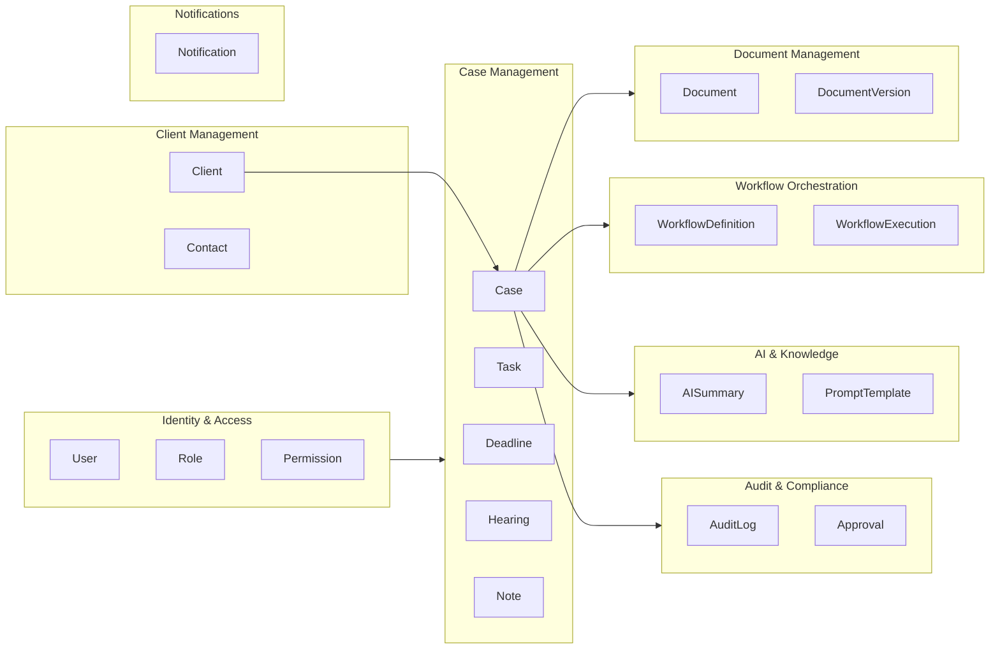
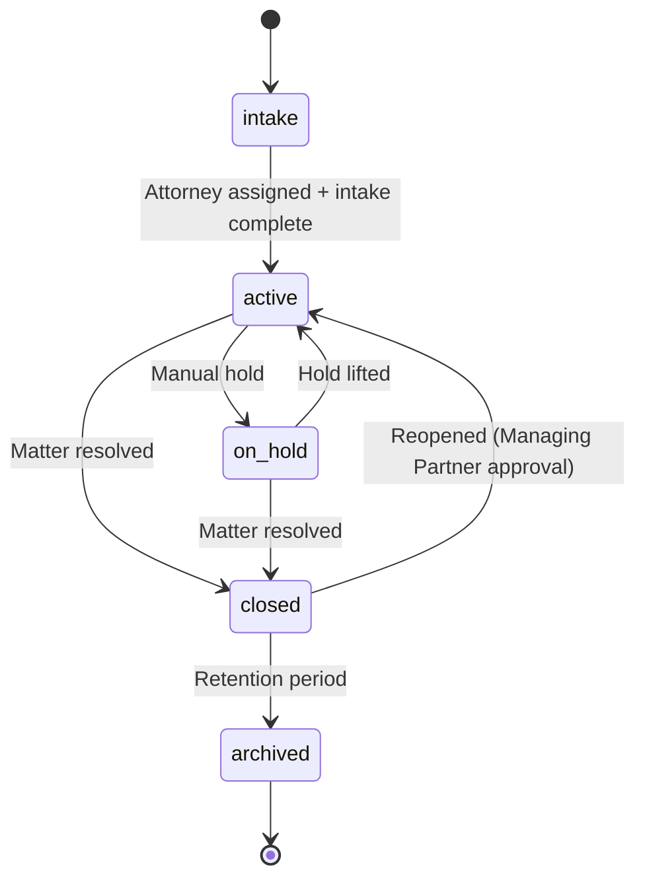

# Domain Model

**LexFlow AI** — Domain-Driven Design Reference  
**Version:** 1.0  
**Status:** Draft — Pre-Implementation  
**Last Updated:** 2026-07-06

---

## 1. Overview

LexFlow AI is organized around **Cases** (legal matters) as the central aggregate. All other entities either belong to a Case or support firm-wide operations (users, workflow templates, audit).

This document defines aggregates, entities, value objects, domain events, and bounded context boundaries.

---

## 2. Bounded Contexts



| Context | Owns | Publishes Events |
|---------|------|------------------|
| Identity & Access | Users, roles, sessions | `UserCreated`, `RoleAssigned` |
| Case Management | Cases, tasks, deadlines, hearings, notes | `CaseCreated`, `CaseStatusChanged`, `TaskCompleted`, `DeadlineApproaching` |
| Client Management | Clients, contacts | `ClientCreated`, `ClientUpdated` |
| Document Management | Documents, versions, embeddings | `DocumentUploaded`, `DocumentProcessed`, `OCRCompleted` |
| Workflow Orchestration | Definitions, executions | `WorkflowTriggered`, `WorkflowCompleted`, `WorkflowFailed` |
| AI & Knowledge | Summaries, prompts, usage | `SummaryGenerated`, `SummaryApproved`, `ResearchCompleted` |
| Audit & Compliance | Audit logs, approvals | `ApprovalRequested`, `ApprovalDecided` |
| Notifications | Notification delivery | `NotificationSent` |

---

## 3. Core Aggregate: Case

The **Case** is the aggregate root. External references to case internals should go through the Case aggregate or explicit application services that enforce invariants.

### 3.1 Case Entity

```
Case (Aggregate Root)
├── id: CaseId (UUID)
├── firmId: FirmId
├── clientId: ClientId
├── caseNumber: CaseNumber (value object — firm-unique)
├── title: string
├── practiceArea: PracticeArea (enum)
├── status: CaseStatus (enum)
├── priority: Priority (enum)
├── leadAttorneyId: UserId
├── participants: CaseParticipant[]
├── openedAt: datetime
├── closedAt: datetime | null
├── version: int (optimistic concurrency)
└── metadata: JSON
```

### 3.2 Case Invariants

1. A Case must have exactly one Client and one Lead Attorney at creation.
2. Case status transitions follow defined state machine (see §3.3).
3. Only participants on the case (or firm admins) may access case data — **matter wall**.
4. A closed Case cannot have new Tasks or Documents added without reopening.
5. Case number is immutable after assignment.

### 3.3 Case Status State Machine



### 3.4 Child Entities (within Case aggregate)

| Entity | Key Fields | Notes |
|--------|------------|-------|
| **Task** | title, status, assignedTo, dueAt | Completable work items |
| **Deadline** | title, deadlineAt, type, status | Legal deadlines with reminders |
| **Hearing** | title, hearingAt, location, court, judge | Scheduled court appearances |
| **Note** | content, authorId, visibility | Internal case notes |
| **CaseParticipant** | userId, role | Matter wall membership |
| **TimelineEvent** | eventType, title, occurredAt, reference | Denormalized audit-friendly timeline |

---

## 4. Client Aggregate

```
Client (Aggregate Root)
├── id: ClientId
├── firmId: FirmId
├── type: individual | organization
├── name: string
├── email: Email (value object)
├── phone: PhoneNumber (value object)
├── address: Address (value object)
├── portalUserId: UserId | null
├── contacts: Contact[] (for organizations)
└── version: int
```

**Invariant:** A Client linked to active Cases cannot be hard-deleted.

---

## 5. Document Aggregate

```
Document (Aggregate Root)
├── id: DocumentId
├── caseId: CaseId
├── title: string
├── documentType: DocumentType (enum)
├── status: DocumentStatus (enum)
├── currentVersion: DocumentVersion
├── versions: DocumentVersion[]
├── s3Key: string
├── ocrStatus: OCRStatus
├── ocrText: string | null
├── uploadedBy: UserId
└── version: int

DocumentVersion (Entity)
├── id: VersionId
├── versionNumber: int
├── s3Key: string
├── checksum: SHA256
└── createdBy: UserId
```

**Invariant:** Version numbers are monotonically increasing. Current version always points to latest.

---

## 6. Workflow Aggregate

```
WorkflowDefinition (Aggregate Root)
├── id: WorkflowDefinitionId
├── name: string
├── slug: string
├── n8nWorkflowId: string
├── triggerType: manual | event | schedule
├── isActive: boolean
└── configSchema: JSON Schema

WorkflowExecution (Aggregate Root)
├── id: ExecutionId
├── workflowDefinitionId: WorkflowDefinitionId
├── caseId: CaseId | null
├── status: ExecutionStatus
├── inputPayload: JSON
├── outputPayload: JSON | null
├── correlationId: UUID
├── idempotencyKey: string | null
├── steps: WorkflowStep[]
└── retryCount: int
```

**Invariant:** A WorkflowExecution in `completed` or `failed` status is immutable.

---

## 7. AI Summary Aggregate

```
AISummary (Aggregate Root)
├── id: SummaryId
├── caseId: CaseId
├── documentId: DocumentId | null
├── summaryType: SummaryType (enum)
├── content: string
├── status: generating | draft | approved | rejected
├── model: string
├── promptVersion: string
├── approvedBy: UserId | null
└── tokenCount: int
```

**Invariant:** A Summary cannot transition to `approved` without an authorized attorney action.

---

## 8. Approval Aggregate

```
Approval (Aggregate Root)
├── id: ApprovalId
├── caseId: CaseId
├── approvalType: ApprovalType (enum)
├── referenceType: string
├── referenceId: UUID
├── requestedBy: UserId
├── approverId: UserId
├── status: pending | approved | rejected | expired
├── decisionNote: string | null
└── expiresAt: datetime
```

---

## 9. Value Objects

| Value Object | Validation |
|--------------|------------|
| `Email` | RFC 5322 format, lowercased |
| `PhoneNumber` | E.164 format |
| `CaseNumber` | Firm-configured pattern (e.g., `YYYY-NNNNN`) |
| `Address` | Structured: street, city, state, zip, country |
| `SHA256` | 64-char hex checksum |
| `Money` | Decimal + currency code (for future billing integration) |
| `DateRange` | start ≤ end, timezone-aware |

---

## 10. Domain Events

All domain events follow the pattern: `{Aggregate}{Action}` in past tense.

### 10.1 Case Events

| Event | Payload | Triggers |
|-------|---------|----------|
| `CaseCreated` | caseId, clientId, leadAttorneyId, practiceArea | Intake workflow, notification to lead attorney |
| `CaseStatusChanged` | caseId, oldStatus, newStatus, changedBy | Timeline update, audit log |
| `CaseParticipantAdded` | caseId, userId, role | Notification to participant |
| `TaskCreated` | caseId, taskId, assignedTo, dueAt | Notification to assignee |
| `TaskCompleted` | caseId, taskId, completedBy | Timeline update |
| `DeadlineApproaching` | caseId, deadlineId, deadlineAt | Reminder notification (48h, 24h, 4h) |
| `DeadlineMissed` | caseId, deadlineId | Escalation notification to lead attorney |

### 10.2 Document Events

| Event | Payload | Triggers |
|-------|---------|----------|
| `DocumentUploaded` | caseId, documentId, documentType | OCR pipeline, timeline update |
| `DocumentProcessed` | caseId, documentId, ocrText | Embedding generation, AI summary eligibility |
| `DocumentVersionCreated` | documentId, versionNumber | Timeline update |

### 10.3 Workflow Events

| Event | Payload | Triggers |
|-------|---------|----------|
| `WorkflowTriggered` | executionId, workflowSlug, caseId | Celery task → n8n |
| `WorkflowCompleted` | executionId, outputPayload | Case update, notification |
| `WorkflowFailed` | executionId, errorMessage | DLQ alert, notification to ops |

### 10.4 AI Events

| Event | Payload | Triggers |
|-------|---------|----------|
| `SummaryGenerated` | summaryId, caseId, summaryType | Approval request if required |
| `SummaryApproved` | summaryId, approvedBy | Available in case UI |
| `SummaryRejected` | summaryId, rejectedBy, reason | Notification to requester |

### 10.5 Approval Events

| Event | Payload | Triggers |
|-------|---------|----------|
| `ApprovalRequested` | approvalId, approverId, referenceType | Notification to approver |
| `ApprovalDecided` | approvalId, status, decidedBy | Unblock dependent workflow step |

---

## 11. Ubiquitous Language

| Term | Definition | NOT Called |
|------|------------|------------|
| Case | A legal matter handled by the firm | Ticket, Issue, Project |
| Matter Wall | Access restriction on a case | Permission group |
| Client | Individual or organization receiving legal services | Customer, Account |
| Document | A file associated with a case | Attachment, File |
| Workflow | An automated sequence of steps | Automation, Bot |
| Summary | AI-generated text requiring human review | Report, Analysis |
| Approval | Explicit human authorization gate | Sign-off, OK |
| Participant | User assigned to a case with a role | Member, Assignee |
| Intake | Initial case creation process | Onboarding, Registration |
| Practice Area | Legal specialty (Litigation, Corporate, etc.) | Department, Team |

---

## 12. Context Mapping

| Upstream → Downstream | Relationship | Integration |
|-----------------------|--------------|-------------|
| Identity → Case Management | Customer-Supplier | UserId references, permission checks |
| Client Management → Case Management | Customer-Supplier | ClientId on Case |
| Case Management → Document Management | Customer-Supplier | CaseId on Document |
| Case Management → Workflow Orchestration | Customer-Supplier | Case events trigger workflows |
| Document Management → AI & Knowledge | Customer-Supplier | DocumentProcessed triggers embeddings/summaries |
| All contexts → Audit & Compliance | Conformist | All contexts emit audit events |
| Workflow Orchestration → Notifications | Customer-Supplier | Workflow completion triggers notifications |

---

## 13. Related Documents

- [database-architecture.md](./database-architecture.md)
- [event-driven-architecture.md](./event-driven-architecture.md)
- [api-architecture.md](./api-architecture.md)
- [workflow-orchestration.md](./workflow-orchestration.md)
