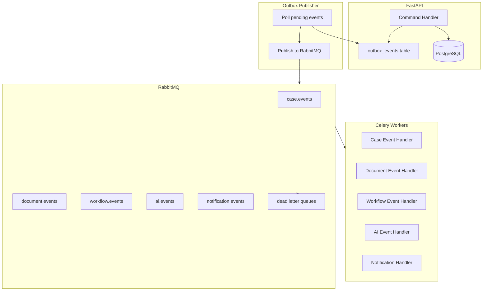
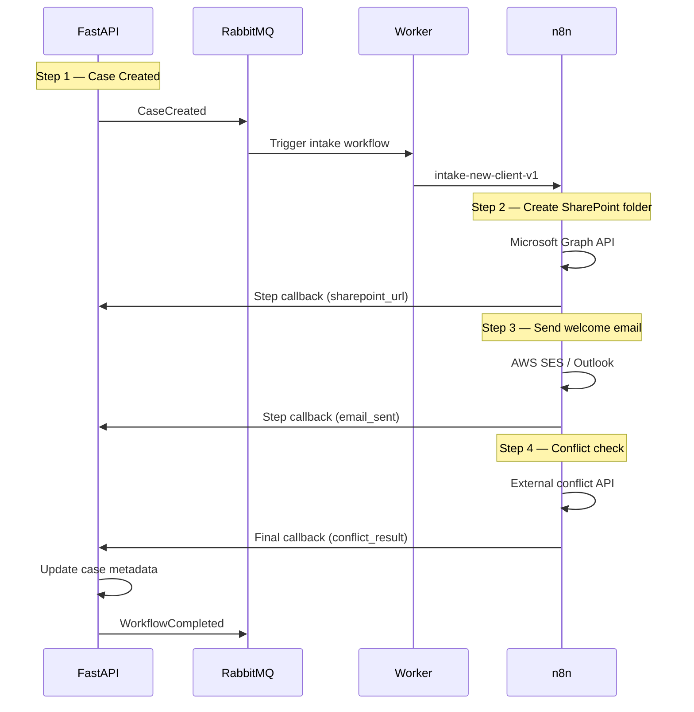

# Event-Driven Architecture

**LexFlow AI** — Events, Messaging & Sagas  
**Version:** 1.0  
**Status:** Draft — Pre-Implementation  
**Last Updated:** 2026-07-06

---

## 1. Overview

LexFlow AI uses event-driven architecture (EDA) to decouple bounded contexts, enable async processing, and ensure reliable side effects. Events flow through RabbitMQ with the transactional outbox pattern guaranteeing at-least-once delivery.

---

## 2. Event Flow Architecture



---

## 3. Transactional Outbox Pattern

Domain changes and event publication happen in a **single database transaction**:

```python
# Pseudocode
async def create_case(command, db):
    async with db.transaction():
        case = Case.create(command)
        db.add(case)

        event = OutboxEvent(
            aggregate_type="Case",
            aggregate_id=case.id,
            event_type="CaseCreated",
            payload=case.to_event_payload()
        )
        db.add(event)

    # Transaction committed — event is durable
    # Outbox publisher will pick it up asynchronously
```

### 3.1 Outbox Publisher

- Background Celery beat task polls `shared.outbox_events` WHERE status = 'pending'
- Publishes to appropriate RabbitMQ exchange
- Marks event as 'published' with timestamp
- Poll interval: 1 second
- Failed publishes retry with exponential backoff; after 5 failures → status 'failed' + alert

---

## 4. Message Broker Configuration

### 4.1 RabbitMQ Topology

```
Exchange: lexflow.events (topic)
├── Queue: case.events          ← routing key: case.*
├── Queue: document.events      ← routing key: document.*
├── Queue: workflow.events      ← routing key: workflow.*
├── Queue: ai.events            ← routing key: ai.*
├── Queue: notification.events  ← routing key: notification.*
├── Queue: audit.events         ← routing key: audit.*
└── DLX: lexflow.dlx (direct)
    ├── DLQ: case.events.dlq
    ├── DLQ: document.events.dlq
    ├── DLQ: workflow.events.dlq
    ├── DLQ: ai.events.dlq
    └── DLQ: notification.events.dlq
```

### 4.2 Queue Properties

| Property | Value |
|----------|-------|
| Durable | Yes |
| Auto-delete | No |
| Message TTL | 7 days |
| Max length | 100,000 messages (alert at 80%) |
| Dead letter exchange | lexflow.dlx |
| Prefetch count | 10 (per consumer) |

---

## 5. Event Catalog

### 5.1 Case Domain Events

| Event | Routing Key | Payload | Consumers |
|-------|-------------|---------|-----------|
| `CaseCreated` | `case.created` | caseId, clientId, leadAttorneyId, practiceArea | Workflow, Notification, Audit |
| `CaseStatusChanged` | `case.status_changed` | caseId, oldStatus, newStatus | Workflow, Timeline, Audit |
| `CaseParticipantAdded` | `case.participant_added` | caseId, userId, role | Notification, Audit |
| `TaskCreated` | `case.task_created` | caseId, taskId, assignedTo, dueAt | Notification |
| `TaskCompleted` | `case.task_completed` | caseId, taskId, completedBy | Timeline, Audit |
| `DeadlineApproaching` | `case.deadline_approaching` | caseId, deadlineId, deadlineAt, hoursRemaining | Notification, Workflow |
| `DeadlineMissed` | `case.deadline_missed` | caseId, deadlineId | Notification |

### 5.2 Document Domain Events

| Event | Routing Key | Payload | Consumers |
|-------|-------------|---------|-----------|
| `DocumentUploaded` | `document.uploaded` | caseId, documentId, documentType | Workflow, Timeline |
| `DocumentProcessed` | `document.processed` | caseId, documentId, ocrText | AI (embeddings), Timeline |
| `DocumentVersionCreated` | `document.version_created` | documentId, versionNumber | Timeline, Audit |

### 5.3 Workflow Domain Events

| Event | Routing Key | Payload | Consumers |
|-------|-------------|---------|-----------|
| `WorkflowTriggered` | `workflow.triggered` | executionId, workflowSlug, caseId | Celery (n8n invoke) |
| `WorkflowCompleted` | `workflow.completed` | executionId, outputPayload | Notification, Timeline, Audit |
| `WorkflowFailed` | `workflow.failed` | executionId, errorMessage | Notification, DLQ alert |

### 5.4 AI Domain Events

| Event | Routing Key | Payload | Consumers |
|-------|-------------|---------|-----------|
| `SummaryGenerated` | `ai.summary_generated` | summaryId, caseId, summaryType | Approval, Notification |
| `SummaryApproved` | `ai.summary_approved` | summaryId, approvedBy | Timeline |
| `EmbeddingCompleted` | `ai.embedding_completed` | documentId, chunkCount | — (informational) |

### 5.5 Notification Events

| Event | Routing Key | Payload | Consumers |
|-------|-------------|---------|-----------|
| `NotificationRequested` | `notification.requested` | userId, channel, title, body | Notification Handler |
| `ApprovalRequested` | `notification.approval_requested` | approvalId, approverId | Notification Handler |

---

## 6. Event Handler Patterns

### 6.1 Idempotent Consumer

Every event handler must be idempotent — processing the same event twice produces the same result:

```python
async def handle_case_created(event, db):
    # Check if already processed
    if await db.exists(ProcessedEvent, event_id=event.id):
        return  # Already handled

    async with db.transaction():
        # Process event
        await create_timeline_entry(event.payload)
        await send_notification(event.payload)

        # Mark as processed
        db.add(ProcessedEvent(event_id=event.id))
```

### 6.2 Event Schema

All events follow a standard envelope:

```json
{
  "eventId": "uuid",
  "eventType": "CaseCreated",
  "aggregateType": "Case",
  "aggregateId": "uuid",
  "firmId": "uuid",
  "occurredAt": "2026-07-06T08:00:00Z",
  "correlationId": "uuid",
  "causationId": "uuid",
  "version": 1,
  "payload": { ... }
}
```

---

## 7. Saga Pattern (Multi-Step Workflows)

Complex workflows spanning multiple services use the **orchestration saga** pattern (coordinated by FastAPI, executed via n8n):

### Example: New Client Intake Saga



**Compensation:** If a saga step fails, FastAPI marks the execution as failed. Partial results are preserved. Manual retry or rollback is initiated by ops — no automatic compensation in Phase 1.

---

## 8. Scheduled Events

Celery Beat schedules periodic tasks that emit events:

| Schedule | Task | Event Generated |
|----------|------|-----------------|
| Every hour | Check approaching deadlines | `DeadlineApproaching` (48h, 24h, 4h thresholds) |
| Daily 06:00 UTC | Check missed deadlines | `DeadlineMissed` |
| Daily 02:00 UTC | Cleanup expired tokens | — (maintenance) |
| Daily 03:00 UTC | Cleanup expired idempotency keys | — (maintenance) |
| Weekly | LLM usage aggregation | — (reporting) |

---

## 9. Monitoring Events

| Metric | Alert Threshold |
|--------|----------------|
| Outbox pending events age | > 30 seconds |
| Queue depth (any queue) | > 1,000 messages |
| DLQ depth (any DLQ) | > 0 messages |
| Consumer lag | > 60 seconds |
| Event processing error rate | > 1% over 5 minutes |
| Outbox publisher failures | > 3 consecutive |

---

## 10. Related Documents

- [domain-model.md](./domain-model.md) — domain events
- [workflow-orchestration.md](./workflow-orchestration.md)
- [database-architecture.md](./database-architecture.md) — outbox schema
- [observability.md](./observability.md)
- [high-level-architecture.md](./high-level-architecture.md)
