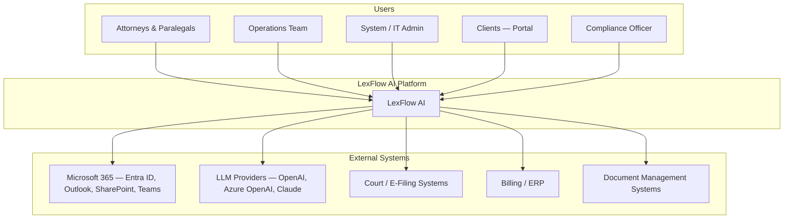
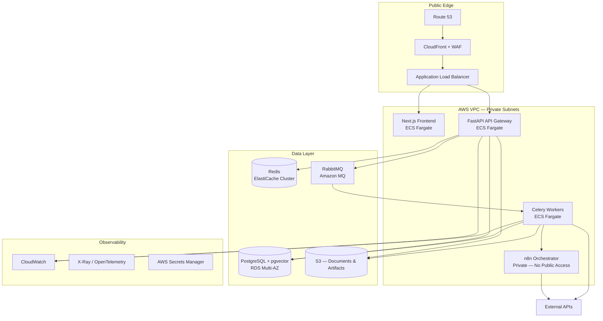

# High-Level Architecture

**LexFlow AI** — Enterprise AI Automation Platform for Law Firms  
**Version:** 1.0  
**Status:** Draft — Pre-Implementation  
**Last Updated:** 2026-07-06

---

## 1. Purpose

This document describes the system architecture for LexFlow AI at the level required for engineering onboarding, security review, and infrastructure planning. It defines boundaries, data flows, technology choices, and non-functional requirements for deployment inside a large US law firm (e.g., Freeman Mathis & Gary LLP).

LexFlow AI eliminates repetitive manual work performed by lawyers, paralegals, legal assistants, and operations teams. It does **not** replace legal judgment.

---

## 2. Architectural Goals

| Goal | Target |
|------|--------|
| Concurrent users | 1,000+ |
| Workflow executions | 50,000+ / month |
| Documents stored | Millions |
| Audit log entries | Millions (append-only, retained per policy) |
| Availability | 99.9% (three nines) |
| RPO (Recovery Point Objective) | ≤ 15 minutes |
| RTO (Recovery Time Objective) | ≤ 4 hours |
| Deployment | Zero-downtime rolling updates |
| Scaling | Horizontal across all stateless tiers |

---

## 3. System Context (C4 Level 1)



---

## 4. Container Diagram (C4 Level 2)



---

## 5. Request Flow — Synchronous Path

Used for reads, lightweight writes, and operations requiring immediate user feedback.

```
Browser
  → CloudFront (static assets + SSR)
  → ALB
  → Next.js (BFF pattern — optional thin proxy)
  → FastAPI (Authentication + Authorization enforced here)
  → PostgreSQL / Redis (cache)
  → Response
```

**Rules:**
- Frontend **never** calls n8n, RabbitMQ, or internal worker endpoints directly.
- All API calls carry a JWT access token; refresh tokens are httpOnly cookies or secure storage.
- RBAC is enforced at the FastAPI layer before any domain handler executes.

---

## 6. Request Flow — Asynchronous Path (Primary for Automation)

Used for document processing, AI inference, workflow triggers, bulk operations, and notifications.

```
Frontend
  ↓  POST /api/v1/cases/{id}/workflows/trigger
FastAPI
  ↓  Validate + Authorize + Persist Intent (Outbox)
  ↓  Publish domain event to RabbitMQ
  ↓  Return 202 Accepted + correlationId
Celery Worker
  ↓  Consume message (idempotent handler)
  ↓  Execute domain logic in FastAPI service layer (shared Python packages)
  ↓  Invoke n8n webhook (internal VPC only) with signed payload
n8n
  ↓  Orchestrate external calls (Outlook, SharePoint, webhooks)
  ↓  Callback to FastAPI internal webhook (HMAC-signed)
FastAPI (internal endpoint)
  ↓  Persist results, emit events, write audit log
  ↓  Push notification via WebSocket / SSE / polling
Frontend
  ↓  User sees updated case timeline
```

---

## 7. Layer Responsibilities

### 7.1 Frontend (Next.js)

| Responsibility | Technology |
|----------------|------------|
| UI rendering | Next.js 14+ App Router, React 18+ |
| Styling | Tailwind CSS, ShadCN UI |
| Client state | Zustand (UI/ephemeral), React Query (server state) |
| Auth session | Token refresh flow via FastAPI |
| Real-time updates | SSE or WebSocket via FastAPI |

**Does NOT:** contain business rules, call n8n, store secrets, or perform AI inference.

### 7.2 Backend (FastAPI)

| Responsibility | Pattern |
|----------------|---------|
| All business logic | Domain-Driven Design, Clean/Hexagonal Architecture |
| API surface | REST (OpenAPI 3.1), versioned `/api/v1` |
| Authorization | RBAC middleware + resource-level policies |
| Validation | Pydantic v2 models |
| Persistence | SQLAlchemy 2.0 + Alembic migrations |
| CQRS | Command/query separation where read models benefit (search, dashboards) |
| Events | Transactional outbox → RabbitMQ |

**Bounded contexts (initial):**
- Identity & Access
- Case Management
- Client Management
- Document Management
- Workflow Orchestration
- AI & Knowledge
- Notifications
- Audit & Compliance

### 7.3 Automation Layer (n8n)

n8n is an **orchestration engine only**.

| n8n MAY do | n8n MUST NOT do |
|------------|-----------------|
| Call external APIs (Outlook, Teams, SharePoint) | Contain business rules or legal logic |
| Transform payloads for external systems | Store authoritative case/client data |
| Retry HTTP calls with configured backoff | Be exposed to the public internet |
| Route based on simple flags from FastAPI | Make authorization decisions |
| Emit callbacks to FastAPI internal webhooks | Directly write to PostgreSQL |

Workflow definitions live in `n8n/workflows/` (version-controlled JSON). Promotion: dev → staging → production via CI/CD with manual approval gate.

### 7.4 Queue & Workers

| Component | Role |
|-----------|------|
| RabbitMQ | Durable queues, dead-letter exchanges (DLQ), priority queues for urgent deadlines |
| Celery | Task execution, retry policies, task routing by queue |
| Redis | Celery result backend (non-authoritative), rate limiting, distributed locks |

**Queue naming convention:** `{domain}.{action}.{priority}`  
Example: `document.process.high`, `workflow.trigger.normal`

### 7.5 Data Stores

| Store | Purpose |
|-------|---------|
| PostgreSQL | System of record — all domain entities, audit logs, workflow state |
| pgvector | Document embeddings, knowledge base semantic search |
| Redis | Cache, session adjunct, rate limits, Celery broker adjunct |
| S3 | Document binaries, export artifacts, AI prompt/response archives (encrypted) |

---

## 8. AI Architecture Summary

AI capabilities are invoked **only** through the FastAPI AI bounded context. See [ai-architecture.md](./ai-architecture.md) for full detail.

```
FastAPI AI Service
  → Provider abstraction (OpenAI / Azure OpenAI / Claude / Ollama)
  → Prompt registry (versioned, audited)
  → Token usage metering → LLMUsage table
  → Output validation + PII redaction pipeline
  → Human-in-the-loop for high-risk outputs (contract review, client-facing summaries)
```

Embeddings are stored in pgvector. Raw LLM responses for legal work product are persisted with case linkage for audit and reproducibility.

---

## 9. Security Architecture Summary

See [security-architecture.md](./security-architecture.md) and [authentication-authorization.md](./authentication-authorization.md).

| Control | Implementation |
|---------|----------------|
| Authentication | JWT access + refresh tokens; future Microsoft Entra ID (OIDC) |
| Authorization | RBAC + ABAC for case-level access (matter walls) |
| Encryption at rest | RDS encryption, S3 SSE-KMS, ElastiCache encryption |
| Encryption in transit | TLS 1.2+ everywhere |
| Secrets | AWS Secrets Manager — never in code or n8n credentials in repo |
| Network | n8n in private subnet; security groups deny public ingress |
| Audit | Immutable audit log stream; all AI invocations logged |

---

## 10. Deployment Topology (AWS)

```
Region: us-east-1 (primary) — us-west-2 (DR standby)

├── Route 53 (DNS + health checks)
├── CloudFront (CDN, WAF, Shield Standard)
├── ALB (HTTPS termination, path-based routing)
├── ECS Fargate Cluster
│   ├── web-service (Next.js) — min 2 tasks, auto-scale on CPU/requests
│   ├── api-service (FastAPI) — min 2 tasks, auto-scale
│   ├── worker-service (Celery) — scale on queue depth
│   └── n8n-service — min 1 task, internal ALB only
├── RDS PostgreSQL Multi-AZ (db.r6g.xlarge → scale up)
├── ElastiCache Redis (cluster mode)
├── Amazon MQ (RabbitMQ, active/standby)
├── S3 (versioned, lifecycle policies)
├── Secrets Manager
└── CloudWatch + X-Ray
```

Infrastructure is defined in Terraform under `infra/terraform/`. See [deployment-architecture.md](./deployment-architecture.md).

---

## 11. Cross-Cutting Concerns

| Concern | Approach |
|---------|----------|
| **Idempotency** | `Idempotency-Key` header on mutating APIs; dedup table in PostgreSQL |
| **Optimistic concurrency** | `version` column on Cases, Documents, Tasks — ETag support |
| **Retry** | Exponential backoff in Celery; n8n retry nodes for external HTTP |
| **Dead letter queues** | All RabbitMQ queues have DLQ; alerting on DLQ depth |
| **Caching** | Redis for permission sets, reference data; Cache-Control on static assets |
| **Distributed tracing** | OpenTelemetry trace ID propagated: Frontend → API → Queue → Worker → n8n callback |
| **Structured logging** | JSON logs with `correlationId`, `userId`, `caseId`, `tenantId` |
| **Feature flags** | LaunchDarkly or env-based flags for gradual rollout |

---

## 12. Integration Points

| System | Direction | Pattern |
|--------|-----------|---------|
| Microsoft Entra ID | Inbound auth | OIDC / SAML (future) |
| Outlook / Exchange | Bidirectional | Microsoft Graph via n8n + FastAPI |
| SharePoint / OneDrive | Bidirectional | Microsoft Graph |
| Teams | Outbound notifications | Webhook / Graph |
| OpenAI / Azure OpenAI | Outbound | FastAPI AI service (direct) |
| Court e-filing | Outbound | n8n orchestration |
| Billing system | Outbound | Event-driven export |
| External DMS | Bidirectional | Adapter pattern in FastAPI |

See [integration-architecture.md](./integration-architecture.md).

---

## 13. What This Architecture Explicitly Avoids

1. **Business logic in n8n** — n8n is a dumb pipe with retries.
2. **Public n8n exposure** — attack surface reduction.
3. **Frontend-to-n8n calls** — bypasses auth and audit.
4. **Synchronous AI calls in request path** — always async with status polling.
5. **Monolithic database per microservice** — single PostgreSQL with schema separation by bounded context (modular monolith first; extract services only when proven necessary).
6. **Shared mutable state in workers** — all state in PostgreSQL or S3.

---

## 14. Evolution Path

| Phase | Scope |
|-------|-------|
| **Phase 1 — MVP** | Case intake, document upload, AI summary, basic workflow, RBAC, audit |
| **Phase 2** | Contract review, legal research, Microsoft 365 integration, client portal |
| **Phase 3** | Entra ID SSO, advanced analytics, multi-office tenancy, DR failover automation |
| **Phase 4** | Extract high-load bounded contexts to independent services if metrics justify |

The initial deployment is a **modular monolith** (FastAPI with bounded context modules) to reduce operational complexity while preserving clean boundaries for future extraction.

---

## 15. Related Documents

| Document | Description |
|----------|-------------|
| [product-overview.md](./product-overview.md) | Vision, users, capabilities |
| [domain-model.md](./domain-model.md) | Entities, aggregates, events |
| [database-architecture.md](./database-architecture.md) | Schema, indexes, retention |
| [api-architecture.md](./api-architecture.md) | REST conventions, versioning |
| [security-architecture.md](./security-architecture.md) | Threat model, controls |
| [workflow-orchestration.md](./workflow-orchestration.md) | n8n patterns, contracts |
| [ai-architecture.md](./ai-architecture.md) | LLM providers, prompts, safety |
| [event-driven-architecture.md](./event-driven-architecture.md) | Events, outbox, sagas |
| [deployment-architecture.md](./deployment-architecture.md) | AWS, Terraform, CI/CD |
| [observability.md](./observability.md) | Logging, tracing, alerting |
| [disaster-recovery.md](./disaster-recovery.md) | HA, backup, failover |

---

## 16. Architecture Decision Records

Significant decisions are captured in [adr/](./adr/). See [adr/README.md](./adr/README.md).
