# Integration Architecture

**LexFlow AI** — External System Integration  
**Version:** 1.0  
**Status:** Draft — Pre-Implementation  
**Last Updated:** 2026-07-06

---

## 1. Overview

LexFlow AI integrates with external systems through an **adapter pattern** in FastAPI (for business logic) and **n8n** (for HTTP orchestration). All integrations are firm-configurable and credentials are stored in AWS Secrets Manager.

---

## 2. Integration Map

```mermaid
flowchart TB
    subgraph LexFlow["LexFlow AI"]
        API[FastAPI Adapters]
        N8N[n8n Orchestrator]
    end

    subgraph Microsoft["Microsoft 365"]
        ENTRA[Entra ID — SSO]
        OUTLOOK[Outlook / Exchange]
        SP[SharePoint / OneDrive]
        TEAMS[Microsoft Teams]
        GRAPH[Microsoft Graph API]
    end

    subgraph AIProviders["AI Providers"]
        AZURE[Azure OpenAI]
        OPENAI[OpenAI]
        CLAUDE[Anthropic Claude]
    end

    subgraph AWS["AWS Services"]
        S3[S3 — Documents]
        SES[SES — Email]
        SM[Secrets Manager]
    end

    subgraph External["External Legal Systems"]
        COURT[Court E-Filing]
        CONFLICT[Conflict Check System]
        BILLING[Billing / ERP]
        DMS[Document Management System]
    end

    API --> ENTRA
    API --> AZURE
    API --> OPENAI
    API --> CLAUDE
    API --> S3
    API --> SES
    API --> SM

    N8N --> GRAPH
    N8N --> OUTLOOK
    N8N --> SP
    N8N --> TEAMS
    N8N --> SES
    N8N --> COURT
    N8N --> CONFLICT
    N8N --> BILLING
    N8N --> DMS
```



---

## 3. Microsoft 365 Integration

Primary integration target — most large US law firms run on Microsoft 365.

### 3.1 Microsoft Entra ID (Phase 3)

| Aspect | Detail |
|--------|--------|
| Protocol | OpenID Connect |
| Purpose | SSO authentication |
| Implementation | FastAPI adapter — see [authentication-authorization.md](./authentication-authorization.md) |
| Scopes | `openid`, `profile`, `email` |

### 3.2 Microsoft Graph API (Phase 2)

| Feature | Graph Endpoint | Orchestrated By |
|---------|---------------|-----------------|
| Send email | `POST /me/sendMail` | n8n |
| Read inbox (intake) | `GET /me/messages` | n8n (scheduled) |
| Create SharePoint folder | `POST /sites/{id}/drive/items/{id}/children` | n8n |
| Upload to SharePoint | `PUT /sites/{id}/drive/items/{id}/content` | n8n |
| Teams notification | `POST /teams/{id}/channels/{id}/messages` | n8n |
| Calendar events (hearings) | `POST /me/events` | n8n |

**Authentication:** OAuth 2.0 client credentials flow (application permissions) for service-level access. Delegated permissions for user-context actions.

**Credentials:** `{firm}-microsoft-graph` in Secrets Manager.

### 3.3 SharePoint Document Sync

Optional bidirectional sync between LexFlow documents and SharePoint:

```
DocumentUploaded (LexFlow)
  → n8n: Upload to case SharePoint folder
  → Callback: sharepointItemId stored in document metadata

SharePoint file modified (webhook)
  → n8n: Download updated file
  → FastAPI callback: Create new DocumentVersion
```

Sync is **opt-in per case** — configured by lead attorney.

---

## 4. AI Provider Integration

See [ai-architecture.md](./ai-architecture.md) for full detail.

| Provider | Adapter Location | Auth |
|----------|-----------------|------|
| Azure OpenAI | `services/ai_knowledge/infrastructure/azure_openai.py` | API key from Secrets Manager |
| OpenAI | `services/ai_knowledge/infrastructure/openai_provider.py` | API key from Secrets Manager |
| Anthropic | `services/ai_knowledge/infrastructure/anthropic_provider.py` | API key from Secrets Manager |
| Ollama | `services/ai_knowledge/infrastructure/ollama_provider.py` | Local — dev only |

All adapters implement the `LLMProvider` protocol for interchangeability.

---

## 5. AWS Service Integration

| Service | Purpose | Access Method |
|---------|---------|---------------|
| S3 | Document storage | boto3 via IAM role (ECS task role) |
| SES | Transactional email | boto3 — domain verified in SES |
| Secrets Manager | Credential storage | boto3 — cached in memory with TTL |
| CloudWatch | Logging & metrics | aws-otel-collector sidecar |
| KMS | Encryption keys | boto3 — envelope encryption for PII fields |

---

## 6. Court E-Filing Integration (Phase 4)

Adapter-based integration with court electronic filing systems:

```
FastAPI Adapter Interface:
  ├── submit_filing(case_id, documents, filing_type) → filing_receipt
  ├── check_filing_status(filing_id) → status
  └── list_required_forms(court, case_type) → form_list
```

Initial target: state-specific adapters (varies by jurisdiction). n8n orchestrates the HTTP calls; FastAPI validates filing requirements and persists receipts.

---

## 7. Conflict Check Integration (Phase 2)

```
CaseCreated event
  → n8n: conflict-check-v1 workflow
  → External conflict check API (firm-specific)
  → Callback to FastAPI with results
  → If conflict found: flag case, notify Managing Partner
```

Adapter interface allows plugging in different conflict check systems per firm.

---

## 8. Billing System Integration (Phase 4)

Event-driven export — LexFlow does NOT replace the billing system:

| LexFlow Event | Billing Action |
|---------------|---------------|
| `CaseCreated` | Create matter in billing system |
| `TaskCompleted` | Export time entry (if time tracking enabled) |
| `CaseStatusChanged(closed)` | Trigger final billing review |
| `DocumentUploaded` | Log document receipt (if billable) |

Export format: JSON via REST adapter or CSV batch export (configurable).

---

## 9. Adapter Pattern

All external integrations follow a consistent adapter pattern:

```python
# services/shared/integration/base.py
class ExternalAdapter(Protocol):
    async def health_check(self) -> HealthStatus: ...
    async def configure(self, config: AdapterConfig) -> None: ...

# services/document_management/infrastructure/sharepoint_adapter.py
class SharePointAdapter(ExternalAdapter):
    async def create_folder(self, case_number: str) -> FolderResult: ...
    async def upload_file(self, folder_id: str, file: bytes, name: str) -> UploadResult: ...
    async def download_file(self, item_id: str) -> bytes: ...
```

### 9.1 Adapter Registry

Firm administrators configure which adapters are active:

```json
{
  "integrations": {
    "sharepoint": {"enabled": true, "site_id": "..."},
    "outlook": {"enabled": true},
    "teams": {"enabled": true},
    "court_efiling": {"enabled": false},
    "billing": {"enabled": false, "adapter": "elite_enterprise"},
    "conflict_check": {"enabled": true, "adapter": "firm_specific"}
  }
}
```

Stored in `firms.settings` JSONB column.

---

## 10. Integration Error Handling

| Scenario | Handling |
|----------|----------|
| External API down | Retry 3x via n8n → mark workflow step failed → alert ops |
| Auth token expired | Adapter refreshes token automatically; if refresh fails → alert IT Admin |
| Rate limited by external API | Backoff + retry; queue depth alert if sustained |
| Partial success (multi-step) | Preserve completed steps; mark execution as failed; manual retry |
| Data format mismatch | Log error, reject callback, alert ops |

---

## 11. Webhook Security (Inbound)

External systems calling LexFlow (future):

| Control | Implementation |
|---------|----------------|
| Authentication | HMAC signature or API key per integration |
| IP allowlisting | WAF rule for known integration partner IPs |
| Payload validation | JSON Schema validation per webhook type |
| Rate limiting | Per-integration rate limits |

---

## 12. Related Documents

- [workflow-orchestration.md](./workflow-orchestration.md)
- [ai-architecture.md](./ai-architecture.md)
- [security-architecture.md](./security-architecture.md)
- [authentication-authorization.md](./authentication-authorization.md)
