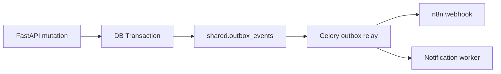

# LexFlow AI — Architecture Walkthrough (CTO Briefing)

**Audience:** CTO, VP Engineering, Principal Architect  
**Duration:** 45–60 minutes  
**Companion:** [High-Level Architecture](../high-level-architecture.md), [Component Architecture](../03-architecture/component-architecture.md)

---

## 1. Architectural Style Overview

LexFlow AI combines **Clean Architecture**, **Domain-Driven Design (DDD)**, and **Hexagonal (Ports & Adapters)** in a pragmatic monorepo — optimized for a small platform team shipping enterprise legal software.

```
┌─────────────────────────────────────────────────────────┐
│  Presentation — Next.js (App Router) + API routes       │
├─────────────────────────────────────────────────────────┤
│  Application — FastAPI routers → Services               │
├─────────────────────────────────────────────────────────┤
│  Domain — Models, RBAC rules, matter wall policy        │
├─────────────────────────────────────────────────────────┤
│  Infrastructure — PostgreSQL, Redis, S3, RabbitMQ, LLM  │
└─────────────────────────────────────────────────────────┘
         ↑ adapters implement ports (StorageClient, CacheClient)
```

**Why not microservices?** Single deployable API + worker pool reduces operational overhead for Phase 1. Bounded contexts are **schema-separated** in one PostgreSQL instance — extraction path exists when team scale demands it.

---

## 2. Domain-Driven Design

### Bounded Contexts (PostgreSQL schemas)

| Schema | Aggregate Roots | Integration |
|--------|-------------------|-------------|
| `identity` | Firm, User, Role | JWT claims |
| `cases` | Case, Task, Deadline | Events to audit, notify |
| `clients` | Client | FK from cases |
| `documents` | Document, Version | Events to AI, workflows |
| `ai` | Summary, PromptTemplate | Reads document OCR |
| `workflows` | Execution, Definition | n8n via HTTP |
| `audit` | AuditLog | Append-only writes |
| `shared` | OutboxEvent, Notification | Cross-cutting infra |

**Ubiquitous language:** *Matter* = Case; *Matter wall* = ethical/conflict access boundary.

**Tradeoff:** Schema separation vs. distributed transactions — we chose **single DB, local transactions + outbox** over saga complexity for Phase 1.

---

## 3. Hexagonal Architecture & Dependency Injection

FastAPI `Depends()` provides **constructor injection** at request scope:

```python
async def confirm_upload(
    session: AsyncSession = Depends(get_db),
    user: CurrentUser = Depends(get_current_user),
):
    DocumentService(session, get_s3_client()).confirm_upload(...)
```

**Ports:** `CacheClient`, `S3StorageClient`, `LlmProvider` (ABC)  
**Adapters:** `RedisCacheClient`, `S3StorageClient`, `LlmStubProvider` / Azure OpenAI

**Tradeoff:** FastAPI DI is request-scoped, not a full IoC container — sufficient for our scale; avoids Spring-style ceremony.

---

## 4. Repository Pattern

SQLAlchemy 2.0 async models + service-layer queries — **not classic Repository classes everywhere**.

| Approach | Rationale |
|----------|-----------|
| Services own queries | Fewer layers; faster iteration in Phase 1 |
| Models map 1:1 to tables | Clear schema ownership |
| Future | Extract `CaseRepository` if query complexity grows |

**Alternative considered:** Raw SQL repositories — rejected for ORM migration safety and Alembic alignment.

---

## 5. CQRS — Partial Application

| Command Path | Query Path |
|--------------|------------|
| POST/PATCH → Service → DB write + outbox | GET → Service → SELECT with matter wall |
| Async via Celery for OCR, AI | Read replicas for reporting (prod) |

**Full CQRS not adopted** — no separate read models or event sourcing. Audit log provides temporal history without replay complexity.

**Tradeoff:** Simpler ops; reporting at very large scale may need read replicas + materialized views.

---

## 6. Technology Choices

### FastAPI

| Why | Tradeoff |
|-----|----------|
| Async I/O for DB + HTTP | Smaller ecosystem than Django |
| Pydantic v2 validation | Team must know async SQLAlchemy |
| OpenAPI auto-gen | |
| Python AI/ML ecosystem | GIL — CPU work offloaded to Celery |

**Alternative:** Django — rejected for async-first API and lighter ORM ceremony.

### Next.js 14

| Why | Tradeoff |
|-----|----------|
| App Router, RSC where useful | Vendor coupling |
| SSR for marketing/SEO landing | |
| TypeScript + shared packages | Two languages in monorepo |

**Alternative:** SPA-only Vite — rejected for SEO landing and SSR auth flows.

### RabbitMQ + Celery

| Why | Tradeoff |
|-----|----------|
| Mature Python task queue | Operational overhead vs SQS |
| Priority queues, DLQ patterns | Self-managed (Amazon MQ in prod) |
| At-least-once delivery | Idempotent tasks required |

**Alternative:** AWS SQS + Lambda — considered for prod; Celery retained for local dev parity.

### Redis

| Why | Tradeoff |
|-----|----------|
| Sub-ms cache + rate limiting | Another failure domain |
| Celery result backend | Memory-bound |
| Session store (future) | Persistence optional |

**Alternative:** Memcached — rejected; Redis data structures needed.

### PostgreSQL + pgvector

| Why | Tradeoff |
|-----|----------|
| ACID, JSONB, mature ops | Vertical scale limits |
| Schema-per-context | Single writer bottleneck |
| pgvector for semantic search (Phase 2) | Extension ops complexity |

**Alternative:** MongoDB — rejected; legal data needs strong consistency and joins.

### MinIO / S3

| Why | Tradeoff |
|-----|----------|
| Presigned uploads — API never holds bytes | Eventual consistency (rare LIST issues) |
| Unlimited scale | Egress costs |
| Versioning + lifecycle | |

### n8n

| Why | Tradeoff |
|-----|----------|
| Visual workflows for ops/legal teams | Not a code-first workflow engine |
| Fast integration prototyping | Must enforce ADR-002 boundary |
| Self-hostable | Security if misconfigured (public exposure) |

**Alternative:** Temporal — rejected for Phase 1 complexity; n8n fits ops user persona.

**Alternative:** Step Functions — considered for AWS-native prod complement.

### OpenTelemetry + Grafana Tempo

| Why | Tradeoff |
|-----|----------|
| Vendor-neutral traces | Collector ops |
| Correlate API → worker | Sampling strategy needed at scale |

**Prod:** ADOT sidecar → X-Ray + CloudWatch.

### JWT + RBAC

| Why | Tradeoff |
|-----|----------|
| Stateless API scaling | Revocation requires blocklist or short TTL |
| Entra ID federation path | Role changes not instant without refresh |
| Matter walls at query time | Defense in depth vs ABAC complexity |

---

## 7. Event-Driven Architecture



**Transactional Outbox (ADR-006):** Event and state change commit atomically — no dual-write problem.

**Why async:** Document OCR (seconds), LLM calls (10–60s), external webhooks — must not block HTTP.

---

## 8. Security Architecture Summary

- **Edge:** CloudFront + WAF + ALB TLS termination
- **App:** JWT, RBAC, matter walls (404 deny), rate limiting on auth
- **Data:** Encryption at rest (RDS, S3 SSE-KMS), TLS in transit
- **AI:** HITL approval, case-scoped context, prompt injection mitigations
- **Audit:** Append-only, 7-year retention

See [SECURITY.md](./SECURITY.md) for full review.

---

## 9. Scalability Discussion

| Load | Architecture response |
|------|----------------------|
| 10 users | Single Docker Compose stack |
| 100 users | 2 API replicas, 2 workers, RDS db.t3.medium |
| 1,000 users | 6–10 API pods, worker autoscale on queue depth, Redis cluster |
| 10,000 users | Read replicas, S3 CloudFront for downloads, partition audit by month |
| 50k workflows/mo | Dedicated n8n cluster, outbox batch size tuning, idempotent consumers |

**Bottleneck order:** PostgreSQL writes → LLM rate limits → Worker pool → API CPU.

See [SCALING.md](./SCALING.md).

---

## 10. Alternatives Considered (Summary)

| Decision | Chosen | Rejected |
|----------|--------|----------|
| Orchestration | n8n (private) | n8n public, custom BPM |
| LLM | Azure OpenAI | Direct OpenAI only (data residency) |
| File upload | Presigned S3 | Multipart through API |
| Matter wall deny | 404 | 403 (information leakage) |
| AI output | HITL required | Auto-publish |
| Monolith vs micro | Modular monolith | 8 microservices Day 1 |

---

## 11. Phase Roadmap (Architecture Evolution)

| Phase | Architecture change |
|-------|---------------------|
| **Phase 1 (now)** | Monolith API + workers, schema-separated DB |
| **Phase 2** | M365 integration, pgvector RAG, read replicas |
| **Phase 3** | Multi-region DR, event bus (SNS/SQS), K8s option |
| **Phase 4** | Extract high-churn contexts if metrics justify |

---

## Related Docs

- [Failure Scenarios](./FAILURE_SCENARIOS.md)
- [Demo Script](../demo/DEMO_SCRIPT.md)
- [Architecture Deep Dive (45 min)](../15-interview/architecture-deep-dive.md)
