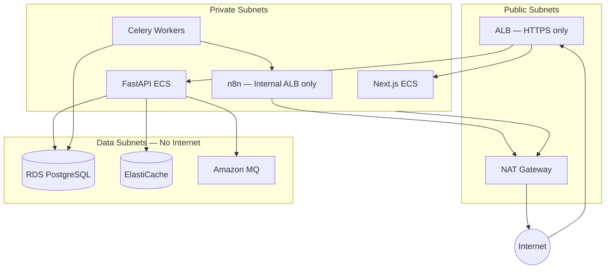

# Security Architecture

**LexFlow AI** — Security Design & Threat Model  
**Version:** 1.0  
**Status:** Draft — Pre-Implementation  
**Last Updated:** 2026-07-06

---

## 1. Security Posture

LexFlow AI handles **attorney-client privileged information** and must meet the security expectations of a large US law firm. Security is designed in — not bolted on.

**Classification levels for data handled:**

| Level | Examples | Controls |
|-------|----------|----------|
| **Restricted** | Case documents, AI summaries, client PII | Encryption, matter walls, audit, access logging |
| **Confidential** | User credentials, API keys, integration tokens | Secrets Manager, hashing, rotation |
| **Internal** | Workflow configs, prompt templates, system logs | RBAC, network segmentation |
| **Public** | Marketing content (not in this platform) | N/A |

---

## 2. Threat Model (STRIDE)

| Threat | Category | Mitigation |
|--------|----------|------------|
| Unauthorized case access | Spoofing / Elevation | JWT auth, RBAC, matter walls, 404-on-deny |
| Token theft | Spoofing | Short-lived access tokens, httpOnly refresh, rotation |
| n8n public exposure | Information Disclosure | Private subnet, no public DNS, SG deny ingress |
| Data exfiltration via AI | Information Disclosure | Case-scoped RAG, PII redaction, prompt logging |
| SQL injection | Tampering | Parameterized queries (SQLAlchemy), input validation |
| XSS in frontend | Tampering | CSP headers, React auto-escaping, DOMPurify for rich text |
| CSRF | Tampering | SameSite cookies, CSRF tokens on state-changing forms |
| Privilege escalation | Elevation | Server-side RBAC only; roles never trusted from client |
| Audit log tampering | Repudiation | Append-only table, separate DB role, no app DELETE |
| DDoS | Denial of Service | WAF, CloudFront, rate limiting, ALB |
| Supply chain attack | Tampering | Dependabot, pinned deps, container scanning (Trivy) |
| Insider threat | All | Audit logs, least privilege, separation of duties |

---

## 3. Network Architecture



### 3.1 Security Groups

| Service | Inbound | Outbound |
|---------|---------|----------|
| ALB | 443 from 0.0.0.0/0 | ECS services on app ports |
| Web (ECS) | ALB only | API, external HTTPS |
| API (ECS) | ALB only | RDS, Redis, MQ, S3, Secrets Manager |
| Workers (ECS) | None | RDS, Redis, MQ, n8n internal ALB, S3, external APIs |
| n8n (ECS) | Workers SG + API SG only | External APIs via NAT |
| RDS | API SG + Workers SG on 5432 | None |
| Redis | API SG + Workers SG on 6379 | None |
| MQ | API SG + Workers SG on 5671 | None |

### 3.2 n8n Isolation

- **No public DNS record** for n8n
- Internal ALB with private hosted zone entry
- n8n admin UI accessible only via VPN or bastion host
- n8n credentials stored in AWS Secrets Manager, injected at runtime

---

## 4. Encryption

### 4.1 At Rest

| Asset | Method |
|-------|--------|
| RDS PostgreSQL | AES-256 (AWS managed key or CMK) |
| S3 documents | SSE-KMS with customer-managed key |
| ElastiCache Redis | Encryption at rest enabled |
| Amazon MQ | Encryption at rest enabled |
| EBS volumes (ECS) | Encrypted |
| Secrets Manager | Encrypted with CMK |
| Application-level PII | AES-256-GCM for fields like tax_id (envelope encryption) |

### 4.2 In Transit

| Path | Protocol |
|------|----------|
| Client → CloudFront | TLS 1.2+ |
| CloudFront → ALB | TLS 1.2+ |
| ALB → ECS | TLS 1.2+ |
| ECS → RDS | TLS (verify-full) |
| ECS → Redis | TLS |
| ECS → MQ | AMQPS |
| ECS → S3 | HTTPS |
| ECS → External APIs | TLS 1.2+ |

---

## 5. Authentication & Authorization

See [authentication-authorization.md](./authentication-authorization.md) for full detail.

Summary:
- JWT access tokens (15-minute expiry)
- Refresh tokens (7-day expiry, rotated on use, stored hashed)
- RBAC with 10 predefined roles
- Matter walls (case-level ABAC)
- Future: Microsoft Entra ID OIDC federation

---

## 6. Secrets Management

| Rule | Implementation |
|------|----------------|
| No secrets in code | `.env.example` only — no values |
| No secrets in n8n repo | Credentials injected via Secrets Manager at deploy |
| No secrets in logs | Structured logging with PII/secret redaction |
| Rotation | API keys rotated quarterly; DB passwords on deploy |
| Access | IAM roles per ECS task — least privilege |

```
AWS Secrets Manager
├── prod/database/credentials
├── prod/redis/auth-token
├── prod/rabbitmq/credentials
├── prod/jwt/signing-key
├── prod/openai/api-key
├── prod/azure-openai/api-key
├── prod/n8n/encryption-key
└── prod/microsoft-graph/client-secret
```

---

## 7. Input Validation & Output Encoding

| Layer | Control |
|-------|---------|
| API | Pydantic v2 strict validation on all inputs |
| File upload | MIME type validation, size limits (100MB default), virus scan (ClamAV) |
| File names | Sanitized — no path traversal |
| AI prompts | Input length limits, PII detection before sending to LLM |
| AI outputs | Output validation, HTML sanitization before rendering |
| SQL | SQLAlchemy ORM — no raw SQL except migrations |
| Frontend | DOMPurify for any rendered HTML from AI/user content |

---

## 8. Audit & Logging Security

- All authentication events logged (login, logout, failed attempts, token refresh)
- All mutating API calls logged with actor, resource, before/after state
- All document access logged (view, download)
- All AI invocations logged with prompt/response (PII-redacted copy)
- Audit logs are append-only — application DB role cannot UPDATE or DELETE
- Log integrity: CloudWatch Logs with retention; optional S3 export for long-term

---

## 9. Container Security

| Control | Tool |
|---------|------|
| Base images | Distroless or Alpine minimal |
| Vulnerability scanning | Trivy in CI pipeline — block on CRITICAL |
| Non-root containers | All containers run as non-root user |
| Read-only filesystem | Where possible (ECS task definition) |
| Resource limits | CPU/memory limits per task |
| Image signing | ECR image scanning + tag immutability |

---

## 10. WAF Rules (AWS WAF on CloudFront)

| Rule | Action |
|------|--------|
| AWS Managed Rules — Core | Block |
| AWS Managed Rules — Known Bad Inputs | Block |
| Rate limiting (2000 req/5min per IP) | Block |
| Geo-blocking (if required by firm) | Block |
| SQL injection patterns | Block |
| Request size > 10MB (except upload endpoints) | Block |

---

## 11. Incident Response

| Phase | Action |
|-------|--------|
| Detection | CloudWatch alarms, GuardDuty, audit anomaly detection |
| Containment | Revoke tokens, disable user, isolate n8n |
| Investigation | Audit log query by correlationId, CloudTrail |
| Recovery | Rotate compromised secrets, restore from backup if needed |
| Post-mortem | Blameless review, ADR if architecture change needed |

**Contacts:** Firm IT security team + LexFlow on-call (defined in runbook).

---

## 12. Compliance Alignment

| Framework | Relevance | Status |
|-----------|-----------|--------|
| ABA Model Rules (1.1, 1.6, 1.15) | Competence, confidentiality, safekeeping | Designed in |
| SOC 2 Type II | Security controls | Target for Year 2 audit |
| GDPR | EU client data (if applicable) | Erasure workflow defined |
| CCPA | California client data | Opt-out and access workflows |
| HIPAA | Not primary — unless healthcare law practice | Data classification supports |

See [compliance-data-governance.md](./compliance-data-governance.md).

---

## 13. Security Testing

| Test | Frequency |
|------|-----------|
| Dependency scanning (Dependabot/Snyk) | Every PR |
| Container scanning (Trivy) | Every build |
| SAST (Bandit for Python, ESLint security for TS) | Every PR |
| DAST (OWASP ZAP) | Weekly on staging |
| Penetration test | Annual (third-party) |
| Matter wall authorization tests | Every PR (automated) |

---

## 14. Related Documents

- [authentication-authorization.md](./authentication-authorization.md)
- [compliance-data-governance.md](./compliance-data-governance.md)
- [deployment-architecture.md](./deployment-architecture.md)
- [observability.md](./observability.md)
