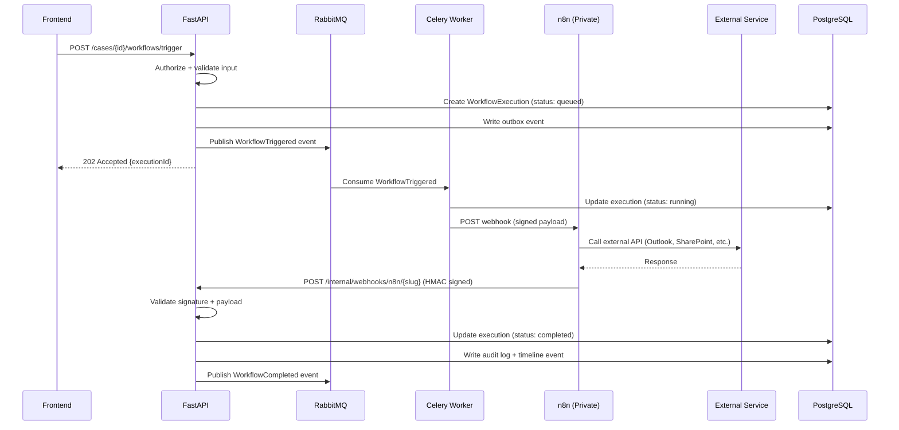
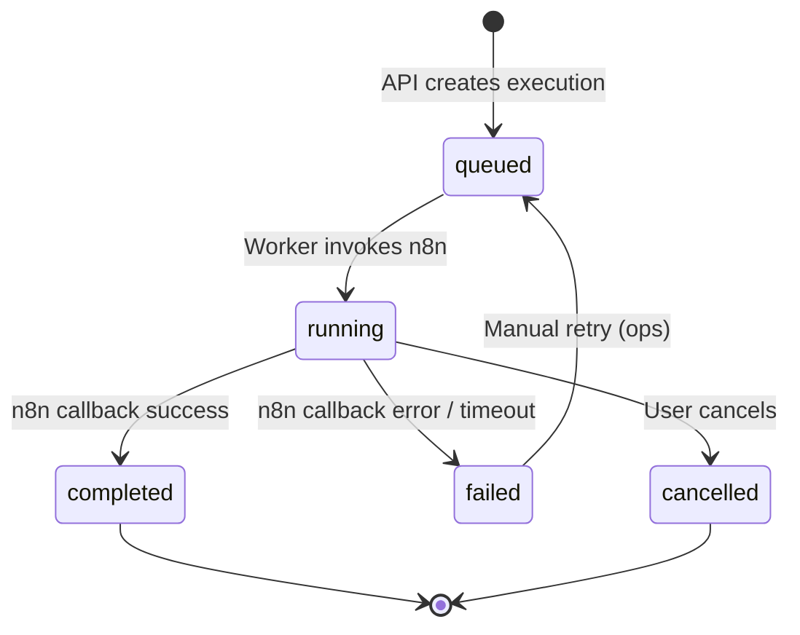
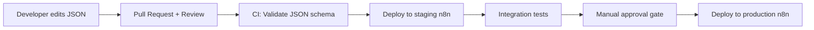

# Workflow Orchestration

**LexFlow AI** — n8n Integration Patterns  
**Version:** 1.0  
**Status:** Draft — Pre-Implementation  
**Last Updated:** 2026-07-06

---

## 1. Core Principle

> **n8n is an orchestration engine. Business logic lives in FastAPI.**

n8n connects external systems, retries HTTP calls, and routes data. It does not make legal decisions, authorization checks, or data validation beyond simple payload routing.

---

## 2. Architecture



---

## 3. What n8n Does vs FastAPI

| Responsibility | Owner |
|----------------|-------|
| Decide IF workflow should run | **FastAPI** |
| Validate input data | **FastAPI** |
| Check authorization | **FastAPI** |
| Persist execution state | **FastAPI** |
| Determine workflow output meaning | **FastAPI** |
| Write audit logs | **FastAPI** |
| Call external HTTP APIs | **n8n** |
| Retry failed HTTP calls | **n8n** |
| Transform payload format for external systems | **n8n** |
| Schedule time-based triggers | **n8n** |
| Route to different external endpoints | **n8n** |

---

## 4. Workflow Lifecycle

### 4.1 States



### 4.2 Timeout Policy

| Stage | Timeout | Action on Timeout |
|-------|---------|-------------------|
| Queue wait | 5 minutes | Alert ops, mark failed |
| n8n execution | 30 minutes (configurable per workflow) | n8n error callback → mark failed |
| External API call (within n8n) | 60 seconds per node | n8n retry (3 attempts) |
| Callback to FastAPI | 30 seconds | n8n retry callback |

---

## 5. n8n Webhook Contract

### 5.1 FastAPI → n8n (Trigger)

```http
POST https://n8n.internal.lexflow/webhook/{workflow-slug}
Content-Type: application/json
X-LexFlow-Signature: sha256=HMAC(body, shared_secret)
X-Correlation-Id: {uuid}
X-Execution-Id: {uuid}

{
  "executionId": "uuid",
  "caseId": "uuid",
  "workflowSlug": "intake-new-client-v1",
  "triggeredBy": "user-uuid",
  "input": {
    "clientName": "Acme Corp",
    "clientEmail": "contact@acme.com",
    "practiceArea": "corporate",
    "documents": [
      {"documentId": "uuid", "s3PresignedUrl": "https://..."}
    ]
  },
  "callbackUrl": "https://api.internal.lexflow/api/v1/internal/webhooks/n8n/intake-new-client-v1"
}
```

### 5.2 n8n → FastAPI (Callback)

```http
POST /api/v1/internal/webhooks/n8n/{workflow-slug}
Content-Type: application/json
X-N8N-Signature: sha256=HMAC(body, shared_secret)
X-Correlation-Id: {uuid}
X-Execution-Id: {uuid}

{
  "executionId": "uuid",
  "status": "success",
  "output": {
    "sharepointFolderUrl": "https://firm.sharepoint.com/...",
    "emailSent": true,
    "externalReferenceId": "ext-123"
  },
  "steps": [
    {"name": "create-sharepoint-folder", "status": "completed", "durationMs": 1200},
    {"name": "send-welcome-email", "status": "completed", "durationMs": 800}
  ]
}
```

Error callback:

```json
{
  "executionId": "uuid",
  "status": "error",
  "error": {
    "step": "send-welcome-email",
    "message": "SMTP connection refused",
    "retryable": true
  }
}
```

---

## 6. Workflow Catalog (Initial)

| Slug | Trigger | Description |
|------|---------|-------------|
| `intake-new-client-v1` | Event: `CaseCreated` | Create SharePoint folder, send welcome email, notify lead attorney |
| `document-upload-notify-v1` | Event: `DocumentUploaded` | Notify case team, sync to SharePoint |
| `deadline-reminder-v1` | Schedule: daily | Query approaching deadlines, send reminders |
| `ai-summary-notify-v1` | Event: `SummaryGenerated` | Notify lead attorney, create approval request |
| `case-close-archive-v1` | Event: `CaseStatusChanged(closed)` | Archive documents, export audit trail, notify billing |
| `discovery-request-v1` | Manual | Generate discovery document package, send via Outlook |
| `conflict-check-v1` | Event: `CaseCreated` | Query external conflict system, flag if match found |

---

## 7. Workflow Definition Management

### 7.1 Repository Structure

```
n8n/workflows/
├── intake/
│   └── intake-new-client-v1.json
├── documents/
│   └── document-upload-notify-v1.json
├── notifications/
│   └── deadline-reminder-v1.json
└── _templates/
    └── basic-webhook-callback.json
```

### 7.2 Promotion Pipeline



| Environment | n8n Instance | Approval Required |
|-------------|-------------|-------------------|
| Local | docker-compose n8n | None |
| Staging | staging-n8n.internal | PR merge |
| Production | prod-n8n.internal | Manual approval + change ticket |

### 7.3 Versioning

- Workflow slugs include version suffix: `{name}-v{N}`
- Breaking changes increment major version
- Old versions remain active until all in-flight executions complete
- FastAPI `workflow_definitions` table maps slug → n8n workflow ID per environment

---

## 8. Error Handling & Retry

### 8.1 Retry Strategy

| Layer | Retry | Backoff |
|-------|-------|---------|
| n8n HTTP nodes | 3 attempts | Exponential (1s, 4s, 16s) |
| Celery task (n8n invoke) | 3 attempts | Exponential (5s, 30s, 120s) |
| n8n callback to FastAPI | 5 attempts | Exponential (2s, 8s, 32s, 128s, 512s) |
| Manual retry | Unlimited | Ops triggers via admin UI |

### 8.2 Dead Letter Handling

- Failed executions after all retries → status `failed`
- Failed messages in RabbitMQ → DLQ
- CloudWatch alarm on DLQ depth > 0
- Ops dashboard shows failed executions with retry button

---

## 9. n8n Security Requirements

| Requirement | Implementation |
|-------------|----------------|
| No public access | Private subnet, internal ALB only |
| Authentication | n8n basic auth + API key for webhooks |
| Credentials | AWS Secrets Manager — injected at container start |
| Network | Security group allows inbound only from Worker + API SGs |
| Audit | All n8n executions logged via callback to FastAPI audit |
| Admin access | VPN or bastion host only |
| Updates | n8n version pinned in Dockerfile; updated via CI |

---

## 10. n8n Node Restrictions

**Allowed node types:**
- HTTP Request
- Webhook
- Code (simple data transformation only — no business logic)
- IF/Switch (routing based on flags from FastAPI)
- Wait/Delay
- Send Email (via AWS SES node)
- Microsoft Graph nodes
- Set/Edit Fields

**Prohibited:**
- PostgreSQL nodes (no direct DB access)
- Complex Code nodes with business rules
- External tool nodes not on approved list
- Nodes that store data outside the workflow execution context

---

## 11. Related Documents

- [high-level-architecture.md](./high-level-architecture.md)
- [event-driven-architecture.md](./event-driven-architecture.md)
- [api-architecture.md](./api-architecture.md)
- [security-architecture.md](./security-architecture.md)
- [adr/002-n8n-orchestration-only.md](./adr/002-n8n-orchestration-only.md)
